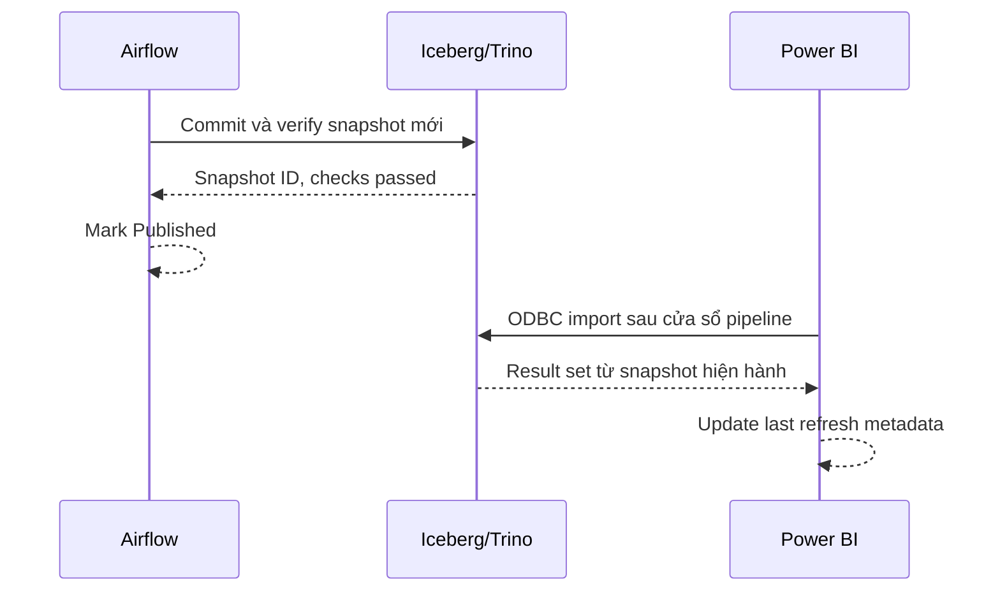

# Đặc tả phân tích và dashboard Power BI

| Thuộc tính | Giá trị |
|---|---|
| Trạng thái | Draft |
| Công cụ | Power BI Desktop |
| Kết nối | ODBC đến Trino, chế độ Import |
| Nguồn logic | Gold Iceberg hiện hành |

## 1. Mục tiêu

Dashboard hỗ trợ mô tả dữ liệu động đất quanh Nhật Bản theo thời gian, không gian, độ lớn và độ sâu. Kết quả dùng cho học tập/phân tích dữ liệu, không phải dự báo hay cảnh báo thiên tai.

## 2. Câu hỏi phân tích

1. Số sự kiện thay đổi thế nào theo ngày, tháng và năm?
2. Khu vực nào có nhiều sự kiện nhất trong phạm vi lọc?
3. Phân bố magnitude và depth ra sao?
4. Magnitude và depth có mối liên hệ mô tả nào trong tập dữ liệu?
5. Khi nào xuất hiện các sự kiện mạnh/đáng chú ý nhất?
6. Bao nhiêu sự kiện có cờ tsunami hoặc alert?
7. Tỷ lệ sự kiện ngoài khơi/không xác định khu vực là bao nhiêu?
8. Dữ liệu dashboard mới đến ngày nào và snapshot nào?

## 3. Định nghĩa KPI

Mọi KPI phải tôn trọng cùng filter context và chỉ đếm mỗi `earthquake_id` một lần.

| KPI | Định nghĩa logic | Định dạng |
|---|---|---|
| Total Earthquakes | `DISTINCTCOUNT(earthquake_id)` | Số nguyên |
| Average Magnitude | Trung bình `magnitude` khác null | 2 chữ số thập phân |
| Maximum Magnitude | Max `magnitude` khác null | 1–2 chữ số thập phân |
| Average Depth | Trung bình `depth_km` hợp lệ | `0.00 km` |
| Strong Earthquakes | Số event có magnitude ≥ ngưỡng người dùng chọn | Số nguyên |
| Tsunami Flagged | Số event có `tsunami_flag = true` | Số nguyên |
| Alerted Events | Số event có `alert_level` khác null/none | Số nguyên |
| Offshore/Unknown Rate | Event offshore/unknown chia tổng event | Phần trăm |
| Latest Event Time | Max event timestamp trong filter | UTC/JST có nhãn rõ |
| Data Freshness | Thời gian từ snapshot/event mới nhất tới lúc refresh | Giờ/ngày |

### Nguyên tắc KPI

- Không dùng `COUNT(*)` nếu query có join có thể nhân bản event.
- `Average Magnitude` bỏ qua null, không thay null bằng 0.
- Ngưỡng “Strong” là tham số/filter. Baseline `PLN-01` đề xuất giá trị mặc định `5.0`; giá trị này trở thành chính thức sau khi ba thành viên phê duyệt baseline.
- Tên múi giờ phải xuất hiện cạnh thời gian; ưu tiên JST cho người xem, giữ UTC để đối soát.
- Tooltip hoặc trang thông tin phải nêu nguồn USGS và thời điểm refresh.

## 4. Bộ lọc dùng chung

- Khoảng ngày/thời gian.
- Prefecture/khu vực và nhóm `Offshore`/`Unknown`.
- Magnitude range và magnitude band.
- Depth range và depth band.
- Tsunami flag.
- Alert level.
- Magnitude type khi cần kiểm tra chất lượng/nguồn đo.

Filter mặc định không được âm thầm loại `Unknown` hoặc `Offshore`.

## 5. Trang 1 — Tổng quan

### Mục tiêu

Cho người xem trả lời nhanh: có bao nhiêu sự kiện, mức độ ra sao, xu hướng thế nào và sự kiện nào đáng chú ý.

### Bố cục đề xuất

```text
┌─────────────────────────────────────────────────────────────┐
│ Date │ Region │ Magnitude │ Depth │ Last refresh / snapshot │
├──────────┬──────────┬──────────┬──────────┬─────────────────┤
│ Total    │ Avg Mag  │ Max Mag  │ Strong   │ Tsunami flagged │
├─────────────────────────────────┬───────────────────────────┤
│ Event count by day/month        │ Magnitude distribution    │
├─────────────────────────────────┼───────────────────────────┤
│ Top regions                     │ Most significant events   │
└─────────────────────────────────┴───────────────────────────┘
```

### Visuals

- KPI cards cho các chỉ số chính.
- Line/column chart số event theo thời gian, có khả năng drill year → month → day.
- Histogram magnitude theo band thống nhất.
- Bar chart top khu vực.
- Bảng sự kiện đáng chú ý: JST time, place, magnitude, depth, significance, tsunami/alert.

## 6. Trang 2 — Phân tích không gian

### Mục tiêu

Quan sát vị trí tâm chấn, cụm khu vực và tỷ lệ ngoài khơi.

### Visuals

- Map theo latitude/longitude; size theo magnitude, color theo magnitude band hoặc depth band.
- Bar/filled map theo prefecture nếu spatial enrichment đủ chất lượng.
- KPI số/tỷ lệ Offshore và Unknown.
- Bảng drill-through chi tiết event.

### Quy tắc hiển thị

- Giới hạn số điểm hoặc dùng sampling/aggregation nếu map chậm, nhưng phải ghi rõ.
- Không đặt điểm `Unknown` tại tọa độ giả như `(0,0)`.
- Event ngoài khơi vẫn hiển thị theo tọa độ thật.
- Map chỉ là mô tả; không suy luận rủi ro cư dân nếu chưa có dữ liệu phơi nhiễm.

## 7. Trang 3 — Độ sâu và độ lớn

### Mục tiêu

Khám phá phân bố và mối liên hệ mô tả giữa depth, magnitude và thời gian.

### Visuals

- Histogram magnitude.
- Histogram depth.
- Scatter plot `depth_km` và `magnitude`, tooltip có time/place.
- Matrix magnitude band × depth band với event count.
- Trend của magnitude trung bình/tối đa theo tháng.

### Cảnh báo diễn giải

Tương quan quan sát được không chứng minh quan hệ nhân quả và không tạo khả năng dự báo sự kiện tương lai.

## 8. Drill-through — Chi tiết sự kiện

Một trang drill-through tùy chọn có thể hiển thị:

- Event ID và mô tả vị trí.
- Event time UTC/JST và updated time.
- Tọa độ, depth, magnitude và magnitude type.
- Prefecture/region classification và khoảng cách nếu có.
- Tsunami flag, alert level, significance, status.
- Link nguồn sự kiện nếu contract Gold cung cấp URL an toàn.

## 9. Semantic model

Thiết kế logic đề xuất là star schema với một fact sự kiện, dimension ngày/khu vực/band. Chi tiết schema vật lý chưa thuộc giai đoạn này.

Nguyên tắc:

- Quan hệ one-to-many từ dimension tới fact.
- Cross-filter một chiều mặc định.
- Date dimension được đánh dấu là date table.
- Measure tập trung trong một khu vực/bảng measure rõ ràng.
- Ẩn technical key và cột không dành cho người xem.
- Không tạo calculated column nặng trong Power BI nếu có thể tính ổn định ở Gold.

## 10. Refresh và freshness



- Refresh chỉ bắt đầu sau giờ pipeline dự kiến hoàn tất.
- Nếu DAG thất bại, giữ dashboard ở dataset trước và hiển thị last refresh/freshness.
- Tránh chạy Spark job nặng cùng lúc Power BI refresh trên máy ít RAM.
- Không tuyên bố dashboard là real-time.

## 11. Kiểm tra chấp nhận dashboard

### Dữ liệu

- [ ] Total count khớp truy vấn kiểm chứng ở Trino với cùng filter.
- [ ] Không nhân bản event khi lọc/join.
- [ ] Average/maximum magnitude và tsunami count khớp SQL độc lập.
- [ ] Offshore/Unknown không bị loại ngoài ý muốn.
- [ ] Latest event và last refresh hiển thị đúng múi giờ.

### Tương tác

- [ ] Filter chung tác động đúng tới mọi visual dự kiến.
- [ ] Drill-down thời gian và drill-through event hoạt động.
- [ ] Reset filters đưa dashboard về trạng thái mặc định.
- [ ] Tooltip không che thông tin và có đơn vị.

### Trình bày

- [ ] Màu magnitude/depth nhất quán giữa các trang.
- [ ] Visual có title, unit, source và trạng thái no-data phù hợp.
- [ ] Dashboard dùng được ở độ phân giải màn hình demo.
- [ ] Có disclaimer không dùng cho dự báo/cảnh báo thiên tai.

## 12. Truy vấn kiểm chứng mẫu

Tên catalog/schema/table là placeholder cho đến khi triển khai:

```sql
SELECT
    COUNT(DISTINCT earthquake_id) AS total_earthquakes,
    AVG(magnitude) AS average_magnitude,
    MAX(magnitude) AS maximum_magnitude,
    SUM(CASE WHEN tsunami_flag THEN 1 ELSE 0 END) AS tsunami_flagged
FROM <catalog>.<gold_schema>.<earthquake_fact_or_view>
WHERE event_time_utc >= TIMESTAMP '<start_utc>'
  AND event_time_utc < TIMESTAMP '<end_utc>';
```

## 13. Nội dung không nên thể hiện

- “Dự báo trận động đất tiếp theo”.
- “Bản đồ rủi ro” nếu chỉ dựa trên số sự kiện lịch sử.
- So sánh khu vực mà không nói rõ thời gian và completeness của dữ liệu.
- Con số freshness không có timestamp/snapshot nguồn.
- KPI dùng các định nghĩa khác nhau giữa visual và truy vấn kiểm chứng.
