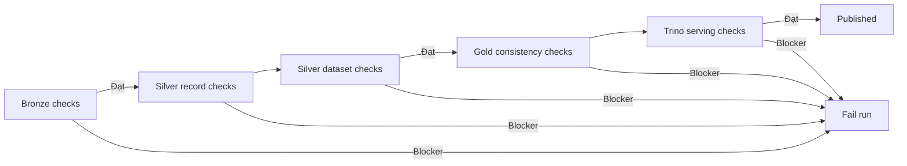

# Chất lượng dữ liệu và khả năng quan sát

| Thuộc tính | Giá trị |
|---|---|
| Trạng thái | Draft |
| Phạm vi | Bronze, Silver, Gold và pipeline run |

## 1. Mục tiêu

- Ngăn dữ liệu sai nghiêm trọng đi vào Gold.
- Phân biệt lỗi nguồn, lỗi xử lý và biến động hợp lệ của dữ liệu.
- Đối soát được số lượng bản ghi qua từng tầng.
- Cung cấp đủ context để retry hoặc backfill đúng phạm vi.

Project không xây quarantine dataset riêng ở phiên bản đầu tiên. Bản ghi Silver không hợp lệ bị loại khỏi output, nhưng số lượng và nhóm lý do phải được ghi trong metric/log. Bronze nguyên bản vẫn là bằng chứng để điều tra và xử lý lại.

## 2. Phân loại kiểm tra

| Loại | Câu hỏi |
|---|---|
| Contract | Nguồn còn đúng cấu trúc tối thiểu không? |
| Completeness | Trường bắt buộc có đầy đủ không? |
| Validity | Giá trị có parse được và nằm trong miền hợp lệ không? |
| Uniqueness | Có duplicate theo khóa nghiệp vụ không? |
| Consistency | Các tầng và aggregate có đối soát được không? |
| Freshness | Dataset mới nhất có đúng lịch dự kiến không? |
| Volume | Số lượng bản ghi có bất thường so với lịch sử gần đây không? |

## 3. Quy tắc ở Bronze

| ID | Quy tắc | Mức | Hành động khi lỗi |
|---|---|---|---|
| B-01 | HTTP response thành công và body không bị cắt | Blocker | Retry/fail extract |
| B-02 | Body parse được thành JSON/GeoJSON | Blocker | Không ghi nhận Bronze ready |
| B-03 | Có cấu trúc `features` dạng array | Blocker | Fail và điều tra contract |
| B-04 | Metadata có run ID, fetch time, window và feature count | Blocker | Fail Bronze task |
| B-05 | Object đọc lại được sau upload | Blocker | Retry upload |
| B-06 | Checksum đã lưu khớp nội dung | Blocker | Fail/ghi lại object mới |
| B-07 | Feature count bằng độ dài `features` | Blocker | Fail contract check |

Response có `features = []` có thể hợp lệ. Khi đó phải log `empty_valid_response=true`; không được suy luận đó là lỗi chỉ vì count bằng 0.

## 4. Quy tắc ở Silver

### 4.1. Quy tắc theo bản ghi

| ID | Trường | Quy tắc | Khi vi phạm |
|---|---|---|---|
| S-01 | `id` | Khác null/rỗng | Loại record |
| S-02 | `time` | Parse được thành timestamp UTC | Loại record |
| S-03 | `updated` | Parse được; không trước một mốc vô lý đã cấu hình | Loại record |
| S-04 | `latitude` | Số trong `[-90, 90]` | Loại record |
| S-05 | `longitude` | Số trong `[-180, 180]` | Loại record |
| S-06 | `depth_km` | Parse được thành số | Loại record và ghi reason |
| S-07 | `magnitude` | Null hoặc parse được thành số; chính sách null phải nhất quán | Giữ/loại theo cấu hình đã chốt |
| S-08 | `tsunami_flag` | Chuẩn hóa về boolean/0–1 | Loại nếu giá trị nguồn không nhận diện được |
| S-09 | Vùng nghiên cứu | Nằm trong ranh giới truy vấn đã cấu hình | Loại nếu ngoài phạm vi |
| S-10 | `event_time_jst` | Quy đổi đúng từ UTC, không parse lại chuỗi local | Fail transform/test |

Các ngưỡng miền nghiệp vụ hẹp hơn (ví dụ magnitude/depth tối đa hợp lý) cần được xác nhận trên mẫu dữ liệu trước khi dùng làm blocker. Trước đó có thể log warning để tránh loại nhầm sự kiện hiếm.

### 4.2. Quy tắc cấp dataset

| ID | Quy tắc | Mức |
|---|---|---|
| SD-01 | Không còn duplicate `id` sau dedup trong snapshot Silver hợp nhất | Blocker |
| SD-02 | Record được chọn cho mỗi `id` có `updated` lớn nhất | Blocker |
| SD-03 | `valid_count + rejected_count = parsed_count` | Blocker |
| SD-04 | `parsed_count <= source_feature_count` chỉ khi parser bỏ qua object không phải feature; mọi chênh lệch phải giải thích | Blocker |
| SD-05 | Partition output khớp năm/tháng của event timestamp UTC | Blocker |
| SD-06 | Schema output khớp schema version mà job công bố | Blocker |

## 5. Quy tắc ở Gold

| ID | Quy tắc | Mức | Ý nghĩa |
|---|---|---|---|
| G-01 | `earthquake_id` duy nhất trong fact/current view | Blocker | Không double count |
| G-02 | Mọi event hợp lệ ở phạm vi publish có mặt trong fact | Blocker | Completeness |
| G-03 | Khóa/ngày phân tích suy ra khớp event timestamp | Blocker | Group theo thời gian đúng |
| G-04 | Bản ghi không match địa giới vẫn được giữ | Blocker | Không mất động đất ngoài khơi |
| G-05 | Tổng count aggregate bằng count fact với cùng filter | Blocker | Consistency |
| G-06 | `min <= avg <= max` cho magnitude/depth khi count > 0 | Blocker | Sanity check |
| G-07 | Snapshot mới đọc được từ Trino | Blocker | Serving readiness |
| G-08 | Snapshot ID verify bằng snapshot vừa commit | Blocker | Không verify nhầm phiên bản |
| G-09 | Không có field bắt buộc cho dashboard bị đổi tên/kiểu ngoài contract | Blocker | Tương thích Power BI |

## 6. Cổng chất lượng



- **Blocker:** fail task/run, không refresh Power BI.
- **Warning:** không dừng pipeline nhưng phải ghi metric và xuất hiện trong tổng kết run.
- Không đặt ngưỡng warning tùy ý trước khi có baseline. Sau ít nhất một số lần chạy đại diện, nhóm mới chốt threshold volume/freshness dựa trên dữ liệu quan sát.

## 7. Đối soát số lượng

Mỗi run cần tạo một bản tóm tắt logic:

```text
source_feature_count
= parsed_count + parse_error_count

parsed_count
= valid_before_dedup_count + rejected_count

valid_before_dedup_count
= silver_output_count + duplicate_or_superseded_count
```

Ký hiệu trên thể hiện quan hệ cần đối soát, không phải cú pháp code. Nếu Silver còn hợp nhất với dữ liệu đã tồn tại, cần tách metric `new`, `updated`, `unchanged` để giải thích output current-state.

## 8. Metric cho từng run

### Trạng thái và thời gian

- `pipeline_run_status`
- `task_duration_seconds`
- `pipeline_duration_seconds`
- `retry_count`
- `data_interval_start/end`
- `published_snapshot_id`

### Số lượng dữ liệu

- `source_feature_count`
- `parsed_count`
- `valid_before_dedup_count`
- `rejected_count` theo reason
- `duplicate_or_superseded_count`
- `silver_output_count`
- `gold_current_count`
- `gold_inserted_count`, `gold_updated_count`, `gold_unchanged_count`
- `unknown_region_count`, `offshore_count`

### Freshness và volume

- Thời điểm event mới nhất trong Gold.
- Tuổi của snapshot hiện hành tại thời điểm verify.
- Count theo ngày so với median/biên lịch sử gần nhất sau khi có baseline.

## 9. Logging chuẩn

Log nên có dạng key-value/JSON để tìm kiếm được, ví dụ:

```json
{
  "event": "silver_quality_summary",
  "run_id": "<airflow-run-id>",
  "window_start_utc": "<timestamp>",
  "window_end_utc": "<timestamp>",
  "input_count": 0,
  "valid_count": 0,
  "rejected_count": 0,
  "duplicate_count": 0,
  "status": "passed"
}
```

Không log toàn bộ event payload theo mặc định. Khi cần debug, dùng ID và Bronze URI để truy vết; tránh làm log quá lớn.

## 10. Kiểm thử tối thiểu

| Cấp | Kiểm thử |
|---|---|
| Unit | Parse field, timezone UTC→JST, range validation, magnitude/depth band, tie-break dedup |
| Spark local | Fixture có record hợp lệ, null, sai type, duplicate và late update |
| Integration | Ghi/đọc MinIO, build Silver, commit/read Iceberg qua Trino |
| Pipeline | Daily run rỗng hợp lệ, daily run có dữ liệu, retry extract, Silver fail gate |
| Idempotency | Chạy cùng fixture hai lần, so tập khóa và KPI |
| Backfill | Chạy hai ngày có duplicate xuyên ngày và late update |
| BI contract | Query trả đủ cột/kiểu mà Power BI dùng |

## 11. Run summary đề xuất

Kết thúc DAG, Airflow log một bảng tóm tắt:

| Nhóm | Giá trị |
|---|---|
| Run | ID, interval, code/config version |
| Extract | HTTP status, Bronze URI, checksum, feature count |
| Silver | input, valid, rejected, duplicate, output |
| Gold | inserted, updated, current total, snapshot ID |
| Quality | số blocker/warning, các rule thất bại |
| Serving | Trino verify status và thời gian |

## 12. Điều chưa chốt

- Schema versioning mechanism cụ thể.
- Threshold volume/freshness sau khi có baseline.
- Chính sách cho `magnitude = null` và depth âm nếu nguồn có trường hợp đặc biệt.
- Công cụ metrics ngoài Airflow log (Prometheus/Grafana chỉ là mở rộng).
- Retention của Bronze, log và snapshot Iceberg.

