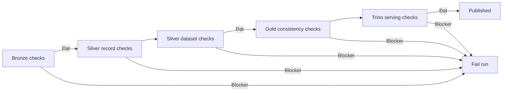

# Chất lượng dữ liệu và khả năng quan sát

| Thuộc tính | Giá trị |
|---|---|
| Trạng thái | ORC-04 telemetry đã triển khai; business gates theo task owner |
| Phạm vi | Bronze, Silver, Gold và pipeline run |

## 1. Mục tiêu

- Ngăn dữ liệu sai nghiêm trọng đi vào Gold.
- Phân biệt lỗi nguồn, lỗi xử lý và biến động hợp lệ của dữ liệu.
- Đối soát được số lượng bản ghi qua từng tầng.
- Cung cấp đủ context để retry hoặc backfill đúng phạm vi.

Project không xây business quarantine dataset riêng ở phiên bản đầu tiên. Payload
Bronze lỗi có thể được giữ ở `bronze/_quarantine` như failure evidence, nhưng
không được resolver chọn làm input. Bản ghi Silver không hợp lệ bị loại khỏi
output, nhưng số lượng và nhóm lý do phải được ghi trong metric/log. Bronze
nguyên bản vẫn là bằng chứng để điều tra và xử lý lại.

Tên trường, type, null policy, reject schema và Gold grain tuân theo
[Silver/Gold logical data model](./specs/SILVER_GOLD_DATA_MODEL.md).

## 2. Phân loại kiểm tra

| Loại | Câu hỏi |
|---|---|
| Contract | Nguồn còn đúng cấu trúc tối thiểu không? |
| Completeness | Trường bắt buộc có đầy đủ không? |
| Validity | Giá trị có parse được và nằm trong miền hợp lệ không? |
| Uniqueness | Có duplicate theo khóa nghiệp vụ không? |
| Consistency | Các tầng và aggregate có đối soát được không? |
| Freshness | Dataset mới nhất có đúng lịch dự kiến không? |
| Volume | Số lượng bản ghi có bất thường so với lịch sử gần đây không? |

## 3. Quy tắc ở Bronze

| ID | Quy tắc | Mức | Hành động khi lỗi |
|---|---|---|---|
| B-01 | HTTP response thành công và body không bị cắt | Blocker | Retry/fail extract |
| B-02 | Body parse được thành JSON/GeoJSON | Blocker | Không ghi nhận Bronze ready |
| B-03 | Có cấu trúc `features` dạng array | Blocker | Fail và điều tra contract |
| B-04 | Manifest có `run_id`, source URL, retrieval time, window và feature count/count estimate | Blocker | Fail Bronze task |
| B-05 | Object đọc lại được sau upload | Blocker | Retry upload |
| B-06 | Checksum đã lưu khớp nội dung | Blocker | Fail/ghi lại object mới |
| B-07 | Feature count bằng độ dài `features` | Blocker | Fail contract check |
| B-08 | Manifest trỏ đúng raw object và có `bronze_status=BronzeReady` | Blocker | Không đưa vào Silver |

Response có `features = []` có thể hợp lệ. Khi đó phải log `empty_valid_response=true`; không được suy luận đó là lỗi chỉ vì count bằng 0.

## 4. Quy tắc ở Silver

### 4.1. Quy tắc theo bản ghi

| ID | Trường | Quy tắc | Khi vi phạm |
|---|---|---|---|
| S-01 | `source_record_key` | Khác null/rỗng, ổn định trong nguồn | Loại record |
| S-02 | `event_time_utc` | Parse được thành timestamp UTC | Loại record |
| S-03 | `source_updated_at_utc` | USGS bắt buộc parse được; JMA được null | Loại USGS record sai |
| S-04 | `latitude` | Số trong `[-90, 90]` | Loại record |
| S-05 | `longitude` | Số trong `[-180, 180]` | Loại record |
| S-06 | `depth_km` | Null hoặc số hữu hạn; negative được giữ và gắn warning | Loại nếu sai kiểu/non-finite |
| S-07 | `magnitude` | Null hoặc số hữu hạn; null không đổi thành `0` | Giữ null; loại nếu sai kiểu/non-finite |
| S-08 | `tsunami_flag` | Null hoặc boolean map từ source value nhận diện được | Loại nếu source value không nhận diện được |
| S-09 | `is_in_study_area` | Tính theo envelope `CON-01` | Giữ observation ngoài ROI; loại khỏi serving view mặc định |
| S-10 | `event_time_jst` | Quy đổi đúng từ UTC, không parse lại chuỗi local | Fail transform/test |
| S-11 | Lineage | Có manifest ID, raw URI/SHA, locator, run ID và parser version | Loại record khỏi publish |

Các ngưỡng miền nghiệp vụ hẹp hơn (ví dụ magnitude/depth tối đa hợp lý) cần được xác nhận trên mẫu dữ liệu trước khi dùng làm blocker. Trước đó có thể log warning để tránh loại nhầm sự kiện hiếm.

### 4.2. Quy tắc cấp dataset

| ID | Quy tắc | Mức |
|---|---|---|
| SD-01 | Mỗi `(source_system, source_record_key)` có đúng một `is_current_source_revision=true` sau source-local dedup | Blocker |
| SD-02 | USGS chọn `updated` mới nhất; JMA chọn catalog release hợp lệ mới nhất theo tie-break xác định | Blocker |
| SD-03 | `valid_count + rejected_count = parsed_count` | Blocker |
| SD-04 | `parsed_count <= source_feature_count` chỉ khi parser bỏ qua object không phải feature; mọi chênh lệch phải giải thích | Blocker |
| SD-05 | Partition output khớp năm/tháng của event timestamp UTC | Blocker |
| SD-06 | Schema output khớp schema version mà job công bố | Blocker |

## 5. Quy tắc ở Gold

| ID | Quy tắc | Mức | Ý nghĩa |
|---|---|---|---|
| G-01 | `canonical_event_id` duy nhất trong fact/current view | Blocker | Không double count xuyên nguồn |
| G-02 | Mọi event hợp lệ ở phạm vi publish có mặt trong fact | Blocker | Completeness |
| G-03 | Khóa/ngày phân tích suy ra khớp event timestamp | Blocker | Group theo thời gian đúng |
| G-04 | Bản ghi không match địa giới vẫn được giữ | Blocker | Không mất động đất ngoài khơi |
| G-05 | Tổng count aggregate bằng count fact với cùng filter | Blocker | Consistency |
| G-06 | `min <= avg <= max` cho magnitude/depth khi count > 0 | Blocker | Sanity check |
| G-07 | Snapshot mới đọc được từ Trino | Blocker | Serving readiness |
| G-08 | Snapshot ID verify bằng snapshot vừa commit | Blocker | Không verify nhầm phiên bản |
| G-09 | Không có field bắt buộc cho dashboard bị đổi tên/kiểu ngoài contract | Blocker | Tương thích Power BI |

## 6. Cổng chất lượng


```mermaid
flowchart LR
    B["Bronze checks"] -->|"Đạt"| S["Silver record checks"]
    S --> D["Silver dataset checks"]
    D -->|"Đạt"| G["Gold consistency checks"]
    G --> T["Trino serving checks"]
    T -->|"Đạt"| P["Published"]
    B -->|"Blocker"| F["Fail run"]
    S -->|"Blocker"| F
    D -->|"Blocker"| F
    G -->|"Blocker"| F
    T -->|"Blocker"| F
```

- **Blocker:** fail task/run, không refresh Power BI.
- **Warning:** không dừng pipeline nhưng phải ghi metric và xuất hiện trong tổng kết run.
- Không đặt ngưỡng warning tùy ý trước khi có baseline. Sau ít nhất một số lần chạy đại diện, nhóm mới chốt threshold volume/freshness dựa trên dữ liệu quan sát.

## 7. Đối soát số lượng

Runtime summary có contract version `orc-04-v1` tại
[Run observability contract](./specs/RUN_OBSERVABILITY_CONTRACT.md). Mỗi nguồn
được đối soát riêng trong cùng exact input/replacement scope:

```text
input = parsed + parse_error + ignored

parsed = valid + rejected

valid = duplicate + superseded + current
current = linked + unlinked
Gold bridge = sum(source current)
```

`ignored` giải thích structural record không thuộc observation; `linked` là
current memberships, không phải candidate/link pairs. Gold canonical current
là event grain, không bằng tổng observation hai nguồn. Reject reasons trong
telemetry là primary quality reason/record; reason occurrences trong report
SLV-05 có thể nhiều hơn số rejected records.

Không copy thẳng `slv-05-v1` combined `parsed_count/rejected_count`: khi dùng
overload parser result, nó đã gồm parser rejects. Adapter ORC-04 phải tách
`reject_stage=PARSE` khỏi quality rejects và tính observation parse thành công
trước quality. Không đổi nghĩa report SLV-05 hoặc bỏ parser blocker.

`null/not_reported` là chưa có metric, khác với `0/passed`. Nếu Silver hợp
nhất với existing state, cần tách baseline/new/updated/unchanged và khóa
extension mới trước khi emit count; không trộn incremental input với global
current-state trong equations v1 này.

## 8. Metric cho từng run

### Trạng thái và thời gian

- `pipeline_run_status`
- `task_duration_seconds`
- `pipeline_duration_seconds`
- `retry_count`
- `data_interval_start/end`
- `published_snapshot_id`

### Số lượng dữ liệu

- `source_feature_count`
- `parsed_count`
- `valid_before_dedup_count`
- `rejected_count` theo reason
- `duplicate_or_superseded_count`
- `silver_output_count`
- `gold_current_count`
- `gold_inserted_count`, `gold_updated_count`, `gold_unchanged_count`
- `unknown_region_count`, `offshore_count`

### Freshness và volume

- Thời điểm event mới nhất trong Gold.
- Tuổi của snapshot hiện hành tại thời điểm verify.
- Count theo ngày so với median/biên lịch sử gần nhất sau khi có baseline.

## 9. Logging chuẩn

ORC-04 đã nối log JSON `pipeline_phase` và `pipeline_run_summary` vào DAG
ORC-01/02. Mỗi run có journal, summary persisted, UTC timestamps, monotonic
durations, attempt, exact lineage references và safe fixed reasons.

Ví dụ minh họa quality log (không phải schema receipt `orc-04-v1`):

```json
{
  "event": "silver_quality_summary",
  "run_id": "<airflow-run-id>",
  "window_start_utc": "<timestamp>",
  "window_end_utc": "<timestamp>",
  "input_count": 0,
  "valid_count": 0,
  "rejected_count": 0,
  "duplicate_count": 0,
  "status": "passed"
}
```

Không log toàn bộ event payload theo mặc định. Khi cần debug, dùng ID và Bronze URI để truy vết; tránh làm log quá lớn.

## 10. Kiểm thử tối thiểu

| Cấp | Kiểm thử |
|---|---|
| Unit | Parse field, timezone UTC→JST, range validation, magnitude/depth band, tie-break dedup |
| Spark local | Fixture có record hợp lệ, null, sai type, duplicate và late update |
| Integration | Ghi/đọc MinIO, build Silver, commit/read Iceberg qua Trino |
| Pipeline | Daily run rỗng hợp lệ, daily run có dữ liệu, retry extract, Silver fail gate |
| Idempotency | Chạy cùng fixture hai lần, so tập khóa và KPI |
| Backfill | Chạy hai ngày có duplicate xuyên ngày và late update |
| BI contract | Query trả đủ cột/kiểu mà Power BI dùng |

## 11. Run summary đề xuất

Summary đã triển khai theo [contract ORC-04](./specs/RUN_OBSERVABILITY_CONTRACT.md),
ghi JSON cuối gate và khi phase fail, không thêm success leaf che lỗi upstream.
Những nhóm dưới là logical contents; metric adapter chưa cung cấp giữ null:

| Nhóm | Giá trị |
|---|---|
| Run | ID, interval, code/config version |
| Extract | HTTP status, Bronze URI, checksum, feature count |
| Silver | input, valid, rejected, duplicate, output |
| Gold | inserted, updated, current total, snapshot ID |
| Quality | số blocker/warning, các rule thất bại |
| Serving | Trino verify status và thời gian |

## 12. Điều chưa chốt

- Threshold volume/freshness sau khi có baseline.
- Công cụ metrics ngoài Airflow log (Prometheus/Grafana chỉ là mở rộng).
- Retention của Bronze, log và snapshot Iceberg.

Business counts/freshness và E2E thật còn chờ **SLV-09 - Tích hợp và kiểm thử
Silver đa nguồn**, **GLD-03 - Ghi Gold Iceberg và commit snapshot**, **GLD-04 -
Tạo Trino views và verification SQL**, **QA-01 - Chạy E2E daily đa nguồn**.
Abandoned run/stale lease recovery thuộc **ORC-05 - Chốt recovery, concurrency
và tài nguyên**. Retention/metrics backend mở rộng chưa có task chốt riêng.
