# Nền tảng phân tích dữ liệu động đất tại Nhật Bản

> Trạng thái: **Bản thiết kế ban đầu**. Xem [mục lục tài liệu](./README.md) để đọc đặc tả, kiến trúc, luồng xử lý, chất lượng dữ liệu, vận hành và kịch bản demo.

## 1. Giới thiệu đề tài

Nhật Bản nằm trong khu vực có hoạt động địa chấn mạnh và thường xuyên ghi nhận các trận động đất với nhiều mức độ khác nhau. Dữ liệu về thời gian, vị trí, độ sâu và độ lớn của các trận động đất có giá trị trong việc quan sát xu hướng địa chấn, xác định các khu vực thường xuyên xảy ra động đất và hỗ trợ truyền đạt thông tin rủi ro.

Đề tài **“Nền tảng phân tích dữ liệu động đất tại Nhật Bản”** xây dựng một quy trình dữ liệu hoàn chỉnh, từ thu thập dữ liệu động đất, lưu trữ dữ liệu gốc, xử lý phân tán, kiểm tra chất lượng, tổng hợp dữ liệu đến trực quan hóa trên Power BI.

Phiên bản đầu tiên được triển khai trên máy local bằng Docker Compose. Phương án thuê VPS chỉ được xem là hướng mở rộng tham khảo nếu nhóm hoàn thành sớm các chức năng chính và muốn minh họa khả năng vận hành liên tục.

Đề tài tập trung vào hai hướng chính:

- **Data Engineering:** xây dựng pipeline thu thập, lưu trữ, xử lý và cung cấp dữ liệu đáng tin cậy.
- **Data Analytics:** xây dựng KPI, biểu đồ và dashboard để mô tả, so sánh và phát hiện các xu hướng trong dữ liệu lịch sử.

Phần Data Science hoặc Generative AI không thuộc phạm vi bắt buộc của phiên bản đầu tiên và chỉ được xem là hướng phát triển thêm.

## 2. Mục tiêu

Đề tài hướng đến các mục tiêu sau:

1. Thu thập dữ liệu động đất tại Nhật Bản theo lịch định kỳ.
2. Lưu dữ liệu gốc và dữ liệu sau xử lý trong Data Lake sử dụng MinIO.
3. Xây dựng chương trình Spark bằng Java để làm sạch, chuẩn hóa và tổng hợp dữ liệu.
4. Tổ chức pipeline bằng Apache Airflow, có khả năng theo dõi trạng thái, chạy lại và xử lý lỗi.
5. Xây dựng tầng Gold theo định dạng bảng Apache Iceberg trên MinIO để hình thành Lakehouse.
6. Sử dụng Trino làm query engine để truy vấn trực tiếp các bảng Gold trên MinIO.
7. Kết nối Power BI với Trino để phân tích dữ liệu mà không tạo thêm bản sao serving.
8. Xây dựng dashboard Power BI để phân tích động đất theo thời gian, không gian, độ lớn và độ sâu.
9. Đóng gói toàn bộ hệ thống bằng Docker Compose để có thể cài đặt và vận hành trước tiên trên máy local.

## 3. Câu hỏi phân tích

Dashboard dự kiến hỗ trợ trả lời các câu hỏi:

- Số lượng động đất thay đổi như thế nào theo ngày, tháng và năm?
- Những khu vực nào tại Nhật Bản thường xuyên ghi nhận động đất?
- Phân bố độ lớn và độ sâu của các trận động đất như thế nào?
- Có mối liên hệ mô tả nào giữa độ sâu và độ lớn của động đất không?
- Những tháng hoặc khu vực nào có nhiều trận động đất từ cấp độ lớn được lựa chọn trở lên?
- Bao nhiêu sự kiện có cảnh báo sóng thần hoặc mức độ đáng chú ý cao?
- Các trận động đất mạnh nhất trong khoảng thời gian phân tích xảy ra ở đâu và khi nào?

Kết quả của đề tài mang tính mô tả và hỗ trợ quan sát dữ liệu. Hệ thống không tuyên bố có khả năng dự đoán chính xác thời gian hoặc vị trí của trận động đất tiếp theo.

## 4. Nguồn dữ liệu

### 4.1. Dữ liệu động đất

Nguồn chính được đề xuất là **USGS Earthquake Catalog API**. API cho phép truy vấn sự kiện theo:

- Khoảng thời gian.
- Vĩ độ và kinh độ.
- Độ lớn tối thiểu hoặc tối đa.
- Độ sâu.
- Định dạng GeoJSON.

Các trường dữ liệu chính gồm:

| Trường | Ý nghĩa |
|---|---|
| `id` | Mã duy nhất của sự kiện |
| `time` | Thời điểm xảy ra động đất |
| `updated` | Thời điểm bản ghi được cập nhật |
| `latitude`, `longitude` | Tọa độ tâm chấn |
| `depth` | Độ sâu, đơn vị kilomet |
| `mag` | Độ lớn của động đất |
| `magType` | Phương pháp xác định độ lớn |
| `place` | Mô tả vị trí |
| `tsunami` | Cờ liên quan đến cảnh báo sóng thần |
| `alert` | Mức cảnh báo nếu có |
| `sig` | Chỉ số thể hiện mức độ đáng chú ý của sự kiện |
| `status` | Trạng thái rà soát dữ liệu |

Tài liệu: [USGS Earthquake Catalog API](https://earthquake.usgs.gov/fdsnws/event/1/)

### 4.2. Dữ liệu địa lý

Dữ liệu ranh giới hành chính Nhật Bản được sử dụng để gán sự kiện động đất cho tỉnh hoặc khu vực gần nhất. Có thể sử dụng dữ liệu Administrative Area N03 của Bộ Đất đai, Hạ tầng, Giao thông và Du lịch Nhật Bản.

Tài liệu: [MLIT Administrative Area Data](https://nlftp.mlit.go.jp/ksj/gml/datalist/KsjTmplt-N03-v3_1.html)

Do nhiều trận động đất xảy ra ngoài khơi, hệ thống cần giữ lại cả các sự kiện nằm ngoài ranh giới đất liền. Các sự kiện này có thể được gán cho tỉnh gần nhất hoặc được phân loại riêng là động đất ngoài khơi.

## 5. Kiến trúc hệ thống

```mermaid
flowchart LR
    API["USGS Earthquake API"] --> AF1["Airflow - Extract"]
    MAP["Dữ liệu địa giới Nhật Bản"] --> AF1
    AF1 --> BRONZE["MinIO - Bronze"]
    BRONZE --> STAGE1["Airflow - Stage Bronze"]
    STAGE1 --> VOL1["Shared Volume - Bronze Input"]
    VOL1 --> SILVERJOB["Spark Java - Build Silver"]
    SILVERJOB --> VOL2["Shared Volume - Silver Output"]
    VOL2 --> UPLOAD["Airflow - Upload Silver"]
    UPLOAD --> SILVER["MinIO - Silver Parquet"]
    SILVER --> STAGE2["Airflow - Stage Silver"]
    STAGE2 --> VOL3["Shared Volume - Gold Input"]
    VOL3 --> GOLDJOB["Spark Java - Build Gold"]
    GOLDJOB --> GOLD["MinIO - Gold Iceberg Tables"]
    CATALOG["Iceberg REST Catalog"] <--> GOLDJOB
    CATALOG <--> GOLD
    GOLD --> TRINO["Trino Query Engine"]
    CATALOG --> TRINO
    TRINO --> BI["Power BI - Import qua ODBC"]
    AF1 -. "Điều phối" .-> SILVERJOB
    AF1 -. "Điều phối" .-> GOLDJOB
    AF1 -. "Kiểm tra Gold" .-> TRINO
```



### 5.1. Nguyên tắc phân chia trách nhiệm

Docker Compose cung cấp môi trường chạy thống nhất cho các thành phần. Trách nhiệm được phân chia như sau:

- **Airflow** điều phối thứ tự thực hiện, tải dữ liệu nguồn, quản lý retry và kích hoạt các Spark job.
- **MinIO** lưu dữ liệu lâu dài ở các tầng Bronze, Silver và Gold.
- **Docker shared volume** là vùng staging tạm thời cho dữ liệu Bronze/Silver trong một lần chạy.
- **Spark Java job `build_silver`** đọc Bronze đã được staging, làm sạch, chuẩn hóa, loại trùng và tạo Silver.
- **Spark Java job `build_gold`** chỉ chạy sau khi Silver hoàn tất, đọc Silver đã được staging rồi tạo fact, dimension và aggregate ở Gold.
- **Apache Iceberg** cung cấp lớp quản lý bảng cho Gold, bao gồm schema, partition, snapshot và metadata.
- **Iceberg REST Catalog** giúp Spark và Trino cùng nhận biết phiên bản hiện tại của từng bảng Gold.
- **Trino** là query engine đọc metadata Iceberg, truy vấn các file dữ liệu trên MinIO và cung cấp giao diện SQL cho công cụ BI.
- **Power BI** kết nối đến Trino qua ODBC, import dữ liệu cần thiết và xây dựng semantic model/dashboard.
- **PostgreSQL**, nếu được triển khai, chỉ lưu metadata nội bộ của Airflow; không chứa bản sao dữ liệu Gold phục vụ BI.

Điểm quan trọng của kiến trúc là dữ liệu Gold chỉ được xem là hoàn tất sau khi bảng Iceberg được commit thành công trên MinIO. Sau commit, Trino có thể nhìn thấy snapshot mới thông qua Catalog mà không cần sao chép dữ liệu sang một hệ quản trị cơ sở dữ liệu khác.

## 6. Luồng xử lý dữ liệu

Pipeline dự kiến gồm các bước:

1. Airflow gọi USGS API theo khoảng thời gian cấu hình.
2. Dữ liệu GeoJSON gốc được lưu vào vùng Bronze trên MinIO.
3. Airflow tải Bronze cần xử lý từ MinIO vào Docker shared volume.
4. Airflow chạy Spark job `build_silver`.
5. `build_silver` kiểm tra schema, chuẩn hóa kiểu dữ liệu, chuyển múi giờ, loại trùng và loại bỏ bản ghi không hợp lệ.
6. Spark ghi Silver Parquet ra shared volume; Airflow kiểm tra rồi upload Silver lên MinIO.
7. Chỉ sau khi Silver hoàn tất, Airflow tải đúng partition Silver cần xử lý vào shared volume cho bước tiếp theo.
8. Airflow chạy Spark job `build_gold`.
9. `build_gold` đọc Silver, thực hiện spatial enrichment nếu có và xây dựng các bảng fact, dimension, aggregate.
10. Spark commit các bảng Gold dưới dạng Iceberg trên MinIO.
11. Airflow chạy các truy vấn kiểm tra thông qua Trino sau khi Gold được commit.
12. Khi kiểm tra thành công, snapshot Gold mới trở thành phiên bản sẵn sàng cho BI.
13. Power BI kết nối đến Trino và import dữ liệu từ các bảng Gold trên MinIO theo lịch làm mới.

Pipeline cần bảo đảm tính **idempotent**: chạy lại cùng một khoảng thời gian không được tạo ra bản ghi trùng. Trường `id` được sử dụng làm khóa nghiệp vụ và trường `updated` được dùng để chọn phiên bản mới nhất của một sự kiện.

## 7. Tổ chức dữ liệu trên MinIO

```text
earthquake-data/
├── bronze/
│   ├── usgs/ingest_date=YYYY-MM-DD/*.geojson
│   └── boundaries/source=mlit/*
├── silver/
│   └── earthquakes/year=YYYY/month=MM/*.parquet
└── warehouse/
    └── earthquake_gold/
        ├── fact_earthquake/
        ├── dim_date/
        ├── dim_prefecture/
        ├── dim_magnitude_band/
        ├── dim_depth_band/
        └── agg_daily_statistics/
```

- **Bronze:** dữ liệu nguyên bản, phục vụ truy vết và chạy lại pipeline.
- **Silver:** chỉ chứa dữ liệu hợp lệ sau khi đã làm sạch, chuẩn hóa và loại trùng. Các bản ghi không hợp lệ bị loại khỏi luồng xử lý và không được lưu thành một vùng dữ liệu riêng.
- **Gold:** các bảng Iceberg chứa fact, dimension và aggregate đã sẵn sàng cho phân tích. Bên trong mỗi bảng, Iceberg quản lý các file dữ liệu Parquet và file metadata; ứng dụng không tự chọn một file Parquet riêng lẻ để coi là toàn bộ bảng.

Silver sử dụng Parquet. Gold sử dụng Apache Iceberg với các data file Parquet để có schema rõ ràng, quản lý snapshot và cập nhật bảng an toàn hơn.

### 7.1. Nguyên lý đưa Gold từ MinIO đến Power BI

Power BI không tự đọc từng object trong bucket rồi ghép chúng thành bảng. Trino thực hiện vai trò query engine ở giữa Power BI và Lakehouse:

```text
Power BI
    ↓ gửi câu lệnh SQL qua ODBC
Trino
    ↓ hỏi Catalog về snapshot hiện tại
Iceberg REST Catalog
    ↓ trả metadata và danh sách file cần đọc
Trino
    ↓ chỉ đọc các data file cần thiết
Gold Iceberg trên MinIO
    ↓ trả kết quả truy vấn
Trino → Power BI
```

Mỗi thành phần chỉ xử lý đúng trách nhiệm của mình:

- **Parquet** là open file format lưu dữ liệu dạng cột trên MinIO.
- **Iceberg** là open table format tổ chức các file Parquet thành bảng có schema, partition và snapshot.
- **Iceberg REST Catalog** ánh xạ tên bảng logic đến metadata của snapshot hiện tại.
- **Trino** đọc metadata, lập kế hoạch truy vấn và thực thi SQL trên các file cần thiết.
- **ODBC driver** chuyển yêu cầu giữa Power BI và Trino.
- **Power BI** import kết quả truy vấn vào semantic model và trực quan hóa dữ liệu.

Gold trên MinIO là nguồn dữ liệu duy nhất phục vụ phân tích. Hệ thống không duy trì một bản sao fact/dimension trong PostgreSQL.

Trino hỗ trợ Iceberg connector và có cơ chế truy cập native đến S3-compatible storage; MinIO là một trong các hệ thống được Trino kiểm tra tương thích. Tham khảo: [Trino Iceberg connector](https://trino.io/docs/current/connector/iceberg.html) và [Trino S3 file system support](https://trino.io/docs/current/object-storage/file-system-s3.html).

### 7.2. Chế độ kết nối Power BI

Với pipeline cập nhật một lần mỗi ngày, chế độ phù hợp nhất là **Import**:

```text
Gold MinIO → Trino query → Power BI Import → Dashboard
```

Power BI chỉ gọi Trino khi refresh. Sau khi import xong, người dùng lọc biểu đồ và xem dashboard trên dữ liệu đã nạp trong Power BI, nhờ đó không tạo tải liên tục lên máy đang chạy pipeline.

Power Query hỗ trợ kết nối ODBC ở chế độ Import. Trên máy Windows cần cài và cấu hình DSN cho driver trước khi chọn **Get Data → ODBC** trong Power BI. Tham khảo: [Power Query ODBC connector](https://learn.microsoft.com/en-us/power-query/connectors/odbc).

Có thể thử nghiệm [Trino ODBC Driver mã nguồn mở](https://github.com/trinodb/trino-odbc) cho đồ án. Driver này mới triển khai một phần chuẩn ODBC và có phạm vi hỗ trợ hẹp, vì vậy kết nối Power BI phải được kiểm thử sớm. Nếu driver mã nguồn mở không đáp ứng, cần dùng một ODBC driver thương mại tương thích với Trino.

Quy trình refresh nên được sắp xếp sau pipeline hằng ngày:

1. Spark commit snapshot Gold mới.
2. Airflow kiểm tra bảng Gold bằng Trino.
3. Airflow đánh dấu lần chạy thành công.
4. Power BI refresh sau thời điểm pipeline dự kiến hoàn tất.
5. Trino đọc đúng snapshot đã commit và trả dữ liệu cho Power BI.

Nếu Spark đang ghi nhưng chưa commit, Catalog vẫn trỏ đến snapshot cũ. Vì vậy Trino và Power BI không nhìn thấy trạng thái bảng đang cập nhật dở.

Chế độ truy vấn trực tiếp chỉ nên xem xét khi cần dữ liệu gần thời gian thực và môi trường triển khai có nhiều tài nguyên hơn. Với dữ liệu cập nhật hằng ngày, Import đơn giản và ổn định hơn.

### 7.3. Ví dụ truy vấn của Power BI

Power BI có thể gửi một câu SQL đến Trino thông qua phần Advanced options của kết nối ODBC:

```sql
SELECT
    d.year,
    d.month,
    p.prefecture_name,
    COUNT(*) AS earthquake_count,
    AVG(f.magnitude) AS average_magnitude,
    MAX(f.magnitude) AS maximum_magnitude
FROM lakehouse.gold.fact_earthquake AS f
JOIN lakehouse.gold.dim_date AS d
    ON f.date_key = d.date_key
LEFT JOIN lakehouse.gold.dim_prefecture AS p
    ON f.prefecture_key = p.prefecture_key
GROUP BY d.year, d.month, p.prefecture_name;
```

Trino phân tích câu SQL, hỏi Catalog để xác định snapshot và chỉ đọc các file Parquet liên quan trên MinIO. Power BI chỉ nhận result set cuối cùng; Power BI không cần biết vị trí hoặc tên của từng file vật lý.

## 8. Công cụ sử dụng

### 8.1. Công cụ chính

| Công cụ | Vai trò trong đề tài |
|---|---|
| **Apache Spark** | Xử lý dữ liệu phân tán, làm sạch, biến đổi và tổng hợp dữ liệu |
| **Java** | Ngôn ngữ lập trình chính cho các Spark job |
| **Spark SQL/DataFrame API** | Thực hiện phép lọc, nối, tổng hợp và xây dựng bảng dữ liệu |
| **Apache Airflow** | Điều phối pipeline, lập lịch, retry, backfill và theo dõi trạng thái |
| **Airflow S3Hook** | Kết nối Airflow với MinIO thông qua endpoint S3-compatible |
| **MinIO** | Object storage lưu dữ liệu Bronze, Silver và các file dữ liệu/metadata của Gold |
| **Apache Iceberg** | Định dạng bảng cho tầng Gold, quản lý schema, partition, snapshot và lịch sử commit |
| **Iceberg REST Catalog** | Danh mục bảng dùng chung, giúp các Spark job xác định đúng bảng và snapshot Gold hiện tại |
| **Trino** | Query engine cung cấp SQL trên các bảng Iceberg lưu ở MinIO |
| **ODBC driver tương thích Trino** | Kết nối Power BI Desktop với Trino; ưu tiên thử driver mã nguồn mở sớm và chuẩn bị phương án thay thế nếu gặp giới hạn |
| **Docker** | Đóng gói từng thành phần thành container độc lập |
| **Docker Compose** | Quản lý service, network, shared volume và biến môi trường |
| **PostgreSQL** | Chỉ lưu metadata nội bộ của Airflow nếu sử dụng Airflow LocalExecutor/CeleryExecutor |
| **Power BI** | Xây dựng mô hình dữ liệu, KPI, DAX và dashboard |
| **Maven** | Quản lý thư viện và đóng gói Spark Java thành JAR |
| **Git** | Quản lý phiên bản mã nguồn và hỗ trợ làm việc nhóm |

### 8.2. Công cụ tùy chọn

| Công cụ | Trường hợp sử dụng |
|---|---|
| **Apache Sedona** | Spatial join và tính khoảng cách bằng Spark |
| **JUnit 5** | Kiểm thử logic làm sạch và biến đổi dữ liệu Java |
| **Testcontainers** | Kiểm thử tích hợp với MinIO, Catalog hoặc Trino |
| **Prometheus/Grafana** | Theo dõi tài nguyên và trạng thái hệ thống nếu cần mở rộng |

## 9. Các container dự kiến

File `compose.yaml` dự kiến quản lý các service:

| Service | Chức năng |
|---|---|
| `minio` | Object storage |
| `minio-init` | Tạo bucket và thư mục logic ban đầu |
| `iceberg-rest` | Catalog quản lý các bảng và snapshot Iceberg |
| `trino` | Cung cấp SQL trên các bảng Iceberg cho Power BI và các bước kiểm tra dữ liệu |
| `postgres` | Chỉ lưu metadata nội bộ của Airflow |
| `airflow-init` | Khởi tạo database và tài khoản Airflow |
| `airflow-webserver` | Giao diện quản trị Airflow |
| `airflow-scheduler` | Lập lịch và điều phối DAG |
| `spark-master` | Quản lý Spark Standalone cluster |
| `spark-worker` | Thực thi các Spark task |
| `spark-client` | Chứa mã Java và thực hiện `spark-submit` để xử lý Silver/Gold |

Các service Airflow và Spark sử dụng chung Docker named volume, ví dụ:

```text
pipeline-data:/data
```

Thông tin đăng nhập MinIO, PostgreSQL và các cấu hình nhạy cảm được đặt trong file `.env`; không ghi trực tiếp vào mã nguồn hoặc commit lên Git.

## 10. Kiểm tra chất lượng dữ liệu

Các quy tắc kiểm tra dự kiến:

- `id` không được rỗng và không được trùng trong phiên bản dữ liệu hiện tại.
- `time` và `updated` phải chuyển đổi được sang timestamp.
- Vĩ độ nằm trong khoảng hợp lệ từ -90 đến 90.
- Kinh độ nằm trong khoảng hợp lệ từ -180 đến 180.
- Độ lớn và độ sâu phải chuyển đổi được sang kiểu số.
- Chỉ giữ sự kiện nằm trong vùng nghiên cứu đã cấu hình quanh Nhật Bản.
- Bản ghi có cùng `id` phải giữ lại phiên bản có `updated` mới nhất.
- Các bản ghi không hợp lệ bị loại hoàn toàn khi xây dựng tầng Silver và không được ghi sang một vùng dữ liệu riêng.
- Pipeline chỉ ghi nhận số lượng bản ghi đầu vào, hợp lệ, bị loại, cập nhật và đầu ra trong log Airflow để hỗ trợ kiểm tra quá trình chạy.

## 11. Mô hình dữ liệu Gold cho Power BI

Mô hình đề xuất theo dạng star schema. Toàn bộ fact và dimension được lưu dưới dạng bảng Iceberg ở Gold trên MinIO. Trino công bố các bảng này dưới catalog/schema SQL để Power BI truy vấn.

### Bảng sự kiện `fact_earthquake`

- `earthquake_id`
- `date_key`
- `prefecture_key`
- `event_time_utc`
- `event_time_jst`
- `latitude`
- `longitude`
- `depth_km`
- `magnitude`
- `magnitude_type`
- `tsunami_flag`
- `alert_level`
- `significance`
- `place_description`
- `distance_to_prefecture_km`

### Các bảng chiều

- `dim_date`
- `dim_prefecture`
- `dim_magnitude_band`
- `dim_depth_band`

## 12. Dashboard dự kiến

### Trang 1: Tổng quan

- Tổng số trận động đất.
- Độ lớn trung bình và lớn nhất.
- Số sự kiện vượt ngưỡng độ lớn được lựa chọn.
- Số sự kiện có cờ sóng thần.
- Xu hướng số lượng động đất theo ngày hoặc tháng.
- Danh sách các sự kiện đáng chú ý nhất.

### Trang 2: Phân tích không gian

- Bản đồ tọa độ tâm chấn.
- Kích thước hoặc màu điểm theo độ lớn.
- Số sự kiện theo tỉnh hoặc khu vực gần nhất.
- So sánh động đất trên đất liền và ngoài khơi.
- Bộ lọc theo thời gian, độ lớn và độ sâu.

### Trang 3: Độ sâu và độ lớn

- Histogram phân bố độ lớn.
- Histogram phân bố độ sâu.
- Biểu đồ phân tán giữa độ sâu và độ lớn.
- Số trận động đất theo nhóm độ lớn và nhóm độ sâu.
- Bảng chi tiết hỗ trợ drill-through.

## 13. Phương án triển khai

### 13.1. Môi trường triển khai chính: máy local

Trong phạm vi ban đầu, toàn bộ hệ thống được triển khai trên máy cá nhân bằng Docker Compose. Phương án này phù hợp với mục tiêu học tập, không phát sinh chi phí thuê hạ tầng và thuận tiện khi theo dõi log, sửa mã nguồn hoặc chạy lại pipeline.

```text
Máy local
└── Docker Compose
    ├── Airflow webserver
    ├── Airflow scheduler
    ├── Spark master
    ├── Spark worker
    ├── MinIO
    ├── Iceberg REST Catalog
    ├── Trino
    ├── PostgreSQL cho Airflow metadata
    └── Shared Docker volume
```

Cấu hình local khuyến nghị:

| Thành phần | Khuyến nghị |
|---|---|
| CPU | Từ 4 core |
| RAM | 16 GiB trở lên; 8 GiB vẫn có thể thử nghiệm nếu giới hạn tài nguyên và chạy tuần tự |
| Dung lượng trống | Từ 50 GiB |
| Phần mềm | Docker Desktop hoặc Docker Engine, Docker Compose, Git và Power BI Desktop trên Windows |

Máy phải đang bật, không ở chế độ sleep và Docker phải hoạt động vào thời điểm Airflow chạy DAG. Nếu máy tắt hoặc mất kết nối mạng, pipeline có thể được chạy bù bằng chức năng retry, backfill hoặc kích hoạt thủ công của Airflow.

Power BI Desktop cần chạy trên Windows. Nếu backend Docker được chạy trên macOS hoặc Linux, Power BI có thể chạy trên một máy Windows hoặc máy ảo Windows trong cùng mạng và kết nối đến cổng Trino của máy backend.

### 13.2. Lịch thu thập và xử lý dữ liệu trên local

USGS sử dụng UTC khi tham số thời gian không chỉ rõ múi giờ. Vì vậy, không nên gọi API lúc 23:59 theo giờ Việt Nam để lấy toàn bộ ngày hiện tại, vì ngày UTC vẫn chưa kết thúc. Lịch tham khảo là **07:15 theo múi giờ Asia/Ho_Chi_Minh**, sau khi ngày UTC trước đó đã hoàn tất:

1. Airflow truy vấn dữ liệu của ngày UTC trước đó và đọc chồng lại ba ngày gần nhất để nhận các sự kiện được USGS cập nhật muộn.
2. Dữ liệu gốc được ghi vào Bronze trên MinIO.
3. Airflow stage Bronze vào shared volume và chạy `build_silver`.
4. Spark loại dữ liệu không hợp lệ, chuẩn hóa, chọn phiên bản có `updated` mới nhất theo `id`, ghi Silver Parquet và upload lên MinIO.
5. Airflow stage partition Silver cần xử lý và chạy `build_gold`.
6. Spark tạo fact, dimension và aggregate, sau đó commit snapshot Gold Iceberg trên MinIO.
7. Airflow gửi truy vấn kiểm tra snapshot Gold qua Trino.
8. Pipeline được đánh dấu thành công nếu các kiểm tra đạt yêu cầu.
9. Power BI refresh sau thời điểm pipeline dự kiến hoàn tất và import dữ liệu qua Trino.
10. Airflow ghi số lượng bản ghi, snapshot ID và trạng thái thực thi vào log.

Airflow cần bật retry cho lỗi mạng hoặc lỗi tạm thời từ API. Pipeline sử dụng `id` và `updated` để chạy lại an toàn, cập nhật bản ghi đã thay đổi và không tạo dữ liệu trùng.

Lịch chạy gợi ý:

| Thời gian | Công việc |
|---|---|
| 07:15 | Gọi API và ghi Bronze |
| 07:30 | Chạy `build_silver` |
| 07:45 | Chạy `build_gold` |
| 08:15 | Kiểm tra Gold bằng Trino |
| Sau 08:30 | Refresh Power BI khi cần |

Spark job và Power BI refresh không nên chạy đồng thời trên máy có ít RAM. Airflow có thể giới hạn số DAG run và số Spark job đồng thời bằng 1.

### 13.3. Phương án VPS tham khảo nếu còn thời gian

Thuê VPS **không nằm trong phạm vi bắt buộc của phiên bản đầu tiên**. Nếu hoàn thành sớm phần local, nhóm có thể triển khai thêm lên VPS để minh họa khả năng vận hành liên tục, cho phép pipeline chạy khi máy cá nhân tắt và hỗ trợ trình diễn từ xa.

Một cấu hình có thể tham khảo là DigitalOcean Basic Droplet tại Singapore:

| Thành phần | Cấu hình tham khảo |
|---|---|
| Hệ điều hành | Ubuntu 24.04 LTS 64-bit |
| CPU | 4 shared vCPU |
| RAM | 8 GiB |
| Ổ đĩa | Khoảng 160 GiB SSD |
| Chi phí | Kiểm tra lại theo bảng giá tại thời điểm triển khai |

VPS 8 GiB phù hợp cho bản demo nếu chỉ chạy một Spark job tại một thời điểm và không cho Spark xử lý đồng thời với Power BI refresh. Nếu cần tải lớn hoặc nhiều người truy vấn cùng lúc, nên dùng cấu hình RAM cao hơn.

Khi triển khai phương án mở rộng này cần:

- Không công khai trực tiếp MinIO, Catalog, PostgreSQL và Spark ra Internet.
- Bảo vệ Trino và Airflow bằng HTTPS, xác thực và firewall.
- Lưu thông tin nhạy cảm trong `.env` và không commit lên Git.
- Dùng Docker volume và sao lưu dữ liệu MinIO, catalog cùng metadata Airflow.
- Phát triển file Power BI trên máy Windows; Power BI kết nối từ xa đến Trino trên VPS.

MinIO chạy single-node trên một VPS chỉ phù hợp với đồ án và trình diễn, không phải kiến trúc có tính sẵn sàng cao cho hệ thống cảnh báo thiên tai thực tế.

Tham khảo: [DigitalOcean Droplet Pricing](https://www.digitalocean.com/pricing/droplets)

## 14. Sản phẩm bàn giao dự kiến

- Mã nguồn Spark Java.
- Các DAG của Apache Airflow.
- File `compose.yaml` và các Dockerfile cần thiết.
- Cấu trúc Lakehouse và các bảng Iceberg trên MinIO.
- Cấu hình Iceberg REST Catalog.
- Cấu hình Trino Iceberg catalog và kết nối đến MinIO.
- Cấu hình ODBC/Power BI kết nối đến Trino.
- File Power BI `.pbix`.
- Tài liệu hướng dẫn cài đặt và chạy hệ thống.
- Báo cáo kiến trúc, quy trình xử lý và kết quả phân tích.
- Hình ảnh hoặc video minh họa pipeline chạy thành công.

## 15. Hướng mở rộng Data Science và Generative AI

Phần này chỉ mang tính tham khảo và không nằm trong phạm vi bắt buộc ban đầu.

### Data Science truyền thống

- Phân cụm các điểm nóng địa chấn.
- Phân loại mức độ đáng chú ý của sự kiện.
- Phân tích bất thường về số lượng động đất theo thời gian.
- Ước lượng mức rủi ro tương đối theo khu vực dựa trên dữ liệu lịch sử.

### Generative AI

- Sinh bản tóm tắt bằng ngôn ngữ tự nhiên từ KPI đã được Spark tính toán.
- Cho phép đặt câu hỏi về số liệu tổng hợp trên dashboard.
- Tạo báo cáo ngắn theo ngày hoặc tháng từ dữ liệu Gold.

Các công cụ có thể tham khảo gồm Ollama để chạy mô hình cục bộ và LangChain4j để tích hợp mô hình với Java. Mô hình chỉ nên diễn giải dữ liệu đã được hệ thống tính toán và không được sử dụng để khẳng định khả năng dự đoán chính xác động đất.

## 16. Kết luận

Đề tài kết hợp đầy đủ quy trình Data Engineering và Data Analytics: thu thập dữ liệu, xây dựng Lakehouse trên MinIO, xử lý bằng Spark, điều phối bằng Airflow, truy vấn qua Trino và trực quan hóa bằng Power BI.

Gold Iceberg trên MinIO là nguồn dữ liệu duy nhất phục vụ phân tích và lưu giữ trạng thái bảng theo snapshot. Trino cung cấp lớp SQL để Power BI truy vấn trực tiếp các bảng Gold mà không tạo bản sao dữ liệu serving. Docker Compose giúp toàn bộ hệ thống dễ triển khai trước tiên trên máy local và vẫn thể hiện rõ vai trò của từng công nghệ bắt buộc. VPS chỉ là phương án mở rộng tham khảo nếu còn thời gian, không phải điều kiện để hoàn thành phiên bản đầu tiên của đồ án.
