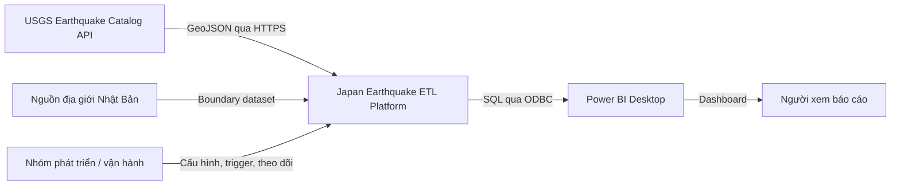
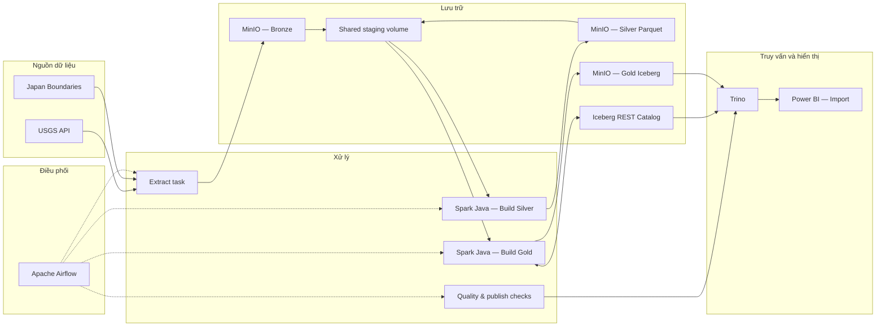
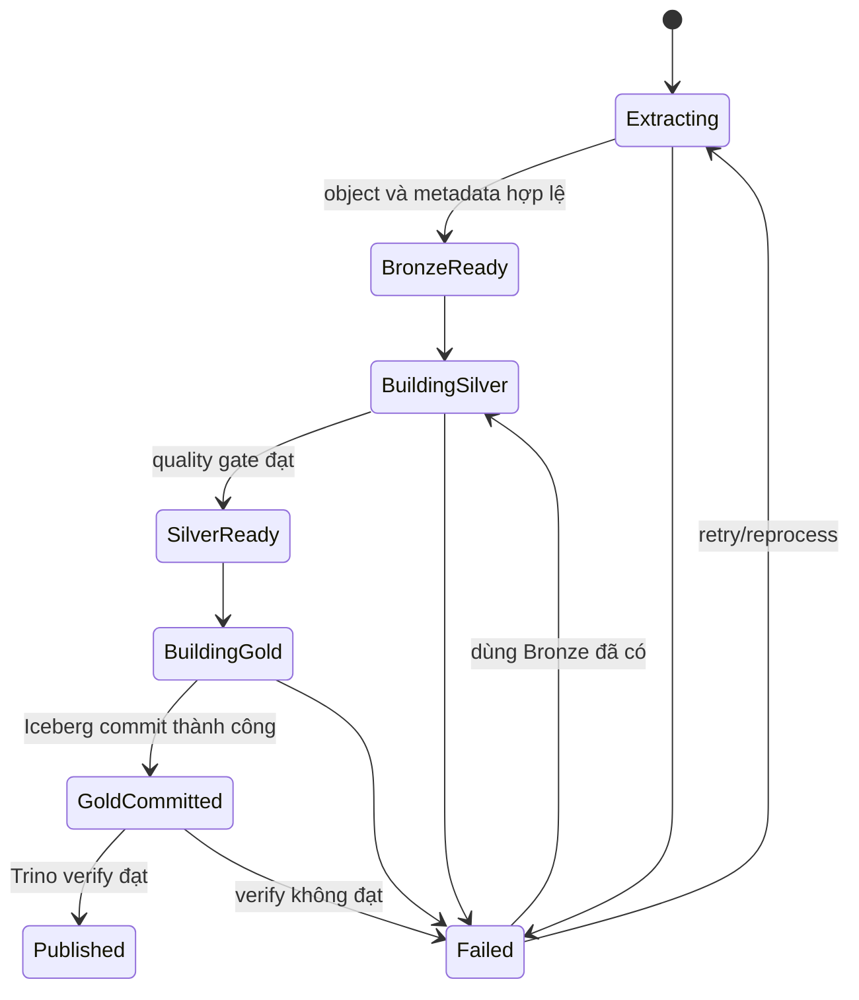
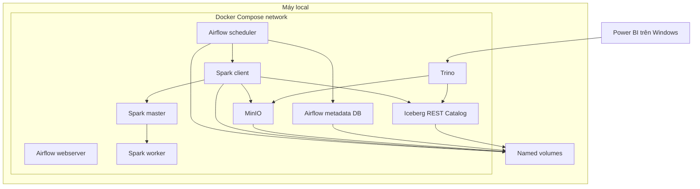

# Kiến trúc hệ thống

| Thuộc tính | Giá trị |
|---|---|
| Trạng thái | Draft |
| Kiểu triển khai chính | Local-first, Docker Compose |
| Mẫu kiến trúc dữ liệu | Batch Lakehouse, Bronze–Silver–Gold |

## 1. Mục tiêu kiến trúc

- Tách rõ orchestration, compute, storage, catalog, query và visualization.
- Bảo toàn dữ liệu nguồn và cho phép xử lý lại.
- Chạy lại an toàn theo ngày hoặc khoảng ngày.
- Chỉ công bố dữ liệu Gold khi một snapshot hoàn chỉnh đã commit.
- Có thể chạy trên một máy local nhưng vẫn thể hiện đúng luồng của một hệ thống dữ liệu.

## 2. Sơ đồ bối cảnh

## 3. Sơ đồ thành phần

Nét liền biểu diễn data flow; nét đứt biểu diễn quyền điều phối.

## 4. Trách nhiệm từng thành phần

| Thành phần | Chịu trách nhiệm | Không chịu trách nhiệm |
|---|---|---|
| Airflow | Lịch chạy, dependency, retry, backfill, log trạng thái | Xử lý dữ liệu phân tán thay Spark |
| Extract task | Gọi API, xác nhận response, ghi Bronze và metadata ingest | Làm sạch nghiệp vụ |
| MinIO | Lưu object Bronze/Silver và warehouse Gold | Hiểu bảng logic hoặc thực thi SQL |
| Shared volume | Staging tạm giữa Airflow và Spark | Lưu dữ liệu dài hạn |
| Spark Java | Parse, validate, deduplicate, enrich, aggregate | Điều phối lịch chạy hoặc cung cấp BI endpoint |
| Iceberg | Schema, partition, metadata, snapshot và commit bảng Gold | Thực thi query cho Power BI |
| REST Catalog | Ánh xạ bảng logic tới metadata/snapshot hiện hành | Lưu toàn bộ data file |
| Trino | Thực thi SQL trên bảng Gold | Tạo bản sao serving bắt buộc |
| Power BI | Semantic model, measure, filter và visualization | Đọc từng object Parquet trực tiếp |
| PostgreSQL của Airflow | Metadata nội bộ cho Airflow nếu cấu hình dùng | Lưu fact/dimension phục vụ BI |

## 5. Ranh giới dữ liệu

### Bronze

- Chứa phản hồi nguồn nguyên bản và metadata của lần ingest.
- Append-only theo `run_id`/`ingest_date`.
- Là điểm bắt đầu cho reprocessing, không dùng trực tiếp cho dashboard.

### Silver

- Chứa sự kiện đã chuẩn hóa kiểu dữ liệu, timestamp và tọa độ.
- Không trùng theo khóa nghiệp vụ trong phạm vi dữ liệu đã hợp nhất.
- Định dạng Parquet, phân vùng theo thời gian sự kiện.

### Gold

- Chứa dữ liệu đã sẵn sàng cho KPI và dashboard.
- Được quản lý như bảng Iceberg; consumer chỉ đọc snapshot đã commit.
- Thiết kế bảng vật lý chi tiết được trì hoãn cho đến khi có mẫu dữ liệu và truy vấn thực tế.

## 6. Biên giao tiếp

| Từ | Đến | Giao tiếp | Dữ liệu |
|---|---|---|---|
| Airflow extract | USGS | HTTPS GET | Query params, GeoJSON response |
| Airflow/Spark | MinIO | S3-compatible API | Object Bronze/Silver/Gold |
| Airflow | Spark | `spark-submit` trong môi trường Compose | JAR, tham số run và đường dẫn staging |
| Spark/Trino | Catalog | Iceberg REST | Namespace, table metadata, snapshot |
| Trino | MinIO | S3-compatible API | Iceberg metadata và Parquet data files |
| Power BI | Trino | ODBC/SQL | Result set phục vụ semantic model |

Tên port, bucket, catalog và service phải nằm trong cấu hình; tài liệu này không cố định giá trị khi `compose.yaml` chưa tồn tại.

## 7. Tính nhất quán và công bố dữ liệu

`Published` là trạng thái nghiệp vụ của pipeline, không phải một database riêng. Power BI chỉ refresh sau trạng thái này. Nếu Gold build thất bại trước commit, consumer vẫn đọc snapshot trước; nếu verify sau commit thất bại, DAG phải báo lỗi và không kích hoạt refresh.

## 8. Idempotency

- `id` của USGS là khóa nghiệp vụ của sự kiện.
- `updated` quyết định phiên bản mới nhất khi cùng `id` xuất hiện nhiều lần.
- Cửa sổ extract đọc chồng các ngày gần nhất để nhận late update.
- Bronze có thể chứa nhiều bản sao nguồn giữa các lần ingest; Silver/Gold phải hợp nhất theo logic khóa và phiên bản.
- Tên output tạm phải gắn `run_id`; output chính thức chỉ được thay đổi bằng thao tác hoàn tất/commit.
- Retry phải ưu tiên dùng lại Bronze hợp lệ thay vì gọi lại API không cần thiết.

## 9. Triển khai local

Chỉ các giao diện cần cho người vận hành và Power BI mới được publish ra host. MinIO API, Catalog, Spark và metadata database nên giữ trong Docker network trừ khi có nhu cầu debug có kiểm soát.

## 10. Bảo mật tối thiểu

- Đặt credentials trong `.env` không commit; cung cấp `.env.example` không có giá trị thật.
- Dùng tài khoản/service credential riêng theo nguyên tắc quyền tối thiểu khi công nghệ hỗ trợ.
- Không đưa access key, password hoặc connection string vào log.
- Không public các port nội bộ ra Internet trong cấu hình local.
- Giới hạn CORS/network exposure của giao diện quản trị.
- Thay credential mặc định trước khi demo qua mạng khác máy.

## 11. Quyết định kiến trúc hiện tại

| Quyết định | Lý do | Hệ quả |
|---|---|---|
| Batch hằng ngày | Phù hợp nguồn và mục tiêu phân tích | Không dùng cho cảnh báo thời gian thực |
| Local-first Compose | Dễ tái tạo, không tốn hạ tầng | Tài nguyên và uptime phụ thuộc máy cá nhân |
| Java cho Spark | Phù hợp yêu cầu học phần/project | Cần quản lý JAR và dependency tương thích |
| MinIO cho toàn bộ data lake | Một nền lưu trữ S3-compatible thống nhất | Cần quản lý bucket policy và volume bền vững |
| Iceberg cho Gold | Snapshot và publish an toàn hơn file rời | Thêm Catalog và cấu hình tương thích |
| Trino làm serving SQL | Power BI không phải hiểu layout object | Thêm một service và ODBC driver |
| Power BI Import | Tương tác dashboard nhẹ trên backend local | Dữ liệu chỉ mới sau lần refresh |

## 12. Điểm còn cần xác nhận khi bắt đầu code

- Phiên bản cụ thể và ma trận tương thích Spark–Iceberg–Trino.
- Catalog implementation và nơi lưu trạng thái catalog.
- Ranh giới địa lý/query bounding box chính xác cho Nhật Bản.
- Số ngày overlap mặc định và giới hạn kích thước mỗi API request.
- Chiến lược merge Gold cho backfill và late update.
- Driver ODBC được dùng trên máy Power BI.
- Tên bucket, namespace, bảng và port cuối cùng.
