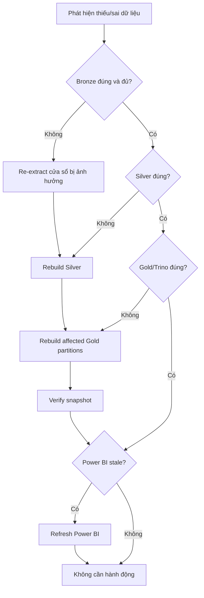

# Backfill và phục hồi pipeline

| Thuộc tính | Giá trị |
|---|---|
| Trạng thái | Draft |
| Áp dụng | Daily run, manual rerun, backfill |

## 1. Mục tiêu

- Chạy bù dữ liệu quá khứ theo phạm vi rõ ràng.
- Chạy lại bước lỗi mà không tạo duplicate logic.
- Không ghi đè nhầm partition ngoài phạm vi.
- Không để Power BI đọc dữ liệu đang xử lý dở.
- Giữ đủ dấu vết để giải thích output được tạo từ input nào.

## 2. Nguyên tắc an toàn

1. Luôn xác định rõ khoảng `[start, end)` bằng UTC.
2. Ưu tiên tái sử dụng Bronze đã xác nhận hợp lệ; chỉ gọi lại nguồn khi Bronze thiếu/sai.
3. Mỗi lần thử có `run_id` riêng nhưng cùng data interval.
4. Không dùng wildcard rộng cho input/output của backfill.
5. Chỉ một job được sửa cùng partition/bảng tại một thời điểm trong môi trường local.
6. Chỉ refresh Power BI sau khi run cuối cùng đạt trạng thái `Published`.
7. Với thao tác có khả năng thay đổi nhiều partition, chạy dry-run/preview phạm vi trước khi submit.

## 3. Chọn loại xử lý

## 4. Các kịch bản

### R01 — Extract lỗi trước khi có Bronze hợp lệ

**Dấu hiệu:** timeout, HTTP `429/5xx`, response hỏng, object Bronze chưa xác nhận.

**Xử lý:**

1. Giữ nguyên data interval.
2. Retry tự động với exponential backoff cho lỗi tạm thời.
3. Nếu hết retry, kiểm tra tình trạng endpoint và tham số request.
4. Trigger lại extract khi nguồn sẵn sàng.
5. Không chạy Silver nếu Bronze chưa qua verify.

### R02 — Extract thành công, Silver lỗi

**Dấu hiệu:** Bronze tồn tại và checksum hợp lệ; Spark parse/transform thất bại.

**Xử lý:**

1. Khóa đúng Bronze URI từ lần ingest thành công.
2. Sửa cấu hình/code nếu cần.
3. Clear/retry từ task Silver, không gọi lại USGS.
4. Ghi output tạm theo attempt mới.
5. Publish Silver chỉ sau quality gate.

### R03 — Silver thành công, Gold lỗi trước commit

**Dấu hiệu:** Spark Gold lỗi, không có snapshot mới.

**Xử lý:**

1. Xác nhận snapshot hiện tại vẫn là phiên bản trước.
2. Dùng đúng Silver partitions của run.
3. Retry build Gold.
4. Theo dõi file tạm/mồ côi; chỉ dọn bằng procedure đã kiểm chứng, không xóa thủ công theo wildcard.

### R04 — Gold commit thành công, verify thất bại

**Dấu hiệu:** có snapshot mới nhưng query kiểm tra sai hoặc Trino không đọc được.

**Xử lý:**

1. Không refresh Power BI.
2. Xác định lỗi là cấu hình Trino/Catalog hay dữ liệu snapshot.
3. Nếu snapshot đúng nhưng query layer lỗi, sửa serving rồi chạy lại verify.
4. Nếu snapshot sai, tạo một snapshot sửa chữa hoặc rollback bằng tính năng Iceberg đã được kiểm thử.
5. Không xóa trực tiếp data/metadata file của snapshot.

### R05 — Power BI refresh lỗi

**Dấu hiệu:** pipeline `Published`, Trino query đạt nhưng Power BI không import được.

**Xử lý:**

1. Chạy lại SQL tương đương bằng Trino client.
2. Kiểm tra ODBC DSN, network, authentication và timeout.
3. Kiểm tra schema/result type có thay đổi không.
4. Retry refresh sau khi kết nối ổn định; không rerun ETL nếu Gold đã đúng.

### R06 — Thiếu một hoặc nhiều ngày quá khứ

**Xử lý:** dùng backfill có ngày bắt đầu/kết thúc rõ ràng. Chia khoảng lớn thành các batch ngày nhỏ để tránh API response quá lớn và giảm phạm vi lỗi.

## 5. Quy trình backfill chuẩn

### Bước 1 — Xác định phạm vi

Ghi lại:

- Lý do backfill.
- `start_date` inclusive và `end_date` exclusive theo UTC.
- Tầng cần chạy lại: extract, Silver, Gold hay chỉ BI refresh.
- Các partition/tables bị ảnh hưởng.
- Người thực hiện và thời điểm.

### Bước 2 — Kiểm tra trước chạy

- Không có daily run đang sửa cùng phạm vi.
- MinIO còn đủ dung lượng.
- Nguồn/API hoạt động nếu cần re-extract.
- Snapshot Gold hiện tại và record count được ghi lại để đối chiếu.
- Power BI refresh tự động được tạm tránh trong cửa sổ backfill nếu cần.

### Bước 3 — Preview

Pipeline nên hỗ trợ in ra, nhưng chưa thực thi:

- Danh sách ngày sẽ chạy.
- Bronze object dự kiến tái sử dụng hoặc cần tải lại.
- Silver partitions và Gold tables/partitions dự kiến thay đổi.
- Số job và concurrency.

### Bước 4 — Chạy tuần tự

Ở môi trường local, mặc định `max_active_runs = 1` cho backfill. Hoàn thành và verify từng interval trước khi chuyển interval tiếp theo nếu tài nguyên hạn chế.

### Bước 5 — Đối soát

- Không trùng `earthquake_id` ở tập Gold hiện hành.
- Cùng `id` chỉ giữ `updated` mới nhất.
- Count theo ngày trước/sau có thể giải thích được.
- Ngày ngoài phạm vi không bị thay đổi ngoài các late update được chủ động bao gồm.
- Trino đọc được snapshot cuối.

### Bước 6 — Kết thúc

- Ghi run IDs và snapshot IDs.
- Lưu kết quả kiểm tra.
- Mở lại lịch refresh Power BI và thực hiện một lần refresh.
- Tạo issue nếu còn dữ liệu mồ côi hoặc cleanup cần làm sau.

## 6. Ma trận retry

| Lỗi | Tự động retry | Điểm chạy lại | Ghi chú |
|---|---:|---|---|
| Network timeout/HTTP `429/5xx` | Có | Extract | Backoff và giới hạn số lần |
| HTTP `4xx` do tham số | Không | Sau khi sửa cấu hình | Không spam nguồn |
| Bronze upload tạm thời lỗi | Có | Ghi Bronze | Xác nhận checksum sau retry |
| Parse/schema mismatch | Không mặc định | Silver | Cần đánh giá thay đổi nguồn |
| Spark worker mất kết nối | Có giới hạn | Job hiện tại | Output tạm gắn attempt/run ID |
| Quality gate thất bại | Không | Sau khi sửa dữ liệu/logic | Không publish downstream |
| Iceberg commit conflict | Có giới hạn | Commit/build Gold | Ngăn writer đồng thời trước |
| Trino tạm không sẵn sàng | Có | Verify | Không rerun Gold nếu snapshot đúng |
| Power BI/ODBC lỗi | Có thủ công | Refresh BI | ETL không cần chạy lại |

## 7. Idempotency checklist

Trước khi coi pipeline là hỗ trợ rerun:

- [ ] Bronze path phân biệt run và không overwrite mơ hồ.
- [ ] Dedup dùng `id` và `updated`, có tie-break xác định.
- [ ] Silver publish không append lặp vào cùng tập logic.
- [ ] Gold write dùng merge/partition replacement có phạm vi rõ.
- [ ] Retry không tạo nhiều snapshot “thành công giả” cho cùng attempt.
- [ ] Verify đọc đúng current snapshot.
- [ ] Chạy cùng input hai lần cho cùng tập khóa và số liệu KPI.

## 8. Bằng chứng cần lưu

Mỗi sự cố/backfill cần tối thiểu:

- Airflow DAG run URL hoặc run ID.
- Data interval và input object URIs.
- Git commit/config version.
- Record-count metrics trước và sau.
- Snapshot ID trước và sau.
- Kết quả verification SQL.
- Mô tả nguyên nhân gốc nếu lần chạy trước thất bại.

## 9. Những việc không làm

- Không xóa toàn bộ bucket/warehouse để “chạy lại từ đầu”.
- Không sửa trực tiếp file Parquet/Iceberg metadata.
- Không dùng `SELECT COUNT(*)` duy nhất để kết luận dữ liệu đúng.
- Không rerun toàn pipeline nếu lỗi chỉ nằm ở Power BI.
- Không chạy backfill lớn cùng daily run trên máy local hạn chế tài nguyên.

