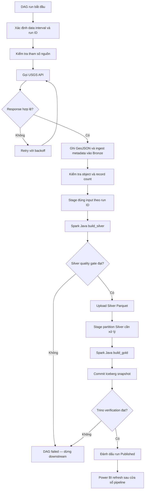
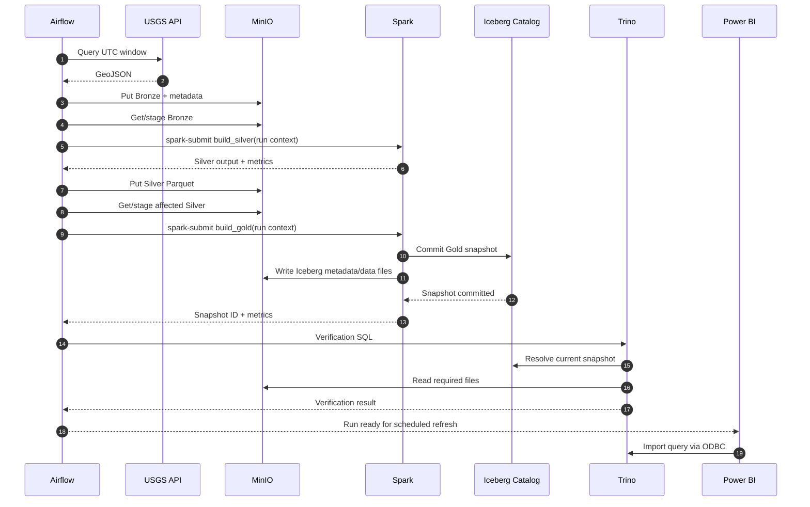

# Luồng ETL hằng ngày

| Thuộc tính | Giá trị |
|---|---|
| Trạng thái | Draft |
| Trigger | Theo lịch hoặc thủ công |
| Chu kỳ dự kiến | Mỗi ngày |
| Múi giờ điều phối | `Asia/Ho_Chi_Minh` |
| Múi giờ cửa sổ dữ liệu | UTC |

## 1. Mục đích

Tài liệu này mô tả happy path của một lần chạy pipeline. Các trường hợp chạy bù, retry có chọn lọc và khôi phục sau lỗi được mô tả tại [Backfill và phục hồi](./BACKFILL_AND_RECOVERY.md).

## 2. Cửa sổ dữ liệu

Lịch tham khảo là **07:15 giờ Việt Nam**, sau khi ngày UTC trước đó đã kết thúc.

Với ngày chạy logic `D`:

- Cửa sổ bắt buộc: toàn bộ ngày UTC `D - 1`.
- Cửa sổ overlap đề xuất: đọc thêm ba ngày gần nhất để nhận sự kiện được USGS sửa muộn.
- Mọi timestamp truyền cho API phải có timezone rõ ràng.
- Giá trị overlap phải cấu hình được; con số ba ngày cần được hiệu chỉnh sau khi quan sát dữ liệu thực tế.

Ví dụ, DAG chạy lúc `2026-09-16 07:15 Asia/Ho_Chi_Minh` có ngày UTC bắt buộc là `2026-09-15` và có thể đọc chồng từ `2026-09-13T00:00:00Z` đến trước `2026-09-16T00:00:00Z`.

## 3. Luồng tổng thể



## 4. Chi tiết từng bước

### P01 — Khởi tạo lần chạy

**Input:** logical date, DAG data interval, cấu hình vùng nghiên cứu.

**Xử lý:**

- Sinh/nhận `run_id` duy nhất từ Airflow.
- Chuẩn hóa `window_start` và `window_end` sang UTC.
- Xác nhận `window_start < window_end` và không vượt quá thời điểm hiện tại.
- Ghi các tham số vào log có cấu trúc.

**Output:** run context dùng chung cho các task.

### P02 — Extract USGS

**Input:** run context.

**Xử lý:**

- Gọi endpoint query ở định dạng GeoJSON.
- Truyền thời gian, bounding box/radius và các bộ lọc đã cấu hình.
- Đặt timeout; retry lỗi mạng, HTTP `429` và lỗi server tạm thời.
- Không retry vô hạn lỗi tham số hoặc response không đúng hợp đồng.

**Output:** response nguyên bản cùng metadata request/response không chứa secret.

### P03 — Ghi Bronze

**Input:** response GeoJSON hợp lệ ở mức cú pháp.

**Xử lý:**

- Ghi object theo đường dẫn gắn ngày ingest và run ID.
- Ghi metadata tối thiểu: source, request window, fetch time, HTTP status, feature count, checksum và run ID.
- Xác nhận object có thể đọc lại trước khi hoàn tất task.

**Output dự kiến:**

```text
bronze/usgs/ingest_date=YYYY-MM-DD/run_id=<run-id>/earthquakes.geojson
bronze/usgs/ingest_date=YYYY-MM-DD/run_id=<run-id>/metadata.json
```

Tên cuối cùng sẽ được xác nhận khi mã nguồn được tạo.

### P04 — Build Silver

**Input:** danh sách Bronze object được khóa theo run context.

**Xử lý:**

1. Parse `features` và ánh xạ các trường cần thiết.
2. Chuẩn hóa timestamp về UTC và tạo timestamp JST.
3. Ép kiểu magnitude, depth, latitude, longitude và flags.
4. Kiểm tra range, required field và tính hợp lệ.
5. Loại bản ghi không hợp lệ; ghi count và lý do tổng hợp vào log.
6. Hợp nhất với dữ liệu liên quan trong overlap window.
7. Với cùng `id`, giữ record có `updated` lớn nhất; tie-break phải xác định được.
8. Ghi Parquet tạm, chạy quality gate rồi mới upload Silver.

**Output dự kiến:**

```text
silver/earthquakes/year=YYYY/month=MM/*.parquet
```

### P05 — Build Gold

**Input:** Silver partitions bị ảnh hưởng bởi cửa sổ chạy.

**Xử lý:**

- Enrich khu vực nếu boundary dataset sẵn sàng.
- Tạo các thuộc tính phân nhóm magnitude/depth dùng thống nhất.
- Tính các aggregate cần thiết cho dashboard nếu có lợi cho hiệu năng.
- Ghi vào bảng Iceberg theo chiến lược merge/overwrite partition đã thống nhất.
- Commit snapshot nguyên tử; lưu snapshot ID trong log/XCom phù hợp.

Thiếu enrichment không được làm mất event. Record không match phải giữ tọa độ gốc và nhận giá trị khu vực quy ước.

### P06 — Verify và publish

**Input:** snapshot ID vừa commit.

**Xử lý:**

- Truy vấn Trino để kiểm tra bảng có thể đọc.
- Đối soát số lượng, uniqueness và range bắt buộc.
- Xác nhận snapshot hiện tại đúng với snapshot vừa ghi.
- Ghi metric cuối cùng và đánh dấu run thành công.

**Output:** trạng thái `Published`, cho phép Power BI refresh.

## 5. Sequence diagram



## 6. Hợp đồng run context

Mỗi job nên nhận cùng một nhóm tham số logic, bất kể cơ chế truyền cụ thể:

| Tham số | Bắt buộc | Ý nghĩa |
|---|---|---|
| `run_id` | Có | Mã truy vết end-to-end |
| `window_start_utc` | Có | Đầu cửa sổ, inclusive |
| `window_end_utc` | Có | Cuối cửa sổ, exclusive |
| `processing_date` | Có | Ngày logic của run |
| `input_uri` | Có | Input đã được resolve, không dùng wildcard mơ hồ |
| `output_uri`/table | Có | Đích của bước xử lý |
| `is_backfill` | Có | Phân biệt run lịch thường và run chạy bù |
| `config_version` | Nên có | Phiên bản cấu hình/commit phục vụ truy vết |

## 7. Logging và metric bắt buộc

Mỗi bước phải log:

- `run_id`, task, attempt, window start/end.
- Input/output URI hoặc table logic, không log credential.
- Thời gian chạy và trạng thái.
- Số bản ghi input, parsed, valid, rejected, duplicate, inserted/updated logic và output.
- Lỗi kèm nguyên nhân gốc và đủ context để chạy lại.
- Snapshot ID sau khi Gold commit.

## 8. Điều kiện dừng

Pipeline phải dừng trước downstream nếu:

- Response không parse được hoặc thiếu cấu trúc nguồn bắt buộc.
- Bronze không ghi/đọc lại được.
- Silver vi phạm quality gate bắt buộc.
- Spark job trả exit code khác 0.
- Iceberg commit thất bại.
- Trino không đọc được snapshot mới hoặc Gold vi phạm kiểm tra bắt buộc.

Việc không có sự kiện trong một cửa sổ nhỏ không mặc định là lỗi; phải phân biệt response rỗng hợp lệ với extract thất bại.

## 9. Điều kiện hoàn tất

Một daily run chỉ hoàn tất khi:

1. Bronze và ingest metadata tồn tại.
2. Silver của các partition liên quan đã publish.
3. Gold snapshot đã commit.
4. Trino verification đạt.
5. Metric đối soát đã ghi đầy đủ.
6. Run được đánh dấu thành công và có thể refresh Power BI.

