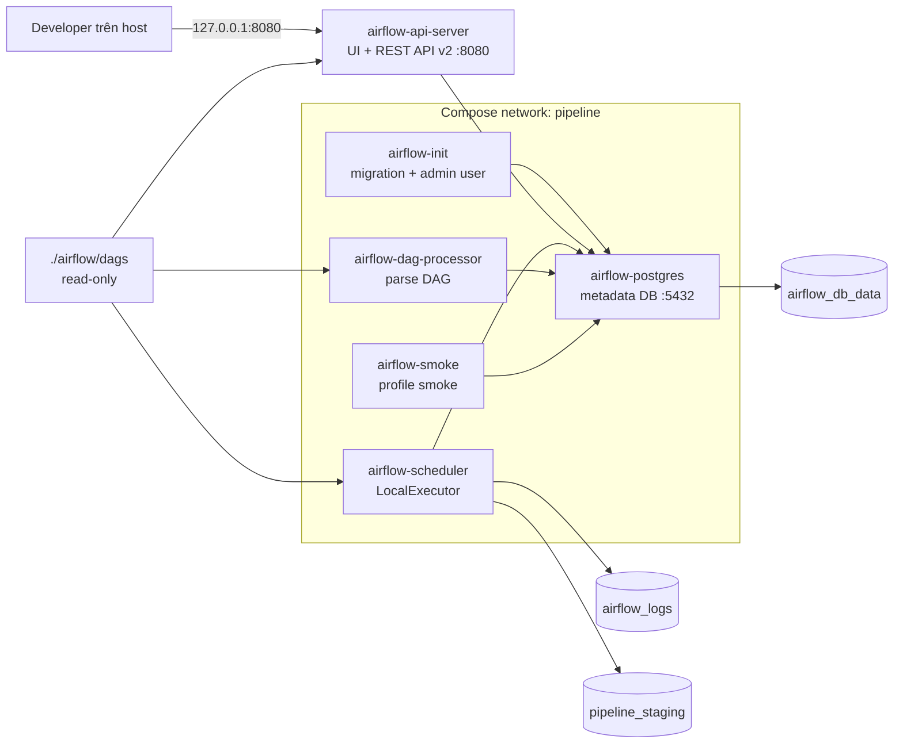

# Airflow local runtime và smoke DAG contract

| Thuộc tính | Giá trị |
|---|---|
| Task | `AFL-01` |
| Trạng thái | Implemented |
| Airflow | `3.3.2-python3.13` |
| Executor | `LocalExecutor` |
| Metadata database | PostgreSQL `16.12-bookworm` |
| Smoke DAG | `afl_01_smoke` |
| UI/API host URL | `http://127.0.0.1:8080` mặc định |

## 1. AFL-01 làm gì

AFL-01 cung cấp môi trường Airflow local để các task orchestration tiếp theo có
nơi khai báo, parse, schedule và thực thi DAG. Phạm vi gồm:

- PostgreSQL chỉ lưu metadata nội bộ của Airflow.
- One-shot init chạy database migration và tạo tài khoản quản trị local.
- API server cung cấp UI và REST API v2.
- Scheduler tạo DAG run và giao task cho `LocalExecutor`.
- DAG processor đọc source DAG độc lập với scheduler theo kiến trúc Airflow 3.
- DAG `afl_01_smoke` và runner xác nhận một task thực sự được scheduler chạy
  đến trạng thái `success`.

Task này chưa triển khai DAG ETL, USGS extract, S3 connection, Spark submit,
retry/backfill nghiệp vụ hoặc data quality gate. Những task downstream phải mở
rộng contract này thay vì tạo một Airflow stack khác.

## 2. Kiến trúc và trình tự khởi động



Trình tự readiness:

1. `airflow-postgres` mount `airflow_db_data` và phải qua `pg_isready`.
2. `airflow-init` chạy migration, tạo tài khoản admin local nếu chưa có, chuẩn
   bị quyền ghi cho log và staging rồi thoát mã `0`.
3. API server, scheduler và DAG processor chỉ khởi động sau khi init thành công.
4. Mỗi component phải qua healthcheck riêng trước khi smoke runner chạy.
5. Smoke runner kiểm tra import error, xác nhận DAG đã được serialize, trigger
   một run ID duy nhất và poll đến trạng thái `success` hoặc `failed`.

Không dùng thời gian chờ cố định để kết luận service đã sẵn sàng. Khoảng nghỉ
hai giây trong smoke runner chỉ là nhịp poll trạng thái của DAG run đã tạo.

Healthcheck heartbeat của scheduler và DAG processor khởi chạy Airflow CLI, nên
được cấp `timeout: 30s`, `start_period: 60s` và interval `30s`. Lệnh bắt đầu
bằng `exec` để tiến trình CLI thay thế shell của healthcheck; nếu Docker hủy
một lần check do timeout thì không để lại Python process mồ côi tranh CPU/RAM
với lần check sau. Các override này chỉ thay ngân sách probe, không làm lỏng
điều kiện heartbeat quyết định readiness.

## 3. Lý do chọn LocalExecutor

`LocalExecutor` chạy task process trong container scheduler và dùng PostgreSQL
để điều phối state. Mô hình này phù hợp cho một máy local vì:

- Không cần Redis, Celery worker hoặc message broker.
- Vẫn kiểm chứng được scheduler và parallel task execution trên metadata DB.
- Ít service và ít RAM hơn CeleryExecutor.
- Các task Spark sau này có thể gọi `spark-submit` mà không biến Airflow thành
  compute engine.

Đây là cấu hình phát triển/demo local, không phải production deployment. Nếu
nhóm chuyển sang executor phân tán, thay đổi đó cần task, sizing và review bảo
mật riêng.

## 4. Service contract

| Service | Vai trò | Readiness | Lifecycle |
|---|---|---|---|
| `airflow-postgres` | Lưu DAG run, task instance, user và Airflow metadata | `pg_isready` | Long-running, durable volume |
| `airflow-init` | Migration và admin bootstrap | Exit code `0` | One-shot, idempotent |
| `airflow-api-server` | UI và REST API v2 | `/api/v2/monitor/health` | Long-running |
| `airflow-scheduler` | Schedule và LocalExecutor | `SchedulerJob` heartbeat | Long-running |
| `airflow-dag-processor` | Parse/serialize DAG | `DagProcessorJob` heartbeat | Long-running |
| `airflow-smoke` | Trigger và verify DAG smoke | Script exit code | One-shot, profile `smoke` |

Airflow 3 tách DAG parsing thành process riêng, vì vậy scheduler healthy không
thay thế healthcheck của DAG processor.

## 5. DAG smoke

Source: `airflow/dags/afl_01_smoke.py`.

Contract:

- DAG ID cố định: `afl_01_smoke`.
- Chỉ trigger thủ công với `schedule=None`.
- `catchup=False`, `max_active_runs=1` và không paused khi được tạo.
- Một task `verify_scheduler_execution` không gọi mạng, MinIO hoặc Spark.
- Task log chỉ ghi event, DAG ID và `run_id`; không ghi secret hoặc payload.
- Mỗi smoke run dùng run ID duy nhất để chạy lại không xung đột run cũ.

DAG này chỉ kiểm tra Airflow runtime. Không dùng nó làm template để bỏ qua run
context, retry hoặc data interval contract của DAG production.

## 6. Cấu hình và secret

Giá trị local lấy từ `.env`; `.env.example` chỉ chứa placeholder.

| Biến | Mục đích | Nhạy cảm |
|---|---|---:|
| `AIRFLOW_UID` | UID của process ghi named volume | Không |
| `AIRFLOW_ADMIN_USERNAME` | Tài khoản UI local | Không |
| `AIRFLOW_ADMIN_PASSWORD` | Mật khẩu UI local | Có |
| `AIRFLOW_FERNET_KEY` | Mã hóa connection/variable trong metadata DB | Có |
| `AIRFLOW_API_JWT_SECRET` | Ký JWT giữa API server và task execution | Có |
| `AIRFLOW_WEB_HOST_PORT` | Port UI/API trên loopback host | Không |
| `AIRFLOW_DB_USER` | PostgreSQL metadata user | Không |
| `AIRFLOW_DB_PASSWORD` | PostgreSQL metadata password | Có |
| `AIRFLOW_DB_NAME` | PostgreSQL metadata database | Không |

`AIRFLOW_DB_PASSWORD` nằm trong SQLAlchemy URI nội bộ, vì vậy checker chỉ cho
phép ký tự URI-safe. Admin password, database password và JWT secret phải khác
nhau. Không dùng root credential MinIO làm Airflow secret.

Tạo Fernet key hợp lệ mà không ghi nó vào shell history:

```bash
python3 -c 'from cryptography.fernet import Fernet; print(Fernet.generate_key().decode())'
```

Chỉ chép kết quả vào `.env` local. Không đưa giá trị vào issue, PR hoặc log.

## 7. Network, mount và persistence

- UI/API là port Airflow duy nhất publish ra host và bind `127.0.0.1`.
- PostgreSQL `5432` chỉ expose trong network `pipeline`, không publish host.
- `./airflow/dags` bind read-only tại `/opt/airflow/dags`.
- `airflow_logs` mount read-write tại `/opt/airflow/logs`.
- `pipeline_staging` mount read-write tại `/opt/pipeline/staging`.
- `airflow_db_data` mount tại `/var/lib/postgresql/data`.

`docker compose down` giữ named volume. Không dùng `docker compose down -v`
trong vận hành thông thường vì thao tác đó có thể xóa lịch sử run, user và
metadata database.

## 8. Khởi động và kiểm thử

Tạo `.env`, thay placeholder rồi chạy preflight:

```bash
cp .env.example .env
./scripts/check-config.sh --require-local
./scripts/check-airflow.sh
```

Khởi động và chạy acceptance smoke:

```bash
./scripts/smoke-airflow.sh
```

Kết quả đúng:

1. `airflow-postgres`, `airflow-api-server`, `airflow-scheduler` và
   `airflow-dag-processor` đều healthy.
2. `airflow-init` thoát mã `0`.
3. Airflow không có DAG import error.
4. `afl_01_smoke` xuất hiện và run mới kết thúc `success`.

Xem trạng thái và log mà không in environment:

```bash
docker compose --env-file .env ps -a \
  airflow-postgres airflow-init airflow-api-server \
  airflow-scheduler airflow-dag-processor
docker compose --env-file .env logs --tail=100 airflow-scheduler
docker compose --env-file .env logs --tail=100 airflow-dag-processor
```

Mở `http://127.0.0.1:8080` và đăng nhập bằng admin credential trong `.env`.

## 9. Troubleshooting

### Init thất bại

- Kiểm tra PostgreSQL đã healthy và `AIRFLOW_DB_*` thống nhất.
- Kiểm tra database password chỉ chứa ký tự URI-safe theo config checker.
- Xem `docker compose --env-file .env logs airflow-init`.
- Không xóa `airflow_db_data` để thử lại; migration được thiết kế chạy lặp.

### DAG không xuất hiện

- Chạy `docker compose --env-file .env exec airflow-dag-processor airflow dags list-import-errors`.
- Xác nhận source nằm dưới `airflow/dags/` và mount read-only đúng target.
- Kiểm tra health/log của `airflow-dag-processor` trước scheduler.

### Scheduler unhealthy

- Chạy `docker compose --env-file .env exec airflow-scheduler airflow jobs check --job-type SchedulerJob --local`.
- Kiểm tra metadata DB, CPU/RAM và log scheduler.
- Không coi API server healthy là bằng chứng scheduler healthy.

### Smoke timeout hoặc failed

- Lấy run ID từ output của smoke runner.
- Mở Grid view hoặc đọc task log trong `airflow_logs`.
- Giữ run metadata làm evidence; không xóa database để che lỗi.

## 10. Handoff cho task downstream

- DAG production đặt dưới `airflow/dags/`, không build vào image ở giai đoạn
  local này.
- Dùng timezone `Asia/Ho_Chi_Minh`, nhưng data interval phải resolve theo UTC
  như baseline dự án.
- Mọi DAG phải truyền `run_id`, window UTC, `processing_date` và `is_backfill`
  qua các bước liên quan.
- Connection/Variable nhạy cảm phải được inject từ environment hoặc secret
  backend được duyệt, không hard-code trong DAG.
- Consumer của MinIO phải chờ `minio-init`; task AFL-01 chưa tạo S3 connection.
- Retry/rerun của DAG downstream phải chứng minh không tạo duplicate.

## 11. Nguồn tham khảo

- [Airflow 3.3.2 Docker Compose quick start](https://airflow.apache.org/docs/apache-airflow/3.3.2/howto/docker-compose/index.html)
- [Airflow 3.3.2 quick start](https://airflow.apache.org/docs/apache-airflow/3.3.2/start.html)
- [Airflow health checks](https://airflow.apache.org/docs/apache-airflow/3.3.2/administration-and-deployment/logging-monitoring/check-health.html)
- [Airflow 3.3.2 release notes](https://airflow.apache.org/docs/apache-airflow/3.3.2/release_notes.html)
