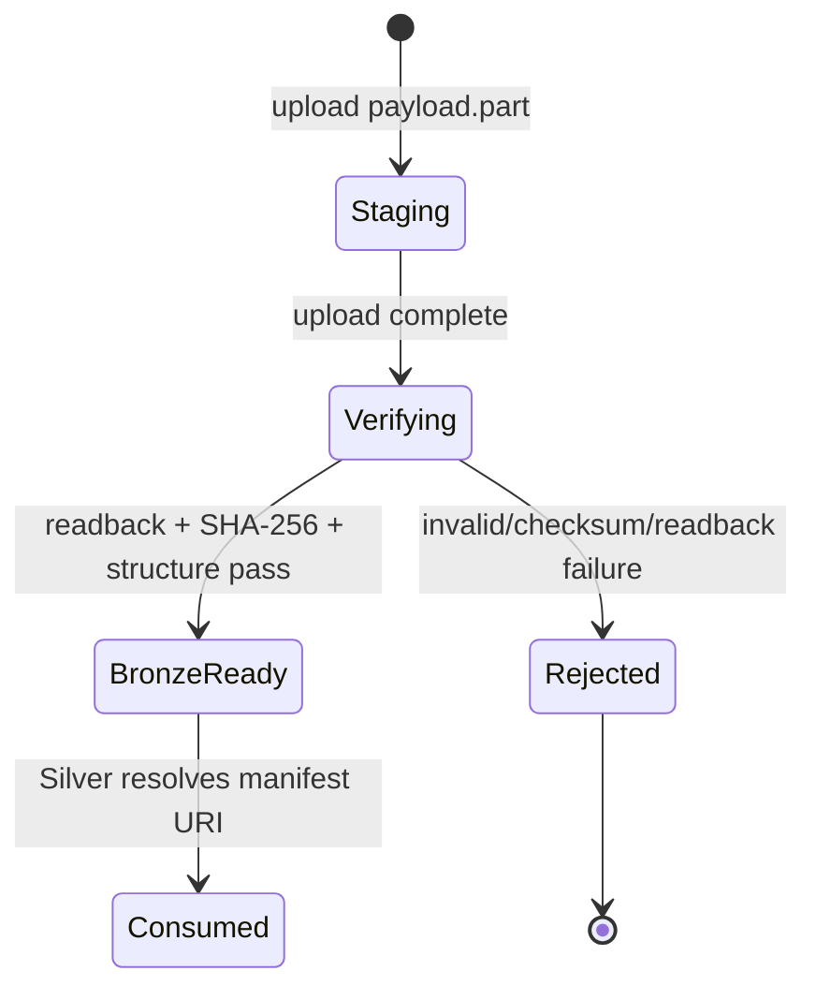

# Bronze storage contract: object và manifest

Tài liệu này là hợp đồng chung giữa nhóm ingest, MinIO, Spark/Silver và
orchestration. Bronze lưu payload nhận từ nguồn và metadata đủ để kiểm tra,
replay và truy vết; Bronze không parse, filter business hay ghi đè payload đã
được xác nhận.

Contract áp dụng cho cả:

- USGS GeoJSON response theo cửa sổ UTC.
- JMA annual ZIP archive theo năm và `catalog_release`.

Các giá trị ROI, cửa sổ USGS, baseline JMA, timezone và source role kế thừa từ
[source coverage contract](./SOURCE_COVERAGE.md). Endpoint, bucket và
credential lấy từ [MinIO storage contract](./MINIO_STORAGE.md), không hard-code
trong writer.

## 1. Nguyên tắc bắt buộc

1. **Raw trước, xử lý sau:** payload được lưu nguyên bản trước khi Silver đọc.
2. **Một object, một key bất biến:** key có `run_id` và `attempt`; retry hoặc
   rerun không ghi đè object cũ.
3. **Manifest là điểm vào hợp lệ:** downstream chỉ đọc manifest có
   `bronze_status=BronzeReady`, raw object tồn tại và checksum đọc lại khớp.
4. **Không nhầm marker với dữ liệu:** `.keep`, thư mục rỗng hoặc object upload
   chưa có manifest không chứng minh một run thành công.
5. **Payload lỗi không được Ready:** dữ liệu lỗi đi vào `_quarantine` hoặc bị
   giữ ở `_staging`; không được phát hành manifest `BronzeReady`.
6. **Không lọc business ở Bronze:** empty response hợp lệ vẫn được lưu; record
   invalid/ngoài ROI chỉ được phân loại ở Silver theo contract downstream.
7. **Metadata không chứa secret:** source URL, query params và response headers
   được phép lưu nếu không có credential/token.

## 2. Bucket và namespace

MinIO local dùng bucket `s3://japan-earthquake`. Bronze là logical prefix,
không phải bucket riêng:

```text
s3://japan-earthquake/bronze/
├── usgs/
├── jma/
├── _staging/
└── _quarantine/
```

`_staging` và `_quarantine` thuộc vùng kiểm soát của Bronze nhưng không phải
input hợp lệ cho Silver. Writer phải dùng pipeline credential theo
[MIO-01](../task/tasks/MIO-01.md); không dùng root credential trong DAG hoặc
Spark job.

### 2.1. Quy tắc key

- Tất cả key dùng `/` làm separator, không có leading `/`, `..` hoặc ký tự
  xuống dòng.
- `run_id` là ID duy nhất, ổn định trong một logical run và URL-safe.
- `attempt` là số nguyên dương tăng dần trong cùng `run_id`.
- `ingest_date` là ngày UTC của thời điểm ingest, định dạng `YYYY-MM-DD`.
- `catalog_release` là slug nguồn, không chứa `/`; JMA bắt buộc có, USGS để
  `null` trong manifest.
- Không dùng timestamp hiện tại hoặc tên máy làm khóa duy nhất thay cho
  `run_id`.

## 3. Object layout

### 3.1. USGS

```text
bronze/usgs/ingest_date=YYYY-MM-DD/run_id=<run-id>/attempt=<nn>/
├── response.geojson
└── manifest.json
```

`response.geojson` là HTTP response body nguyên bản ở dạng GeoJSON. Manifest
ghi lại URL đầy đủ, query params đã resolve, request window half-open của
project, thời điểm lấy dữ liệu, HTTP response metadata và SHA-256 của object.

Ví dụ:

```text
s3://japan-earthquake/bronze/usgs/ingest_date=2026-09-29/
  run_id=20260929T001500Z-7e4f/attempt=01/response.geojson
s3://japan-earthquake/bronze/usgs/ingest_date=2026-09-29/
  run_id=20260929T001500Z-7e4f/attempt=01/manifest.json
```

### 3.2. JMA

```text
bronze/jma/year=YYYY/catalog_release=<release-slug>/
  ingest_date=YYYY-MM-DD/run_id=<run-id>/attempt=<nn>/
├── archive.zip
└── manifest.json
```

`archive.zip` là file ZIP nguyên bản được tải từ JMA. Không giải nén rồi chỉ
lưu fixed-width rows thay cho archive ở Bronze. Parser có thể tạo staging riêng
ở Silver hoặc thư mục tạm, còn raw ZIP và manifest vẫn là bằng chứng gốc.

Ví dụ:

```text
s3://japan-earthquake/bronze/jma/year=2023/catalog_release=2025-12-15/
  ingest_date=2026-09-29/run_id=jma-2023-7e4f/attempt=01/archive.zip
s3://japan-earthquake/bronze/jma/year=2023/catalog_release=2025-12-15/
  ingest_date=2026-09-29/run_id=jma-2023-7e4f/attempt=01/manifest.json
```

Nếu JMA sửa cùng một năm, `catalog_release` hoặc `run_id` phải tạo namespace
mới. Không thay object của release trước.

### 3.3. Staging và quarantine

```text
bronze/_staging/<source>/ingest_date=YYYY-MM-DD/
  run_id=<run-id>/attempt=<nn>/payload.part

bronze/_quarantine/<source>/ingest_date=YYYY-MM-DD/
  run_id=<run-id>/attempt=<nn>/payload.bin
bronze/_quarantine/<source>/ingest_date=YYYY-MM-DD/
  run_id=<run-id>/attempt=<nn>/failure_manifest.json
```

`_staging` chỉ được dùng trong lúc upload/verify. `payload.part` không được
resolver chọn. Khi checksum, readback và source-structure validation thất bại,
writer ghi failure manifest trong `_quarantine` với `bronze_status=Rejected`;
không ghi `manifest.json` `BronzeReady` vào namespace chính.

## 4. Manifest contract

Mỗi raw object hợp lệ có đúng một `manifest.json` cùng thư mục. Manifest phải
chứa các trường sau; field không áp dụng dùng `null`, không tự đổi tên giữa
USGS và JMA.

| Field | Kiểu | Bắt buộc | Ý nghĩa |
|---|---|---:|---|
| `manifest_version` | string | Có | Version schema của manifest, hiện là `1.0` |
| `manifest_id` | string | Có | ID duy nhất của manifest |
| `bronze_status` | enum | Có | `BronzeReady` hoặc `Rejected`; chỉ `BronzeReady` được downstream đọc |
| `source_system` | enum | Có | `USGS` hoặc `JMA_BULLETIN` |
| `source_kind` | enum | Có | `event_api` hoặc `annual_archive` |
| `raw_object_uri` | string | Có | URI `s3://...` trỏ đúng object raw |
| `raw_object_key` | string | Có | Key tương đối trong bucket |
| `media_type` | string | Có | `application/geo+json` hoặc `application/zip` |
| `content_encoding` | string | Có | `identity` nếu chưa có lớp nén |
| `content_length_bytes` | integer | Có | Kích thước object đã lưu |
| `sha256` | string | Có | SHA-256 của bytes trong raw object |
| `run_id` | string | Có | Run context do Airflow/orchestrator cấp |
| `attempt` | integer | Có | Lần thử trong run, bắt đầu từ `1` |
| `ingest_date_utc` | date | Có | Ngày UTC object được ghi |
| `retrieved_at_utc` | timestamp | Có | Thời điểm nhận response/archive |
| `is_backfill` | boolean | Có | Run historical/backfill hay daily |
| `logical_run_key` | string | Có | Khóa logic để nhận diện cùng interval/release |
| `data_interval` | object | Có | Window USGS hoặc year/JST interval của JMA |
| `request` | object | Có | Method, source URL và query/request metadata |
| `response` | object | Có | HTTP status và header không nhạy cảm |
| `catalog_release` | string/null | Có | Release JMA; `null` với USGS |
| `record_count_estimate` | integer/null | Có | Count lấy ở mức Bronze, không phải count Silver |
| `validation` | object | Có | Kết quả readback, checksum và source-structure check |
| `writer` | object | Có | Component/version/commit tạo manifest |
| `lineage` | object | Có | Quan hệ retry/reprocess và source object |

### 4.1. `data_interval`

USGS dùng:

```json
{
  "window_start_utc": "2026-09-26T00:00:00Z",
  "window_end_utc": "2026-09-29T00:00:00Z",
  "interval_semantics": "[start,end)"
}
```

JMA dùng:

```json
{
  "year": 2023,
  "native_timezone": "Asia/Tokyo",
  "native_start": "1983-12-31T15:00:00Z",
  "native_end": "2023-12-31T15:00:00Z",
  "interval_semantics": "[start,end)"
}
```

JMA `native_start`/`native_end` phải thể hiện đúng archive year và UTC boundary
đã quy định trong `CON-01`; không suy ra từ `ingest_date`.

### 4.2. `request` và `response`

`request` tối thiểu có `method`, `url`, `query` hoặc `path`, và `timeout_ms`.
USGS phải lưu query params sau khi resolve bounding box, event type và window.
JMA phải lưu URL file/index và năm/release được yêu cầu.

`response` tối thiểu có `http_status`, `content_type`; có thể có `etag`,
`last_modified`, `server_date` và `content_length_header`. Không lưu
`Authorization`, access key, cookie hoặc token.

### 4.3. `validation`

Manifest `BronzeReady` phải có tất cả giá trị sau là `true`:

```json
{
  "object_write_completed": true,
  "raw_readback_verified": true,
  "checksum_verified": true,
  "source_structure_valid": true,
  "manifest_consistent": true
}
```

`source_structure_valid` chỉ là kiểm tra cấu trúc Bronze:

- USGS: body đọc được, JSON/GeoJSON hợp lệ và có cấu trúc response mong đợi;
  empty `features=[]` là hợp lệ.
- JMA: ZIP mở được, file expected và kích thước record có thể kiểm tra ở mức
  cấu trúc; business filtering và normalize để downstream xử lý.

Nếu một kiểm tra bắt buộc là `false`, status là `Rejected` hoặc object còn ở
`_staging`; không được phát hành `BronzeReady`.

## 5. Lifecycle và trạng thái BronzeReady



Trình tự writer bắt buộc:

1. Resolve `run_id`, `attempt`, source request và logical interval.
2. Upload payload vào `_staging` hoặc key final mới chưa tồn tại.
3. Đọc lại đúng key, tính SHA-256 và so sánh `content_length_bytes`.
4. Kiểm tra cấu trúc nguồn ở mức Bronze; không chạy business transform.
5. Tạo manifest với `bronze_status=BronzeReady` và `raw_object_uri` chính xác.
6. Upload manifest sau cùng; consumer chỉ resolve manifest, không scan payload.
7. Ghi run summary gồm URI, checksum, count và validation result.

Manifest là commit point logic. Nếu bước 3–5 lỗi, payload không được coi là
đầu vào; failure manifest phải ghi lý do ở `_quarantine` hoặc log có run context.

## 6. Retry, rerun và idempotency

| Tình huống | Quy tắc |
|---|---|
| HTTP/network retry trong cùng run | Tăng `attempt`; không overwrite payload/manifest của attempt trước |
| Airflow rerun cùng data interval | Tạo `run_id` mới hoặc trỏ lại manifest `BronzeReady` đã verify; không dùng key cũ cho payload mới |
| Silver retry | Reuse đúng `raw_object_uri` đã verify; không gọi lại source chỉ vì Silver lỗi |
| Payload không hợp lệ | Ghi quarantine/failure evidence; không tạo `BronzeReady` |
| Cùng bytes, cùng logical run | Có thể reuse manifest cũ sau khi kiểm tra checksum; không tạo bản copy không có lineage |
| JMA cùng năm đổi archive | Tạo `catalog_release`/manifest version mới; giữ release cũ để so sánh |

Writer phải kiểm tra key đích trước khi ghi. Nếu key đã tồn tại:

- Cùng checksum và cùng metadata logic: coi là idempotent reuse.
- Khác checksum hoặc khác `run_id`/attempt: fail với lỗi `AMBIGUOUS_OVERWRITE`,
  tạo key mới và không sửa object cũ.

Không dùng `PutObject` cùng key để “cập nhật latest”. Latest release/observation
được chọn ở Silver bằng `updated`, `catalog_release` và tie-break riêng.

## 7. Ví dụ manifest

### 7.1. USGS `BronzeReady`

```json
{
  "manifest_version": "1.0",
  "manifest_id": "m-20260929-usgs-7e4f",
  "bronze_status": "BronzeReady",
  "source_system": "USGS",
  "source_kind": "event_api",
  "raw_object_uri": "s3://japan-earthquake/bronze/usgs/ingest_date=2026-09-29/run_id=20260929T001500Z-7e4f/attempt=01/response.geojson",
  "raw_object_key": "bronze/usgs/ingest_date=2026-09-29/run_id=20260929T001500Z-7e4f/attempt=01/response.geojson",
  "media_type": "application/geo+json",
  "content_encoding": "identity",
  "content_length_bytes": 4821,
  "sha256": "0123456789abcdef0123456789abcdef0123456789abcdef0123456789abcdef",
  "run_id": "20260929T001500Z-7e4f",
  "attempt": 1,
  "ingest_date_utc": "2026-09-29",
  "retrieved_at_utc": "2026-09-29T00:15:08Z",
  "is_backfill": false,
  "logical_run_key": "USGS|2026-09-26T00:00:00Z|2026-09-29T00:00:00Z|daily",
  "data_interval": {
    "window_start_utc": "2026-09-26T00:00:00Z",
    "window_end_utc": "2026-09-29T00:00:00Z",
    "interval_semantics": "[start,end)"
  },
  "request": {
    "method": "GET",
    "url": "https://earthquake.usgs.gov/fdsnws/event/1/query",
    "query": {
      "format": "geojson",
      "eventtype": "earthquake",
      "starttime": "2026-09-26T00:00:00Z",
      "endtime": "2026-09-29T00:00:00Z"
    },
    "timeout_ms": 30000
  },
  "response": {
    "http_status": 200,
    "content_type": "application/geo+json"
  },
  "catalog_release": null,
  "record_count_estimate": 12,
  "validation": {
    "object_write_completed": true,
    "raw_readback_verified": true,
    "checksum_verified": true,
    "source_structure_valid": true,
    "manifest_consistent": true
  },
  "writer": {
    "component": "usgs-bronze-writer",
    "version": "git:0123456"
  },
  "lineage": {
    "retry_of_manifest_uri": null,
    "supersedes_manifest_uri": null
  }
}
```

### 7.2. JMA `BronzeReady`

```json
{
  "manifest_version": "1.0",
  "manifest_id": "m-2023-jma-20251215-7e4f",
  "bronze_status": "BronzeReady",
  "source_system": "JMA_BULLETIN",
  "source_kind": "annual_archive",
  "raw_object_uri": "s3://japan-earthquake/bronze/jma/year=2023/catalog_release=2025-12-15/ingest_date=2026-09-29/run_id=jma-2023-7e4f/attempt=01/archive.zip",
  "raw_object_key": "bronze/jma/year=2023/catalog_release=2025-12-15/ingest_date=2026-09-29/run_id=jma-2023-7e4f/attempt=01/archive.zip",
  "media_type": "application/zip",
  "content_encoding": "identity",
  "content_length_bytes": 918273,
  "sha256": "fedcba9876543210fedcba9876543210fedcba9876543210fedcba9876543210",
  "run_id": "jma-2023-7e4f",
  "attempt": 1,
  "ingest_date_utc": "2026-09-29",
  "retrieved_at_utc": "2026-09-29T02:10:00Z",
  "is_backfill": true,
  "logical_run_key": "JMA_BULLETIN|2023|2025-12-15|backfill",
  "data_interval": {
    "year": 2023,
    "native_timezone": "Asia/Tokyo",
    "native_start": "2023-01-01T00:00:00+09:00",
    "native_end": "2024-01-01T00:00:00+09:00",
    "interval_semantics": "[start,end)"
  },
  "request": {
    "method": "GET",
    "url": "https://www.data.jma.go.jp/eqev/data/bulletin/hypo/2023.zip",
    "path": "2023.zip",
    "timeout_ms": 60000
  },
  "response": {
    "http_status": 200,
    "content_type": "application/zip"
  },
  "catalog_release": "2025-12-15",
  "record_count_estimate": 0,
  "validation": {
    "object_write_completed": true,
    "raw_readback_verified": true,
    "checksum_verified": true,
    "source_structure_valid": true,
    "manifest_consistent": true
  },
  "writer": {
    "component": "jma-bronze-writer",
    "version": "git:0123456"
  },
  "lineage": {
    "retry_of_manifest_uri": null,
    "supersedes_manifest_uri": null
  }
}
```

`record_count_estimate=0` trong ví dụ chỉ nghĩa là writer chưa đếm record ở
Bronze; nó không biểu diễn archive rỗng và không được dùng để reject file.

## 8. Hợp đồng bàn giao cho downstream

- `USG-03` và `JMA-03` tạo raw object/manifest theo layout này.
- `SLV-01` chỉ resolve manifest `BronzeReady` theo `run_id`, `source_system`,
  interval/year và `catalog_release`; không dùng wildcard rộng.
- `SLV-02/03` giữ `raw_object_uri`, `sha256`, `manifest_id`, `run_id` và
  `catalog_release` trong lineage observation.
- Airflow log `run_id`, attempt, raw URI, manifest URI, checksum, count và
  validation result; không log toàn payload.
- Backfill dùng lại manifest đã verify khi có thể; re-extract tạo run/attempt
  mới và không xóa bản cũ.
- Silver/Gold không được suy ra freshness từ tên thư mục; dùng metadata manifest
  và source timestamps.

## 9. Acceptance scenarios

| ID | Tình huống | Kết quả bắt buộc |
|---|---|---|
| `BC-01` | Manifest trỏ đến raw object cùng key và checksum | Resolver đọc đúng object; checksum readback khớp |
| `BC-02` | Retry sau timeout | Attempt mới, key mới; object attempt trước không bị ghi đè |
| `BC-03` | Cùng key nhưng checksum khác | Fail `AMBIGUOUS_OVERWRITE`; không phát hành Ready |
| `BC-04` | USGS `features=[]` | Lưu `BronzeReady` với count `0`; không coi là lỗi |
| `BC-05` | JSON/GeoJSON hỏng | Quarantine hoặc staging; `bronze_status != BronzeReady` |
| `BC-06` | JMA ZIP hỏng | Quarantine; không có manifest Ready dưới `bronze/jma/year=...` |
| `BC-07` | JMA cùng năm có checksum mới | Release/manifest namespace mới; bản cũ vẫn truy cập được |
| `BC-08` | Silver retry sau lỗi parse | Reuse đúng manifest Ready, không gọi lại API bắt buộc |
| `BC-09` | Manifest thiếu `raw_object_uri`/`sha256` | Manifest không hợp lệ, không được resolver chọn |

## 10. Quản lý thay đổi

Thay đổi bucket, prefix, path key, manifest field bắt buộc, trạng thái Ready,
checksum semantics hoặc retry policy là contract change. PR phải cập nhật task
tiêu thụ (`USG-03`, `JMA-03`, `SLV-01`, `SLV-04`), fixtures và flow liên quan,
đồng thời ghi rõ khả năng đọc dữ liệu Bronze đã tồn tại.

Retention/compaction Bronze chưa được chốt ở contract này. Việc dọn payload raw
phải là một quyết định vận hành riêng, không được dùng như bước retry mặc định.

