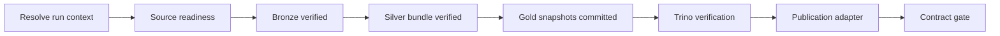

# Khung DAG ETL và giao diện phase ORC-01

## 1. Đang có gì và dùng để làm gì?

`orc_01_etl_pipeline` là khung Airflow để ghép source readiness → Bronze →
Silver → Gold commit → Trino verify → publish. Task này khóa giao diện và
dependency để người làm Silver/Gold và ORC-02..05 có thể viết adapter/test
độc lập. **Đây chưa phải daily ETL chạy dữ liệu thật đến Published.**

DAG hiện manual (`schedule=None`), paused khi tạo, không catchup, tối đa một
run/một task hoạt động, retry tự động bằng `0`. Mặc định chạy `mock` với
fixture metadata nhỏ. Không tự trigger DAG USGS/JMA hoặc notebook Colab.

| Thành phần | Có những gì | Dùng để làm gì |
|---|---|---|
| `airflow/dags/orc_01_etl_pipeline.py` | Resolve context, 6 task groups, 8 task, strict final leaf | Airflow graph và failure propagation |
| `airflow/dags/etl_pipeline_runtime.py` | Context/phase validators, subprocess boundary, publication gate | Kiểm tra metadata, không parse/transform record động đất |
| `airflow/dags/fixtures/orc_01_mock_v1.json` | Version `1.0`, run conf, output metadata của sáu phase | Handoff nhỏ, xác định được, không cần mạng/storage |
| `airflow/tests/test_etl_*.py` | Contract/failure tests và SDK double dựng graph | Test phase I/O/dependency mà không cài Airflow trên host |
| `scripts/preview-etl-pipeline.py` | Preview hoặc chạy chuỗi mock, không ghi staging | Operator/team kiểm tra giao diện qua Makefile |

Python trong module này chỉ là control plane Airflow/JSON metadata, không
đọc GeoJSON/ZIP/Parquet nghiệp vụ. Java/Spark vẫn xử lý ETL; adapter Trino
thực hiện verification độc lập. Không thay schema/grain CON-02/CON-03.

## 2. Graph và cách dừng khi lỗi



Mỗi task nhận cùng context qua XCom và output của phase ngay trước đó.
Task IDs là `resolve_run_context`, `source_readiness.execute_adapter`,
`bronze.execute_adapter`, `silver.execute_adapter`, `gold.execute_adapter`,
`verification.execute_adapter`, `publication.execute_adapter`,
`publication.contract_gate`.

Tất cả dùng `all_success`; final leaf duy nhất là `publication.contract_gate`.
Không có task `all_done` làm final leaf để che lỗi upstream. Lỗi process,
quality, scope, version hoặc snapshot dừng đúng phase; các task sau không
được gọi. Đặc biệt, verify failed không được gọi publication adapter.

## 3. Run context `1.0`

| Field | Quy tắc |
|---|---|
| `contract_version` / `dag_id` | `1.0` / `orc_01_etl_pipeline` |
| `run_id` | Airflow run ID; không thay bằng ingest run ID của Bronze |
| `mode` | Chỉ `mock` hoặc `real`; không tự hiểu chuỗi `dry-run` là real |
| `window_start_utc`, `window_end_utc` | UTC hậu tố `Z`, `start < end`, không chọn end trong tương lai |
| `interval_semantics` | `[start,end)` |
| `processing_date` | ISO date operator/planner xác định; không dùng timezone host |
| `is_backfill` | JSON boolean, không nhận chuỗi `"false"` |
| `config_version` | Từ môi trường `CONFIG_VERSION`, không cho override bằng run conf |
| `input_scope.bronze_manifests` | Exact entries `{source_system, manifest_uri, sha256}`; đủ USGS và JMA_BULLETIN, không URI trùng |
| `output_scope.silver_partitions` | Exact `{event_year_utc, event_month_utc, source_system}`; không wildcard |
| `output_scope.gold_tables` | Exact `catalog.gold.table` trong một catalog; tối thiểu `event_current`, `event_source_bridge` |
| `context_sha256` | Hash toàn context trừ chính field hash; metadata thay đổi không được dùng receipt cũ |

`input_scope.sha256` là **checksum raw payload từ Bronze manifest**, không
phải checksum bytes của manifest. Adapter Bronze phải readback đúng raw và
manifest, kiểm tra sha cùng validation CON-02 rồi mới trả receipt. JMA
year/segment/catalog release và USGS query window vẫn được truy từ exact
manifest theo CON-02; không suy ra bằng cách scan prefix hoặc chọn `latest`.

Context fixture chỉ là UTC window `[2023-01-01, 2023-01-04)` với hai nguồn
synthetic. Nó không trỏ đến data DAT-01/JMA-05 hoặc giả lập coverage 40 năm.
JMA có thể reuse ingest manifest từ run trước; `ingest_run_id` nằm ở Bronze
receipt và không bắt buộc bằng ETL `run_id`. Một manifest mới/revision mới
cần resolve input identity/checksum mới, không sửa context giữa các phase.

`mock` cho phép dùng conf từ fixture khi thiếu field. `real` bắt buộc truyền
toàn bộ scope/window/date/backfill/mode; thiếu field hoặc thiếu command fail
ngay khi resolve. Planner/lịch/ngày nguồn khác nhau chưa được tự suy ra.

## 4. Phase input/output và gates

Mỗi phase nhận `{contract_version, phase, run_context, upstream, upstream_sha256}`; `upstream`
là receipt của phase trước, `null` chỉ ở readiness. Không truyền raw payload
qua XCom/request JSON. Danh sách phase và tên field chính xác xem fixture.

| Phase / task group | Input chính | `artifacts` output | Gate bắt buộc |
|---|---|---|---|
| `readiness` / `source_readiness` | Exact input scope | `sources_ready`, `bronze_manifest_uris` | Hai nguồn ready, URI đúng danh sách đã pin |
| `bronze` / `bronze` | Readiness + pinned manifests/SHA | `bronze_inputs`: source, manifest/raw URI, manifest/ingest ID, sha, count estimate, status, validation | Mọi input BronzeReady, SHA khớp context và đủ 5 validation flags bằng true |
| `silver` / `silver` | Verified Bronze receipt | `input_manifest_uris`, `datasets`, `partitions`, `quality_passed` | Input/scope không đổi; quality true; 4 datasets có exact manifest và readback true |
| `gold` / `gold` | Verified Silver bundle | `input_manifest_uris`, `snapshots`, `scope_verified` | Đọc đúng Silver manifests; mỗi bảng trong scope có một committed snapshot |
| `verify` / `verification` | Committed Gold bundle | `snapshots`, `engine`, `checks`, `report_uri` | Engine Trino, cùng snapshot IDs, tất cả blocker checks đạt |
| `publish` / `publication` | Passed verification receipt | `snapshots`, `verification_report_uri`, `publication_uri`, `published`, `publication_status` | Cùng snapshots/report, đúng mode; adapter đã ghi publication metadata sau verify |

Silver bundle bắt buộc có `source_observation`, `reject_record`, `source_link`,
`canonical_membership`. Một manifest ở đây là **artifact reference của
dataset/bundle**, không tự đổi tên Silver partition manifest SLV-08. Adapter
SLV-09 phải resolve đúng các partition/files/report phía sau reference;
observation/reject Parquet hiện có chưa đủ để giả định link/membership đã ghi.

Gold bundle là danh sách `{table, snapshot_id, committed}`. Với real mode,
snapshot ID là chuỗi biểu diễn positive signed 64-bit integer. Không dùng
`latest`/current hoặc một snapshot ID chung để giả định các bảng Iceberg
commit atomically. Thiếu bất kỳ bảng nào, commit false hoặc verify snapshot
khác sẽ chặn publish. `output_scope.gold_tables` có thể bổ sung dimension/
aggregate theo implementation, nhưng mọi bảng trong scope đều phải verify.

Trino receipt cần đủ sáu checks boolean bằng true: `readable`,
`counts_reconciled`, `canonical_unique`, `required_fields_valid`,
`scope_respected`, `lineage_resolved`. Report nhỏ lưu bằng exact `report_uri`;
SQL chi tiết/count/coverage thuộc owner GLD-04/ORC-04. Chưa có SQL nghiệp vụ
thì không được bịa receipt true. Bronze estimate `0` là hợp lệ, không tự coi
response rỗng hoặc JMA chưa đếm là extract failure.

## 5. Adapter protocol và bảo mật

Real adapter command cấu hình duy nhất qua `ETL_PHASE_RUNNER_COMMAND`, không
nhận executable/shell script từ `dag_run.conf`. Compose passthrough command
mặc định **rỗng** vì chưa có implementation ETL toàn chuỗi.

- Runtime gọi executable với fixed args, `shell=False`, thêm `--phase <phase>`
  và `--context-file <exact-local-path>`; timeout qua
  `ETL_PHASE_RUNNER_TIMEOUT_SECONDS` (mặc định 3600 giây, hợp lệ 1..86400).
- Request nằm ở `ETL_STAGING_ROOT/<sha256-of-full-run-id>/<phase>-input.json`;
  root Compose là `/opt/pipeline/staging/etl`. File ghi atomically với quyền
  tạo file hạn chế. Không ghi URI `s3://...` bằng `Path.of` như local file.
- Runner đọc request, delegate Java/Spark/Trino, trả exit `0` và đúng **một
  JSON object** stdout. Wrapper cần redirect business logs ra nơi an toàn;
  không trả raw stdout/stderr của Spark/HTTP vào metadata.
- Runtime spool stdout tạm, cap metadata 64 KiB, discard stderr; lỗi chỉ trả
  reason code cố định. Field lạ, JSON field trùng, URI có query/token/userinfo,
  wildcard, NaN/Infinity hoặc sai shape không qua gate.
- Mỗi danh sách artifact/partition/table giới hạn 64 entries cho một context;
  đây là guard metadata skeleton, không phải benchmark full historical. Planner
  ORC-03 cần chia scope lớn, không gỡ guard bằng wildcard.
- XCom/receipt chỉ có field được allowlist. URI là `mock://...` trong mock,
  `s3://...` trong real; không trộn `dry-run://`, local path hoặc credential URL.

Receipt envelope chính xác:

```json
{
  "contract_version": "1.0",
  "run_id": "<same ETL run ID>",
  "context_sha256": "<same context hash>",
  "mode": "real",
  "phase": "verify",
  "status": "ok",
  "upstream_sha256": "<hash of exact gold receipt>",
  "artifacts": {}
}
```

`artifacts` phải theo bảng/fixture, không để rỗng trong implementation. Hash
SHA-256 được tính từ UTF-8 JSON keys sort tăng dần, không whitespace giữa
token, boolean/null JSON chuẩn; giữ nguyên thứ tự list. Fixture metadata chỉ
dùng ASCII. `upstream_sha256=null` ở readiness. Adapter Java/wrapper có thể echo
`run_context.context_sha256` và `upstream_sha256` đã cung cấp trong request;
nếu tự tính phải serialize tương đương.
Hash là kiểm tra tính nhất quán, **không phải chữ ký/chứng minh dữ liệu thật**.
Adapter là trusted implementation, chịu trách nhiệm thực sự đọc/ghi/verify.

Publication adapter phải kiểm tra passed receipt trước khi ghi
`gold.publication_status` theo CON-03 và trả `publication_uri` trỏ evidence
thật của cùng bundle. Validator không rollback external side effect nếu
adapter nói sai. Không bật real mode trước khi owner có commit/readback,
idempotency và publication behavior đủ bằng chứng.

Core mock adapter không spawn subprocess hoặc ghi data/staging; URI mock và
snapshot `mock-101`/`mock-102` chỉ là fixture. Mock publish luôn
`publication_status=MockComplete`, `published=false`; không ghi Gold
`publication_status`, không cấp một real-mode Published receipt.

ORC-04 bổ sung observer cho DAG: mock **ghi telemetry metadata** ở staging,
không ghi business data. `execute_phase`/`etl-mock` core cũ vẫn không persist.
Receipt có optional field `observability` version `orc-04-v1`; hash upstream
bao gồm field này khi có. Shape, count semantics/primary reasons và null khi
chưa có metric xem [Run observability contract](./RUN_OBSERVABILITY_CONTRACT.md).
Gate cuối DAG còn yêu cầu persisted phase evidence và same snapshot/report
references; DAG failure callback chỉ ghi failure metadata, không che failure.

## 6. Cách test hiện tại

Từ repo root, không cần `.env`, Docker daemon hoặc Airflow trên host:

```bash
make test-orchestration
make etl-preview
make etl-mock
make test-airflow
```

`etl-preview` chỉ in context và phase list. `etl-mock` chạy sáu phase, kết thúc
`MockComplete`/`published=false`. `test-orchestration` gồm tests failure từng
phase, stale context/upstream, scope/checksum/readback, multi-table commit,
Trino blockers, mock/real boundary, safe process errors và graph strict leaf.
Test adapter real-mode dùng subprocess mock, **không tạo Published thật**.

Khi Airflow đã chạy, kiểm tra import/dependency bằng API Airflow 3.3.2 (không
trigger job, không unpause các DAG nguồn):

```bash
docker compose exec -T -e PYTHONPATH=/opt/airflow/dags airflow-dag-processor python -c 'from airflow.dag_processing.dagbag import DagBag; b=DagBag(dag_folder="/opt/airflow/dags/orc_01_etl_pipeline.py", safe_mode=False); assert not b.import_errors; d=b.dags["orc_01_etl_pipeline"]; assert len(d.tasks)==8; assert all(t.trigger_rule.value=="all_success" for t in d.tasks); assert {t.task_id for t in d.leaves}=={"publication.contract_gate"}; print(d.dag_id, len(d.tasks), "import/graph passed")'
```

Trong UI có thể xem DAG `orc_01_etl_pipeline`. ORC-01 chỉ nghiệm thu skeleton
qua offline tests và import graph; không cần trigger một real ETL để hoàn tất.
Evidence thực tế ở [ORC-01 evidence](../evidence/ORC-01.md).

## 7. Handoff, giới hạn và task còn thiếu

| Owner task | Phần còn thiếu / cách dùng giao diện này |
|---|---|
| [ORC-02 - Cấu hình lịch và readiness cho hai nguồn](../task/tasks/ORC-02.md) | Nối readiness/source adapters, resolve exact source manifests/SHA, daily UTC/overlap USGS, JMA change/no-change và contention; hiện chưa có automatic planner/sensors |
| [ORC-03 - Implement backfill và reprocessing](../task/tasks/ORC-03.md) | Đã có manual planner/chunk/JMA-04 reuse, exact Bronze readback và versioned scoped-adapter handoff; [runbook](./BACKFILL_AND_REPROCESSING.md). Không thay ORC-01 `1.0`; scoped Silver/Gold adapter thật vẫn cần downstream owners |
| [ORC-04 - Chuẩn hóa logging và run summary](../task/tasks/ORC-04.md) | Đã có persisted observer/summary, safe logs và versioned count reconciliation; real business counts còn do SLV-09/GLD-03/04 adapters cung cấp, legacy receipt ghi not_reported |
| [ORC-05 - Chốt recovery, concurrency và tài nguyên](../task/tasks/ORC-05.md) | Retry/resource/cross-DAG concurrency và recovery/idempotency thật; một-run/một-task/no-retry hiện là guard bảo thủ, chưa là resource benchmark |
| [SLV-09 - Tích hợp và kiểm thử Silver đa nguồn](../task/tasks/SLV-09.md) | Real adapter/build/readback đủ observations/reject/link/membership; mock SilverReady không chứng minh integration thật |
| [GLD-01 - Xây canonical event, dimensions và bands](../task/tasks/GLD-01.md) | Canonical Gold business output và provenance thật, không triển khai lại trong Python |
| [GLD-03 - Ghi Gold Iceberg và commit snapshot](../task/tasks/GLD-03.md) | Writer/adapter commit toàn bộ required tables, snapshot bundle và idempotency; chưa có real command được đóng gói |
| [GLD-04 - Tạo Trino views và verification SQL](../task/tasks/GLD-04.md) | SQL/blocker reports pin committed snapshots và publication metadata thật |
| [QA-01 - Chạy E2E daily đa nguồn](../task/tasks/QA-01.md) | Scheduler run, Bronze → Silver → Gold Published với input/snapshot/report trace thật |

Không chuyển các task trên sang Done từ evidence skeleton này. Interface có
thể được mở rộng versioned để truyền baseline/current state khi integration
chốt; không tự scan latest hoặc bỏ gate để giữ shape fixture.

[MLI-02 - Tạo Airflow DAG build ML dataset](../task/tasks/MLI-02.md) và
[MLI-03 - Validate/import kết quả và commit bảng ML Iceberg](../task/tasks/MLI-03.md)
là hai DAG riêng, ngoài phạm vi ORC-01; không thêm Colab vào critical path.
