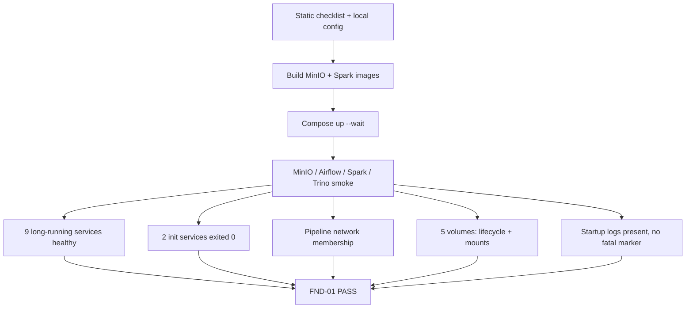

# Foundation environment smoke contract

| Thuộc tính | Giá trị |
|---|---|
| Task | `FND-01` |
| Trạng thái | Verified bằng full runtime smoke local (2026-09-21) |
| Static entrypoint | `./scripts/check-foundation.sh` |
| Runtime entrypoint | `./scripts/smoke-foundation.sh` |
| Phạm vi | MinIO, Airflow, Spark, Iceberg REST Catalog và Trino |

## 1. Mục đích

FND-01 cung cấp một checklist lặp lại được để xác nhận toàn bộ foundation stack
hoạt động cùng nhau trên một Compose project. Checklist không chỉ dựa vào trạng
thái `running`; nó kiểm tra readiness, các one-shot init, network, volume mount,
startup log và smoke hành vi của từng subsystem.

Task này không chạy DAG ETL nghiệp vụ, không kiểm thử USGS API và không thay thế
test riêng của các task downstream. Script không dừng service, không xóa
container và không xóa volume để thành viên có thể tiếp tục debug.

## 2. Hai lớp kiểm tra

### Static checklist

`check-foundation.sh` chạy các contract check đã được task sở hữu component
cung cấp:

| Contract | Nội dung chính |
|---|---|
| `REP-01` | Cấu trúc repository và asset bắt buộc |
| `CFG-01` | Biến môi trường, secret hygiene và port |
| `CMP-01` | Compose schema, network, volume và lifecycle label |
| `MIO-01` | MinIO image, init, healthcheck, policy và mount |
| `AFL-01` | PostgreSQL/Airflow dependency, healthcheck và DAG unit test |
| `SPK-01` | Maven verify, JAR, Spark services và smoke contract |
| `QRY-01` | Iceberg REST Catalog, Trino, catalog config và secret injection |

Chế độ mặc định dùng `.env.example` cho Compose rendering và không cần
container. `--require-local` yêu cầu `.env` thật, nhưng checker không in giá trị
secret.

### Runtime smoke

`smoke-foundation.sh` thực hiện theo thứ tự:



`docker compose up --wait` dùng healthcheck/dependency đã được từng component
định nghĩa. Script không thay readiness bằng `sleep` cố định.

## 3. Checklist service

### Long-running service

Tất cả service dưới đây phải có Docker health status `healthy`, thuộc đúng
project-scoped network `pipeline` và có startup log không rỗng:

| Service | Readiness | Smoke hành vi bổ sung |
|---|---|---|
| `minio` | MinIO live endpoint | Ghi, đọc và xóa đúng object smoke |
| `airflow-postgres` | `pg_isready` | Airflow metadata/init sử dụng được DB |
| `airflow-api-server` | API monitor endpoint | DAG smoke có thể được trigger |
| `airflow-scheduler` | Scheduler heartbeat | DAG smoke đạt trạng thái `success` |
| `airflow-dag-processor` | DAG processor heartbeat | Không có import error cho DAG smoke |
| `spark-master` | Master UI HTTP | Nhận worker và Spark application |
| `spark-worker` | Worker UI HTTP | Chạy `HelloWorldJob` thành công |
| `iceberg-rest` | REST `/v1/config` | Namespace/table registration hoạt động |
| `trino` | Trino health-check binary | Tạo, ghi và đọc Iceberg table qua MinIO |

Startup log được quét các marker làm startup không thể hợp lệ: `FATAL`, `PANIC`,
uncaught `Exception in thread "main"` và `dependency failed to start`. Warning
không tự động làm fail; smoke hành vi và healthcheck mới quyết định readiness.

### One-shot init service

| Service | Kết quả bắt buộc |
|---|---|
| `minio-init` | Trạng thái `exited`, exit code `0` |
| `airflow-init` | Trạng thái `exited`, exit code `0` |

## 4. Checklist network và volume

Mọi long-running service phải thuộc đúng network vật lý mang label
`com.docker.compose.network=pipeline` của Compose project hiện tại. Script dùng
Compose label để resolve tên vật lý, vì vậy vẫn hoạt động khi đặt
`COMPOSE_PROJECT_NAME` riêng cho một checkout/test run.

| Volume logic | Lifecycle | Mount được kiểm chứng |
|---|---|---|
| `pipeline_staging` | `transient` | Airflow API và Spark worker tại `/opt/pipeline/staging` |
| `airflow_logs` | `operational` | Airflow API tại `/opt/airflow/logs` |
| `airflow_db_data` | `durable` | PostgreSQL tại `/var/lib/postgresql/data` |
| `minio_data` | `durable` | MinIO tại `/data` |
| `iceberg_catalog_data` | `durable` | Catalog tại `/home/iceberg` |

Volume được resolve bằng Compose project/volume label, sau đó đối chiếu
`com.japan-earthquake-etl.lifecycle` và mount thực tế của container. Không dựa
vào việc đoán tên volume từ thư mục checkout.

## 5. Cách chạy

### Static checklist

Không cần `.env` thật hoặc khởi động service:

```bash
./scripts/check-foundation.sh
```

Lệnh này chạy Maven verify trong `check-spark.sh`, nên máy cần JDK 17 và network
ở lần Maven Wrapper/dependency đầu tiên.

### Full runtime smoke

Tạo `.env`, thay toàn bộ placeholder, rồi chạy:

```bash
cp .env.example .env
./scripts/check-foundation.sh --require-local
./scripts/smoke-foundation.sh
```

Cold run cần tải/build nhiều image và phù hợp nhất với máy có tối thiểu 16 GiB
RAM. Timeout mặc định cho Compose readiness là 300 giây. Có thể tăng timeout mà
không sửa `.env`:

```bash
FOUNDATION_WAIT_TIMEOUT_SECONDS=600 ./scripts/smoke-foundation.sh
```

Để lưu bằng chứng ngắn ở ngoài repository:

```bash
./scripts/smoke-foundation.sh 2>&1 | tee /tmp/fnd-01-smoke.log
```

Kết quả cuối cùng phải là:

```text
FND-01 environment smoke passed: 9 services healthy, 2 init services exited 0, 1 network and 5 volumes verified.
Foundation services and volumes remain available for debugging and downstream work.
```

Mỗi checklist item được in với `[PASS]` hoặc `[FAIL]`; không in credential.

## 6. Failure semantics và an toàn dữ liệu

- Static/config/build/start hoặc component smoke thất bại: script dừng ngay,
  in `docker compose ps -a` và lệnh đọc log gợi ý.
- Runtime audit cuối: script tiếp tục kiểm tra các item còn lại để báo đủ health,
  network, volume và log nào sai, rồi trả exit code khác `0`.
- Service và volume được giữ nguyên khi thành công hoặc thất bại.
- Không dùng `docker compose down -v`, `docker volume rm`, recursive delete hoặc
  xóa warehouse để xử lý smoke failure.
- One-shot smoke chỉ xóa object/table do chính nó tạo; không xóa bucket, schema
  hoặc dữ liệu pipeline.

## 7. Troubleshooting nhanh

| Triệu chứng | Kiểm tra trước | Hướng xử lý ngắn |
|---|---|---|
| Thiếu `.env` hoặc còn placeholder | `./scripts/check-config.sh --require-local` | Copy lại `.env.example`, điền secret local khác nhau và không commit `.env` |
| Port host đã được dùng | Config checker và process đang giữ port `8080/8081/8082/9001` | Đổi host port trong `.env`, giữ nguyên internal port/service name |
| Cold run quá timeout | Docker pull/build progress, disk và RAM | Tăng `FOUNDATION_WAIT_TIMEOUT_SECONDS`; không thay healthcheck bằng `sleep` |
| `minio-init` thất bại | Log `minio` rồi `minio-init` | Kiểm tra root/pipeline credential và bucket config; không xóa `minio_data` |
| Airflow init hoặc DAG smoke lỗi | PostgreSQL health, `airflow-init`, DAG processor rồi scheduler | Sửa dependency đầu tiên bị lỗi; không coi API healthy là đủ |
| Airflow heartbeat probe timeout | `docker inspect` phần `.State.Health.Log` và `docker stats` | Xác nhận probe dùng `exec` với timeout `30s`; recreate riêng scheduler/DAG processor, không xóa metadata volume |
| Spark worker không `ALIVE` | Master/worker log và resource config | Đưa core/memory về baseline, xác nhận JAR/image build thành công |
| Catalog không healthy | MinIO init, Catalog log và `/tmp` tmpfs | Giữ SQLite volume; xác nhận tmpfs cho native SQLite helper có quyền execute |
| Trino không thấy catalog/schema | Catalog health, `iceberg.properties`, endpoint/region | Chạy `check-query.sh`; giữ catalog URI và MinIO endpoint nội bộ |
| Network membership sai | Compose project name và network labels | Chạy trong cùng project/env; không nối service vào network external tùy ý |
| Volume/lifecycle sai | `docker volume inspect` và container mounts | Sửa Compose contract; không rename/xóa volume để làm checker pass |
| Startup log có fatal marker | Log service và dependency ngay trước nó | Sửa root cause rồi recreate đúng service; không xóa data volume |
| Disk gần đầy | Docker disk usage và volume lớn | Dừng job mới; dùng retention procedure đã review, không xóa file Iceberg thủ công |

Lệnh chẩn đoán chuẩn:

```bash
docker compose --env-file .env ps -a
docker compose --env-file .env logs --tail=100 <service>
```

Đọc log dependency trước consumer, ví dụ MinIO → init → Catalog → Trino hoặc
PostgreSQL → Airflow init → DAG processor/scheduler/API.

## 8. Handoff

- Task thêm service foundation mới phải bổ sung service, smoke hành vi, volume
  và hướng xử lý lỗi vào checklist trong cùng PR.
- Task ETL downstream có thể chạy FND-01 trước integration test để phân biệt lỗi
  môi trường với lỗi pipeline.
- CI có thể dùng static checklist; full runtime smoke cần Docker daemon, JDK 17
  và resource phù hợp.
- Evidence chia sẻ chỉ cần console summary/CI log không chứa secret; không commit
  dump log runtime vào repository.
