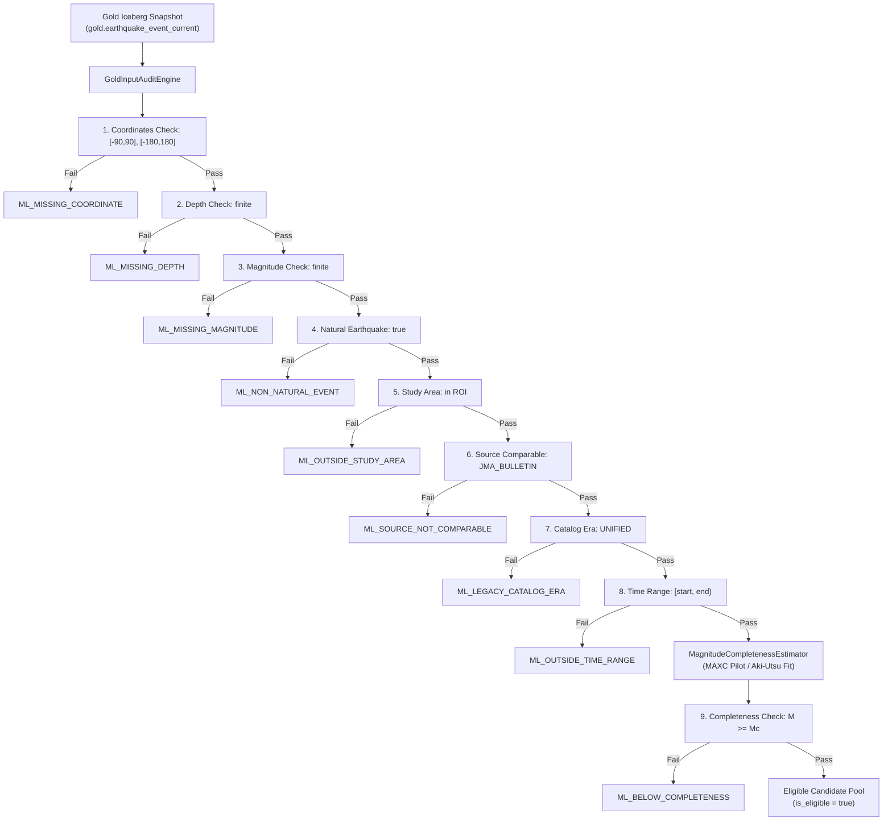

# Đặc tả kỹ thuật: Gold Input Audit và Magnitude of Completeness (Mc)

Tài liệu này đặc tả logic nghiệp vụ, quy tắc loại trừ và phương pháp ước lượng
magnitude of completeness ($M_c$) cho task `MLD-02`, kế thừa từ [ML logical
data model](./ML_DATA_MODEL.md) (`CON-03-ML`) và [Silver, Gold và ML logical model](./SILVER_GOLD_DATA_MODEL.md).

## 1. Mục đích và ranh giới

- **Loại bias do detection threshold/catalog change** trước khi trích xuất sequence và candidate windows.
- **Bảo toàn Gold**: Không xóa bất kỳ sự kiện nào khỏi Gold core (`gold.event_current` hoặc `gold.earthquake_event_current`);
  chỉ gắn nhãn điều kiện `is_eligible` và gán mã lý do loại trừ (`ML_*`) cho dataset candidate của ML.
- **Version hóa tham số $M_c$**: Cung cấp ngưỡng trung tâm $M_c$ cùng hai biên sensitivity ($M_c \pm \Delta$)
  có cơ sở thống kê/vật lý, được lưu trữ trong cấu hình chuẩn tắc có kiểm tra toàn vẹn bằng SHA-256 hash.
- **Ranh giới phân chia thời kỳ**: Tuyệt đối không sử dụng dữ liệu của thời kỳ mở rộng (`EXTENSION`, từ `2018-10-01`)
  để tune hoặc ước lượng tham số cho thời kỳ tái lập (`REPRODUCTION`, `2000-01-01` đến `2018-10-01`).



## 2. Thứ bậc quy tắc loại trừ và mã lý do (`ML_*`)

Mỗi bản ghi được đánh giá theo thứ bậc xác định. Bản ghi không đạt sẽ được gán `primary_exclusion_reason`
tại bước vi phạm đầu tiên, đồng thời toàn bộ vi phạm được ghi nhận trong `all_exclusion_reasons`:

| Thứ tự | Kiểm tra | Điều kiện vi phạm | Mã lý do | Ý nghĩa |
|---:|---|---|---|---|
| 1 | Coordinates | Latitude/Longitude là null, NaN, vô hạn hoặc ngoài $[-90, 90]$, $[-180, 180]$ | `ML_MISSING_COORDINATE` | Thiếu hoặc sai tọa độ không gian |
| 2 | Depth | `depth_km` là null, NaN hoặc vô hạn | `ML_MISSING_DEPTH` | Thiếu độ sâu chấn tiêu |
| 3 | Magnitude | `magnitude` là null, NaN hoặc vô hạn | `ML_MISSING_MAGNITUDE` | Thiếu độ lớn chấn tiêu |
| 4 | Natural event | `is_natural_earthquake == false` hoặc `event_type_code != 'EARTHQUAKE'` | `ML_NON_NATURAL_EVENT` | Sự kiện nhân tạo / phi tự nhiên |
| 5 | Study area | `is_in_study_area == false` | `ML_OUTSIDE_STUDY_AREA` | Ngoài khu vực nghiên cứu ROI |
| 6 | Primary source | `canonical_source_system != requiredCanonicalSource` | `ML_SOURCE_NOT_COMPARABLE` | Nguồn không tương đồng (vd: USGS thay vì JMA) |
| 7 | Catalog era | `catalog_era != 'UNIFIED'` | `ML_LEGACY_CATALOG_ERA` | Thuộc kỷ nguyên catalog cũ trước 1997-10-01 |
| 8 | Period window | `event_time_utc < start` hoặc `event_time_utc >= end` | `ML_OUTSIDE_TIME_RANGE` | Ngoài cửa sổ thời gian của dataset split |
| 9 | Completeness | $M < M_c$ | `ML_BELOW_COMPLETENESS` | Dưới ngưỡng độ lớn hoàn thiện của catalog |

### Bất biến kế toán (Reconciliation Invariant)
$$N_{\text{input}} = N_{\text{eligible}} + N_{\text{excluded}}$$
$$\sum_{r \in \text{Reasons}} N(r) = N_{\text{excluded}}$$

## 3. Phương pháp ước lượng độ lớn hoàn thiện ($M_c$)

### 3.1. Phân bố tần số - độ lớn (FMD)
Độ lớn được phân nhóm vào các bin rời rạc có độ rộng $\Delta M = 0.1$:
$$\text{bin}(M) = \text{round}\left(\frac{M}{\Delta M}\right) \times \Delta M$$

- Số lượng không tích lũy: $N(M_i) = \sum \mathbf{1}_{\{M \in \text{bin}_i\}}$.
- Số lượng tích lũy: $N_{\text{cum}}(\ge M_i) = \sum_{M_j \ge M_i} N(M_j)$.

### 3.2. Maximum Curvature (MAXC)
Ngưỡng độ lớn hoàn thiện ban đầu được xác định tại bin có tần số không tích lũy đạt cực đại
(tương ứng với điểm uốn cực đại của đường cong phân bố tích lũy Gutenberg-Richter):
$$M_c^{\text{central}} = \arg\max_{M_i} N(M_i)$$
Nếu xảy ra trường hợp hòa tần số giữa nhiều bin, quy tắc chọn bin có độ lớn nhỏ nhất một cách thận trọng.

### 3.3. Dải độ nhạy (Sensitivity Intervals)
Để phục vụ phân tích độ nhạy của mô hình ML (Window, DBSCAN, HDBSCAN), hai giá trị lân cận được xác định với bước nhảy $\Delta_{\text{sens}} = 0.2$:
$$M_c^{\text{lower}} = M_c^{\text{central}} - \Delta_{\text{sens}}$$
$$M_c^{\text{upper}} = M_c^{\text{central}} + \Delta_{\text{sens}}$$

### 3.4. Kiểm chứng hệ số góc $b$ Gutenberg-Richter (Aki-Utsu)
Hệ số góc $b$ theo phân bố Gutenberg-Richter $\log_{10} N = a - b M$ được tính bằng phương pháp cực đại hợp lý (Maximum Likelihood):
$$b = \frac{\log_{10}(e)}{\bar{M} - (M_c - \Delta M / 2)}$$
với sai số chuẩn:
$$\sigma_b = \frac{b}{\sqrt{N(\ge M_c)}}$$
Được tính toán khi số lượng mẫu $N(\ge M_c) \ge 10$ và mẫu số dương.

### 3.5. Phân tầng theo độ sâu (Depth Stratification)
Catalog được phân chia thành 3 tầng độ sâu theo chuẩn Seismology Nhật Bản:
1. **Shallow**: $0 \le \text{depth} < 70\text{ km}$
2. **Intermediate**: $70 \le \text{depth} < 300\text{ km}$
3. **Deep**: $\text{depth} \ge 300\text{ km}$
Ước lượng $M_c$ được tính toán độc lập cho từng tầng độ sâu để ghi nhận sự biến thiên phát hiện chấn tiêu theo độ sâu.

### 3.6. Điều kiện tin cậy (Reliability Guard)
Nếu số lượng mẫu $N < 50$ sự kiện, bộ ước lượng đánh dấu `is_reliable = false` kèm lý do `INSUFFICIENT_DATA`,
tuyệt đối không bịa đặt hoặc hard-code số giả.

## 4. Phân tích biến động mạng lưới quan sát (Network Shift Analysis)

Hệ thống tự động theo dõi tỷ lệ sự kiện thường niên trước và sau các mốc chuyển đổi quan trọng:
1. **1997-10-01**: Chuyển đổi sang `UNIFIED` catalog era (JMA bắt đầu dùng mạng lưới thống nhất).
2. **2000-10-01**: Tích hợp mạng lưới địa chấn độ nhạy cao Hi-net của NIED.
3. **2011-03-11**: Động đất Tohoku $M_w 9.0$ và chuỗi dư chấn cực lớn (saturation spike).
4. **2018-10-01**: Biên giới giữa thời kỳ tái lập (`REPRODUCTION`) và thời kỳ mở rộng (`EXTENSION`).

Tỷ lệ biến động $R = \frac{\text{Rate}_{\text{after}}}{\text{Rate}_{\text{before}}}$ được tính toán và đưa vào báo cáo:
- $R > 2.0$: Tăng vọt độ nhạy hoặc dư chấn bão hòa (High detection surge).
- $R < 0.5$: Giảm mạnh tỷ lệ phát hiện hoặc sau suy giảm động đất (Significant decay/shift).
- $0.5 \le R \le 2.0$: Tỷ lệ ổn định (Stable detection rate).

## 5. Làm giàu Manifest (`ml.dataset_manifest`)

Khi tích hợp vào manifest của dataset, engine ghi đầy đủ các trường bắt buộc theo `CON-03-ML`:
- `input_event_count`: Tổng số sự kiện input.
- `eligible_event_count`: Số sự kiện hợp lệ ($M \ge M_c$, natural, ROI, primary JMA, UNIFIED, in-period).
- `excluded_event_count`: Tổng số sự kiện bị loại trừ.
- `exclusion_counts_json`: Chuỗi JSON thống kê số lượng theo từng mã lý do.
- `mc_method`: `MAXIMUM_CURVATURE`.
- `mc_method_version`: `1.0`.
- `mc_value`: Giá trị $M_c$ trung tâm (hữu hạn).
- `mc_region_version`: Phiên bản phân vùng/tầng độ sâu (`overall-v1` hoặc `depth-stratified-v1`).
- `mc_config_json`: JSON chuẩn tắc chứa toàn bộ tham số, dải sensitivity và phân tầng độ sâu.
- `mc_config_sha256`: Mã băm SHA-256 của `mc_config_json`.
- `audit_report_uri`: Đường dẫn lưu báo cáo audit.

## 6. Lệnh kiểm thử và đối soát

```bash
# Chạy bộ test MLD-02 offline
make test-ml-audit

# Hoặc chạy trực tiếp qua Maven Wrapper
./mvnw --batch-mode -pl spark -am -Dtest=MagnitudeCompletenessEstimatorTest,GoldInputAuditEngineTest,GoldInputAuditIntegrationTest test
```
