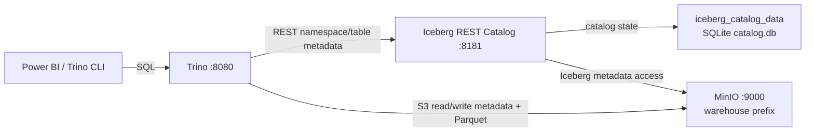

# Iceberg REST Catalog và Trino contract

| Thuộc tính | Giá trị |
|---|---|
| Task | `QRY-01` |
| Trạng thái | Verified bằng runtime smoke |
| Serving engine | Trino `483` |
| Catalog server | Apache Iceberg REST fixture `1.10.1` |
| Warehouse | MinIO, lấy từ `WAREHOUSE_PATH` |

## 1. Mục đích và phạm vi

`QRY-01` tạo lớp catalog và query dùng chung cho các bảng Iceberg:

- `iceberg-rest` quản lý namespace, table registration và con trỏ tới metadata
  Iceberg bằng REST protocol.
- `trino` cung cấp SQL endpoint cho kiểm tra pipeline và consumer như Power BI.
- `trino-smoke` chứng minh một bảng Iceberg có thể được tạo, ghi và đọc xuyên
  suốt qua Trino, REST Catalog và MinIO.

Task này chưa tạo schema Gold nghiệp vụ, bảng fact/dimension, DAG ETL hoặc kết
nối Power BI. Schema `earthquakes` được smoke test tạo để kiểm chứng hạ tầng;
table `qry_01_smoke` chỉ tồn tại trong thời gian kiểm tra.

## 2. Phiên bản và lý do lựa chọn

| Thành phần | Phiên bản | Cách pin |
|---|---|---|
| Trino | `483` | Tag và multi-architecture digest |
| Iceberg REST fixture | `1.10.1` | Tag và multi-architecture digest |
| Catalog backend | SQLite | File `/home/iceberg/catalog.db` trong named volume |
| FileIO | Iceberg `S3FileIO` | MinIO endpoint, path-style access |
| Table data | Parquet | Default trong catalog Trino |

Trino `483` là bản phát hành hiện hành khi task được triển khai. Apache Iceberg
có library release `1.11.0`, nhưng registry chính thức không cung cấp image
versioned `apache/iceberg-rest-fixture:1.11.0` ở thời điểm triển khai. Vì vậy
Compose pin tag ổn định mới nhất có sẵn là `1.10.1`, kèm digest để tránh image
thay đổi ngoài review. Không dùng tag `latest`.

Tham khảo chính thức:

- [Trino downloads](https://trino.io/download)
- [Trino Iceberg connector](https://trino.io/docs/current/connector/iceberg.html)
- [Trino REST catalog configuration](https://trino.io/docs/current/object-storage/metastores.html#rest-catalog)
- [Trino native S3 file system](https://trino.io/docs/current/object-storage/file-system-s3.html)
- [Trino environment-variable secrets](https://trino.io/docs/current/security/secrets.html)
- [Apache Iceberg releases](https://iceberg.apache.org/releases/)
- [Official Iceberg REST fixture image tags](https://hub.docker.com/r/apache/iceberg-rest-fixture/tags)

Nâng version phải chạy lại static check và runtime smoke; không chỉ sửa tag.
Digest phải được lấy lại cho đúng manifest của version và architecture được
review.

## 3. Kiến trúc và luồng dữ liệu



Luồng startup:

1. `minio` healthy.
2. `minio-init` tạo bucket, warehouse prefix và pipeline credential.
3. `iceberg-rest` chỉ khởi động sau khi init thành công, rồi công bố readiness
   qua `GET /v1/config`.
4. `trino` chờ cả MinIO bootstrap và Catalog healthy.
5. `trino-smoke` chờ Trino healthy trước khi chạy SQL.

Catalog state và warehouse không phải cùng một loại dữ liệu:

- `iceberg_catalog_data:/home/iceberg` giữ SQLite database dùng để đăng ký
  namespace/table. Đây là named volume bền vững.
- `minio_data:/data` giữ warehouse ở `s3://<DATA_BUCKET>/warehouse`, bao gồm
  Iceberg metadata file và Parquet data file.

Mất một trong hai volume có thể làm catalog và warehouse không còn đồng bộ.
Không dùng `docker compose down -v` trong vận hành thường ngày.

## 4. Service contract

### Iceberg REST Catalog

- Service name và endpoint nội bộ: `iceberg-rest:8181`.
- Không publish port ra host.
- Root filesystem read-only; `/tmp` là tmpfs tạm thời có quyền execute vì
  `sqlite-jdbc` phải extract và load native library theo architecture tại đây.
- SQLite dùng pool size `1`, phù hợp runtime local một Catalog instance.
- State mount tại `/home/iceberg`; warehouse không lưu trong volume này.
- Dùng pipeline MinIO credential, không dùng root credential.

### Trino

- Service name và endpoint nội bộ: `trino:8080`.
- Endpoint host mặc định: `http://127.0.0.1:8081`.
- Host binding chỉ ở loopback; baseline local chưa bật Trino authentication và
  không được expose ra LAN/Internet.
- Catalog source `./trino/catalog` được bind read-only vào
  `/etc/trino/catalog`.
- Resource local: limit `2 CPU / 3 GiB`, reservation `0.5 CPU / 512 MiB`.
- Healthcheck dùng `/usr/lib/trino/bin/health-check` từ image chính thức.

### Smoke runner

`trino-smoke` là one-shot service thuộc profile `smoke`. Runner không nhận
MinIO credential; nó chỉ gửi SQL tới Trino. `/tmp` là tmpfs tạm thời có quyền
execute để Trino CLI/JLine có thể load native terminal helper. Quy trình:

1. `SHOW CATALOGS` phải thấy catalog `iceberg`.
2. Tạo schema cấu hình nếu chưa tồn tại và xác nhận bằng `SHOW SCHEMAS`.
3. Xóa table smoke cũ nếu lần chạy trước bị gián đoạn.
4. Tạo Iceberg table Parquet, insert một row và đọc lại ba giá trị kiểm chứng.
5. Chỉ xóa table `qry_01_smoke`; giữ schema, catalog state và warehouse volume.

Việc tạo/ghi/đọc table kiểm chứng đồng thời đường REST metadata và đường S3
data, mạnh hơn việc chỉ kiểm tra HTTP health endpoint.

## 5. Cấu hình catalog và secret

File `trino/catalog/iceberg.properties` chỉ chứa contract, không chứa giá trị
credential. Trino thay `${ENV:VARIABLE}` bằng environment của container:

```properties
connector.name=iceberg
iceberg.catalog.type=rest
iceberg.rest-catalog.uri=${ENV:ICEBERG_CATALOG_URI}
iceberg.rest-catalog.warehouse=${ENV:WAREHOUSE_PATH}
iceberg.rest-catalog.vended-credentials-enabled=false
fs.s3.enabled=true
s3.endpoint=${ENV:MINIO_ENDPOINT}
s3.region=${ENV:S3_REGION}
s3.path-style-access=true
s3.aws-access-key=${ENV:MINIO_ACCESS_KEY}
s3.aws-secret-key=${ENV:MINIO_SECRET_KEY}
```

`vended-credentials-enabled=false` có chủ đích: REST server không cấp credential
ngắn hạn; Trino dùng pipeline credential được Compose inject trực tiếp. MinIO
cần path-style access và region local cố định `us-east-1`.

Các giá trị phải đồng bộ:

| Biến | Baseline local | Ý nghĩa |
|---|---|---|
| `ICEBERG_CATALOG_URI` | `http://iceberg-rest:8181` | REST endpoint nội bộ |
| `ICEBERG_CATALOG_NAME` | `iceberg` | Tên logic dùng chung |
| `TRINO_CATALOG` | `iceberg` | Khớp tên file `iceberg.properties` |
| `TRINO_SCHEMA` | `earthquakes` | Namespace kiểm thử/downstream |
| `TRINO_HOST` | `trino` | Service name nội bộ |
| `TRINO_INTERNAL_PORT` | `8080` | SQL endpoint trong network |
| `TRINO_HOST_PORT` | `8081` | Endpoint loopback cho host |
| `S3_REGION` | `us-east-1` | Region baseline cho MinIO |

Credential thật chỉ đặt trong `.env` bị Git ignore. `check-query.sh` từ chối
literal access/secret key trong catalog properties.

## 6. Kiểm tra và vận hành

Chuẩn bị `.env`, thay toàn bộ `change-me-*`, rồi chạy:

```bash
cp .env.example .env
./scripts/check-config.sh --require-local
./scripts/check-query.sh
./scripts/smoke-query.sh
```

Static check không khởi động container. Runtime smoke sẽ khởi động/giữ lại
MinIO, Catalog và Trino để debug hoặc tiếp tục phát triển. Kết quả đúng:

```text
QRY-01 query smoke passed: catalog=iceberg schema=earthquakes row_count=1.
QRY-01 runtime smoke completed; MinIO, Catalog, Trino and durable volumes are preserved.
```

Kiểm tra trạng thái và log:

```bash
docker compose --env-file .env ps -a minio minio-init iceberg-rest trino
docker compose --env-file .env logs --tail=100 iceberg-rest trino
```

Query nhanh từ host bằng Trino CLI/ODBC dùng `127.0.0.1:${TRINO_HOST_PORT}`,
catalog `iceberg` và schema `earthquakes`. Repository không cài Trino CLI trên
host; smoke runner dùng CLI đã có trong image Trino.

Dừng container nhưng giữ data:

```bash
docker compose --env-file .env down
```

## 7. Troubleshooting

| Hiện tượng | Kiểm tra | Cách xử lý |
|---|---|---|
| Catalog không healthy | `logs iceberg-rest`; MinIO init exit code | Sửa credential/warehouse, chạy lại `minio-init`, không xóa volume |
| Trino báo catalog failed | `logs trino`; biến `ICEBERG_CATALOG_URI` | Chờ Catalog healthy, chạy `check-config.sh` và `check-query.sh` |
| `Access Denied` khi tạo table | Pipeline policy, `WAREHOUSE_PATH`, MinIO credential | Chạy `check-minio.sh`/`smoke-minio.sh`, không đổi sang root credential |
| Schema thấy nhưng insert/read lỗi | Trino S3 endpoint, region, path-style | Giữ endpoint nội bộ và `S3_REGION=us-east-1` |
| Port 8081 bận | `TRINO_HOST_PORT` và host port khác | Chọn port chưa dùng rồi chạy config check |
| Catalog mất table sau recreate | Named volume có còn hay không | Không dùng `down -v`; xác nhận `iceberg_catalog_data` được mount |
| Smoke cũ để lại table | Chạy lại `smoke-query.sh` | Runner tự drop đúng `qry_01_smoke`, không xóa schema/volume |

## 8. Handoff cho task downstream

- Job Gold dùng cùng `WAREHOUSE_PATH`, catalog name và MinIO pipeline
  credential; không tạo catalog cạnh tranh.
- DDL nghiệp vụ dùng schema `TRINO_SCHEMA` hoặc cập nhật config/docs trong cùng
  PR nếu cần namespace khác.
- Verification trong DAG query qua Trino và chỉ publish khi SQL check đạt.
- Power BI kết nối endpoint loopback bằng ODBC; việc cài driver/authentication
  thuộc task BI. Nếu query engine được mở khỏi localhost, phải thêm
  authentication/TLS trước.
- Backup local cần giữ cả `minio_data` và `iceberg_catalog_data`; chỉ backup một
  phía không đủ để khôi phục catalog nhất quán.
