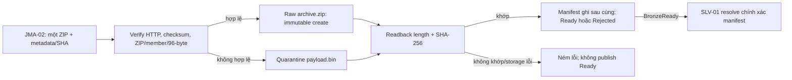

# JMA archive validation và Bronze writer

Triển khai `JMA-03` dưới package `ie212.earthquake.spark.jma`, dựa trên
[Bronze contract CON-02](./BRONZE_STORAGE_CONTRACT.md) và
[inventory/source format JMA-01](./JMA_ARCHIVE_INVENTORY.md). Không thay đổi
manifest `1.0`, inventory hoặc shared fixture. Đây là Java API cho một archive;
DAG ingest theo năm và live integration thuộc `JMA-04`/`JMA-05`.

## 1. Làm phần gì, có những gì, dùng để làm gì?

| Thành phần | Công việc | Mục đích |
|---|---|---|
| `JmaArchiveValidator` | Kiểm tra ZIP, expected member, CRC/size và record 96 byte | Chặn file hỏng trước `BronzeReady`, không parse business fields |
| `JmaArchiveValidationResult` | Valid/rejected, count hoặc reason code | Evidence cấu trúc, không nhầm count Bronze với count Silver |
| `JmaBronzeWriteRequest` | Bytes, checksum/length kỳ vọng, inventory, HTTP metadata và run context | Kiểm tra đầu vào và giữ provenance trước mọi storage write |
| `JmaBronzeWriter` | Ghi ZIP nguyên bản, verify readback, publish manifest sau cùng | Raw bất biến, retry an toàn, bàn giao đúng input cho Silver |
| `JmaBronzeWriteResult` | Status, object/manifest key, SHA-256, count, reuse và reason | Caller biết tiếp tục downstream hay dừng, không log payload |

Writer dùng lại `BronzeObjectStore` của USGS: production dùng
`MinioBronzeObjectStore`, test dùng file store hoặc in-memory mock. Bucket,
endpoint và credential do adapter cấu hình, không có credential trong request,
manifest hoặc class JMA. Prefix/layout hiện tại vẫn là `bronze` theo CON-02.

## 2. Luồng thực hiện



Không đẩy fixed-width đã giải nén thay cho ZIP lên Bronze. Validator dùng một
ZIP tạm để `ZipFile` kiểm tra central directory, đọc member theo stream rồi
xóa file tạm. Không extract member ra filesystem, không decode toàn bộ file
thành UTF-8 và không tạo dataset chuẩn hóa ở bước này. Sau khi kiểm tra cấu
trúc, writer lưu đúng bytes ZIP tải được; checksum readback xác nhận bytes trên
storage vẫn giống input đã validate.

### Validation ở mức Bronze

- ZIP phải mở được, có đúng một member không phải thư mục, tên khớp
  `entry.memberName()`. Không chấp nhận absolute/nested path, backslash hoặc `..`.
- Kiểm tra CRC và kích thước member; chặn ZIP truncated/corrupt.
- Mỗi record dài đúng 96 **byte**, không tính `LF`/`CRLF`. Record cuối không có
  newline vẫn hợp lệ; bare CR, blank line hoặc record sai độ dài bị reject.
- Member rỗng hợp lệ có count `0`; ZIP không có member không hợp lệ.
- Giới hạn mặc định: ZIP 128 MiB, member giải nén 512 MiB. Có thể inject
  `new JmaArchiveValidator(maxArchiveBytes, maxMemberBytes)`; giới hạn member
  kiểm tra cả metadata và bytes thực sự đọc. API nhận ZIP bằng `byte[]`, nên
  caller vẫn phải giới hạn tải/đồng thời trước khi cấp phát input lớn.
- Không kiểm tra/lọc ngày sự kiện, tọa độ, magnitude, agency, quality flag,
  artificial event hoặc duplicate tại Bronze. Record có cấu trúc đúng vẫn
  được giữ để Silver phân loại, kể cả business values sai hoặc ngoài interval.

Request kiểm tra run/release slug, SHA-256 lowercase, attempt/timeout dương,
source/final URL HTTP(S) không chứa credential/query/fragment và staged URI
optional là `file://` hoặc `s3://` an toàn. Interval metadata phải đúng JST và
year/segment; `full-year` dùng `[01-01, 01-01 năm sau)`. Năm 1997 giữ riêng
`jan-sep` (`LEGACY`) và `oct-dec` (`UNIFIED`) theo inventory, không nối ZIP.

## 3. Output và manifest

Archive hợp lệ:

```text
bronze/jma/year=YYYY/catalog_release=<release>/ingest_date=YYYY-MM-DD/
  run_id=<run>/attempt=<nn>/archive.zip
  run_id=<run>/attempt=<nn>/manifest.json
```

Archive lỗi:

```text
bronze/_quarantine/jma/ingest_date=YYYY-MM-DD/run_id=<run>/attempt=<nn>/
  payload.bin
  failure_manifest.json
```

Manifest giữ đầy đủ fields CON-02, five validation flags, native JST interval,
year/segment/release, HTTP status/type/length/ETag/Last-Modified, raw URI/SHA,
run/attempt và lineage. `provenance` thêm inventory version, archive/member,
record format, era, JGD2000, source/index/final URL, citation với retrieval time
và release, cùng terms/update/errata URLs. Chỉ ghi header được cho phép, không
ghi Authorization/cookie/token hoặc toàn raw payload.

`record_count_estimate` là số record cấu trúc đã đếm, không phải số event đã
normalize/deduplicate. Nếu structure không hợp lệ, count là `null`; nếu cấu
trúc hợp lệ nhưng HTTP/checksum/length sai, count vẫn chỉ là evidence và không
làm status thành Ready. Failure manifest có `failure_reason` và
`manifest_consistent=false`; SLV-01 không được chọn.

Các reason chính:

| Reason | Ý nghĩa |
|---|---|
| `HTTP_STATUS_<code>` / `UNEXPECTED_CONTENT_TYPE` | Response không phải archive thành công |
| `CHECKSUM_MISMATCH` / `SOURCE_LENGTH_MISMATCH` | Không khớp evidence của input/download |
| `INVALID_ZIP` / `ZIP_CRC_OR_SIZE_MISMATCH` | Container hoặc dữ liệu member hỏng |
| `UNEXPECTED_MEMBER_COUNT` / `UNEXPECTED_MEMBER_NAME` | ZIP khác cấu trúc inventory |
| `INVALID_RECORD_LENGTH` | Record/line ending không đúng 96-byte contract |
| `ARCHIVE_SIZE_LIMIT` / `MEMBER_SIZE_LIMIT` | Vượt resource guard |
| `AMBIGUOUS_OVERWRITE` | Key cũ có bytes hoặc metadata khác; không sửa object cũ |
| `RAW_READBACK_MISMATCH` | Readback của raw mới không khớp; không ghi Ready manifest |

## 4. Retry, rerun và handoff

- `putIfAbsent` giữ raw và manifest bất biến, kể cả khi writer khác thắng race.
  Cùng key/bytes/metadata được verify và reuse; khác bytes/metadata thì fail.
- Manifest ghi sau raw readback và được đọc lại để đối chiếu JSON. So sánh
  trên representation JSON đã serialize để không nhầm integer node với long
  node của cùng một giá trị. Không bỏ qua các validation/count/provenance fields.
- Recheck cùng publication giữ nguyên retrieval timestamp và citation đầu tiên;
  không cập nhật manifest đã commit. Metadata khác ngoài retrieval time vẫn
  bị từ chối. Header đổi nhưng SHA giống cần reuse manifest đã verify cùng
  metadata gốc; caller không sửa manifest cũ để ghi metadata quan sát mới.
- Raw upload thành công nhưng manifest upload lỗi: chưa có commit point.
  Retry cùng input verify raw cũ rồi tạo manifest còn thiếu, không upload lại
  một payload khác vào cùng key. Nếu raw/manifest bị ghi dở hoặc hỏng, dùng
  attempt mới; không ghi đè object cũ.
- Revision dùng release/run/attempt namespace mới; release cũ vẫn đọc được.
  Writer không tự chọn `latest` hoặc tìm manifest bằng wildcard.
- `JmaDownloadResult.succeeded()` không có nghĩa `BronzeReady`. Caller phải
  đọc đúng `archivePath`, truyền `sha256`, `contentLengthBytes`,
  `catalogRelease` và inventory entry vào `JmaBronzeWriteRequest`.
- HTTP metadata phải được caller giữ từ transport thật. JMA-04 bổ sung GET
  status/content-type/final URI/headers/retrieval time vào result và state;
  state JMA-02 cũ thiếu fields này cần GET lại, không tự bịa HTTP `200` hoặc
  dùng `observed_*` trong CSV. Với resume `206`, length kỳ vọng là **toàn
  archive**, không phải Content-Length của phần Range cuối. Xem
  [JMA year backfill](./JMA_YEAR_BACKFILL.md) về API tương thích và publication reuse.
- SLV-01 hiện nhận manifest **local path**: đọc/download chính xác manifest
  key từ store ra staging trước, rồi dùng `ObjectStoreBronzeInputReader` để
  đọc raw key. Không gọi `Path.of()` với URI `s3://`.

## 5. Cách test và evidence

Từ repository root, dùng JDK theo cấu hình build (runtime Spark chốt Java 17):

```bash
make test-jma-bronze
make test
make check
git diff --check
```

`test-jma-bronze` chạy riêng validator/writer bằng fixture CON-04 và mock,
không cần `.env`, Docker daemon hoặc mạng nguồn. `make test` và `make check`
tự bao gồm các Java tests mới. HTTP mock của bộ test đầy đủ cần quyền bind
localhost; lỗi `Operation not permitted` tại HTTP tests là giới hạn môi trường,
không được dùng để bỏ qua test hoặc tuyên bố gate đã đạt.

Coverage: success/empty, invalid record, raw duplicates/artificial/out-of-year,
LF/CRLF/bytes non-UTF-8, wrong/missing/extra/unsafe member, truncated ZIP/CRC,
size guards, checksum/type/length/HTTP rejection, metadata safety, native 1997
segments, rerun/revision, manifest tampering, create race, storage failure và
mock JMA-02 → Bronze → SLV-01 với raw S3 URI. Test đối chiếu status/reason với
`tests/fixtures/cases.json`, không sửa fixture dùng chung.

Live download, ghi MinIO thật, DAG/backfill 40 năm và parse Silver JMA chưa
được cung cấp bởi JMA-03; JMA-04 hiện có workflow có phạm vi/runner, live QA
ở JMA-05 và parser ở SLV-03. Không có migration
hoặc xóa dữ liệu Bronze bắt buộc.

Evidence ngày 2026-10-07: `make test-jma-bronze` đạt **21/21 tests** (5
validator, 16 writer/handoff); full `make check` đạt **104/104 Java tests**,
**15/15 Airflow tests**, checker **73 task** và toàn bộ static gates. Build
bằng JDK 21.0.11 với `--release 17`, chưa xác nhận JDK 17/Spark/MinIO live
runtime. Task JMA-03 là `Done`, assignee `HoaiTam`, reviewer `unassigned`.
