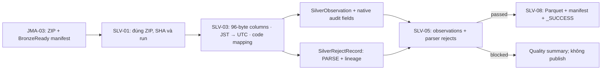

# JMA fixed-width → Silver observations

Triển khai SLV-03 dưới package `ie212.earthquake.spark.silver`, theo
[CON-03](./SILVER_GOLD_DATA_MODEL.md), [fixture CON-04](../../tests/fixtures/README.md)
và [JMA source-format contract](./JMA_ARCHIVE_INVENTORY.md). Không đổi schema
Java/Spark/Parquet `1.0`, không tạo model observation riêng cho JMA.

## 1. Làm gì, có gì, dùng để làm gì?

| Thành phần | Công việc | Mục đích |
|---|---|---|
| `JmaFixedWidthParser` | Đọc ZIP đã resolve hoặc member 96 byte, parse từng dòng | Tạo observation/reject dùng chung với USGS |
| `JmaParseContext` | Khóa manifest, ZIP URI/SHA, run, release, member và source URL | Không nhầm input/release, không suy diễn metadata từ tên file |
| `JmaCodeMapping` | Version hóa mapping agency, event category, magnitude, intensity, tsunami, determination | Giữ semantics native và phân biệt hoa/thường |
| `JmaNativeFields` | Giữ nguyên các code/slice native, nối bằng raw locator | Audit magnitude thứ hai, region và flags không có cột Silver riêng |
| `JmaParseResult` | Observations, rejects, native fields, counts và Spark Dataset adapters | Handoff vào quality/Parquet hoặc Spark SQL theo schema chung |
| `SilverQualityValidator.validate(JmaParseResult, runId)` | Gộp parser rejects vào quality gate | Không coi input lỗi toàn bộ là empty input hợp lệ |



## 2. Đầu vào, record boundary và charset

- Entry point tích hợp là `parse(ResolvedBronzeInput, memberName, sourceUrl,
  processedAtUtc)`. Input phải là `JMA_BULLETIN`, có release; parser đối chiếu
  context với resolved manifest/run/release/URI/SHA và kiểm tra lại length/SHA
  của staging ZIP trước khi trả bất kỳ observation nào.
- Member name và source URL lấy từ inventory/Bronze provenance tương ứng.
  SLV-01 staging manifest hiện không giữ hai trường này hoặc release time;
  caller phải truyền rõ, không tự dùng `hypo.dat` cho archive thật (`h2023`,
  `h199701`, `h199710`, ...). Release time không biết giữ null, không dùng
  `processed_at` hoặc retrieval time thay thế.
- `parseArchive(Path/byte[], context)` kiểm tra SHA và dùng lại validator
  JMA-03 cho ZIP/member/CRC/size; không extract member ra filesystem.
  ZIP tạm được xóa sau xử lý. Member được đọc theo stream.
- `parse(Path/byte[], context)` là API **member fixed-width** cho fixture hoặc
  member đã verify. API này không tự verify SHA của member: `raw_sha256` trong
  lineage thuộc **ZIP Bronze**, không phải file giải nén. Không dùng API này
  để bỏ qua resolver/ZIP checks trong luồng vận hành.
- Chấp nhận LF, CRLF và dòng cuối không có newline. Empty member có count 0.
  95/97 byte, blank line hoặc bare CR là lỗi cấu trúc: ném `IOException`
  `INVALID_RECORD_LENGTH`, không trả partial result. Case invalid CON-04 bị
  chặn trước Silver, đúng expected parsed/valid/rejected count 0.
- Cắt theo **byte**, không cắt chuỗi UTF-8 theo character. ISO-8859-1 chỉ là
  bridge một byte/một position. Parser v1 nhận printable ASCII; byte khác
  tạo row reject `CONTRACT_MISMATCH` với raw hash/locator nguyên bản, không
  đoán charset hoặc thay bằng replacement character. Cần profile/version
  mapping riêng trước khi hỗ trợ charset khác; JMA format không chốt charset.
- Guard mặc định: ZIP 128 MiB, member 512 MiB; có thể inject hai giới hạn vào
  constructor. API giữ ZIP `byte[]` và các output lists của **một archive**;
  không phải distributed parser hay cơ chế bounded-memory cho toàn bộ 40 năm.
  Caller phải giới hạn allocation/concurrency; không tải tất cả năm vào một process.

## 3. Field mapping theo cột 1-based

| Byte | Parse / output |
|---|---|
| 01 | `J/U/I` → `determining_agency_code`; source luôn `JMA_BULLETIN` |
| 02–13, 14–17 | Year/month/day/hour/minute + second F4.2 trong `Asia/Tokyo` |
| 22–24, 25–28 | Latitude degree + F4.2 minute / 60, giữ dấu kể cả `-00` |
| 33–36, 37–40 | Longitude degree + F4.2 minute / 60, giữ dấu kể cả `-000` |
| 45–49 | Depth F5.2 hoặc depth-slice I3 + hai blank → `depth_km` |
| 53–54 / 55 | Magnitude 1 F2.1 / native magnitude type |
| 56–57 / 58 | Magnitude 2 / type; fallback chỉ khi magnitude 1 thiếu |
| 59 / 60 | Travel-time table / location precision, giữ native audit slices |
| 61 | Subsidiary/event category → `event_type_code`, giữ raw category |
| 62 | Native intensity → `max_intensity_code`, không đổi A/B/C/D thành integer |
| 63 / 64 | Damage / tsunami class, giữ raw; tsunami recognized → true |
| 65 / 66–68 | District / region number; giữ cả leading zeros trong native fields |
| 69–92 | Region name trim → `place_name`; blank → null, không tự enrich prefecture |
| 93–95 | Station count parse-check và giữ native slice |
| 96 | Native determination code → `source_status`, không lowercase |

Quy tắc numeric:

- Implied decimal: `5678` → 56.78 giây, `4020` → 40.20 phút,
  `01000` → 10.00 km, `52` → 5.2. Decimal point có sẵn được dùng trực tiếp.
- Trailing blank trong phần thập phân không được trim trước scale:
  second `56  ` → 56.00; depth-slice `123  ` → 123 km. Right-aligned
  magnitude ` 5` vẫn là 0.5, không phải 5.0.
- Negative magnitude: `-1..-9` → -0.1..-0.9; `A0..A9`, `B0..B9`,
  `C0..C9` áp dụng cách mã hóa -1.x/-2.x/-3.x. Code numeric khác không được
  đoán; malformed → `INVALID_NUMBER`, không fallback sang magnitude 2.
- Magnitude 1 được ưu tiên nếu có; magnitude 2/value/type luôn giữ ở native
  metadata. Type được giữ nguyên `J/D/d/V/v/W/B/S`, không đổi đơn vị hay
  coi tất cả magnitude là Mw. Value/type đều blank → null.
- Missing depth/magnitude và optional numeric fields giữ null. Negative depth
  giữ giá trị, thêm warning `NEGATIVE_DEPTH`. Không ép thiếu thành 0.
- Required date/time hoặc coordinate sai/missing → row reject
  `INVALID_EVENT_TIME`, `INVALID_LATITUDE`, `INVALID_LONGITUDE`. Minutes phải
  trong `[0,60)`, latitude/longitude không vượt ±90/±180; second trong `[0,60)`.
  Parser v1 không tự roll leap second hoặc giờ 24 sang ngày tiếp theo.
- Optional error/station/region numeric fields vẫn được parse-check; sai kiểu
  → `INVALID_NUMBER`. Một row có thể có nhiều reason, mỗi code chỉ xuất một lần.

Quy tắc code/time:

- Category `1/2/5` → `EARTHQUAKE`, `3` → `ARTIFICIAL`, `4` → `ERUPTION`.
  Code 4 của nguồn cũng có thể bao gồm "others"; đây là mapping v1 cho nhóm
  đó, không khẳng định nguyên nhân vật lý từng event. Raw category giữ để audit.
  Blank/unknown → `UNKNOWN`; unknown nonblank có warning.
- Tsunami `T` và `1..6` → true. Blank/unknown, kể cả `0` không được format
  định nghĩa, → null; unknown có warning. Không suy diễn false từ blank.
- Giữ nguyên `K/S/k/s/A/a/N/F`; không bỏ low-quality, fixed/far-field,
  agency U/I, artificial hoặc event ngoài ROI ở parser. Unknown determination
  giữ raw và warning; quality gate hiện tại reject code không được contract cho phép.
- Unknown magnitude type/intensity/category/tsunami giữ native code và warning;
  không đoán mapping hoặc làm mất lineage.
- UTC/JST/date/year/month dẫn xuất bằng zone cố định, không dùng host timezone.
  Era `LEGACY` trước `1997-10-01 00:00:00 JST`, `UNIFIED` từ mốc đó, theo
  **event origin**, không lấy ingest date hoặc era của cả archive thay từng row.
- Chỉ phân loại ROI envelope CON-01 `[20,50] × [120,155]`, bao gồm biên;
  event ngoài vùng vẫn giữ với `is_in_study_area=false`.
- Giữ tọa độ JGD2000 của nguồn; không transform hoặc âm thầm relabel WGS84.

## 4. Key, lineage và native audit

Dùng lại SLV-04 `SourceKeyGenerator`: `jma_k1` từ native identity agency,
origin JST và degree/minute fields; revision = release + raw record hash;
observation ID = SHA-256 của source/key/revision. Không chọn current revision
hoặc canonical ID; `is_current_source_revision=false` cho mọi parsed row.
Thuật toán key hiện tại đổi nếu time/coordinate identity thay đổi; liên kết
các trường hợp đó thuộc dedup/linking, không giả định một universal JMA ID.

Locator là `member=<inventory-member>;line=<1-based>`. Hash record tính trên
đúng 96 bytes **trước normalize, không gồm LF/CRLF**; ZIP SHA giữ từ Bronze.
Reject giữ đủ schema/manifest/URI/SHA/locator/hash/run/parser/time/stage/reasons.
Không log toàn record hoặc copy raw payload vào quality summary.

`JmaNativeFields` là metadata in-memory của successful rows, không thêm cột
Java/Spark/Parquet hoặc ghi một dataset sidecar tự động. Raw region numbers,
magnitude 2, damage/tsunami/travel/precision/category flags truy ngược bền vững
bằng locator/hash vào ZIP Bronze; consumer muốn persist sidecar cần contract
riêng. `source_status`, intensity, agency và release đã có cột Silver để query.

## 5. Handoff và cách test

Sau khi resolver đã trả đúng input và caller lấy metadata từ inventory:

```java
JmaParseResult parsed = new JmaFixedWidthParser().parse(
        resolvedInput, entry.memberName(), entry.sourceUrl().toString(), processedAtUtc);
SilverQualityResult quality = new SilverQualityValidator().validate(parsed, resolvedInput.runId());
new SilverQualitySummaryWriter().write(summaryPath, quality, "JMA_BULLETIN");
SilverWriteRequest request = new SilverWriteRequest(resolvedInput.runId(),
        quality.validObservations(), quality.rejectedRecords(), publishedAtUtc, true);
SilverWriteResult output = new SilverParquetWriter(store).write(request, quality);
```

Không chỉ validate `parsed.observations()` vì sẽ bỏ mất parser rejects.
`valid + rejected = parsed`; quality hiện block checked publication khi có
bất kỳ reject. Structural/container errors ném exception để workflow dừng.
`JmaParseResult.observationDataset(spark)` / `rejectDataset(spark)` dùng lại
`SilverSchemas`; yêu cầu session timezone `UTC`, không tự sửa cấu hình host.
Dataset adapters dành cho một parsed batch, không phải runner tải 40 năm.

Chạy từ repository root với JDK build phù hợp:

```bash
make test-jma-parser
make test
make check
make check-task-status
git diff --check
```

Unit/integration tests đọc fixture CON-04, copy/mutate trong memory/temp,
không sửa shared fixtures, không gọi JMA hoặc ghi MinIO thật. Coverage gồm
biên cột/null/byte encoding, magnitude âm, depth-slice/fixed-hypocenter,
JST/UTC/1997/UTC partition, agency/flags, duplicate/revision, raw lineage,
ZIP staging integrity và JMA-03 → SLV-01 → parser → quality → Parquet readback.
Reject toàn bộ/mixed input không thể bị coi là empty hoặc publish thành công.

Evidence ngày 2026-10-07: target JMA parser đạt **36/36 tests** (30 parser,
6 integration), full `make check` đạt **140/140 Java tests**, **15/15 Airflow
tests**, checker **73 task** và các static/contract gates. Build dùng JDK
21.0.11 với `--release 17`; Spark Dataset adapters compile và shared Row
schema được kiểm tra nhưng chưa chạy Spark cluster/JDK 17 runtime. Không
có live source download hoặc ghi MinIO thật. SLV-03 là `Done`, assignee
`HoaiTam`, reviewer `unassigned`.

## 6. Phạm vi và nguồn đối chiếu

Không triển khai JMA DAG/live QA (JMA-04/JMA-05), dedup/revision selection
(SLV-06), source linking (SLV-07), E2E thật (SLV-09), Gold hoặc ML filtering.
Không có migration/xóa dữ liệu bắt buộc vì schema Silver không đổi. Khi đổi
parser/mapping ở tương lai, reprocess đúng ZIP release/run, không tải lại toàn catalog.

- [JMA record format](https://www.data.jma.go.jp/eqev/data/bulletin/data/format/hypfmt_e.html)
- [JMA 96-byte file format](https://www.data.jma.go.jp/eqev/data/bulletin/data/format/fmthyp_e.html)
- [JMA notes: JST, JGD2000 và thay đổi năm 1997](https://www.data.jma.go.jp/eqev/data/bulletin/readme_e.html)

Code mapping/offset được đối chiếu ngày 2026-10-07. Output là dữ liệu đã được
project xử lý từ JMA, không phải sản phẩm chuẩn hóa chính thức của JMA.
