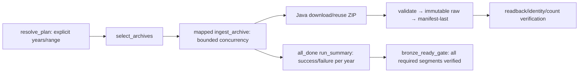

# JMA-04 — ingest theo năm/segment và resume có phạm vi

Task cung cấp workflow **Bronze**, không parse Silver, không publish Gold,
không huấn luyện model và không tự tải toàn bộ 40 năm. Dependency JMA-02/03
đã Done. Unit acceptance dùng fixture/mock; live QA nằm ở JMA-05.

## 1. Làm phần gì, có những gì, dùng để làm gì?

| Thành phần | Làm gì | Dùng để làm gì |
|---|---|---|
| `jma_backfill_runtime.py` | Resolve năm/range từ CSV, pin checksum inventory, context, preview, runner protocol, summary | Đảm bảo scope rõ và không đưa ZIP vào XCom |
| `jma_04_year_backfill.py` | Task group `jma_year_backfill`, map archive, retry, concurrency, all-done summary và gate | Chạy độc lập từng year/segment và giữ evidence khi một archive lỗi |
| `JmaYearIngestRunner` | Nối JMA-02 → JMA-03, verify readback và lưu exact publication pointer | Reuse raw/manifest đã xác minh giữa các run, không scan latest/wildcard |
| Downloader bổ sung | Giữ GET status/type/final URI/retrieval time; validate Range/size/timeout | Writer nhận metadata thật; không suy từ CSV hoặc HEAD thành HTTP GET 200 |
| Makefile, CLI preview, image wrapper | Test offline, preview scope, đóng gói Java runner + inventory | Thành viên có lệnh thực tế để hiểu/test workflow trước live run |



Preview map rỗng, không gọi Java/MinIO; summary/gate trả `PREVIEW`,
`verified=false`. Không coi successful preview là BronzeReady downstream.

## 2. Input và context

DAG manual `schedule=None`, paused khi tạo, `catchup=False`, `max_active_runs=1`.
Không nhận URL tùy ý hoặc mặc định full baseline. Chọn **một** trong hai kiểu
JSON conf:

```json
{"years": [1997, 2000, 2023], "preview": true, "force_download": false}
```

```json
{"start_year": 2000, "end_year": 2002, "preview": true}
```

Range bao gồm hai biên năm, giới hạn inventory baseline 1984–2023. Years phải
là integer, không nhận chuỗi/bool/float; list được sort/dedup. Mỗi năm phải
resolve đủ archive entries duy nhất. Năm 1997 giữ **h199701.zip / jan-sep** và
**h199710.zip / oct-dec**, không ghép ZIP hoặc cho year Ready chỉ vì một file đạt.

Plan chứa exact entries, source URL, native JST interval, UTC envelope,
`run_id`, hashed `run_id_path`, `processing_date`, `is_backfill=true`,
`config_version`, `logical_run_key` và SHA-256 của CSV. Với list năm rời rạc,
UTC envelope không có nghĩa ingest mọi năm ở giữa: chỉ exact entries đã chọn
được chạy. Processing date dùng logical date, data interval end hoặc run start
ổn định (Airflow 3 manual run có thể không có logical date); không lấy JST từ
timezone máy. `ingest_date_utc` của manifest do Java lấy ngày UTC lúc ghi;
retrieval time được giữ theo GET thực tế.

Plan đã ghi không được đổi conf/scope trong cùng run ID. Retry dùng lại plan;
đổi năm/range/preview/force cần run ID mới. Java đọc lại CSV và so checksum trước
mọi network/storage write; inventory đổi sau preview phải lập plan/run mới.
Release/SHA chưa biết ở preview và chỉ được resolve sau download, không bịa từ
`observed_*` hoặc release hint.

## 3. Download, publication và retry

- HEAD kiểm tra validators/size; local ZIP chỉ reuse khi SHA/length được đọc
  lại, source URL và validators khớp, state có metadata GET thật.
- State cũ JMA-02 thiếu GET status/type: download lại một lần để bổ sung,
  không fabricate 200. Constructor cũ của result/payload vẫn dùng được.
- GET timeout và body size guard áp dụng cả response chunked. ZIP tối đa
  mặc định 128 MiB; validator JMA-03 giới hạn member giải nén 512 MiB.
- Prefix `.part` chỉ resume khi sidecar gắn đúng URL/validators/total length.
  `206` phải có Content-Range đúng offset/end/total, response length đúng và
  file hoàn chỉnh khớp HEAD total. Writer nhận full archive length, không phải
  length của Range cuối. Untracked/stale prefix bị bỏ riêng tại staging.
  Transport JDK hiện trả body hoàn chỉnh trước khi downloader ghi staging;
  lỗi giữa HTTP body thường phải GET lại từ đầu. Resume áp dụng khi có prefix
  staging đã được gắn/verify metadata, không hứa mọi timeout đều giữ prefix.
- `force_download=true` yêu cầu GET đầy đủ để so SHA ngay cả khi HEAD không đổi;
  không resume prefix cũ trong chế độ này. Header-only changes với SHA giống
  không tạo raw copy; SHA khác tạo release mới và giữ bytes/manifest cũ.
- Airflow mapped task retry 2 lần, cách 2 phút. Mỗi attempt gửi `ti.try_number`
  vào Java và writer; raw/manifest đã ghi không bị overwrite.
- File lock theo year/segment bảo vệ state trên shared LocalExecutor volume.
  Publication run ID có suffix year/segment, tránh đụng key quarantine của
  hai segment 1997. Đây không phải distributed lock cho executor đa máy.
- Publication pointer gắn exact SHA, release, raw/manifest key, manifest hash
  và count. Reuse phải đọc raw + manifest, đối chiếu hash, identity, flags,
  cấu trúc và count; metadata HTTP/citation gốc trong manifest không bị sửa.
- Raw đã upload nhưng manifest lỗi: không Ready. Retry cùng input/attempt
  verify raw rồi ghi manifest còn thiếu; attempt mới dùng namespace mới.
  Pointer chỉ ghi sau readback. Pointer/manifest/raw lỗi không được tự repair
  bằng overwrite hoặc gọi đó là reuse thành công.

Cache nằm trong `pipeline_staging`, không phải source of truth. Mất cache thì
workflow có thể tải lại và tạo publication mới dưới run mới; không tuyên bố
exactly-once physical storage khi staging bị mất. Không xóa volume/bucket để
retry. Check revision cùng headers cần scoped `force_download`; schedule/check
hằng tuần thuộc ORC-02, chưa tự động được bật bởi JMA-04.

## 4. Summary và failure gate

Metadata trên staging:

```text
<JMA_STAGING_ROOT>/runs/<hashed-run-id>/plan.json
<JMA_STAGING_ROOT>/runs/<hashed-run-id>/year=YYYY/segment=<segment>/attempt-N-input.json
<JMA_STAGING_ROOT>/runs/<hashed-run-id>/year=YYYY/segment=<segment>/result.json
<JMA_STAGING_ROOT>/runs/<hashed-run-id>/run_summary.json
<JMA_STAGING_ROOT>/downloads/year=YYYY/segment=<segment>/state.json
<JMA_STAGING_ROOT>/downloads/year=YYYY/segment=<segment>/publication-<full-sha>.json
```

Summary đọc **đúng các result paths trong plan**, không scan rộng. Trước mỗi
attempt, result được đặt `RUNNING` để crash không giữ Ready cũ. Nonzero exit,
timeout, sai JSON/identity hoặc verify thiếu trả FAILED có reason an toàn;
không copy stderr/payload/secret vào XCom. Mapped task vẫn fail/retry thật.

`run_summary` chạy `all_done`, giữ evidence năm khác dù một mapped task lỗi.
Thiếu/corrupt/RUNNING result đều fail closed. Year có tất cả segment Ready mới
Ready; năm 1997 chỉ một segment Ready là `PARTIAL`; run chỉ `BronzeReady` khi
tất cả archive đạt. Gate cuối fail nếu summary thiếu gate thật, nên leaf
summary thành công không che failed DAG. Summary metadata không phải Bronze
commit point và không thay manifest. Keys/SHA/release/count trong report dùng
cho JMA-05 và SLV-01; SLV-01 cần stage exact manifest về local path trước khi
đọc raw bằng object-store adapter.

## 5. Cấu hình và giới hạn tài nguyên

| Biến | Default / phạm vi | Mục đích |
|---|---|---|
| `JMA_INGEST_RUNNER_COMMAND` | `/opt/pipeline/bin/jma-ingest-runner` | Gọi Java, không shell interpolation |
| `JMA_INGEST_RUNNER_TIMEOUT_SECONDS` | 900; 1–3600 | Giới hạn một archive attempt |
| `JMA_BACKFILL_MAX_CONCURRENCY` | 2; 1–4 | `max_active_tis_per_dag` cho mapped archive task |
| `JMA_HTTP_TIMEOUT_MS` | 60000; 1000–300000 | HEAD/GET timeout |
| `JMA_MAX_ARCHIVE_BYTES` | 134217728; 1024–134217728 | Guard trước/during download |
| `JMA_INVENTORY_PATH` | `/opt/pipeline/config/jma/hypocenter_archives_v1.csv` | Inventory đóng gói trong image |
| `JMA_STAGING_ROOT` | `/opt/pipeline/staging/jma` | Shared cache/context/summary |

Compose có default nên `.env` cũ không bắt buộc thêm keys. Không sửa `.env`
trong task này. Runner dùng credential MinIO pipeline đã có, không root.
ZIP vẫn dùng byte array ở writer; memory có nhiều copy, nên giảm concurrency
về 1 và cap nếu archive tiến sát giới hạn. Đây là guard baseline, chưa là
profile memory throughput; sizing thực tế thuộc ORC-05/QA-05.

## 6. Cách test và chạy

Offline, từ repository root; không cần `.env`, Docker hay nguồn thật:

```bash
make test-jma-backfill
make test-airflow
make jma-preview JMA_YEARS=1997,2023
make check
git diff --check
```

Preview host chỉ tạo plan metadata trong `staging/jma/` đã gitignore. HTTP mock
test cần quyền bind localhost. Build theo compiler `--release 17`; dùng JDK
được repo chấp nhận, không dùng Java 26 mặc định nếu Maven enforcer từ chối.

Khi sẵn sàng chạy thật (live acceptance thuộc JMA-05):

```bash
make up-airflow
```

Lệnh build custom image với Java runner và inventory rồi start service.
Trong Airflow UI, chọn `jma_04_year_backfill`, unpause manual DAG, Trigger với
JSON preview ở mục 2. Kiểm tra plan/summary: PREVIEW, không BronzeReady.
Sau đó trigger **run mới** với `{"years":[2023],"preview":false}`. Bắt đầu
một năm, không range 1984–2023. Xem mapped task log và run summary; gate phải
thành công với `verified=true`, URI/SHA/count thật.

Nếu một năm lỗi, giữ run/evidence cũ, sửa đúng nguyên nhân rồi trigger run mới
chỉ năm đó. Có thể clear mapped task lỗi trong cùng run để retry scope cũ;
summary/gate phải chạy lại sau đó. Năm khác reuse exact publication đã verify.
Muốn check bytes có đổi dù validators không đổi, dùng run mới với
`{"years":[2023],"preview":false,"force_download":true}`.

JMA-05 dùng các năm đại diện 2000 (reproduction pilot), 2023 (extension), 1997
(hai segment); sample 2000 chưa tải ở JMA-04. Không sửa DAT-01 catalog để đổi
STAGED_SOURCE thành BronzeReady hoặc bịa expected count.

## 7. Kiểm thử và handoff

Java test kiểm tra download→write→readback, same-run/new-run reuse không GET
lại và không raw copy, header-only changes, forced revision, manifest failure
recovery, rejection/quarantine, tamper và hai segment 1997. Python test kiểm
tra list/range/preview, strict input, manual context, immutable scope,
subprocess argv/whitelist, timeout/invalid output, missing result, partial year
và crash sau khi có Ready cũ. DAG/deployment tests là static contract, không
thay bằng chứng scheduler thực thi.

Không có migration Bronze, fixture/catalog change hoặc thao tác xóa dữ liệu.
Live source, MinIO/Spark/JDK17 runtime và Airflow mapped execution chưa được
xác nhận trong task này; cần ghi evidence riêng ở JMA-05.

- [JMA inventory](./JMA_ARCHIVE_INVENTORY.md)
- [JMA Bronze writer](./JMA_BRONZE_WRITER_CONTRACT.md)
- [Airflow local](./AIRFLOW_LOCAL.md)
- [Nhóm mở đường tuần 4](../task/WEEK_4_PREP_GROUP.md)
- [Airflow dynamic task mapping](https://airflow.apache.org/docs/apache-airflow/stable/authoring-and-scheduling/dynamic-task-mapping.html)
