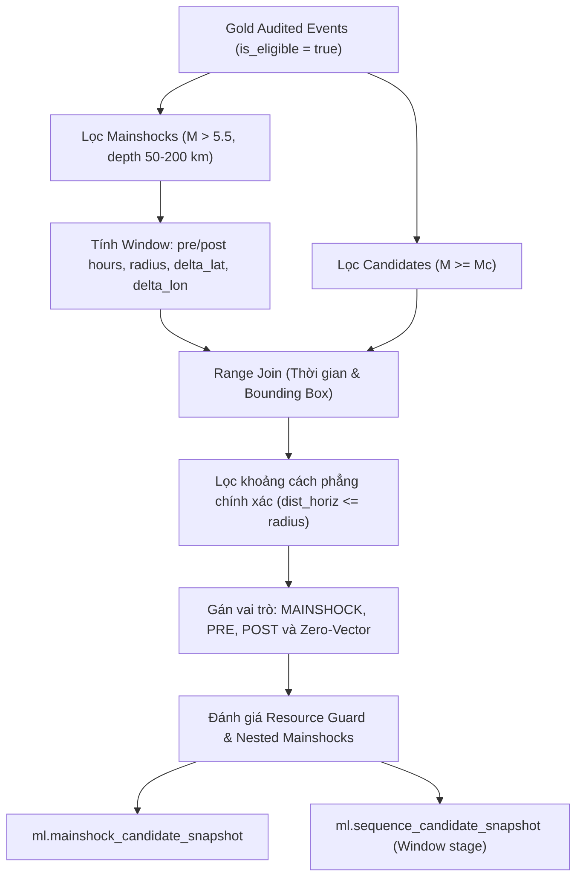

# Mainshock Selection và Candidate Window Generation Specification

Tài liệu này đặc tả quy trình kỹ thuật, mô hình toán học và cấu trúc dữ liệu cho việc chọn lọc động đất chính (mainshock) và tạo các cửa sổ ứng viên (candidate windows) theo hợp đồng dữ liệu `CON-03-ML` trong khuôn khổ task `MLD-03`.

---

## 1. Mục tiêu và Nguyên tắc Cốt lõi

1. **Giảm thiểu độ phức tạp tính toán:** Giảm catalog động đất thành các cửa sổ cục bộ theo từng mainshock để giữ lại nền địa chấn (background noise) phục vụ phân cụm, loại bỏ hoàn toàn tích Descartes không điều kiện (unqualified cross join) trên toàn lãnh thổ Nhật Bản.
2. **Bảo toàn hạt dữ liệu (Grain Invariant):**
   - Hạt của `ml.mainshock_candidate_snapshot`: `(dataset_id, mainshock_event_id)` là duy nhất.
   - Hạt của `ml.sequence_candidate_snapshot`: `(dataset_id, mainshock_event_id, candidate_event_id)` là duy nhất tuyệt đối.
3. **Bảo tồn tính toàn vẹn cửa sổ (Self-Inclusion):** Mỗi window phải chứa chính mainshock của nó đúng một lần với cờ `is_mainshock = true`, vai trò `relative_time_role = MAINSHOCK`, và vector tương đối bằng 0 tuyệt đối (`dx = dy = dz = distance_3d = delta_time = 0.0`).
4. **Hỗ trợ đa cửa sổ (Overlapping Windows):** Một sự kiện địa chấn có thể nằm trong nhiều cửa sổ của các mainshock khác nhau mà không bị coi là duplicate sai.
5. **Giám sát tài nguyên không nuốt lỗi (No Silent Truncation):** Khi số lượng candidate trong window vượt ngưỡng trần tài nguyên (`maxCandidatesPerWindow`), cửa sổ bị gắn cờ `FLAGGED` hoặc `REJECTED` kèm mã lý do `ML_RESOURCE_LIMIT_EXCEEDED`, không âm thầm cắt bớt dữ liệu.

---

## 2. Tiêu chí Chọn lọc Mainshock

Mainshock được chọn lọc từ tập dữ liệu Gold đã qua kiểm toán (`is_eligible = true` từ MLD-02) theo các tiêu chuẩn vật lý địa chấn:

| Thuộc tính | Điều kiện | Ý nghĩa / Cơ sở |
|---|---|---|
| `depth_km` | $50.0 \le \text{depth} \le 200.0\text{ km}$ (inclusive) | Giới hạn phân tầng trung gian (Intermediate depth) theo baseline nghiên cứu |
| `magnitude` | $> 5.5$ (exclusive) | Ngưỡng năng lượng đủ mạnh để phát sinh chuỗi dư chấn có ý nghĩa |
| `event_time_utc` | $[T_{\text{start}}, T_{\text{end}})$ | Nằm trong khoảng nửa mở của phân đoạn dataset (`REPRODUCTION` hoặc `EXTENSION`) |
| `catalog_era` | `UNIFIED` | Kỷ nguyên mạng lưới chuẩn hóa JMA (từ sau 1997) |
| `is_natural_earthquake` | `true` | Động đất tự nhiên |
| `is_in_study_area` | `true` | Nằm trong phạm vi quan sát Nhật Bản |

---

## 3. Mô hình Cửa sổ Không - Thời gian (Window Models)

Đặc tả hỗ trợ ba mô hình tính toán kích thước cửa sổ phụ thuộc magnitude:

### 3.1. Mô hình Uhrhammer (1986) — `wm_uhrhammer_v1.0`
- **Bán kính tìm kiếm ($d$):**
  $$d(M) = \exp(-1.024 + 0.804 \cdot M)\text{ km}$$
- **Thời gian sau mainshock ($t_{\text{post}}$):**
  $$t_{\text{post}}(M) = \exp(-2.870 + 1.235 \cdot M)\text{ days} \times 24.0\text{ hours}$$
- **Thời gian trước mainshock ($t_{\text{pre}}$):**
  $$t_{\text{pre}}(M) = \max(168.0\text{ h}, 0.1 \times t_{\text{post}}(M))$$

### 3.2. Mô hình Gardner & Knopoff (1974) — `wm_gardner_knopoff_v1.0`
- **Bán kính tìm kiếm ($L$):**
  $$L(M) = 10^{0.1238 \cdot M + 0.983}\text{ km}$$
- **Thời gian sau mainshock ($T_{\text{post}}$):**
  $$T_{\text{post}}(M) = 10^{0.5409 \cdot M - 0.547}\text{ days} \times 24.0\text{ hours}$$
- **Thời gian trước mainshock ($T_{\text{pre}}$):**
  $$T_{\text{pre}}(M) = \max(168.0\text{ h}, 0.1 \times T_{\text{post}}(M))$$

### 3.3. Mô hình Mở rộng — `wm_expanded_v1.0`
- Cho phép đặt trần an toàn (`maxSearchRadiusKm`, `maxPostWindowHours`, `maxPreWindowHours`) để tránh các trận siêu động đất (như Tohoku 2011 M9.0) tạo ra cửa sổ bao phủ toàn bộ catalog kéo dài hàng chục năm.

---

## 4. Chiến lược Range-Join và Bounding Box Prefilter

Để đảm bảo hiệu năng Spark và tránh Cross Join toàn catalog:



### 4.1. Toán tử Bounding Box
Tại vĩ độ $\phi$ của mainshock:
- $\Delta\text{lat} = \frac{R}{110.57}^\circ$
- $\Delta\text{lon} = \min\left(180^\circ, \frac{R}{111.32 \cdot \cos(\text{radians}(\phi))}^\circ\right)$
Điều kiện lọc Range Join trên Spark SQL:
```sql
c.event_time_utc >= m.window_start_utc AND c.event_time_utc <= m.window_end_utc
AND c.latitude >= m.min_lat AND c.latitude <= m.max_lat
AND c.longitude >= m.min_lon AND c.longitude <= m.max_lon
```

### 4.2. Khoảng cách địa phương và Độ lệch thời gian
- $dx = 111.32 \cdot \cos(\text{radians}(\text{lat}_m)) \cdot (\text{lon}_c - \text{lon}_m)$ (km)
- $dy = 110.57 \cdot (\text{lat}_c - \text{lat}_m)$ (km)
- $dz = \text{depth}_c - \text{depth}_m$ (km)
- $d_{\text{horiz}} = \sqrt{dx^2 + dy^2} \le R$
- $d_{\text{3D}} = \sqrt{dx^2 + dy^2 + dz^2}$
- $\Delta t = \frac{T_c - T_m}{3600.0}$ (hours)

---

## 5. Cấu trúc Bảng Output

### 5.1. `ml.mainshock_candidate_snapshot`
| Field | Type | Nullable | Quy tắc |
|---|---|:---:|---|
| `schema_version` | string | Không | `"1.0"` |
| `dataset_id` | string | Không | Định danh bất biến của dataset |
| `mainshock_event_id` | string | Không | Canonical ID của mainshock |
| `event_time_utc` | timestamp | Không | Thời điểm xảy ra mainshock |
| `latitude` | double | Không | Tọa độ vĩ độ |
| `longitude` | double | Không | Tọa độ kinh độ |
| `depth_km` | double | Không | Độ sâu chấn tiêu (50–200 km) |
| `magnitude` | double | Không | Độ lớn (> 5.5) |
| `mc_value` | double | Không | Ngưỡng completeness áp dụng |
| `selection_rule_version` | string | Không | Phiên bản rule chọn mainshock |
| `window_model_version` | string | Không | Phiên bản mô hình cửa sổ |
| `pre_window_hours` | double | Không | Thời gian trước mainshock |
| `post_window_hours` | double | Không | Thời gian sau mainshock |
| `search_radius_km` | double | Không | Bán kính tìm kiếm |
| `candidate_count` | long | Không | Số ứng viên trong cửa sổ (gồm cả self) |
| `resource_guard_status` | string | Không | `"PASS"`, `"FLAGGED"`, hoặc `"REJECTED"` |
| `resource_reason_code` | string | Có | `"ML_RESOURCE_LIMIT_EXCEEDED"` khi vượt ngưỡng |
| `created_at_utc` | timestamp | Không | Thời điểm tạo snapshot |

### 5.2. `ml.sequence_candidate_snapshot` (Window stage)
Grain: `(dataset_id, mainshock_event_id, candidate_event_id)`

| Field | Type | Nullable | Quy tắc |
|---|---|:---:|---|
| `schema_version` | string | Không | `"1.0"` |
| `dataset_id` | string | Không | FK dataset manifest |
| `mainshock_event_id` | string | Không | FK mainshock snapshot |
| `candidate_event_id` | string | Không | Canonical ID của candidate |
| `candidate_time_utc` | timestamp | Không | Thời điểm candidate |
| `candidate_latitude` | double | Không | Vĩ độ candidate |
| `candidate_longitude` | double | Không | Kinh độ candidate |
| `candidate_depth_km` | double | Không | Độ sâu candidate |
| `candidate_magnitude` | double | Không | Độ lớn candidate ($\ge M_c$) |
| `mainshock_magnitude` | double | Không | Độ lớn của mainshock |
| `relative_time_role` | string | Không | `"MAINSHOCK"`, `"PRE"`, hoặc `"POST"` |
| `is_mainshock` | boolean | Không | `true` duy nhất cho self mainshock |
| `dx_km` | double | Không | Độ lệch đông-tây cục bộ (0.0 cho mainshock) |
| `dy_km` | double | Không | Độ lệch bắc-nam cục bộ (0.0 cho mainshock) |
| `dz_km` | double | Không | Độ lệch độ sâu cục bộ (0.0 cho mainshock) |
| `delta_time_hours` | double | Không | Độ lệch thời gian có dấu (0.0 cho mainshock) |
| `distance_3d_km` | double | Không | Khoảng cách không gian 3 chiều |
| `mc_value` | double | Không | Ngưỡng completeness áp dụng |
| `window_model_version` | string | Không | Phiên bản mô hình cửa sổ |
| `created_at_utc` | timestamp | Không | Thời điểm tạo |
