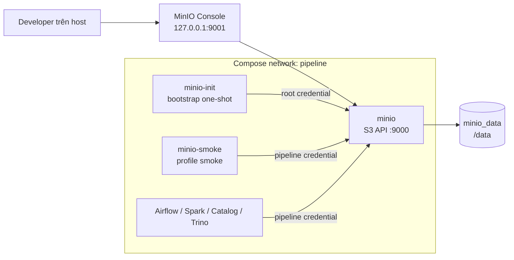

# MinIO storage và bootstrap contract

| Thuộc tính | Giá trị |
|---|---|
| Task | `MIO-01` |
| Trạng thái | Implemented |
| Runtime service | `minio` |
| Bootstrap service | `minio-init` |
| Smoke service | `minio-smoke` — profile `smoke` |
| Durable volume | `minio_data` tại `/data` |

## 1. MIO-01 làm gì

MIO-01 cung cấp object storage S3-compatible cho ba tầng dữ liệu của pipeline:

- Bronze giữ response nguồn và metadata theo run.
- Silver giữ dữ liệu Parquet đã chuẩn hóa.
- Warehouse giữ data/metadata của bảng Iceberg Gold.

Task này thêm MinIO runtime, healthcheck, bucket bootstrap, ba prefix logic,
credential riêng cho pipeline và smoke test ghi/đọc object. Task chưa cài writer
Bronze, Spark Silver hoặc Iceberg; các task downstream sử dụng contract ở tài
liệu này thay vì tự tạo bucket, endpoint hoặc credential khác.

## 2. Các thành phần phối hợp thế nào



Trình tự khởi động mặc định:

1. `minio` mount volume `minio_data` và mở S3 API nội bộ ở cổng `9000`.
2. Healthcheck gọi `/minio/health/live` bên trong container.
3. Chỉ khi MinIO healthy, `minio-init` mới chạy.
4. `minio-init` tạo/cập nhật bucket, prefix marker, policy và pipeline user rồi
   thoát với mã `0`.
5. Consumer tương lai phải chờ `minio-init` hoàn thành thành công, không chỉ chờ
   container MinIO bắt đầu chạy.

Không dùng `sleep` cố định để đoán readiness.

## 3. Bucket và prefix contract

Giá trị mặc định local lấy từ `.env.example`:

| Logical layer | URI mặc định | Owner downstream | Tính chất |
|---|---|---|---|
| Bucket | `s3://japan-earthquake` | MIO-01 | Một bucket dùng chung cho project local |
| Bronze | `s3://japan-earthquake/bronze` | USG-03/JMA-03 | Raw immutable theo `run_id`/`attempt`; layout tại [Bronze storage contract](./BRONZE_STORAGE_CONTRACT.md) |
| Silver | `s3://japan-earthquake/silver` | SLV-08 | Có thể thay output/partition theo contract rerun |
| Gold warehouse | `s3://japan-earthquake/warehouse` | QRY-01/GLD-03 | Iceberg quản lý file và snapshot |

S3 không có thư mục thật. Bootstrap tạo object rỗng `.keep` dưới mỗi prefix để
prefix xuất hiện ngay trong Console và để smoke test xác nhận init đã hoàn tất:

```text
japan-earthquake/
├── bronze/.keep
├── silver/.keep
└── warehouse/.keep
```

`.keep` chỉ là bootstrap marker, không phải dữ liệu nghiệp vụ, manifest hay dấu
hiệu một pipeline run đã hoàn thành. Writer downstream phải dùng object/path
contract của task sở hữu và không suy ra trạng thái publish từ marker này.

Bronze object và manifest phải tuân theo [Bronze storage
contract](./BRONZE_STORAGE_CONTRACT.md). Manifest `BronzeReady` là commit point
logic; object trong `_staging` hoặc `_quarantine` không được resolver Silver
chọn.

`WAREHOUSE_PATH` phải nằm trong `DATA_BUCKET`; Bronze, Silver và warehouse
prefix phải khác nhau. `scripts/check-config.sh` và `compose/minio/init.sh` đều
fail fast nếu contract này sai.

## 4. Cách bootstrap hoạt động

`compose/minio/init.sh` chạy bằng image MinIO Client và thực hiện idempotent:

1. Kết nối alias `bootstrap` bằng root credential.
2. Chờ cluster có read/write quorum bằng `mc ready`.
3. Tạo bucket bằng `mc mb --ignore-existing`.
4. Ghi lại ba marker `.keep`.
5. Tạo hoặc cập nhật policy `japan-earthquake-pipeline`.
6. Tạo hoặc cập nhật pipeline user từ `MINIO_ACCESS_KEY` và
   `MINIO_SECRET_KEY`.
7. Attach policy cho pipeline user.

Chạy lại init không tạo bucket thứ hai và không xóa object hiện có. Khi secret
pipeline trong `.env` đổi, chạy lại init cập nhật credential của user đó; các
consumer phải được restart với cùng cấu hình mới.

## 5. Credential và quyền truy cập

| Credential | Dùng bởi | Quyền |
|---|---|---|
| `MINIO_ROOT_USER` / `MINIO_ROOT_PASSWORD` | `minio`, `minio-init`, người vận hành Console | Bootstrap/admin local |
| `MINIO_ACCESS_KEY` / `MINIO_SECRET_KEY` | Smoke test và pipeline consumer | Policy giới hạn trong bucket/prefix đã cấu hình |

Pipeline không dùng root credential. Policy hiện tại cho phép:

| Phạm vi | Get/List | Put | Delete |
|---|---:|---:|---:|
| Bucket metadata và ba prefix | Có | Không áp dụng | Không |
| `bronze/*` | Có | Có | Không |
| `silver/*` | Có | Có | Có |
| `warehouse/*` | Có | Có | Có |
| Bucket/object ngoài contract | Không | Không | Không |

Không cấp `DeleteObject` cho Bronze để giảm rủi ro xóa raw response. Tuy vậy,
`PutObject` cùng một key vẫn có thể thay object trên bucket chưa bật versioning;
USG-03 và JMA-03 vẫn phải dùng path gắn `run_id`/`attempt`/catalog release và
từ chối overwrite mơ hồ theo Bronze storage contract để đáp ứng tính bất biến
nghiệp vụ.

Secret chỉ đi qua environment. Script không in credential; `MC_CONFIG_DIR` đặt
trong tmpfs `/tmp` và init/smoke container dùng root filesystem read-only.

## 6. Network, endpoint và persistence

| Interface | Địa chỉ | Ai dùng | Host exposure |
|---|---|---|---|
| S3 API | `http://minio:9000` | Container trong network `pipeline` | Không publish |
| Console | `http://127.0.0.1:9001` mặc định | Người vận hành local | Chỉ loopback; port đổi bằng `MINIO_CONSOLE_HOST_PORT` |
| Health | `http://localhost:9000/minio/health/live` trong container | Docker Compose | Không publish |

Không dùng `localhost:9000` từ Airflow/Spark/Trino vì `localhost` trong container
trỏ về chính container đó. Consumer phải dùng `MINIO_ENDPOINT`.

Toàn bộ object và IAM/config state local nằm trong named volume `minio_data`.
`docker compose stop` hoặc `docker compose down` giữ volume. Không dùng
`docker compose down -v` trong quy trình thường ngày.

## 7. Khởi động và kiểm tra

Tạo `.env`, thay mọi placeholder, rồi chạy preflight:

```bash
cp .env.example .env
./scripts/check-config.sh --require-local
./scripts/check-compose.sh
./scripts/check-minio.sh
```

Khởi động MinIO và bootstrap:

```bash
docker compose --env-file .env up -d minio minio-init
docker compose --env-file .env ps -a minio minio-init
```

Kết quả mong đợi:

- `minio` là `healthy`.
- `minio-init` là `Exited (0)`.
- Console mở ở `http://127.0.0.1:9001` nếu dùng port mặc định.

Chạy smoke test tự động:

```bash
./scripts/smoke-minio.sh
```

Script này kiểm tra config/static contract, khởi động MinIO, chạy lại bootstrap,
kiểm tra ba marker, ghi object tạm bằng pipeline credential, đọc lại và so sánh
nội dung, rồi xóa đúng object smoke ở `silver/_smoke/`. Nó không dừng MinIO và
không xóa bucket hoặc volume.

## 8. Kiểm tra thủ công và log

```bash
docker compose --env-file .env ps -a minio minio-init
docker compose --env-file .env logs --tail=100 minio
docker compose --env-file .env logs minio-init
```

Không paste output có credential vào issue/PR. Bootstrap thành công chỉ in tên
bucket/prefix. Để chạy lại init sau khi đổi cấu hình:

```bash
docker compose --env-file .env run --rm minio-init
```

## 9. Troubleshooting

### `minio` unhealthy

1. Xem `docker compose ps` và log `minio`.
2. Kiểm tra root credential đã thay placeholder và đủ độ dài.
3. Kiểm tra disk còn trống và volume mount không lỗi.
4. Không xóa `minio_data` để thử sửa lỗi.

### `minio-init` thoát khác 0

1. Xác nhận `MINIO_ENDPOINT=http://minio:9000`.
2. Chạy `./scripts/check-config.sh --require-local`.
3. Kiểm tra bucket/prefix chỉ chứa ký tự được hỗ trợ và không trùng nhau.
4. Chạy lại init; script được thiết kế idempotent.

### Console vào được nhưng pipeline bị `AccessDenied`

1. Không đổi consumer sang root credential.
2. Chạy lại `minio-init` để cập nhật user/policy.
3. Xác nhận object nằm trong Bronze, Silver hoặc warehouse prefix đã cấu hình.
4. Với thao tác xóa Bronze, `AccessDenied` là hành vi chủ đích.

### Port Console bị chiếm

Đổi `MINIO_CONSOLE_HOST_PORT` trong `.env`, chạy lại config check rồi recreate
service. Không publish thêm S3 API port `9000` chỉ để mở Console.

## 10. Handoff cho task downstream

- USG-03/JMA-03 dùng pipeline credential và ghi dưới `BRONZE_PREFIX`.
- SLV-08 dùng cùng bucket và ghi dưới `SILVER_PREFIX`.
- QRY-01/GLD-03 dùng đúng `WAREHOUSE_PATH`; không tạo warehouse song song.
- Consumer Compose phải chờ `minio-init` với
  `condition: service_completed_successfully`.
- Không hard-code endpoint, bucket hoặc credential trong DAG, Java source,
  `pom.xml` hay Trino catalog file.

## 11. Giới hạn phiên bản

Project pin MinIO Community server `RELEASE.2025-10-15T17-29-55Z` tại commit
`9e49d5e7a648f00e26f2246f4dc28e6b07f8c84a`. Vì upstream không phát hành
container image cho release này, Compose build image local từ source bằng
`compose/minio/Dockerfile`. MinIO Client pin
`quay.io/minio/mc:RELEASE.2025-08-13T08-35-41Z`.

MinIO Community đã chuyển sang source-only distribution và repository upstream
hiện đã archive. Baseline này dành cho môi trường học/demo, không phải image
production có hỗ trợ. Lần build server đầu cần Internet và có thể lâu hơn một
lần pull image thông thường; các lần sau dùng Docker build cache.

Trước khi dùng ngoài môi trường học/demo, `SEC-01` phải đánh giá lại CVE,
license, nguồn image và phương án object storage được duy trì. Không đổi sang
tag `latest` để né review; upgrade phải pin version mới, chạy static check,
smoke test và xác nhận tương thích S3 của Spark/Iceberg/Trino.

Tài liệu upstream tham khảo:

- [MinIO server releases](https://github.com/minio/minio/releases)
- [MinIO Client releases](https://github.com/minio/mc/releases)
- [MinIO healthcheck endpoints](https://github.com/minio/minio/blob/master/docs/metrics/healthcheck/README.md)
- [`mc admin policy create`](https://docs.min.io/aistor/reference/cli/admin/mc-admin-policy/mc-admin-policy-create/)
- [`mc admin policy attach`](https://docs.min.io/aistor/reference/cli/admin/mc-admin-policy/mc-admin-policy-attach/)
