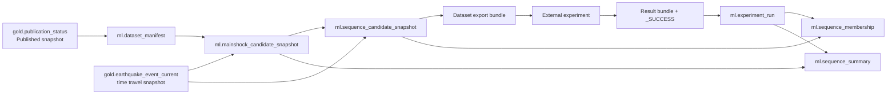
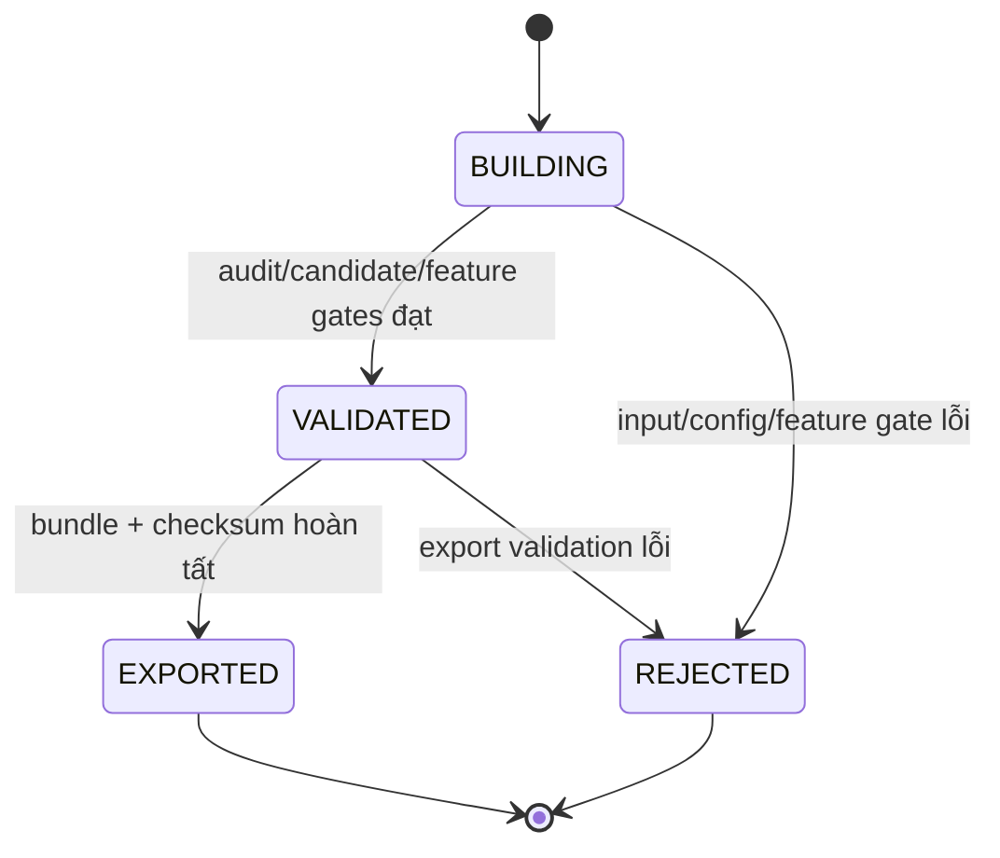
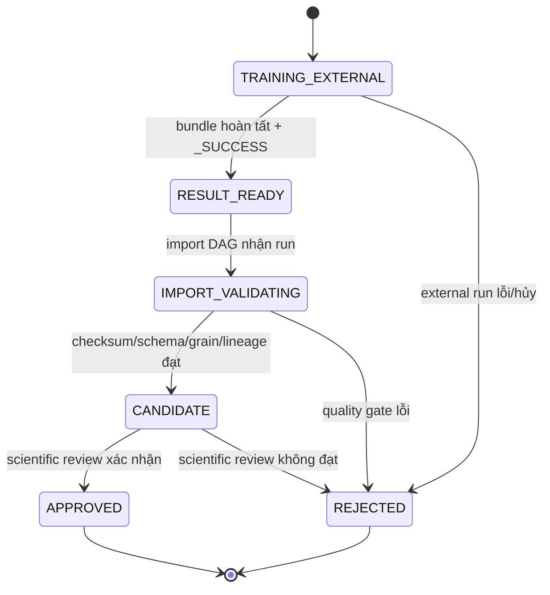

# Logical data model cho ML dataset và HDBSCAN experiment

Tài liệu này là phần namespace `ml` của contract `CON-03` v2. Nó khóa logical
grain, key, field, null policy, lineage và lifecycle để Spark, Colab, Airflow,
Iceberg và Trino dùng cùng một giao diện. Phần Silver/Gold và kiểu dữ liệu nền
nằm tại [Silver, Gold và ML logical model](./SILVER_GOLD_DATA_MODEL.md).

Đây không phải physical DDL. Partition transform, file size, merge strategy và
Iceberg implementation thuộc `MLI-03`, nhưng không được thay đổi grain hoặc
null semantics trong tài liệu này.

## 1. Quyết định bắt buộc

| Nội dung | Quyết định |
|---|---|
| Gold input | Pin đúng một snapshot `Published`; không resolve lại bảng current sau khi đã tạo `dataset_id` |
| Dataset identity | `dataset_id` bất biến, dẫn xuất từ snapshot + canonical config/version, không từ thời gian chạy |
| Dataset grain | Một dòng trong `ml.dataset_manifest` cho một `dataset_id` |
| Mainshock grain | `(dataset_id, mainshock_event_id)` |
| Candidate grain | `(dataset_id, mainshock_event_id, candidate_event_id)` |
| Experiment grain | Một dòng trong `ml.experiment_run` cho một `experiment_run_id` |
| Membership grain | `(experiment_run_id, mainshock_event_id, candidate_event_id)` |
| Summary grain | `(experiment_run_id, mainshock_event_id)` |
| So sánh thuật toán | `WINDOW`, `DBSCAN`, `HDBSCAN_GLOBAL`, `HDBSCAN_ADAPTIVE` cùng đọc một `dataset_id` |
| Đơn vị fit | Từng mainshock window; không fit HDBSCAN trên toàn catalog |
| Publish gate | Chỉ run `CANDIDATE`/`APPROVED` được serving; import thành công không tự `APPROVED` |
| Gold boundary | Không thêm cluster, probability hoặc nhãn sequence vào Gold core |
| External boundary | Colab chỉ đọc/ghi bundle; không nhận MinIO credential hoặc ghi Iceberg trực tiếp |
| Diễn giải | Output là sequence/aftershock candidate hồi cứu, không phải prediction hay causal label |

`candidate_event_id` luôn là `canonical_event_id` của Gold snapshot, nhưng dùng
tên riêng để thể hiện event đang ở grain của một mainshock window. Consumer
không tạo ID mới từ thời gian hoặc tọa độ.

## 2. Quan hệ và lineage



Lineage tối thiểu:

```text
gold_table_name + gold_snapshot_id
  -> dataset_id
  -> (mainshock_event_id, candidate_event_id)
  -> experiment_run_id
  -> membership/summary
  -> Trino/static report
```

Một Gold snapshot có thể tạo nhiều dataset vì time split, `Mc`, window hoặc
feature version khác nhau. Một dataset có nhiều experiment runs. Các run không
overwrite nhau và không sửa snapshot candidate đã export.

## 3. Kiểu, ID và quy ước chung

- Dùng logical types trong contract chính: `string`, `boolean`, `integer`,
  `long`, `double`, `timestamp_utc` và `json_string`.
- Spark session timezone là UTC. Mọi timestamp ML có hậu tố `_utc`.
- JSON phải được canonicalize với key sort ổn định trước khi hash; JSON không
  chứa credential, absolute path cá nhân hoặc giá trị `NaN`/`Infinity`.
- Hash dùng SHA-256 chữ thường. Checksum luôn tính trên bytes artifact, không
  tính trên tên file hoặc timestamp upload.
- Mọi `double` được publish phải hữu hạn. Thiếu metric hợp lệ giữ `null` và có
  reason code; không thay bằng `0`.
- ID là opaque string; consumer không parse ID để suy ra period/algorithm.

### 3.1. `dataset_id`

Identity input tối thiểu:

```text
gold_table_name
gold_snapshot_id
dataset_split
period_start_utc
period_end_utc_exclusive
canonical filter_config_json
dataset_config_version
audit_rule_version
mc_method_version
window_model_version
feature_version
scaling_config_version
code_version
```

Quy tắc logic:

```text
dataset_id = "ds_" + sha256(canonical_identity_payload)
```

Không đưa `run_id`, `created_at_utc`, retry attempt hoặc staging URI vào
identity. Rerun cùng identity phải tiếp tục/đối soát cùng dataset; nếu cùng ID
nhưng identity payload khác thì reject `DS_IDENTITY_CONFLICT`.

### 3.2. `experiment_run_id`

`experiment_run_id` là ID bất biến của đúng một artifact set, một `dataset_id`,
một algorithm và một model config. Có thể tạo bằng UUID/ULID hoặc deterministic
run key do `MLI-01` chốt, nhưng không được reuse. Import lại cùng run ID và cùng
bundle checksum là idempotent; cùng run ID với checksum khác bị reject
`IMP_EXPERIMENT_RUN_REUSED`.

## 4. `ml.dataset_manifest`

Grain: một dòng cho một `dataset_id`.

| Field | Type | Null | Quy tắc |
|---|---|---:|---|
| `schema_version` | string | Không | `1.0` |
| `dataset_id` | string | Không | Primary logical key, theo mục 3.1 |
| `dataset_split` | string | Không | `REPRODUCTION` hoặc `EXTENSION` |
| `gold_table_name` | string | Không | Baseline `gold.earthquake_event_current` |
| `gold_snapshot_id` | long | Không | Snapshot đã `Published` |
| `gold_publication_id` | string | Không | FK logic tới `gold.publication_status` |
| `period_start_utc` | timestamp_utc | Không | Inclusive |
| `period_end_utc_exclusive` | timestamp_utc | Không | Exclusive |
| `observation_cutoff_utc` | timestamp_utc | Không | Event/source cutoff dùng khi build |
| `filter_config_json` | json_string | Không | Natural/study area/catalog/source/depth/magnitude filters |
| `dataset_config_version` | string | Không | Version tổng của dataset rule |
| `audit_rule_version` | string | Không | Version input audit/exclusion rules |
| `mc_method` | string | Có điều kiện | Bắt buộc từ `VALIDATED`; ví dụ maximum curvature |
| `mc_method_version` | string | Có điều kiện | Bắt buộc khi `mc_method` có giá trị |
| `mc_value` | double | Có điều kiện | Bắt buộc từ `VALIDATED`, hữu hạn |
| `mc_region_version` | string | Có điều kiện | Bắt buộc nếu `Mc` phân vùng/depth group |
| `mc_config_json` | json_string | Có điều kiện | Bắt buộc từ `VALIDATED`; lưu central/sensitivity values và group mapping |
| `mc_config_sha256` | string | Có điều kiện | Bắt buộc từ `VALIDATED`; hash canonical Mc config |
| `window_model_version` | string | Không | Rule pre/post/radius đã version hóa |
| `feature_version` | string | Không | Công thức relative 4-D |
| `scaling_config_version` | string | Không | Global/adaptive scale rule |
| `code_version` | string | Không | Git commit/tag tạo dataset |
| `input_event_count` | long | Có điều kiện | Bắt buộc từ `VALIDATED`, `>= 0` |
| `eligible_event_count` | long | Có điều kiện | Bắt buộc từ `VALIDATED`, `>= 0` |
| `excluded_event_count` | long | Có điều kiện | Bắt buộc từ `VALIDATED`, đối soát input |
| `mainshock_count` | long | Có điều kiện | Bắt buộc từ `VALIDATED`, `>= 0` |
| `candidate_row_count` | long | Có điều kiện | Bắt buộc từ `VALIDATED`, `>= mainshock_count` khi có mainshock |
| `feature_row_count` | long | Có điều kiện | Bắt buộc từ `VALIDATED`, bằng candidate rows đã publish |
| `exclusion_counts_json` | json_string | Có điều kiện | Count theo reason; bắt buộc từ `VALIDATED` |
| `audit_report_uri` | string | Có | URI artifact, không chứa credential |
| `feature_schema_sha256` | string | Có điều kiện | Bắt buộc từ `VALIDATED` |
| `export_artifact_uri` | string | Có điều kiện | Chỉ có từ `EXPORTED` |
| `export_manifest_sha256` | string | Có điều kiện | Bắt buộc từ `EXPORTED` |
| `dataset_status` | string | Không | Lifecycle ở mục 4.1 |
| `status_reason_code` | string | Có điều kiện | Bắt buộc khi `REJECTED` |
| `build_run_id` | string | Không | Airflow/run context, không thuộc identity |
| `created_at_utc` | timestamp_utc | Không | Thời điểm tạo manifest |
| `updated_at_utc` | timestamp_utc | Không | Thời điểm transition gần nhất |

Baseline period:

| Split | Khoảng half-open |
|---|---|
| `REPRODUCTION` | `[2000-01-01T00:00:00Z, 2018-10-01T00:00:00Z)` |
| `EXTENSION` | `[2018-10-01T00:00:00Z, 2024-01-01T00:00:00Z)` |

### 4.1. Dataset lifecycle



- `BUILDING`: chỉ pipeline nội bộ đọc; Colab không được xem là ready.
- `VALIDATED`: snapshot candidate/feature đã commit và đối soát, chưa chắc đã export.
- `EXPORTED`: bundle độc lập đã có manifest/checksum và sẵn sàng handoff.
- `REJECTED`: terminal cho identity đó; sửa identity input tạo dataset mới.

## 5. `ml.mainshock_candidate_snapshot`

Grain và logical key: `(dataset_id, mainshock_event_id)`.

| Field | Type | Null | Quy tắc |
|---|---|---:|---|
| `schema_version` | string | Không | `1.0` |
| `dataset_id` | string | Không | FK `ml.dataset_manifest` |
| `mainshock_event_id` | string | Không | Gold `canonical_event_id` tại snapshot đã pin |
| `event_time_utc` | timestamp_utc | Không | Nằm trong period dataset |
| `latitude` | double | Không | `[-90, 90]`, hữu hạn |
| `longitude` | double | Không | `[-180, 180]`, hữu hạn |
| `depth_km` | double | Không | Baseline `[50, 200]` inclusive |
| `magnitude` | double | Không | Baseline `> 5.5` |
| `mc_value` | double | Không | Giá trị completeness áp dụng cho window |
| `selection_rule_version` | string | Không | Version natural/UNIFIED/primary JMA/mainshock filters |
| `window_model_version` | string | Không | Version rule thời gian/không gian |
| `pre_window_hours` | double | Không | `>= 0` |
| `post_window_hours` | double | Không | `> 0` |
| `search_radius_km` | double | Không | `> 0` |
| `candidate_count` | long | Không | Gồm chính mainshock, `>= 1` khi đạt gate |
| `resource_guard_status` | string | Không | `PASS`, `FLAGGED` hoặc `REJECTED` |
| `resource_reason_code` | string | Có điều kiện | Bắt buộc khi không `PASS` |
| `created_at_utc` | timestamp_utc | Không | Thời điểm materialize snapshot |

Không gắn `is_nested_mainshock` tại dataset build vì đó là kết quả phụ thuộc
experiment. Nested evidence được lưu theo run ở `ml.sequence_summary`.

## 6. `ml.sequence_candidate_snapshot`

Grain và logical key:
`(dataset_id, mainshock_event_id, candidate_event_id)`.

Một `candidate_event_id` có thể xuất hiện trong nhiều window; đây không phải
duplicate. Snapshot này là input bất biến cho mọi thuật toán cùng dataset.

| Field | Type | Null | Quy tắc |
|---|---|---:|---|
| `schema_version` | string | Không | `1.0` |
| `dataset_id` | string | Không | FK manifest |
| `mainshock_event_id` | string | Không | FK mainshock snapshot |
| `candidate_event_id` | string | Không | Gold `canonical_event_id` tại snapshot đã pin |
| `candidate_time_utc` | timestamp_utc | Không | Event time từ Gold snapshot |
| `candidate_latitude` | double | Không | Hữu hạn |
| `candidate_longitude` | double | Không | Hữu hạn |
| `candidate_depth_km` | double | Không | Hữu hạn |
| `candidate_magnitude` | double | Không | `>= mc_value` |
| `mainshock_magnitude` | double | Không | Khớp mainshock snapshot |
| `relative_time_role` | string | Không | `PRE`, `MAINSHOCK` hoặc `POST` theo timestamp/ID |
| `is_mainshock` | boolean | Không | Đúng duy nhất một row mỗi window |
| `dx_km` | double | Không | Candidate trừ mainshock theo local-km formula |
| `dy_km` | double | Không | Candidate trừ mainshock theo local-km formula |
| `dz_km` | double | Không | Candidate depth trừ mainshock depth |
| `delta_time_hours` | double | Không | Có dấu; PRE âm, MAINSHOCK 0, POST dương |
| `distance_3d_km` | double | Không | `>= 0` |
| `x_scaled` | double | Không | Feature baseline |
| `y_scaled` | double | Không | Feature baseline |
| `z_scaled` | double | Không | Feature baseline |
| `time_scaled` | double | Không | Feature baseline |
| `space_scale_km` | double | Không | `> 0`, giá trị thực tế của run |
| `depth_scale_km` | double | Không | `> 0` |
| `time_scale_hours` | double | Không | `> 0` |
| `mc_value` | double | Không | Khớp rule của dataset/window |
| `window_model_version` | string | Không | Khớp mainshock snapshot |
| `feature_version` | string | Không | Khớp manifest |
| `scaling_config_version` | string | Không | Khớp manifest |
| `created_at_utc` | timestamp_utc | Không | Thời điểm materialize |

Quality invariant:

- Mỗi window chứa chính mainshock đúng một lần.
- Row mainshock có `dx_km`, `dy_km`, `dz_km`, `delta_time_hours` và bốn feature
  scaled bằng `0` trong tolerance do `MLD-04` chốt.
- Không có null/NaN/Infinity ở feature hoặc scale.
- Không silently truncate window vượt resource guard; dataset bị flag/reject có
  reason và count.

## 7. `ml.experiment_run`

Grain: một dòng cho một `experiment_run_id`. Đây là publication gate và
artifact registry; consumer không suy trạng thái chỉ từ việc membership rows đã
tồn tại.

| Field | Type | Null | Quy tắc |
|---|---|---:|---|
| `schema_version` | string | Không | `1.0` |
| `experiment_run_id` | string | Không | Primary logical key, không reuse |
| `dataset_id` | string | Không | FK manifest ở trạng thái `EXPORTED` |
| `algorithm_name` | string | Không | Enum ở mục 10.1 |
| `algorithm_version` | string | Không | Package/implementation version |
| `model_config_version` | string | Không | Global/adaptive/window rule version |
| `experiment_config_json` | json_string | Không | Canonical config, không secret |
| `experiment_config_sha256` | string | Không | Hash canonical config |
| `code_version` | string | Không | Git commit/tag experiment code |
| `notebook_version` | string | Có | Null nếu chạy module không notebook |
| `requirements_lock_sha256` | string | Không | Pin môi trường Python |
| `runtime_environment_json` | json_string | Không | Python/package/runtime metadata |
| `random_seed` | long | Có | Null nếu không áp dụng; lý do nằm trong config |
| `result_artifact_uri` | string | Có điều kiện | Bắt buộc từ `RESULT_READY` |
| `result_bundle_sha256` | string | Có điều kiện | Bắt buộc từ `RESULT_READY` |
| `membership_row_count` | long | Có điều kiện | Bắt buộc từ `RESULT_READY`, `>= 0` |
| `summary_row_count` | long | Có điều kiện | Bắt buộc từ `RESULT_READY`, bằng mainshock count được xử lý |
| `import_run_id` | string | Có điều kiện | Bắt buộc từ `IMPORT_VALIDATING` |
| `membership_snapshot_id` | long | Có điều kiện | Bắt buộc khi `CANDIDATE`/`APPROVED` |
| `summary_snapshot_id` | long | Có điều kiện | Bắt buộc khi `CANDIDATE`/`APPROVED` |
| `experiment_status` | string | Không | Lifecycle ở mục 7.1 |
| `status_reason_code` | string | Có điều kiện | Bắt buộc khi `REJECTED` |
| `created_at_utc` | timestamp_utc | Không | Thời điểm đăng ký run |
| `result_ready_at_utc` | timestamp_utc | Có điều kiện | Bắt buộc từ `RESULT_READY` |
| `imported_at_utc` | timestamp_utc | Có điều kiện | Bắt buộc khi `CANDIDATE`/`APPROVED` |
| `approved_at_utc` | timestamp_utc | Có điều kiện | Chỉ có khi `APPROVED` |
| `approved_by` | string | Có điều kiện | Reviewer identity; chỉ có khi `APPROVED` |

### 7.1. Experiment lifecycle



`_SUCCESS.json.status=COMPLETED` chỉ cho phép `RESULT_READY`; không tự chuyển
thành `CANDIDATE` hoặc `APPROVED`. Run `REJECTED` là terminal; sửa artifact hoặc
config phải tạo `experiment_run_id` mới.

## 8. `ml.sequence_membership`

Grain và logical key:
`(experiment_run_id, mainshock_event_id, candidate_event_id)`.

Mỗi run ghi một assignment cho mọi candidate được xử lý, kể cả noise hoặc
không thuộc sequence, để count đối soát được. Raw rows của event thuộc nhiều
mainshock windows đều được giữ.

| Field | Type | Null | Quy tắc |
|---|---|---:|---|
| `schema_version` | string | Không | `1.0` |
| `experiment_run_id` | string | Không | FK experiment run |
| `dataset_id` | string | Không | Phải khớp run và candidate snapshot |
| `mainshock_event_id` | string | Không | FK candidate grain |
| `candidate_event_id` | string | Không | FK candidate grain; Gold canonical ID |
| `algorithm_name` | string | Không | Phải khớp experiment run |
| `model_config_version` | string | Không | Phải khớp experiment run |
| `cluster_id` | long | Có điều kiện | Null cho `WINDOW`; `-1` là noise cho density algorithms |
| `is_noise` | boolean | Có điều kiện | Null cho `WINDOW`; bắt buộc cho DBSCAN/HDBSCAN |
| `is_mainshock_cluster_member` | boolean | Có điều kiện | Null cho `WINDOW`; false cho toàn window nếu mainshock là noise |
| `is_sequence_member` | boolean | Không | Kết quả rule của algorithm/run |
| `membership_probability` | double | Có điều kiện | Bắt buộc `[0,1]` cho HDBSCAN; null cho WINDOW/DBSCAN |
| `event_role_candidate` | string | Không | `PRE`, `MAINSHOCK`, `POST`; phải khớp candidate time |
| `normalized_distance` | double | Không | `>= 0`, dùng tie-break multi-sequence |
| `multi_sequence_status` | string | Không | Enum ở mục 10.1 |
| `resolution_rank` | integer | Có | `1` là winner nếu resolve được; null khi không áp dụng/ambiguous |
| `created_at_utc` | timestamp_utc | Không | Thời điểm result bundle tạo row |

Convention:

- WINDOW không giả cluster/probability; field không áp dụng giữ null.
- DBSCAN/HDBSCAN noise có `cluster_id=-1`, `is_noise=true` và không là sequence member.
- Nếu mainshock bị density algorithm gán noise, mọi row trong window có
  `is_mainshock_cluster_member=false`; summary ghi
  `EXP_MAINSHOCK_CLASSIFIED_AS_NOISE`.
- `multi_sequence_status`/`resolution_rank` không xóa raw membership. Aggregate
  toàn catalog phải dùng resolution rule version hóa và báo trước/sau resolve.

## 9. `ml.sequence_summary`

Grain và logical key: `(experiment_run_id, mainshock_event_id)`.

Mỗi mainshock được xử lý phải có đúng một summary, kể cả `FAILED` hoặc
`SKIPPED`, để report không che failure windows.

| Field | Type | Null | Quy tắc |
|---|---|---:|---|
| `schema_version` | string | Không | `1.0` |
| `experiment_run_id` | string | Không | FK experiment run |
| `dataset_id` | string | Không | Khớp run |
| `mainshock_event_id` | string | Không | FK mainshock snapshot |
| `algorithm_name` | string | Không | Khớp run |
| `model_config_version` | string | Không | Khớp run |
| `window_result_status` | string | Không | `SUCCESS`, `FAILED` hoặc `SKIPPED` |
| `productive_sequence_detected` | boolean | Có điều kiện | Null khi failed/skipped |
| `productive_definition_version` | string | Không | Version định nghĩa POST trên `Mc` |
| `candidate_count` | long | Không | Khớp candidate snapshot |
| `cluster_count` | integer | Có điều kiện | Null khi không áp dụng/không fit |
| `noise_count` | long | Có điều kiện | Null cho WINDOW hoặc failed |
| `noise_ratio` | double | Có điều kiện | `[0,1]`, null cùng reason nếu không áp dụng |
| `sequence_member_count` | long | Có điều kiện | Null khi failed/skipped |
| `aftershock_count` | long | Có điều kiện | POST member count, null khi failed/skipped |
| `foreshock_candidate_count` | long | Có điều kiện | PRE member count, null khi failed/skipped |
| `sequence_duration_hours` | double | Có điều kiện | `>= 0`, null nếu không có POST |
| `largest_aftershock_magnitude` | double | Có điều kiện | Null nếu không có POST |
| `magnitude_difference` | double | Có điều kiện | Mainshock − largest POST magnitude |
| `spatial_extent_km` | double | Có điều kiện | `>= 0`, định nghĩa theo config version |
| `mean_membership_probability` | double | Có điều kiện | Chỉ HDBSCAN và khi có member |
| `dbcv_score` | double | Có điều kiện | Null nếu không áp dụng/fit được, cần metric reason |
| `omori_k` | double | Có điều kiện | Null nếu không fit được |
| `omori_c` | double | Có điều kiện | Null nếu không fit được |
| `omori_p` | double | Có điều kiện | Null nếu không fit được |
| `omori_fit_metric` | double | Có điều kiện | Null nếu không fit được |
| `stability_components_json` | json_string | Có điều kiện | Jaccard/ARI/CV thành phần, không chỉ score tổng hợp |
| `runtime_seconds` | double | Không | `>= 0` |
| `peak_memory_mb` | double | Có | Null nếu runtime không đo được; cần metric reason |
| `is_nested_mainshock_candidate` | boolean | Không | Evidence theo run, không sửa mainshock snapshot |
| `parent_mainshock_event_id` | string | Có điều kiện | Có khi nested được resolve |
| `nested_membership_probability` | double | Có điều kiện | Chỉ khi algorithm có probability |
| `metric_reason_codes` | array<string> | Có điều kiện | Bắt buộc cho metric null không hiển nhiên |
| `failure_reason_code` | string | Có điều kiện | Bắt buộc khi failed/skipped |
| `created_at_utc` | timestamp_utc | Không | Thời điểm bundle tạo summary |

`aftershock_count`, largest magnitude và duration phải đối soát từ membership
POST có `is_sequence_member=true`. Không dùng accuracy/F1 nếu không có ground
truth độc lập.

## 10. Enum, null policy và reason code

### 10.1. Enum ổn định

| Field | Giá trị |
|---|---|
| `dataset_split` | `REPRODUCTION`, `EXTENSION` |
| `dataset_status` | `BUILDING`, `VALIDATED`, `EXPORTED`, `REJECTED` |
| `algorithm_name` | `WINDOW`, `DBSCAN`, `HDBSCAN_GLOBAL`, `HDBSCAN_ADAPTIVE` |
| `experiment_status` | `TRAINING_EXTERNAL`, `RESULT_READY`, `IMPORT_VALIDATING`, `CANDIDATE`, `APPROVED`, `REJECTED` |
| `event_role_candidate` / `relative_time_role` | `PRE`, `MAINSHOCK`, `POST` |
| `multi_sequence_status` | `NOT_MEMBER`, `UNIQUE`, `MULTIPLE`, `AMBIGUOUS` |
| `window_result_status` | `SUCCESS`, `FAILED`, `SKIPPED` |

### 10.2. Null policy

- Identity, foreign key, version, status và lineage field không được null.
- Missing/không áp dụng/fit lỗi là ba trường hợp khác nhau. Metric null vì
  không áp dụng hoặc lỗi phải có code `METRIC_*` phù hợp.
- Không đổi probability, DBCV, Omori parameter, magnitude, depth, runtime hoặc
  memory thiếu thành `0`.
- `cluster_id=-1` chỉ là noise convention, không phải null/missing cluster.
- JSON rỗng dùng `{}` chỉ khi contract cho phép không có thành phần; không dùng
  `{}` để che config/audit bị thiếu.
- Rejected bundle không tạo partial membership/summary được serving.

### 10.3. Reason code tối thiểu

| Nhóm | Code | Khi dùng |
|---|---|---|
| Dataset | `DS_GOLD_NOT_PUBLISHED` | Snapshot chưa qua Gold publish gate |
| Dataset | `DS_INVALID_PERIOD` | Period không đúng half-open split/config |
| Dataset | `DS_IDENTITY_CONFLICT` | Cùng dataset ID nhưng identity payload khác |
| Dataset | `ML_MISSING_COORDINATE` | Thiếu latitude/longitude |
| Dataset | `ML_MISSING_DEPTH` | Thiếu depth |
| Dataset | `ML_MISSING_MAGNITUDE` | Thiếu magnitude |
| Dataset | `ML_OUTSIDE_TIME_RANGE` | Event ngoài period |
| Dataset | `ML_BELOW_COMPLETENESS` | Magnitude dưới `Mc` |
| Dataset | `ML_SOURCE_NOT_COMPARABLE` | Không thỏa primary source/catalog rule |
| Dataset | `ML_NON_NATURAL_EVENT` | Event không phải natural earthquake |
| Dataset | `ML_OUTSIDE_STUDY_AREA` | Ngoài study area |
| Dataset | `ML_LEGACY_CATALOG_ERA` | Không thuộc `UNIFIED` era |
| Dataset | `ML_NON_FINITE_FEATURE` | Feature/scale NaN hoặc Infinity |
| Dataset | `ML_RESOURCE_LIMIT_EXCEEDED` | Window vượt hard limit |
| Experiment | `EXP_MAINSHOCK_CLASSIFIED_AS_NOISE` | Mainshock có density label `-1` |
| Experiment | `EXP_EMPTY_POST_SEQUENCE` | Không có POST member trên `Mc` |
| Experiment | `EXP_WINDOW_FAILED` | Algorithm lỗi ở một window |
| Import | `IMP_INCOMPLETE_BUNDLE` | Thiếu file hoặc `_SUCCESS.json` |
| Import | `IMP_CHECKSUM_MISMATCH` | Artifact checksum sai |
| Import | `IMP_SCHEMA_MISMATCH` | Parquet/JSON schema sai version |
| Import | `IMP_DUPLICATE_GRAIN` | Membership/summary key trùng |
| Import | `IMP_UNKNOWN_DATASET` | Dataset ID không tồn tại/không EXPORTED |
| Import | `IMP_UNKNOWN_EVENT_ID` | Event không thuộc candidate snapshot |
| Import | `IMP_DATASET_LINEAGE_MISMATCH` | Bundle/config không khớp dataset/run |
| Import | `IMP_INVALID_PROBABILITY` | Probability ngoài `[0,1]` hoặc null sai rule |
| Import | `IMP_NOISE_CLUSTER_INCONSISTENT` | `cluster_id`, noise và membership mâu thuẫn |
| Import | `IMP_EVENT_ROLE_MISMATCH` | PRE/MAINSHOCK/POST không khớp time/ID |
| Import | `IMP_SUMMARY_COUNT_MISMATCH` | Summary không đối soát membership |
| Import | `IMP_EXPERIMENT_RUN_REUSED` | Run ID được dùng cho checksum/config khác |
| Import | `IMP_COMMIT_FAILED` | Iceberg publish không hoàn tất |
| Metric | `METRIC_NOT_APPLICABLE` | Metric không áp dụng cho algorithm/case |
| Metric | `METRIC_INSUFFICIENT_MEMBERS` | Không đủ POST/member để fit |
| Metric | `METRIC_FIT_FAILED` | DBCV/Omori/stability calculation lỗi |
| Metric | `METRIC_RUNTIME_UNAVAILABLE` | Runtime không cung cấp memory metric |

Owner task có thể thêm code nhưng không đổi nghĩa code đã publish. Unknown code
phải được giữ nguyên khi đọc để forward-compatible, đồng thời được log/flag.

## 11. Bundle-to-table contract

### 11.1. Dataset export bundle

```text
ml-export/dataset_id=<dataset_id>/
├── features-part-*.parquet
├── dataset_manifest.json
└── checksums.sha256
```

- `dataset_manifest.json` là serialization của identity/config/count cần cho
  Colab verify, không phải bản ghi thay thế Iceberg manifest.
- Parquet map theo field cần thiết từ `ml.sequence_candidate_snapshot` và giữ
  đủ ba key lineage.
- Bundle chỉ được tạo khi dataset `VALIDATED`; transition `EXPORTED` xảy ra sau
  khi schema/count/checksum được đọc lại thành công.

### 11.2. Result bundle

```text
experiment-run-<experiment_run_id>/
├── memberships.parquet
├── sequence_summary.parquet
├── experiment_metrics.json
├── experiment_config.json
├── requirements-lock.txt
├── optional-model-artifacts/
└── _SUCCESS.json
```

Mapping:

| Artifact | Đích logic |
|---|---|
| `memberships.parquet` | `ml.sequence_membership` |
| `sequence_summary.parquet` | `ml.sequence_summary` |
| `experiment_config.json`, requirements/runtime/checksum | `ml.experiment_run` |
| `experiment_metrics.json` | Run-level metadata và summary metric fields, phải đối soát |
| `_SUCCESS.json` | Evidence để chuyển `TRAINING_EXTERNAL` → `RESULT_READY` |

`_SUCCESS.json` tối thiểu có `experiment_run_id`, `dataset_id`, algorithm,
algorithm/model/package version, membership/summary counts, `COMPLETED`,
`completed_at_utc` và checksum cho mọi artifact bắt buộc.

Bundle không chứa Drive token, MinIO/Airflow credential hoặc absolute path cá
nhân. Notebook output hiển thị trên màn hình không phải artifact contract.

## 12. Quality và publication gate

### 12.1. Dataset build gate

1. Xác nhận Gold publication/snapshot và period.
2. Audit input, lưu counts/reason và resolve `Mc` có version.
3. Chọn mainshock, tạo window không full cross join.
4. Tạo feature finite, mainshock vector zero và kiểm tra resource guard.
5. Commit snapshot, đối soát manifest/count/grain.
6. Export bundle, đọc lại checksum/schema rồi mới chuyển `EXPORTED`.

### 12.2. Result import gate

1. Resolve đúng `experiment_run_id`; verify `_SUCCESS` và checksum.
2. Xác nhận dataset `EXPORTED`, algorithm/config/version khớp run.
3. Validate schema, unique grain, foreign key candidate và finite/range rules.
4. Đối soát membership với summary cho từng mainshock, kể cả failed windows.
5. Commit membership/summary Iceberg snapshots và verify qua Trino.
6. Ghi snapshot IDs vào `ml.experiment_run`, rồi mới chuyển `CANDIDATE`.

Nếu bước 1–5 lỗi, run chuyển `REJECTED`; không có trạng thái `CANDIDATE`. Rows
đã stage/commit nhưng chưa qua publication gate không được serving và chỉ được
xử lý bằng maintenance có phạm vi, không xóa rộng warehouse.

Consumer và report phải join `ml.experiment_run` và filter rõ
`experiment_status IN ('CANDIDATE', 'APPROVED')`. Chỉ reviewer khoa học mới
được chuyển `CANDIDATE` → `APPROVED`.

## 13. Query examples

Tên catalog là placeholder; query dùng logical field/table contract.

### 13.1. Truy vết experiment về Gold snapshot

```sql
SELECT
    e.experiment_run_id,
    e.algorithm_name,
    e.model_config_version,
    e.experiment_status,
    d.dataset_id,
    d.dataset_split,
    d.gold_table_name,
    d.gold_snapshot_id,
    d.period_start_utc,
    d.period_end_utc_exclusive,
    d.feature_version,
    d.scaling_config_version
FROM <catalog>.ml.experiment_run e
JOIN <catalog>.ml.dataset_manifest d
  ON e.dataset_id = d.dataset_id
WHERE e.experiment_run_id = '<experiment_run_id>';
```

### 13.2. So sánh thuật toán trên cùng dataset

```sql
SELECT
    e.dataset_id,
    e.algorithm_name,
    COUNT(*) AS mainshock_windows,
    SUM(CASE WHEN s.window_result_status = 'FAILED' THEN 1 ELSE 0 END)
        AS failure_windows,
    AVG(s.noise_ratio) AS average_noise_ratio,
    AVG(s.dbcv_score) AS average_dbcv,
    SUM(s.aftershock_count) AS raw_aftershock_memberships
FROM <catalog>.ml.experiment_run e
JOIN <catalog>.ml.sequence_summary s
  ON e.experiment_run_id = s.experiment_run_id
WHERE e.dataset_id = '<dataset_id>'
  AND e.experiment_status IN ('CANDIDATE', 'APPROVED')
GROUP BY e.dataset_id, e.algorithm_name
ORDER BY e.algorithm_name;
```

Null averages không được đổi thành `0`. Query/report phải kèm sample/failure
window counts và không so sánh DBCV cho WINDOW như metric có thật.

### 13.3. Phát hiện membership không có candidate lineage

```sql
SELECT
    m.experiment_run_id,
    m.mainshock_event_id,
    m.candidate_event_id
FROM <catalog>.ml.sequence_membership m
LEFT JOIN <catalog>.ml.sequence_candidate_snapshot c
  ON m.dataset_id = c.dataset_id
 AND m.mainshock_event_id = c.mainshock_event_id
 AND m.candidate_event_id = c.candidate_event_id
WHERE c.candidate_event_id IS NULL;
```

Kết quả bắt buộc là `0` row cho run được publish.

### 13.4. Đếm unique member sau multi-sequence resolution

```sql
SELECT
    experiment_run_id,
    COUNT(DISTINCT candidate_event_id) AS unique_sequence_candidates
FROM <catalog>.ml.sequence_membership
WHERE experiment_run_id = '<experiment_run_id>'
  AND is_sequence_member
  AND event_role_candidate = 'POST'
  AND resolution_rank = 1
GROUP BY experiment_run_id;
```

Raw membership count và unique resolved count phải được báo riêng; không dùng
`COUNT(*)` rồi gọi là tổng số dư chấn duy nhất.

### 13.5. Liệt kê failure/reason thay vì ẩn khỏi report

```sql
SELECT
    e.algorithm_name,
    s.window_result_status,
    s.failure_reason_code,
    COUNT(*) AS window_count
FROM <catalog>.ml.experiment_run e
JOIN <catalog>.ml.sequence_summary s
  ON e.experiment_run_id = s.experiment_run_id
WHERE e.dataset_id = '<dataset_id>'
GROUP BY e.algorithm_name, s.window_result_status, s.failure_reason_code
ORDER BY e.algorithm_name, s.window_result_status, s.failure_reason_code;
```

## 14. Acceptance scenarios

| ID | Input | Kết quả bắt buộc |
|---|---|---|
| `ML-DM-01` | Cùng Gold snapshot + canonical config/version | Cùng `dataset_id` hoặc rerun được nhận diện; không tạo dataset mơ hồ |
| `ML-DM-02` | Snapshot chưa `Published` | Reject `DS_GOLD_NOT_PUBLISHED` trước candidate build |
| `ML-DM-03` | Reproduction/extension chạm biên `2018-10-01` | Event thuộc đúng một split theo half-open interval |
| `ML-DM-04` | Mainshock depth `50`/`200`, magnitude `5.5`/`>5.5` | Hai depth biên được giữ; magnitude đúng `5.5` bị loại |
| `ML-DM-05` | Một event ở hai mainshock windows | Hai candidate grain hợp lệ, không bị dedup sai |
| `ML-DM-06` | Mainshock candidate row | Relative/scaled 4-D bằng zero trong tolerance |
| `ML-DM-07` | NaN/Infinity hoặc window vượt limit | Không publish feature; reason/count được ghi |
| `ML-DM-08` | Bốn algorithm dùng một dataset | Bốn experiment runs cùng tồn tại, không overwrite Gold/candidate |
| `ML-DM-09` | Mainshock HDBSCAN label `-1` | Không chọn cluster gần nhất; summary có `EXP_MAINSHOCK_CLASSIFIED_AS_NOISE` |
| `ML-DM-10` | WINDOW/DBSCAN không có probability | `membership_probability=null`, không thay `0` |
| `ML-DM-11` | Cùng run ID, checksum khác | Reject `IMP_EXPERIMENT_RUN_REUSED` |
| `ML-DM-12` | Checksum/schema/grain/event ID sai | Run `REJECTED`, không `CANDIDATE`, không partial serving |
| `ML-DM-13` | Summary count khác membership | Reject `IMP_SUMMARY_COUNT_MISMATCH` |
| `ML-DM-14` | DBCV/Omori không fit được | Metric null kèm `METRIC_*`; failure không bị ẩn |
| `ML-DM-15` | Import thành công | Run chỉ `CANDIDATE`; cần review riêng để `APPROVED` |
| `ML-DM-16` | Query Gold schema sau nhiều experiments | Gold grain/columns không đổi, không có cluster label |

## 15. Schema evolution và ownership

- Thêm nullable metric/reason code tương thích là minor change; cập nhật
  validator/consumer fixtures và cho phép reader giữ unknown code.
- Đổi field name/type/nullability, grain, identity input, enum/lifecycle
  semantics hoặc bundle mapping là breaking change; tăng major version và nêu
  migration/rebuild.
- `MLD-01..05` sở hữu dataset identity, audit/`Mc`, candidate, feature và export.
- `EXP-01..05` sở hữu algorithm/config và giá trị result/metric, không đổi schema.
- `MLI-01` sở hữu machine-readable bundle schema/fixtures phù hợp logical model.
- `MLI-03` sở hữu physical Iceberg mapping/import transaction nhưng không đổi grain.
- `MLI-04` sở hữu serving views/report và phải filter publication status rõ.
- `MLQ-01` đối soát xuyên Gold snapshot → dataset → experiment → report.

Mọi thay đổi contract phải nêu dataset/experiment cũ còn đọc được hay cần
rebuild, tác động checksum/identity, và cách tránh trộn artifact giữa version.
