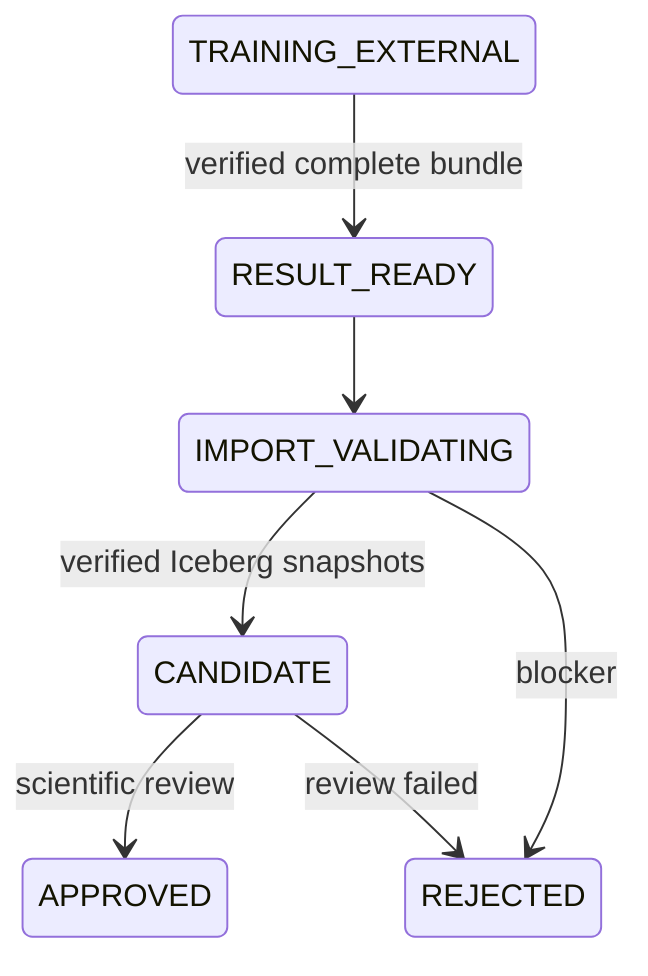

# MLI-01 — Result bundle contract v1

Owner Trang; reviewer unassigned. Canonical logical schema:
[ML_DATA_MODEL.md](./ML_DATA_MODEL.md). Machine-readable layout, field types,
nullability, grain, enums and lifecycle:
[`result-bundle-v1.json`](../../spark/src/main/resources/ml/result-bundle-v1.json).

## Layout and marker

    experiment-run-<experiment_run_id>/
      memberships.parquet
      sequence_summary.parquet
      experiment_metrics.json
      experiment_config.json
      requirements-lock.txt
      optional-model-artifacts/<safe-flat-file>
      _SUCCESS.json

`_SUCCESS` is written last. Required metadata: schema 1.0, dataset/run,
algorithm/algorithm_version/package_version/model_config_version/code_version,
membership and summary integer counts, COMPLETED, completed_at_utc, credential-free
s3/https artifact_uri and lowercase SHA-256 checksums of every artifact's bytes.
The marker does not hash itself. Config repeats dataset/run/algorithm and versions;
metrics repeats dataset/run and row counts. Additional scientific metrics are
nullable per logical model, with METRIC reason codes; no accuracy/F1 without truth.
Optional model files are inert bytes, never loaded/deserialized by this contract.
Filenames must be flat under optional-model-artifacts, no traversal or account paths.

`result_bundle_sha256` is SHA-256 of UTF-8 dataset/run/algorithm/model version and
the lexically sorted filename=byte-checksum map (Java TreeMap serialization in v1),
separated by newlines. Upload URI/completion time do not change artifact identity.
Version metadata must match checksummed config. The import registry must atomically
reserve run ID + fingerprint: same pair is retry, changed fingerprint is
IMP_EXPERIMENT_RUN_REUSED. Never replace rejected run artifacts in place.

## Parquet mapping / validator boundary

Required/optional primitives follow JSON field nullability. string/json_string:
UTF8 binary; integer: INT32; long: INT64; double: DOUBLE; boolean: BOOLEAN;
timestamp_utc: INT64 TIMESTAMP(MILLIS,true); array<string>: standard 3-level LIST.
All times use UTC. Null/missing/wrong type/NaN/Infinity are not substituted with 0.

`ResultBundleValidator` is the reader/import SPI. `ResultBundleContract` checks
decoded records, raw bytes, exact-schema evidence and immutable candidate lineage.
The caller must read these rows from those same bytes, verify physical schema, bound
file/row size, resolve exact EXPORTED dataset and expected run/config, reject symlinks
and atomically enforce registry uniqueness. `exactParquetSchemaVerified` is a trusted
reader assertion, never an external marker field. The Java test adapter reads real
Parquet with NIO and checks exact schemas. Production readers belong to MLI-03.

Membership keys are (run, mainshock, candidate), summary keys (run, mainshock).
Every expected candidate has a row including noise; summary covers every window.
Roles come from pinned candidate time/ID lineage supplied by the reader. WINDOW
keeps cluster/noise/probability null; DBSCAN probability null; HDBSCAN probability
finite [0,1]. Density label -1 means noise and no sequence membership. Mainshock
noise never chooses another cluster and records EXP_MAINSHOCK_CLASSIFIED_AS_NOISE.
Summary candidate/member/PRE/POST/noise/cluster counts and applicable probability
means reconcile with rows. Raw multi-window rows survive; UNIQUE has rank 1,
MULTIPLE ranks are unique with one winner, AMBIGUOUS ranks are null.

## Lifecycle

Validation receipt is only RESULT_READY. CANDIDATE additionally needs verified
positive membership/summary snapshots; the helper does not establish verification
by itself. APPROVED needs independent scientific review. APPROVED/REJECTED terminal.

## Fixtures and checks

[Fixtures](../../spark/src/test/resources/ml/results/README.md) are synthetic,
small, deterministic, not actual trained model output. Run with Java 17:

    & 'C:\Program Files\Git\bin\bash.exe' -lc './mvnw --batch-mode --no-transfer-progress -pl spark -am -Dtest=ResultBundleContractTest -Dsurefire.failIfNoSpecifiedTests=false test'

Tests cover persisted success/checksum/schema/duplicate/unknown-event Parquet
bundles, HDBSCAN/noise, probability/null/type/count/role/run reuse, unsafe URI,
and lifecycle gates. Full Spark unit suite also runs without network data.

## Giới hạn / downstream

- [EXP-01 — Tạo Colab harness và khóa môi trường thí nghiệm](../task/tasks/EXP-01.md):
  implement notebook and real model/package locks; fixtures prove contract only.
- [MLI-03 — Validate/import kết quả và commit bảng ML Iceberg](../task/tasks/MLI-03.md):
  production reader, durable registry, transaction/Trino gates and rejection reports.
- [SEC-01 — Review secret và bề mặt truy cập](../task/tasks/SEC-01.md):
  audit actual exported bundles/permissions when downstream exists.
No algorithm, DAG, Iceberg writes, real approval or Gold mutation in this task.
