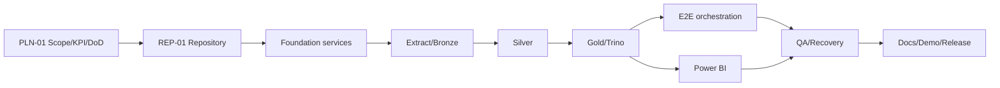

# Baseline phạm vi MVP, KPI và Definition of Done

| Thuộc tính | Giá trị |
|---|---|
| Task | `PLN-01` |
| Trạng thái tài liệu | Sẵn sàng để nhóm phê duyệt |
| Phạm vi | Phiên bản local-first trong kế hoạch 6 tuần |
| Nguồn backlog | `docs/task/JAPAN_EARTHQUAKE_ETL_TASKS.xlsx` |

## 1. Mục đích

Tài liệu này là baseline dùng để quyết định một yêu cầu thuộc MVP, Stretch hay ngoài phạm vi; thống nhất KPI phải kiểm chứng; xác định đường găng; và cung cấp Definition of Done chung cho các task.

Baseline không thay thế acceptance criteria riêng của từng task. Khi có khác biệt, task phải cập nhật tài liệu liên quan trong cùng pull request.

## 2. Kết quả MVP bắt buộc

Phiên bản đầu tiên hoàn thành khi nhóm chứng minh được một luồng dữ liệu local end-to-end:

```text
USGS → Airflow Extract → MinIO Bronze → Spark Java Silver
→ Spark Java/Iceberg Gold → Trino verification → Power BI Import
```

MVP phải đáp ứng đồng thời:

1. Chạy bằng Docker Compose trên một máy local theo cấu hình tài nguyên đã ghi nhận.
2. Thu thập một cửa sổ dữ liệu UTC từ USGS và lưu response nguyên bản cùng metadata/checksum ở Bronze.
3. Tạo Silver có schema logic được công bố, timestamp UTC/JST, validation, reject metrics và dedup theo `id`/`updated`.
4. Tạo Gold Iceberg có dataset sự kiện hiện hành và dữ liệu phục vụ KPI; chỉ công bố sau commit và Trino verification.
5. Có daily DAG theo đúng dependency Extract → Bronze → Silver → Gold → Verify, hỗ trợ retry và backfill có phạm vi.
6. Power BI import qua Trino/ODBC và có ba trang: Tổng quan, Không gian, Độ sâu và độ lớn.
7. Có bằng chứng rerun/idempotency, late update, backfill nhỏ, failure recovery và đối soát Trino–Power BI.
8. Có runbook, tài liệu kiến trúc, quality rules và kịch bản demo khớp hệ thống thực tế.

## 3. Phân loại phạm vi

### 3.1. Core

| Nhóm | Nội dung bắt buộc |
|---|---|
| Nguồn | USGS Earthquake Catalog API và fixture dự phòng có thể tái lập |
| Orchestration | Airflow daily run, retry có giới hạn, run context, backfill/reprocessing |
| Storage | MinIO cho Bronze, Silver và warehouse Gold; staging tạm tách khỏi dữ liệu bền vững |
| Compute | Spark Java cho parse, normalize, validation, dedup, bands, fact/current và aggregate cần thiết |
| Lakehouse | Apache Iceberg cho Gold, Catalog dùng chung giữa Spark và Trino |
| Serving | Trino SQL trên current Iceberg snapshot; Power BI Import qua ODBC |
| Quality | Blocker gates, count reconciliation, uniqueness, schema/BI contract và snapshot verification |
| Analytics | KPI thống nhất, ba trang dashboard, filter dùng chung, freshness/snapshot metadata |
| Operations | Secret hygiene, health checks, backup/restore smoke test, runbook và demo evidence |

### 3.2. Stretch

Chỉ bắt đầu khi dependency Core ổn định và task P0/P1 trên đường găng không bị trễ:

- `GLD-02`: ingest và chuẩn hóa boundary Nhật Bản.
- `GLD-03`: spatial enrichment chi tiết bằng GIS/Sedona và báo cáo match rate.
- Triển khai VPS, Prometheus/Grafana hoặc cải tiến hiệu năng vượt yêu cầu demo.

Nếu không làm spatial Stretch, MVP vẫn giữ tọa độ thật và phân loại khu vực theo contract tối thiểu `Unknown`/`Offshore`; không đặt tọa độ giả và không loại event hợp lệ.

### 3.3. Ngoài phạm vi phiên bản đầu tiên

- Dự đoán động đất, cảnh báo thiên tai thời gian thực hoặc tuyên bố quan hệ nhân quả.
- Streaming/near-real-time, high availability, multi-node production và autoscaling.
- Ứng dụng web/mobile, tài khoản người dùng hoặc phân quyền ứng dụng.
- Data Science, Generative AI và bản đồ rủi ro dân cư khi chưa có dữ liệu phơi nhiễm.
- Database serving riêng, bản sao Gold trong PostgreSQL, DDL/migration vật lý chi tiết.
- Xóa/rebuild toàn bộ data lake như cơ chế retry hoặc backfill mặc định.

## 4. KPI baseline

Các định nghĩa dưới đây trở thành baseline chính thức sau khi ba thành viên xác nhận tại mục 9.

### 4.1. KPI dashboard

Mọi KPI dùng cùng filter context và mỗi `earthquake_id` chỉ được đếm một lần.

| KPI | Định nghĩa | Quy tắc hiển thị/kiểm chứng |
|---|---|---|
| Total Earthquakes | `DISTINCTCOUNT(earthquake_id)` | Số nguyên; đối chiếu `COUNT(DISTINCT ...)` ở Trino |
| Average Magnitude | Trung bình `magnitude` khác null | 2 chữ số thập phân; null không đổi thành 0 |
| Maximum Magnitude | Giá trị lớn nhất của `magnitude` khác null | 1–2 chữ số thập phân |
| Average Depth | Trung bình `depth_km` hợp lệ | 2 chữ số thập phân, đơn vị km |
| Strong Earthquakes | Số event có `magnitude >= strong_threshold` | Ngưỡng là tham số; baseline đề xuất mặc định `5.0`, không phải phân loại cảnh báo |
| Tsunami Flagged | Số event có `tsunami_flag = true` | Số nguyên |
| Alerted Events | Số event có `alert_level` khác null/none | Số nguyên |
| Offshore/Unknown Rate | Event `Offshore` hoặc `Unknown` chia Total Earthquakes | Phần trăm; mẫu số là total trong cùng filter |
| Latest Event Time | `MAX(event_time_jst)` trong filter | Hiển thị rõ `JST`; UTC được giữ để đối soát |
| Data Freshness | Thời gian từ event/snapshot mới nhất đến thời điểm Power BI refresh | Hiển thị timestamp refresh và snapshot ID; không ghi real-time |

### 4.2. KPI nghiệm thu hệ thống

| KPI | Điều kiện đạt | Evidence tối thiểu |
|---|---|---|
| End-to-end success | Một daily interval hoàn tất đến trạng thái `Published` | Airflow run ID, Bronze URI, Silver summary, snapshot ID và Trino verify |
| Idempotency | Chạy cùng fixture/input hai lần cho cùng tập khóa và KPI | So sánh distinct IDs, counts và KPI giữa hai run |
| Latest update wins | Cùng `id` giữ record có `updated` mới nhất với tie-break xác định | Fixture late update và assertion |
| Count reconciliation | Mọi chênh lệch source → parsed → valid/rejected → dedup → output giải thích được | Run summary có count theo reason |
| Gold integrity | Fact/current không trùng ID; aggregate khớp fact với cùng filter | Verification SQL và snapshot ID |
| BI consistency | Total, average/max, tsunami, region và date filter khớp Trino | Reconciliation checklist |
| Recovery | Retry/reprocessing chạy lại đúng tầng và BI không refresh trước `Published` | Evidence cho extract, Silver, Gold và verify failure |
| Local reproducibility | Thành viên mới làm theo runbook có thể khởi động và chạy smoke flow | Command log/checklist không dùng placeholder |

Không đặt tỷ lệ daily success, duration, freshness hoặc volume warning bằng số tùy ý trước khi có baseline thực nghiệm. `QA-05` và các run đại diện chịu trách nhiệm chốt ngưỡng vận hành.

## 5. Đường găng và điều kiện bắt đầu

Đường găng logic:



Quy tắc:

- P0 được ưu tiên trước P1; P2/Stretch không chiếm tài nguyên của đường găng.
- Không bắt đầu task nếu dependency trong workbook chưa đạt, trừ fixture/test plan được backlog cho phép.
- Mỗi task phải truyền deliverable/contract đã kiểm chứng cho downstream; không chỉ dựa vào mô tả miệng.
- Một failure ở quality gate chặn downstream và Power BI refresh.

## 6. Quyết định được giao cho task downstream

Các mục dưới đây không làm thay đổi phạm vi MVP. Owner task phải chốt trước khi consumer phụ thuộc bắt đầu:

| Quyết định | Owner task | Consumer chính |
|---|---|---|
| Cấu trúc module, wrapper và mount path | `REP-01` | Toàn bộ task code/platform |
| Ma trận phiên bản Spark–Iceberg–Trino và Catalog | `SPK-01`, `QRY-01` | Gold/serving |
| Bounding box/radius, overlap mặc định và source fixture | `EXT-01` | Extract/Silver |
| Chính sách magnitude null, depth đặc biệt, schema version và reject reason | `SLV-01` | Silver/Gold |
| Gold logical contract, band boundaries và aggregate grain | `GLD-01`, `GLD-04` | Trino/Power BI |
| Driver ODBC, DSN và timeout | `ORC-05` | Power BI |
| Schedule cuối, max active runs và resource profile | `ORC-04`, `QA-05` | Vận hành/demo |

Mỗi owner phải cập nhật docs/contract và test tương ứng. Không hard-code giá trị chưa được owner task chốt.

## 7. Definition of Done cho task

Một task chỉ đủ điều kiện chuyển sang `Done` khi tất cả mục áp dụng đều đạt:

- [ ] Dependency đã đạt hoặc ngoại lệ chuẩn bị fixture/test plan được ghi rõ.
- [ ] Deliverable tồn tại trong repository hoặc môi trường demo và truy vết được bằng Task ID.
- [ ] Mọi acceptance criteria của dòng task đã được kiểm tra.
- [ ] Test tự động liên quan đạt; nếu chưa thể tự động hóa, có evidence thủ công lặp lại được.
- [ ] Case lỗi, retry/rerun, idempotency và data-safety đã được xem xét khi thay đổi có liên quan.
- [ ] Không có secret, dữ liệu nhạy cảm, build artifact hoặc local runtime file không cần thiết.
- [ ] Docs/contract/config được cập nhật trong cùng thay đổi nếu hành vi thay đổi.
- [ ] `git diff` chỉ chứa thay đổi trong phạm vi task và không có whitespace error.
- [ ] Evidence/PR ghi run ID, query, log, ảnh hoặc commit phù hợp với loại task.
- [ ] Task P0/P1 có reviewer khác assignee xác nhận.

## 8. Definition of Done cho MVP

MVP chỉ hoàn tất khi:

- [ ] Tất cả task Core bắt buộc trên đường găng đã `Done`; task Stretch còn lại được ghi `Deferred` hoặc giữ ngoài release.
- [ ] Daily happy path chạy end-to-end và có evidence xuyên suốt một `run_id`.
- [ ] Rerun, duplicate, late update, backfill nhỏ và failure recovery đạt.
- [ ] Gold current snapshot đọc được qua Trino và mọi blocker quality gate đạt.
- [ ] Ba trang Power BI refresh được; KPI khớp SQL với cùng filter.
- [ ] Security/secret review và backup/restore smoke test đạt.
- [ ] Runbook không còn placeholder cho lệnh/service/port của phiên bản demo.
- [ ] Demo 15–20 phút có fallback và mọi con số trình bày có evidence.
- [ ] Release candidate gắn với commit/tag, config version và snapshot ID đã ghi nhận.

## 9. Phê duyệt PLN-01

Task `PLN-01` chỉ chuyển `Done` sau khi ba thành viên xác nhận baseline này và không còn blocker phạm vi trên đường găng.

| Thành viên | Ngày xác nhận | Kết quả |
|---|---|---|
| Trần Minh Hoài Tâm | Chưa xác nhận | Pending |
| Nguyễn Thanh Trí | Chưa xác nhận | Pending |
| Lê Thị Thuỳ Trang | Chưa xác nhận | Pending |

Nếu nhóm thay đổi Core/Stretch, KPI hoặc DoD sau phê duyệt, pull request phải nêu tác động tới dependency, effort, backfill/rebuild và tài liệu liên quan.
