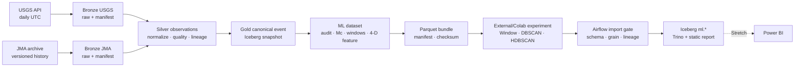
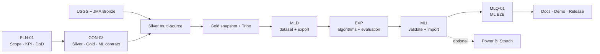

# Baseline phạm vi MVP, KPI và Definition of Done

| Thuộc tính | Giá trị |
|---|---|
| Task | `PLN-01` |
| Trạng thái tài liệu | Baseline HDBSCAN hiện hành |
| Kế hoạch | 8 tuần, 3 thành viên, 364 giờ task; 12 giờ data-readiness trước tuần 3 và 352 giờ trong capacity tham khảo 360 giờ |
| Nguồn backlog | [`docs/task/tasks/README.md`](../task/tasks/README.md) và file riêng của từng task |
| Roadmap kỹ thuật | [Roadmap HDBSCAN từ Gold đến ML Iceberg](../task/HDBSCAN_WORKSTREAM.md) |

## 1. Mục đích và thứ tự ưu tiên

Tài liệu này là baseline chính thức để quyết định một yêu cầu thuộc Core,
Stretch hay ngoài phạm vi; thống nhất KPI nghiệm thu; xác định đường găng; và
cung cấp Definition of Done dùng chung cho dự án.

Baseline không thay acceptance criteria riêng của từng task. Baseline này quyết
định ranh giới Core/Stretch, KPI và DoD cấp MVP; file task quyết định deliverable
cụ thể; contract của owner task quyết định schema/interface. Tài liệu mô tả tổng
quan không được ghi đè ba nguồn đó. Mọi thay đổi Core/Stretch, KPI hoặc DoD phải
cập nhật các tài liệu bị tác động trong cùng pull request.

Baseline tại PR #3 là mốc lịch sử và đã bị phiên bản này thay thế. Quy trình
Window/DBSCAN/HDBSCAN hiện thuộc Core; Power BI là Stretch và không chặn MVP.

## 2. Kết quả MVP bắt buộc

Phiên bản đầu tiên hoàn thành khi nhóm chứng minh được luồng local-first sau:

```mermaid
flowchart LR
    USGS["USGS API<br/>daily UTC"] --> BUSGS["Bronze USGS<br/>raw + manifest"]
    JMA["JMA archive<br/>versioned history"] --> BJMA["Bronze JMA<br/>raw + manifest"]
    BUSGS --> SILVER["Silver observations<br/>normalize · quality · lineage"]
    BJMA --> SILVER
    SILVER --> GOLD["Gold canonical event<br/>Iceberg snapshot"]
    GOLD --> DATASET["ML dataset<br/>audit · Mc · windows · 4-D feature"]
    DATASET --> BUNDLE["Parquet bundle<br/>manifest · checksum"]
    BUNDLE --> EXP["External/Colab experiment<br/>Window · DBSCAN · HDBSCAN"]
    EXP --> IMPORT["Airflow import gate<br/>schema · grain · lineage"]
    IMPORT --> ML["Iceberg ml.*<br/>Trino + static report"]
    ML -. "Stretch" .-> BI["Power BI"]
```

MVP phải đáp ứng đồng thời:

1. Chạy các service nền bằng Docker Compose trên một máy local theo cấu hình tài nguyên đã ghi nhận.
2. Thu thập USGS theo cửa sổ UTC và JMA theo archive/release; lưu payload nguyên bản cùng manifest/checksum ở Bronze.
3. Tạo Silver chung cho hai nguồn với timestamp UTC/JST, lineage, validation, reject metrics, revision/dedup và source linking để không double count.
4. Publish Gold Iceberg canonical chỉ sau quality gate; pin được snapshot và kiểm chứng độc lập qua Trino.
5. Điều phối source → Bronze → Silver → Gold bằng Airflow, có retry, backfill/reprocessing theo phạm vi và run summary.
6. Từ một Gold snapshot cố định, tạo dataset có version gồm audit, `Mc`, mainshock, candidate windows và feature không-thời gian 4-D.
7. Chạy Window, DBSCAN, HDBSCAN global và HDBSCAN adaptive trên cùng `dataset_id`, theo từng mainshock window.
8. Đánh giá chất lượng clustering, tính nhất quán vật lý, độ ổn định và out-of-period; không dùng accuracy/F1 như ground truth tuyệt đối khi chưa có nhãn chuẩn.
9. Validate result bundle trước khi import vào Iceberg `ml.*`; tạo Trino verification và static report truy vết được dataset/experiment.
10. Có evidence rerun/idempotency, late revision, historical backfill, failure recovery, secret review, runbook và demo khớp hệ thống thực tế.

## 3. Ranh giới dữ liệu nghiên cứu

| Hạng mục | Baseline |
|---|---|
| Reproduction period | `2000-01-01T00:00:00Z <= event_time < 2018-10-01T00:00:00Z` |
| Extension period | `2018-10-01T00:00:00Z <= event_time < 2024-01-01T00:00:00Z` |
| Catalog nghiên cứu | Natural events trong study area, catalog era `UNIFIED`, primary JMA, đủ latitude/longitude/depth/magnitude |
| Mainshock | Depth `50–200 km` (bao gồm hai biên), magnitude `> 5.5` |
| Magnitude completeness | `Mc` phải được estimate, lưu method/version và có evidence; không hard-code không giải thích |
| Candidate grain | `(dataset_id, mainshock_event_id, candidate_event_id)` |
| Feature baseline | `[x_scaled, y_scaled, z_scaled, time_scaled]`, chuyển tọa độ sang km trước khi scale |
| Đơn vị fit | Từng mainshock window; không fit HDBSCAN một lần trên toàn catalog |
| Diễn giải | Sequence/aftershock candidate theo mô hình thống kê hồi cứu, không phải dự đoán hay chứng minh quan hệ nhân quả |

Mọi dataset phải pin `gold_snapshot_id` và có `dataset_id` bất biến. Mọi kết
quả phải có `experiment_run_id`, thuật toán/config version, code/notebook/package
version và checksum. Colab không nhận credential MinIO/pipeline, không ghi trực
tiếp Gold hoặc `ml.*`; dữ liệu ra/vào được trao đổi bằng bundle độc lập. Airflow
build dataset kết thúc ở bundle sẵn sàng và chỉ import sau completion manifest;
không giả định free Colab là một job service ổn định có thể trigger tự động.

Các bảng Core trong namespace `ml` gồm `ml.dataset_manifest`,
`ml.mainshock_candidate_snapshot`, `ml.sequence_candidate_snapshot`,
`ml.experiment_run`, `ml.sequence_membership` và `ml.sequence_summary`. Grain,
key và lifecycle chi tiết do `CON-03` khóa trước khi implementation ghi Iceberg.

## 4. Phân loại phạm vi

### 4.1. Core

| Nhóm | Nội dung bắt buộc |
|---|---|
| Nguồn | USGS cho daily update, JMA cho lịch sử có version và fixture có thể tái lập |
| Data engineering | Bronze raw/manifest, Silver đa nguồn, Gold canonical Iceberg, Trino verification |
| Orchestration | Airflow schedule, retry, backfill/reprocessing, recovery boundary và run summary |
| ML dataset | Pin Gold snapshot, dataset manifest, audit/`Mc`, mainshock/window, feature 4-D, Parquet/checksum bundle |
| Experiment | Window, DBSCAN, HDBSCAN global/adaptive dùng cùng dataset và package/config có version |
| Scientific evaluation | DBCV/noise/membership, Modified Omori consistency, sensitivity/stability, out-of-period và failure/resource reporting |
| ML integration | Result bundle contract, build/import DAG, validation gate, Iceberg `ml.*`, Trino/static report |
| Quality & release | ETL/ML E2E, idempotency/revision/recovery, security, docs, demo và release evidence |

### 4.2. Stretch

Chỉ bắt đầu khi dependency Core ổn định và đường găng P0/P1 không bị trễ:

- `GLD-02`: aggregate tối ưu riêng cho dashboard.
- `BI-01..05`: kết nối, semantic model, dashboard, refresh và reconciliation Power BI.
- `QA-05`: profile toàn bộ lịch sử và tối ưu tài nguyên local.
- `OPS-01`: smoke test backup/restore metadata.
- Shallow control group, OPTICS, GIS/Sedona nâng cao, quan sát bằng Prometheus/Grafana hoặc tối ưu vượt yêu cầu demo.

Nếu không làm Power BI, MVP vẫn phải có Trino verification và static report.
Nếu không làm spatial Stretch, hệ thống giữ tọa độ thật và dùng giá trị
`Unknown`/`Offshore` theo contract; không đặt tọa độ giả hoặc loại event hợp lệ.

### 4.3. Ngoài phạm vi phiên bản đầu tiên

- Dự đoán động đất, cảnh báo thiên tai thời gian thực hoặc tuyên bố quan hệ nhân quả.
- Streaming/near-real-time, high availability, multi-node production và autoscaling.
- Ứng dụng web/mobile, tài khoản người dùng hoặc phân quyền ứng dụng.
- Generative AI, bản đồ rủi ro dân cư khi chưa có dữ liệu phơi nhiễm.
- Database serving riêng hoặc bản sao dữ liệu nghiệp vụ trong PostgreSQL; PostgreSQL Compose chỉ lưu metadata Airflow.
- Để notebook ghi trực tiếp Gold/ML hoặc cấp credential MinIO/pipeline cho Colab.
- Xóa/rebuild toàn bộ data lake làm cơ chế retry/backfill mặc định.

## 5. KPI baseline

Các KPI dưới đây là điều kiện kiểm chứng, không phải ngưỡng khoa học được bịa
trước khi có dữ liệu. Owner task phải ghi lại phương pháp, input, version và
evidence. Các ngưỡng vận hành mới chỉ được khóa sau run đại diện.

### 5.1. KPI dữ liệu và vận hành

| KPI | Điều kiện đạt | Evidence tối thiểu |
|---|---|---|
| End-to-end ETL | Một daily interval đạt `Published` đến Gold | Airflow run ID, Bronze URI, Silver summary, Gold snapshot ID và Trino verify |
| Idempotency | Chạy lại cùng input không sinh thêm logical record hoặc đổi kết quả ngoài policy revision | So sánh keys, counts và snapshot/query trước–sau |
| Latest revision wins | Observation có revision mới được chọn bằng tie-break xác định, raw history vẫn còn | Fixture late revision và assertion |
| Count reconciliation | Source → parsed → valid/rejected → dedup/link → Gold đều giải thích được | Run summary theo source và reason code |
| Gold integrity | Canonical current không trùng key, field bắt buộc hợp lệ và snapshot chỉ Published sau verify | Verification SQL gắn snapshot ID |
| Recovery | Retry/reprocess đúng tầng, không xóa dữ liệu và không publish output dở | Evidence lỗi có kiểm soát và run phục hồi |
| Local reproducibility | Thành viên mới có thể làm theo runbook để khởi động và chạy smoke flow | Command log/checklist không còn placeholder |

### 5.2. KPI ML dataset và artifact

| KPI | Điều kiện đạt | Evidence tối thiểu |
|---|---|---|
| Dataset identity | Mỗi dataset pin Gold snapshot, filter/time split và các version xử lý | `ml.dataset_manifest` hoặc fixture tương đương |
| Candidate integrity | Grain duy nhất; mainshock có offset thời gian 0; event ngoài window bị loại có reason | Quality report theo `dataset_id` |
| Feature validity | Tọa độ đã đổi sang km, feature hữu hạn, scaling có version và resource guard | Feature summary + test biên/null/non-finite |
| Bundle integrity | Manifest, Parquet, checksums và counts khớp; consumer reject file bị sửa | Bundle validator log |
| Fair comparison | Bốn thuật toán đọc cùng `dataset_id` và cùng candidate population | Experiment config + input checksum |
| Result integrity | Membership/summary/metrics đúng schema, grain, lineage và hoàn tất bằng `_SUCCESS.json` | Result validation report |
| Import safety | Sai checksum/schema/grain/lineage bị reject trước Iceberg commit | Import gate tests + accepted/rejected evidence |

### 5.3. KPI đánh giá nghiên cứu

| Nhóm | Điều kiện báo cáo |
|---|---|
| Cluster quality | DBCV khi khả dụng, noise rate, số/kích thước cluster và membership probability distribution |
| Physical consistency | Decay theo Modified Omori hoặc kiểm tra tương đương được mô tả; nêu rõ giả định và trường hợp không fit được |
| Stability/sensitivity | Báo mức thay đổi theo parameter/seed/sample; dùng Jaccard/ARI khi phù hợp và không che failure window |
| Out-of-period | Áp dụng rule/config đã khóa từ reproduction sang extension `2018-10-01..2023-12-31` và báo drift/failure |
| Resource | Runtime, memory, số candidate/mainshock và cửa sổ bị skip/fail được ghi nhận |
| Interpretation | Dùng thuật ngữ candidate; không đổi metric unsupervised thành accuracy/F1 nếu không có nhãn chuẩn độc lập |

### 5.4. KPI trình bày

- Static report Core phải đối soát được với Trino trên cùng `dataset_id` và `experiment_run_id`.
- Nếu Power BI Stretch được thực hiện, total/average/max/source/date filters phải khớp truy vấn Trino với cùng filter context và snapshot.
- Mọi báo cáo hiển thị data snapshot, dataset/config version, thời điểm tạo và limitation không prediction/causal.

## 6. Đường găng và điều kiện bắt đầu

```mermaid
flowchart LR
    PLN["PLN-01<br/>Scope · KPI · DoD"] --> CON["CON-03<br/>Silver · Gold · ML contract"]
    SRC["USGS + JMA Bronze"] --> SLV["Silver multi-source"]
    CON --> SLV
    SLV --> GLD["Gold snapshot + Trino"]
    GLD --> MLD["MLD<br/>dataset + export"]
    MLD --> EXP["EXP<br/>algorithms + evaluation"]
    EXP --> MLI["MLI<br/>validate + import"]
    MLI --> MLQ["MLQ-01<br/>ML E2E"]
    MLQ --> REL["Docs · Demo · Release"]
    MLI -. "optional" .-> BI["Power BI Stretch"]
```

Các contract/fixture cho `EXP-01` và `MLI-01` có thể làm song song trước khi
Gold thật sẵn sàng. Chỉ integration gate mới chờ output thật. P0 được ưu tiên
trước P1; Stretch không chiếm tài nguyên của đường găng Core. Failure tại một
quality gate phải chặn publish/import downstream.

## 7. Quyết định được giao cho task downstream

| Quyết định | Owner task | Consumer chính |
|---|---|---|
| Cấu trúc module, wrapper và mount path | `REP-01` | Toàn bộ code/platform |
| Phiên bản Spark–Iceberg–Trino và Catalog | `SPK-01`, `QRY-01` | Gold/ML serving |
| Phạm vi nguồn, overlap và source priority | `CON-01` | USGS/JMA/Silver/Gold |
| Bronze layout, manifest và checksum | `CON-02` | USGS/JMA/Silver |
| Silver/Gold/ML grain, null, lineage và lifecycle | `CON-03` | Parser/Gold/ML |
| Fixture và test matrix dùng chung | `CON-04` | Parser/quality/Gold/ML |
| Request UTC, overlap và runtime USGS | `USG-01` | USGS ingest/backfill |
| JMA inventory, release và format metadata | `JMA-01` | JMA ingest/parser |
| Validation, revision và canonical link | `SLV-05..07` | Gold/QA/ML |
| Gold event model và snapshot publish | `GLD-01`, `GLD-03`, `GLD-04` | ML dataset/Trino |
| Dataset identity, time split và Gold snapshot | `MLD-01` | MLD/EXP/MLI |
| `Mc`, mainshock/window và feature/scaling version | `MLD-02..04` | Export/experiment |
| Export bundle contract | `MLD-05` | Colab experiment |
| Algorithm/config và evaluation policy | `EXP-02..05` | Scientific report |
| Result bundle và experiment lifecycle | `MLI-01` | Import/report |
| Build/import/publish gates | `MLI-02..04` | ML E2E/consumer |
| Schedule, concurrency và resources | `ORC-02`, `ORC-05`, `QA-05` | Vận hành/demo |

Owner phải cập nhật docs/contract và test tương ứng. Consumer không được
hard-code giá trị chưa được owner chốt hoặc lặp lại logic trong notebook/BI.

## 8. Definition of Done cho task

Một task chỉ đủ điều kiện chuyển sang `Done` khi tất cả mục áp dụng đều đạt:

- [ ] Hard dependency đã đạt; ngoại lệ phát triển bằng fixture/mock được ghi rõ.
- [ ] Deliverable tồn tại trong repository hoặc môi trường demo và truy vết được bằng Task ID.
- [ ] Acceptance criteria trong file task đã được kiểm tra.
- [ ] Test/check liên quan đạt; kiểm tra thủ công phải lặp lại được và có evidence.
- [ ] Case lỗi, retry/rerun, idempotency và data safety đã được xem xét khi liên quan.
- [ ] Không có secret, dữ liệu nhạy cảm, data dump lớn, build artifact hoặc local runtime file không cần thiết.
- [ ] Docs/contract/config được cập nhật cùng thay đổi hành vi/schema.
- [ ] `git diff` chỉ chứa thay đổi đúng phạm vi và `git diff --check` đạt.
- [ ] Evidence ghi command/query/log/report/commit phù hợp với loại task.
- [ ] Reviewer khác assignee được khuyến nghị cho P0/P1 nhưng chưa có reviewer không chặn `Done`.

## 9. Definition of Done cho MVP

MVP chỉ hoàn tất khi:

- [ ] Tất cả task Core trên đường găng đạt `Done`; Stretch còn lại được ghi rõ là deferred/ngoài release.
- [ ] Daily USGS và historical JMA đi qua Bronze → Silver → Gold với evidence xuyên suốt run/source version.
- [ ] Rerun, duplicate, late revision, backfill có phạm vi và failure recovery đạt.
- [ ] Gold canonical snapshot đọc được qua Trino và mọi blocker quality gate đạt.
- [ ] Một `dataset_id` pin snapshot đi qua audit/`Mc`/window/feature/export bằng bundle hợp lệ.
- [ ] Window, DBSCAN, HDBSCAN global/adaptive chạy trên cùng dataset; evaluation và limitation được báo cáo.
- [ ] Result bundle hợp lệ được import vào `ml.*`; bundle sai bị reject trước commit.
- [ ] Trino verification và static report khớp `dataset_id`/`experiment_run_id`; Power BI không phải điều kiện chặn.
- [ ] Security/secret review đạt; runbook không còn placeholder cho phiên bản demo.
- [ ] Demo có fixture/bundle fallback và mọi số liệu trình bày truy vết được về snapshot/config/evidence.
- [ ] Release candidate gắn commit/tag, config version, Gold snapshot, dataset và experiment run đã ghi nhận.

## 10. Quản lý thay đổi PLN-01

- [PR #3](https://github.com/HoaiTam/japan-earthquake-etl/pull/3) chỉ còn là evidence của baseline cũ.
- Bản cập nhật HDBSCAN được thực hiện trong task `PLN-01` trên branch `docs/pln-01-hdbscan-scope-update`.
- Team review qua pull request được khuyến nghị. Không ghi nhận tên người xác nhận mới nếu chưa có review/evidence thực tế.
- Pull request đổi Core/Stretch, KPI hoặc DoD phải nêu tác động tới dependency, effort, backfill/rebuild, security và tài liệu downstream.
