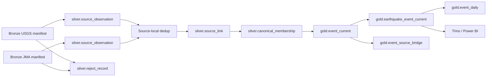

# Logical data model: Silver và Gold

Tài liệu này là hợp đồng tên trường, kiểu dữ liệu, null policy, lineage,
canonical event và KPI dùng chung cho parser USGS/JMA, quality rules, Spark,
Iceberg, Trino và Power BI. Đây là logical model; catalog/schema/table DDL vật
lý, partition transform và merge implementation thuộc các task triển khai sau.

Phạm vi nguồn, timezone và source priority kế thừa từ [source coverage
contract](./SOURCE_COVERAGE.md). Bronze lineage kế thừa từ [Bronze storage
contract](./BRONZE_STORAGE_CONTRACT.md).

## 1. Quyết định tóm tắt

| Nội dung | Quyết định |
|---|---|
| Grain Silver observation | Một dòng cho một revision của một source record |
| Grain Silver reject | Một dòng cho một raw record bị reject |
| Source dedup | Thực hiện riêng trong từng nguồn trước source linking |
| Grain source link | Một dòng cho một cặp candidate observation và quyết định match |
| Grain canonical membership | Một current observation thuộc đúng một canonical event |
| Grain Gold current | Một dòng cho một `canonical_event_id` hiện hành |
| Gold serving | Iceberg current snapshot, Trino view ổn định cho Power BI Import |
| Time chuẩn | `event_time_utc`; JST là giá trị dẫn xuất bằng `Asia/Tokyo` |
| Null số | Giữ `null`; không đổi magnitude/depth thiếu thành `0` |
| Khu vực thiếu | Gold dùng dimension member `UNKNOWN`; ngoài khơi dùng `OFFSHORE` |
| ID canonical | ID opaque, ổn định; không tạo trực tiếp từ time/toạ độ |
| KPI count | Mỗi `canonical_event_id` tự nhiên trong ROI được đếm một lần |

## 2. Luồng dataset logic



Các dataset logic ổn định:

| Dataset | Grain | Consumer chính |
|---|---|---|
| `silver.source_observation` | Một source record revision đã parse | Quality, dedup, linking |
| `silver.reject_record` | Một raw record bị reject | Quality report, audit |
| `silver.source_link` | Một candidate pair và match decision | Canonicalization, QA |
| `silver.canonical_membership` | Một current observation → một canonical event | Gold build |
| `gold.event_current` | Một canonical event hiện hành, mọi event type | Audit, serving views |
| `gold.earthquake_event_current` | Một natural earthquake trong ROI | Trino, Power BI, KPI |
| `gold.event_source_bridge` | Một canonical event → một source observation | Drill-through, provenance |
| `gold.event_daily` | Một ngày và tổ hợp dimension | Dashboard aggregate |
| `gold.publication_status` | Một Gold snapshot đã publish | Freshness, vận hành |

## 3. Kiểu dữ liệu logic

| Logical type | Spark/Parquet | Iceberg/Trino | Power BI |
|---|---|---|---|
| `string` | `StringType` | `VARCHAR` | Text |
| `boolean` | `BooleanType` | `BOOLEAN` | True/False |
| `integer` | `IntegerType` | `INTEGER` | Whole number |
| `long` | `LongType` | `BIGINT` | Whole number |
| `double` | `DoubleType` | `DOUBLE` | Decimal number |
| `date` | `DateType` | `DATE` | Date |
| `timestamp_utc` | `TimestampType`, Spark session UTC | `TIMESTAMP`, semantics UTC | Date/Time có nhãn UTC |
| `timestamp_local` | `TimestampType`, giá trị local dẫn xuất | `TIMESTAMP` | Date/Time có nhãn JST |
| `array<string>` | `ArrayType(StringType)` | `ARRAY(VARCHAR)` | Flatten/bridge trước khi import |

Quy ước bắt buộc:

- Spark session timezone là `UTC` khi parse/write.
- Tên trường timestamp phải có hậu tố `_utc` hoặc `_jst`; không dùng tên mơ
  hồ như `time`/`updated`.
- `event_time_jst` được dẫn xuất từ `event_time_utc` bằng `Asia/Tokyo`, không
  parse lại chuỗi nguồn và không dùng timezone host.
- `double` phải hữu hạn; `NaN`/`Infinity` bị reject như sai kiểu.
- Chuỗi được trim; chuỗi rỗng chuyển thành `null`, trừ code dimension đã định
  nghĩa rõ như `UNKNOWN`.

## 4. Silver `source_observation`

### 4.1. Identity và revision

| Field | Type | Null | Quy tắc |
|---|---|---:|---|
| `schema_version` | string | Không | `1.0` cho contract hiện tại |
| `source_observation_id` | string | Không | ID duy nhất cho một revision; `obs_` + SHA-256 của source/revision identity |
| `source_system` | string | Không | `USGS` hoặc `JMA_BULLETIN` |
| `source_record_key` | string | Không | Khóa ổn định trong phạm vi nguồn; không phải canonical ID |
| `source_revision_key` | string | Không | Phân biệt các revision của cùng source record |
| `source_updated_at_utc` | timestamp_utc | Có | Bắt buộc với USGS; JMA có thể null vì archive không có update time từng record |
| `catalog_release` | string | Có | Bắt buộc với JMA; USGS là null |
| `catalog_release_at_utc` | timestamp_utc | Có | Thời điểm release/update JMA nếu biết |
| `is_current_source_revision` | boolean | Không | Chỉ được gán sau source-local dedup |

`source_observation_id` được tạo theo công thức logic:

```text
obs_ + sha256(source_system | source_record_key | source_revision_key)
```

`source_revision_key` phải thay đổi khi source record thay đổi:

- USGS: `properties.updated` kết hợp raw record hash để có tie-break.
- JMA: `catalog_release` kết hợp raw record hash.

`source_record_key` của USGS là event `id`. JMA không có một universal event ID
ổn định giống USGS; `SLV-04` phải version hóa thuật toán tạo key từ identity
fields chính thức của record và chứng minh key ổn định khi rerun cùng input.
Không được dùng key JMA làm canonical ID xuyên nguồn.

### 4.2. Thuộc tính sự kiện chuẩn hóa

| Field | Type | Null | Quy tắc |
|---|---|---:|---|
| `event_time_utc` | timestamp_utc | Không | Origin time chuẩn để partition/filter |
| `event_time_jst` | timestamp_local | Không | Dẫn xuất `Asia/Tokyo` từ UTC |
| `event_date_utc` | date | Không | Date của `event_time_utc` |
| `event_date_jst` | date | Không | Date của `event_time_jst` |
| `event_year_utc` | integer | Không | Dẫn xuất từ UTC; field partition Silver |
| `event_month_utc` | integer | Không | `1..12`; field partition Silver |
| `latitude` | double | Không | `[-90, 90]`; không đặt tọa độ giả |
| `longitude` | double | Không | `[-180, 180]`; không đặt tọa độ giả |
| `depth_km` | double | Có | Giữ giá trị nguồn; negative được flag, không tự ép về `0` |
| `magnitude` | double | Có | Missing giữ null |
| `magnitude_type` | string | Có | Ví dụ `mw`, `mb`, code JMA; giữ provenance |
| `event_type_code` | string | Không | `EARTHQUAKE`, `ARTIFICIAL`, `ERUPTION`, `OTHER`, `UNKNOWN` |
| `place_name` | string | Có | Mô tả vị trí của nguồn, chưa phải region dimension |
| `tsunami_flag` | boolean | Có | `null` nghĩa là nguồn không cung cấp/không biết |
| `alert_level` | string | Có | Giá trị chuẩn hóa lowercase; thường chỉ USGS có |
| `significance` | integer | Có | USGS `sig` nếu có |
| `max_intensity_code` | string | Có | Mã intensity JMA nếu record có |
| `determining_agency_code` | string | Có | JMA agency (`J`, `U`, `I`, ...); USGS null |
| `catalog_era` | string | Có | JMA `LEGACY`/`UNIFIED`; USGS null |
| `source_status` | string | Có | Status nguồn như USGS reviewed/automatic |
| `source_url` | string | Có | URL công khai an toàn; không chứa token |
| `is_in_study_area` | boolean | Không | Theo envelope `CON-01`; không dùng polygon đất liền |

Một observation hợp lệ bắt buộc có source identity, lineage, event time và tọa
độ parse được. Magnitude/depth/region/source-specific fields có thể null và
không làm observation bị reject chỉ vì thiếu.

### 4.3. Quality và lineage

| Field | Type | Null | Quy tắc |
|---|---|---:|---|
| `quality_status` | string | Không | `VALID` hoặc `WARNING` trong observation output |
| `quality_flags` | array<string> | Không | Empty array khi không có warning |
| `bronze_manifest_id` | string | Không | Manifest `BronzeReady` đã resolve |
| `raw_object_uri` | string | Không | URI raw object trong Bronze |
| `raw_sha256` | string | Không | SHA-256 từ manifest |
| `raw_record_locator` | string | Không | USGS feature index/id hoặc JMA line number |
| `raw_record_hash` | string | Không | Hash bytes/record text trước normalize |
| `ingest_run_id` | string | Không | Run đã tạo Bronze input |
| `parser_name` | string | Không | `usgs-geojson` hoặc `jma-hypocenter-fixed-width` |
| `parser_version` | string | Không | Version code/mapping có thể audit |
| `processed_at_utc` | timestamp_utc | Không | Thời điểm parser tạo observation |

Partition logic của Silver là
`event_year_utc/event_month_utc/source_system`. Partition dựa trên event time,
không dựa trên ingest date. Physical object layout và publish marker thuộc
`SLV-08`.

## 5. Silver `reject_record`

Reject dataset không thay thế raw Bronze. Nó lưu lý do và locator để đối soát:

| Field | Type | Null | Quy tắc |
|---|---|---:|---|
| `schema_version` | string | Không | Cùng major version với observation |
| `source_system` | string | Không | `USGS`/`JMA_BULLETIN` |
| `source_record_key_candidate` | string | Có | Khóa parse được trước khi reject |
| `bronze_manifest_id` | string | Không | Truy vết về manifest |
| `raw_object_uri` | string | Không | Truy vết về raw payload/archive |
| `raw_sha256` | string | Không | Xác nhận đúng raw object |
| `raw_record_locator` | string | Không | Feature/line locator |
| `raw_record_hash` | string | Không | Hash raw record |
| `reject_stage` | string | Không | `PARSE`, `NORMALIZE` hoặc `VALIDATE` |
| `reject_reason_codes` | array<string> | Không | Một hoặc nhiều code xác định |
| `ingest_run_id` | string | Không | Run context |
| `parser_version` | string | Không | Version parser |
| `rejected_at_utc` | timestamp_utc | Không | Thời điểm reject |

Reason code dùng uppercase snake case, tối thiểu gồm:
`MISSING_SOURCE_KEY`, `INVALID_EVENT_TIME`, `INVALID_LATITUDE`,
`INVALID_LONGITUDE`, `INVALID_NUMBER`, `NON_FINITE_NUMBER`,
`UNSUPPORTED_RECORD_TYPE` và `CONTRACT_MISMATCH`.

## 6. Field mapping USGS và JMA

### 6.1. Common mapping

| Silver field | USGS GeoJSON | JMA hypocenter record |
|---|---|---|
| `source_system` | Constant `USGS` | Constant `JMA_BULLETIN` |
| `source_record_key` | Feature `id` | Versioned deterministic key từ identity fields do `SLV-04` chốt |
| `source_updated_at_utc` | `properties.updated` epoch millis | Null nếu archive không cung cấp per-record update |
| `catalog_release` | Null | Release từ Bronze manifest/inventory |
| `event_time_utc` | `properties.time` epoch millis | Origin time parse trong JST rồi đổi sang UTC |
| `event_time_jst` | Dẫn xuất từ UTC | Native JST đã parse, chuẩn hóa lại từ UTC |
| `longitude` | `geometry.coordinates[0]` | Degree/minute longitude fields |
| `latitude` | `geometry.coordinates[1]` | Degree/minute latitude fields |
| `depth_km` | `geometry.coordinates[2]` | Depth fields sau scale theo format |
| `magnitude` | `properties.mag` | Magnitude value được chọn theo mapping JMA |
| `magnitude_type` | `properties.magType` | Magnitude type/code JMA |
| `place_name` | `properties.place` | Region/place name/code JMA |
| `event_type_code` | `properties.type` qua code map | Record type/determination flag qua code map |
| `tsunami_flag` | `properties.tsunami` (`0/1`) | Tsunami flag nếu record cung cấp, nếu không null |
| `alert_level` | `properties.alert` | Null |
| `significance` | `properties.sig` | Null |
| `max_intensity_code` | Null | JMA intensity field/code nếu có |
| `determining_agency_code` | Null | Agency character đầu record |
| `catalog_era` | Null | `LEGACY`/`UNIFIED` theo mốc thời gian contract |
| `source_status` | `properties.status` | Determination/quality status được map nếu có |
| `source_url` | `properties.url` hoặc `detail` URL công khai | Archive URL từ manifest, không tạo URL giả theo record |

### 6.2. Source-specific rule

- USGS `geometry.coordinates` bắt buộc theo thứ tự longitude, latitude, depth;
  parser không được đảo latitude/longitude.
- USGS `properties.tsunami=null` là unknown; chỉ `0`→`false`, `1`→`true`.
- USGS `properties.updated` là revision ordering field, không phải event time.
- JMA origin time được parse trong `Asia/Tokyo`; host timezone không tham gia.
- JMA degree/minute fields phải đổi sang decimal degrees bằng mapping có test
  biên cột; không parse raw text như số thập phân trực tiếp.
- JMA agency character mô tả cơ quan xác định, không thay `source_system`.
- JMA `catalog_era=LEGACY` trước `1997-10-01` JST và `UNIFIED` từ mốc đó.
- Source field không tồn tại phải là null, không điền giá trị của nguồn kia.

## 7. Source-local dedup và revision

Dedup chạy sau validation và trước cross-source linking.

### USGS

Partition key là `(source_system, source_record_key)`. Chọn current revision theo:

1. `source_updated_at_utc` giảm dần.
2. `processed_at_utc` giảm dần.
3. `raw_record_hash` tăng dần để tie-break xác định.

### JMA

Partition key là `(source_system, source_record_key)`. Chọn current revision theo:

1. `catalog_release_at_utc` giảm dần nếu có.
2. `catalog_release` theo normalized inventory order, không sort chuỗi tùy ý.
3. `processed_at_utc` giảm dần.
4. `raw_record_hash` tăng dần để tie-break xác định.

Revision cũ vẫn tồn tại trong Silver history với
`is_current_source_revision=false`. Không deduplicate JMA với USGS ở bước này.

## 8. Source linking và canonical membership

### 8.1. `silver.source_link`

| Field | Type | Null | Quy tắc |
|---|---|---:|---|
| `source_link_id` | string | Không | ID deterministic của candidate pair + model version |
| `left_observation_id` | string | Không | Current observation một nguồn |
| `right_observation_id` | string | Không | Current observation nguồn còn lại |
| `time_delta_seconds` | double | Không | Sai khác tuyệt đối origin time |
| `distance_km` | double | Không | Khoảng cách tâm chấn theo thuật toán đã version |
| `depth_delta_km` | double | Có | Null khi một bên thiếu depth |
| `magnitude_delta` | double | Có | Null khi một bên thiếu magnitude |
| `match_score` | double | Không | Score chuẩn hóa do `SLV-07` chốt |
| `link_decision` | string | Không | `ACCEPTED`, `REJECTED`, `AMBIGUOUS` |
| `decision_reason_codes` | array<string> | Không | Evidence giải thích quyết định |
| `match_model_version` | string | Không | Version threshold/algorithm |
| `decided_at_utc` | timestamp_utc | Không | Thời điểm đánh giá |

Ngưỡng time/distance/depth/magnitude thuộc `SLV-07`; contract này chỉ khóa tên,
kiểu và hành vi. Candidate `AMBIGUOUS` không được auto-merge.

### 8.2. `silver.canonical_membership`

| Field | Type | Null | Quy tắc |
|---|---|---:|---|
| `canonical_event_id` | string | Không | ID opaque, ổn định |
| `source_observation_id` | string | Không | Current revision member |
| `membership_status` | string | Không | `PRIMARY` hoặc `SUPPORTING` |
| `source_link_id` | string | Có | Null với single-source event |
| `canonical_model_version` | string | Không | Version selection rule |
| `assigned_at_utc` | timestamp_utc | Không | Thời điểm gán |

Quy tắc canonical ID:

- Event chưa có membership nhận ID mới seed từ stable source identity, không từ
  time/toạ độ.
- Khi observation mới được link vào event đã tồn tại, giữ nguyên canonical ID.
- Nếu merge hai cluster đã có ID, giữ ID được tạo trước; nếu cùng thời điểm, dùng
  lexicographic tie-break và lưu supersession mapping.
- Đổi primary observation không được đổi canonical ID.
- Unmatched observation vẫn tạo canonical event riêng.

## 9. Gold `event_current`

Gold current chọn field từ primary observation theo source priority `CON-01`;
không lấy trung bình time, coordinate, depth hoặc magnitude giữa hai nguồn.

| Field | Type | Null | Quy tắc |
|---|---|---:|---|
| `schema_version` | string | Không | Gold schema version `1.0` |
| `canonical_event_id` | string | Không | Unique grain của dataset |
| `primary_observation_id` | string | Không | Observation cung cấp thuộc tính canonical |
| `canonical_source_system` | string | Không | Source của primary observation |
| `event_time_utc` | timestamp_utc | Không | Time primary đã chuẩn hóa |
| `event_time_jst` | timestamp_local | Không | Dẫn xuất từ UTC |
| `event_date_utc` | date | Không | UTC date |
| `event_date_jst` | date | Không | JST date |
| `event_date_key_utc` | integer | Không | `YYYYMMDD` |
| `event_date_key_jst` | integer | Không | `YYYYMMDD`; default BI date relation |
| `latitude` | double | Không | Coordinate primary |
| `longitude` | double | Không | Coordinate primary |
| `depth_km` | double | Có | Missing giữ null |
| `magnitude` | double | Có | Missing giữ null |
| `magnitude_type` | string | Có | Type của primary magnitude |
| `event_type_code` | string | Không | Common event type code |
| `is_natural_earthquake` | boolean | Không | True chỉ với natural earthquake KPI |
| `place_name` | string | Có | Mô tả nguồn primary |
| `is_in_study_area` | boolean | Không | Kế thừa ROI classification từ canonical observation |
| `region_key` | string | Không | Key dimension; fallback `OFFSHORE`/`UNKNOWN` |
| `region_name` | string | Không | Label ổn định cho BI |
| `region_category` | string | Không | `PREFECTURE`, `OFFSHORE`, `UNKNOWN` |
| `magnitude_band_code` | string | Không | Band code, kể cả `UNKNOWN` |
| `depth_band_code` | string | Không | Band code, kể cả `UNKNOWN` |
| `tsunami_flag` | boolean | Có | True nếu bất kỳ accepted observation là true; null nếu tất cả unknown |
| `alert_level` | string | Có | Alert có provenance, không tự suy diễn |
| `significance` | integer | Có | Canonical/source-specific significance nếu có |
| `max_intensity_code` | string | Có | Giá trị có provenance |
| `determining_agency_code` | string | Có | Agency JMA nếu có accepted JMA observation |
| `catalog_era` | string | Có | JMA era khi event có JMA observation |
| `source_count` | integer | Không | Số current observations accepted |
| `has_usgs` | boolean | Không | Có accepted USGS observation |
| `has_jma` | boolean | Không | Có accepted JMA observation |
| `source_coverage_code` | string | Không | `USGS_ONLY`, `JMA_ONLY`, `USGS_JMA` |
| `link_status` | string | Không | `SINGLE_SOURCE`, `MATCHED`, `AMBIGUOUS` |
| `quality_status` | string | Không | Worst applicable canonical quality |
| `canonical_model_version` | string | Không | Version selection/link rule |
| `gold_run_id` | string | Không | Run tạo current row |
| `record_updated_at_utc` | timestamp_utc | Không | Thời điểm current row được cập nhật |

`gold.earthquake_event_current` là serving view logic:

```text
gold.event_current
WHERE is_natural_earthquake = true
  AND is_in_study_area = true
```

`is_in_study_area` phải được mang từ canonical observation vào Gold dù không
bắt buộc expose trong mọi Power BI visual. JMA artificial/eruption record vẫn
còn ở Silver và có thể có trong `gold.event_current`, nhưng không vào natural
earthquake KPI mặc định.

Field selection theo provenance:

- `event_time_*`, coordinate, depth, magnitude, magnitude type và place lấy từ
  primary observation, không average/coalesce tùy ý.
- `tsunami_flag=true` nếu bất kỳ accepted observation cung cấp true; false nếu
  có ít nhất một giá trị false và không có true; null nếu tất cả unknown.
- `alert_level` và `significance` lấy từ accepted USGS observation nếu có.
- `max_intensity_code`, `determining_agency_code` và `catalog_era` lấy từ accepted JMA
  observation nếu có.
- Mỗi field lấy từ supporting source phải truy được qua
  `gold.event_source_bridge`; không làm mất primary/source priority.

## 10. Gold dimensions và bands

### 10.1. Date dimension

`gold.dim_date` có `date_key`, `calendar_date`, `year`, `quarter`, `month`,
`month_name`, `day_of_month`, `day_of_week` và `is_weekend`. Power BI dùng
`event_date_key_jst` làm relationship mặc định; UTC date vẫn tồn tại để đối soát.

### 10.2. Region dimension

| Member | Ý nghĩa |
|---|---|
| `PREFECTURE:<code>` | Match một đơn vị hành chính theo boundary version |
| `OFFSHORE` | Không nằm trên land/prefecture nhưng coordinate hợp lệ |
| `UNKNOWN` | Chưa enrich được hoặc boundary unavailable |

Không dùng `(0,0)` hoặc loại event chỉ vì `region_key=UNKNOWN/OFFSHORE`.

### 10.3. Magnitude bands

| Code | Điều kiện | Label | Sort |
|---|---|---|---:|
| `UNKNOWN` | `magnitude IS NULL` | Unknown | 0 |
| `LT_3` | `< 3.0` | Below 3.0 | 1 |
| `M3_TO_LT4` | `[3.0, 4.0)` | 3.0–<4.0 | 2 |
| `M4_TO_LT5` | `[4.0, 5.0)` | 4.0–<5.0 | 3 |
| `M5_TO_LT6` | `[5.0, 6.0)` | 5.0–<6.0 | 4 |
| `M6_TO_LT7` | `[6.0, 7.0)` | 6.0–<7.0 | 5 |
| `GE_7` | `>= 7.0` | 7.0 or greater | 6 |

### 10.4. Depth bands

| Code | Điều kiện | Label | Sort |
|---|---|---|---:|
| `UNKNOWN` | `depth_km IS NULL` | Unknown | 0 |
| `NEGATIVE` | `< 0` | Negative/above datum | 1 |
| `SHALLOW` | `[0, 70)` | Shallow | 2 |
| `INTERMEDIATE` | `[70, 300)` | Intermediate | 3 |
| `DEEP` | `>= 300` | Deep | 4 |

Mọi boundary là lower-inclusive và upper-exclusive, trừ band cuối không có
upper bound. Band mapping phải được test tại `0`, `3`, `4`, `5`, `6`, `7`,
`70`, `300` và null.

## 11. Gold bridge, aggregate và publication

### `gold.event_source_bridge`

Grain là một canonical event và một current source observation. Tối thiểu có
`canonical_event_id`, `source_observation_id`, `source_system`,
`source_record_key`, `is_primary`, `source_link_id`, `raw_object_uri`,
`bronze_manifest_id`, `catalog_release` và `source_updated_at_utc`.

### `gold.event_daily`

Grain đề xuất:

```text
event_date_key_jst
+ region_key
+ magnitude_band_code
+ depth_band_code
+ source_coverage_code
```

Metrics:

- `event_count`
- `magnitude_non_null_count`, `magnitude_sum`, `magnitude_max`
- `depth_non_null_count`, `depth_sum`
- `tsunami_flagged_count`, `alerted_event_count`
- `offshore_or_unknown_count`

Average được tính bằng `sum / non_null_count`; không coi null là `0`.

### `gold.publication_status`

Một dòng cho mỗi snapshot đã verify: `gold_run_id`, `snapshot_id`,
`committed_at_utc`, `verified_at_utc`, `published_at_utc`,
`max_event_time_utc`, `event_count`, `schema_version` và `verify_status`.
Chỉ dòng `verify_status=PASSED` được dùng cho freshness.

## 12. Null và default policy

| Trường hợp | Quyết định |
|---|---|
| Missing magnitude/depth | Giữ null; band `UNKNOWN`; bỏ khỏi avg/max tương ứng |
| Missing tsunami flag | Null, không đổi thành false |
| Missing alert/intensity/significance | Null |
| Missing source-specific field | Null ở nguồn không cung cấp |
| Missing/invalid event time | Reject; không tạo observation valid |
| Missing/invalid latitude/longitude | Reject; không tạo tọa độ giả |
| Không enrich được khu vực | Gold `region_key=UNKNOWN`, giữ event |
| Coordinate ngoài đất liền | Gold `region_key=OFFSHORE` khi classifier xác định được |
| Chuỗi rỗng | Null sau trim |
| Boolean unknown | Null; chỉ map khi source value được nhận diện |
| Negative depth | Giữ giá trị, thêm quality flag, band `NEGATIVE` |

## 13. KPI contract

Mọi KPI mặc định đọc `gold.earthquake_event_current` và tôn trọng cùng filter
context.

| KPI | Định nghĩa |
|---|---|
| Total Earthquakes | `COUNT(DISTINCT canonical_event_id)` |
| Average Magnitude | `AVG(magnitude)` trên non-null |
| Maximum Magnitude | `MAX(magnitude)` trên non-null |
| Average Depth | `AVG(depth_km)` trên non-null |
| Strong Earthquakes | Count distinct event với `magnitude >= strong_threshold`; default `5.0` |
| Tsunami Flagged | Count distinct event với `tsunami_flag=true` |
| Alerted Events | Count distinct event với `alert_level` non-null và khác `none` |
| Offshore/Unknown Rate | Event có region category Offshore/Unknown chia tổng event |
| Latest Event Time | `MAX(event_time_utc)` hoặc JST derived có nhãn rõ |
| Data Freshness | `refresh/evaluation time - published_at_utc` từ latest passed publication |

Không dùng `COUNT(*)` sau bridge join. Filter source coverage dùng
`source_coverage_code`/`has_usgs`/`has_jma`; không join observation rồi nhân bản
fact.

## 14. Query examples

Tên catalog là placeholder; logical schema/table là contract.

### 14.1. KPI theo cửa sổ UTC

```sql
SELECT
    COUNT(DISTINCT canonical_event_id) AS total_earthquakes,
    AVG(magnitude) AS average_magnitude,
    MAX(magnitude) AS maximum_magnitude,
    AVG(depth_km) AS average_depth_km,
    COUNT(DISTINCT CASE WHEN magnitude >= 5.0 THEN canonical_event_id END)
        AS strong_earthquakes,
    COUNT(DISTINCT CASE WHEN tsunami_flag THEN canonical_event_id END)
        AS tsunami_flagged
FROM <catalog>.gold.earthquake_event_current
WHERE event_time_utc >= TIMESTAMP '<start_utc>'
  AND event_time_utc < TIMESTAMP '<end_utc>';
```

### 14.2. Kiểm tra canonical uniqueness

```sql
SELECT canonical_event_id, COUNT(*) AS row_count
FROM <catalog>.gold.event_current
GROUP BY canonical_event_id
HAVING COUNT(*) <> 1;
```

Kết quả bắt buộc là `0` row.

### 14.3. Truy vết Gold về Bronze

```sql
SELECT
    e.canonical_event_id,
    e.canonical_source_system,
    b.source_system,
    b.source_record_key,
    b.raw_object_uri,
    b.bronze_manifest_id
FROM <catalog>.gold.event_current e
JOIN <catalog>.gold.event_source_bridge b
  ON e.canonical_event_id = b.canonical_event_id
WHERE e.canonical_event_id = '<canonical_event_id>';
```

### 14.4. Đối soát source coverage

```sql
SELECT source_coverage_code, COUNT(DISTINCT canonical_event_id) AS event_count
FROM <catalog>.gold.earthquake_event_current
GROUP BY source_coverage_code
ORDER BY source_coverage_code;
```

## 15. Acceptance scenarios

| ID | Input | Kết quả bắt buộc |
|---|---|---|
| `DM-01` | USGS event hợp lệ | Map đúng ID/time/coordinate/depth/magnitude và lineage |
| `DM-02` | JMA record JST | `event_time_utc` và `event_time_jst` đúng, giữ agency/release |
| `DM-03` | Magnitude/depth null | Observation/event giữ null; band `UNKNOWN`; avg bỏ qua |
| `DM-04` | USGS revision mới cùng `id` | Revision cũ giữ history, revision mới là current |
| `DM-05` | JMA archive release mới | Current chọn release mới theo inventory order, giữ release cũ |
| `DM-06` | USGS/JMA accepted 1–1 | Hai observations, một canonical event, bridge có hai dòng |
| `DM-07` | Candidate ambiguous | Không auto-merge; observations/candidate evidence vẫn tồn tại |
| `DM-08` | Event chỉ một nguồn | Vẫn có canonical event với `SINGLE_SOURCE` |
| `DM-09` | Không map được prefecture | Event giữ lại với `UNKNOWN` hoặc `OFFSHORE` |
| `DM-10` | Boundary magnitude `5.0` | Band `M5_TO_LT6` và được tính Strong default |
| `DM-11` | Boundary depth `70`/`300` | `INTERMEDIATE`/`DEEP`, không overlap |
| `DM-12` | Query Gold join bridge | KPI vẫn distinct canonical, không double count |

## 16. Schema evolution và quản lý thay đổi

- Thêm field nullable, enum member hoặc serving view tương thích là minor
  change; tăng minor schema version và cập nhật consumer docs/tests.
- Đổi tên, đổi type/nullability, đổi grain, ID semantics, band boundary hoặc KPI
  là breaking change; tăng major version và nêu rõ backfill/rebuild.
- Parser, quality, canonicalization, Gold và Power BI không được tự đặt alias
  khác contract mà không có mapping/version rõ.
- Physical DDL, Iceberg partition transform và merge strategy thuộc
  `GLD-03`; không được làm thay đổi logical grain/null/KPI ở đây.
- Threshold source linking thuộc `SLV-07`; thay threshold cần version
  `match_model_version` và báo cáo ảnh hưởng.

Mọi PR thay model phải nêu dataset/partition bị ảnh hưởng, khả năng đọc dữ liệu
cũ, nhu cầu rebuild/backfill và cách đối soát Trino–Power BI.
