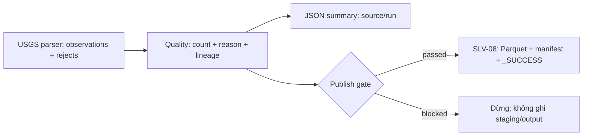

# Silver quality validation và tích hợp parser/writer

Tài liệu triển khai `SLV-05`, dùng chung model `SilverObservation` và
`SilverRejectRecord` của `SLV-02`. Logical schema vẫn là `CON-03` / Silver
`1.0`; không tạo model giản lược riêng cho quality hoặc đổi schema Parquet.

## Làm phần gì, có những gì, dùng để làm gì?

- `SilverQualityValidator`: nhận observation đã parse, kiểm tra source/key,
  tọa độ, số hữu hạn, event type, lineage/run và metadata JMA. Output chia
  thành valid/rejected cùng reason count để ngăn dữ liệu lỗi được publish.
- `SilverQualityResult`: giữ count, datasets và `publishBlocked`;
  `requirePublishable()` ném lỗi khi có blocker. Count phải khớp dataset thực tế.
- `SilverQualitySummaryWriter`: ghi JSON nhỏ theo source/run, gồm count,
  reason codes và đầy đủ locator/hash của reject; không sao chép raw payload.
- `SilverParquetWriter.write(request, quality)`: entry point tích hợp với
  `SLV-08` trong PR #35. Nó kiểm tra gate, run ID và đúng datasets đã validate
  **trước mọi thao tác storage**.

## Cách thực hiện



Ví dụ API thực tế sau khi Bronze input đã được SLV-01 resolve:

```java
UsgsParseResult parsed = new UsgsGeoJsonParser().parse(payload, parseContext);
SilverQualityResult quality = new SilverQualityValidator().validate(parsed, runId);
new SilverQualitySummaryWriter().write(summaryPath, quality, "USGS");
SilverWriteRequest request = new SilverWriteRequest(
        runId, quality.validObservations(), quality.rejectedRecords(), publishedAtUtc, true);
SilverWriteResult output = new SilverParquetWriter(store).write(request, quality);
```

- Dùng overload nhận **toàn bộ `UsgsParseResult`**, không chỉ
  `parsed.observations()`: parser rejects phải được cộng vào run gate. Nếu chỉ
  validate các dòng parse thành công, một input lỗi toàn bộ có thể bị nhầm là
  input rỗng hợp lệ.
- `valid + rejected = parsed` đối soát cả parser rejects và quality rejects.
  Một row có thể có nhiều reason, vì vậy tổng reason count có thể lớn hơn
  rejected count. Mỗi reason chỉ được đếm một lần trên cùng row.
- Policy hiện tại: có bất kỳ reject nào thì block checked publication.
  Warning hợp lệ, kể cả negative depth, không phải blocker. Chưa cấu hình
  threshold/tolerance riêng; thay policy cần review và test.
- Lỗi JSON, missing event time/sai kiểu được parser reject trước khi tạo
  `SilverObservation`, vì constructor model chung không cho phép missing
  required fields. Quality không dựng observation thiếu lineage để thay thế.
- API nhận `List<SilverObservation>` vẫn hỗ trợ caller/parser khác. Caller
  phải gộp rejects của parser tương ứng vào run gate; không bỏ chúng khỏi đối soát.
- `write(request)` một tham số là API persistence thấp tầng đang có của
  SLV-08, **không tự chạy SLV-05**. Luồng tích hợp phải dùng overload checked
  trên hoặc áp dụng quality policy rõ ràng trước khi gọi nó.
- Khi blocked, summary vẫn lưu evidence để audit. Checked writer không ghi
  reject Parquet riêng khi run bị block; workflow audit/recovery riêng thuộc
  integration/orchestration, không publish một run thành công giả.

## Field mapping và điều không được thay đổi

- Reject dùng đủ 13 field contract: schema/source, source key candidate,
  manifest ID, raw URI/SHA-256, raw locator/hash, stage, reason codes, run,
  parser version và `rejected_at_utc`. Summary đọc trực tiếp record chung bằng
  `rejectReasonCodes()`, không dùng wrapper `observation()` hoặc `reasonCodes()`
  chưa tồn tại.
- `rejected_at_utc` lấy từ `Clock` của validator; test dùng fixed clock, không
  phụ thuộc timezone host. Parser rejects giữ timestamp/lineage gốc.
- JMA determination/quality flag được kiểm tra qua **`source_status`** theo
  [field mapping CON-03](./SILVER_GOLD_DATA_MODEL.md), không thêm field
  `determination_flag` vào Java/Parquet schema. Native code có phân biệt hoa/thường:
  `K/S/k/s/A/a/N/F`; null nghĩa là chưa được nguồn/parser cung cấp. SLV-03 cần
  giữ native code khi map field này. Đây là kiểm tra code hợp lệ, không phải
  lọc bỏ agency `U/I`, low-quality flag, artificial event hoặc event ngoài ROI.
- Missing magnitude/depth/tsunami giữ null. Negative depth giữ giá trị và
  warning do parser tạo. Không normalize lại, deduplicate hay xử lý revision
  trong SLV-05; các task sau chịu trách nhiệm phần đó.
- JMA cần catalog release và era `LEGACY`/`UNIFIED`; USGS cần source updated
  timestamp và không được mượn catalog release/era của JMA.

## Regression và cách kiểm tra

Lỗi sau PR #32: quality dùng constructor giản lược không khớp model chung,
đồng thời gọi `determinationFlag()`, `observation()` và `reasonCodes()` không
tồn tại. Hotfix bắt đầu từ head PR #35 `d92dee7`, đồng bộ local với main
`4f906ae`, rồi sửa API và test theo model chung; không rollback code các task cũ.

Chạy từ repository root:

```bash
make test
make package-java
make check
make check-task-status
git diff --check
git diff --cached --check
```

`SilverQualityValidatorTest` kiểm tra success/empty, parser rejects, invalid
coordinate/non-finite number, nullable fields/negative depth, JMA flag/release,
foreign run, retry/duplicate, full reject JSON, parser → quality → Parquet
readback, và gate thất bại không tạo staging/file/manifest/marker.
Unit test dùng fixture/local storage/mock, không gọi nguồn thật hoặc ghi MinIO.

`make check-task-status` kiểm tra frontmatter `status`, mục `Theo dõi` và
dòng index của mọi task, đồng thời phát hiện thiếu/trùng dòng. Check được thêm
vào `make test` và `make check`, không cần `rg` hoặc Python.
SLV-03 vẫn `Ready` cho tới khi có parser/evidence; SLV-05 được đánh dấu `Done`
sau khi hotfix và checks hoàn tất.

Evidence ngày 2026-10-07: full `make check` đạt, gồm clean Maven verify
**83/83 Java tests** (quality/integration **12/12**), **15/15 Airflow tests**,
contract/foundation/USG-06 static checks và checker **73 task**. Build dùng
JDK 21.0.11 với compiler `--release 17`; runtime smoke/JDK 17 chưa được kiểm
tra vì Docker daemon đang tắt. Không có thao tác ghi dữ liệu thật vào MinIO.

Hotfix đã được commit tại `572918c` và mở thành
[PR #36](https://github.com/HoaiTam/japan-earthquake-etl/pull/36). PR #35 đã
merge vào main tại `40710d4`; branch hotfix đồng bộ main này tại `1b6334c`
và giữ nguyên API quality, lineage, checked writer cùng integration tests.
Sau giải quyết conflict, cần đối chiếu metadata/index: assignee SLV-05 là
`HoaiTam`; SLV-03 vẫn `Ready` theo file task, không phải `Done` chỉ vì một
branch khác đã sửa bảng chỉ mục.

Không thay đổi GitHub branch protection/CI settings trong hotfix. Không có
migration hay backfill bắt buộc vì logical schema không đổi; nếu có run cũ
failed/blocked thì retry đúng input/run context sau khi bản sửa được merge.
