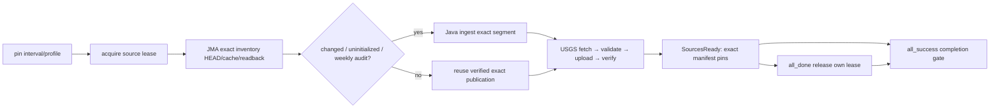

# ORC-02 — lịch nguồn và readiness đa nguồn

## 1. Làm gì, có gì, dùng để làm gì?

ORC-02 cung cấp **lịch và gate source → Bronze**, không triển khai lại
parser/Silver/Gold. `orc_01_etl_pipeline` vẫn manual và real mode vẫn đòi adapter
toàn chuỗi. Không schedule fixture ORC-01 hoặc gọi SourcesReady là Published.

| Thành phần | Làm gì | Dùng để làm gì |
|---|---|---|
| `source_schedule_runtime.py` | Validate profile, pin daily interval/USGS scope/JMA inventory, quyết định checksum audit | Các task/retry dùng cùng ngày, không dùng ngày của máy khi chạy trễ |
| `orc_02_daily_sources.py` | DAG daily thật: resolve → lease → JMA readiness → USGS Bronze → summary → release → gate | Hai nguồn có nhịp khác nhau cùng đi qua source gate |
| Java JMA `probe` | HEAD exact archive, so cache SHA/length, verify raw/manifest MinIO; không GET/ghi Bronze | Không ingest lại năm không đổi; không tin mỗi HEAD hoặc pointer |
| Java JMA `ingest` | Chỉ được gọi cho segment cần bootstrap/change/audit; reuse publication khi bytes không đổi | Giữ immutable history, chỉ báo changed year khi có publication mới |
| `source_run_guard.py` | Persistent whole-run lease với owner `(dag_id,run_id)` và atomic `flock` | Chặn daily/backfill giữa các DAG, không chỉ `max_active_runs` nội bộ |
| `source-readiness-qa.py` + Makefile | Scheduler thật, scheduled interval, fixed-window runs, no-change/readback và contention | Có evidence runtime lặp lại được; mock không thay nghiệm thu |



## 2. Lịch, timezone và interval

- Default `15 7 * * *` / `Asia/Ho_Chi_Minh` = **00:15 UTC hằng ngày**.
- Dùng **explicit `CronDataIntervalTimetable`**, không dựa vào default timetable
  của Airflow 3. Profile chỉ nhận một giờ/phút mỗi ngày, từ 07:15 VN trở đi;
  không nhận cron mỗi phút hoặc timezone khác baseline.
- `catchup=False`, paused khi tạo, `max_active_runs=1`, `max_active_tasks=1`.
  Start date `2023-01-01` cho phép test interval thuộc seed USGS; không bật
  historical catchup. Không dùng start date 2025 rồi nhận manual 2023 success
  mà thực tế Airflow không tạo task instance.
  Source tasks retry 1 lần sau 2 phút; scope/lease/gate không automatic retry.
- **Chọn ngày từ `data_interval_end`**, đổi UTC rồi floor midnight. Target
  `[D-1,D)`; USGS query `[max(seed,D-3),D)` ở default overlap=3.
- Ví dụ interval end `2023-01-04 07:15 +07:00`: processing date `2023-01-03`,
  target `[2023-01-03,2023-01-04)` và query `[2023-01-01,2023-01-04)` UTC.
  Logical date đầu interval không được dùng thay end. Retry vào hôm sau vẫn
  cùng window. JST hoặc host timezone không làm đổi target.
- Overlap `0`/`1` vẫn bao phủ target day; `0..31` theo upstream contract.
  Runner hiện chỉ một bounded request nên tăng overlap phải đồng bộ
  `USGS_MAX_WINDOW_DAYS`; không dùng daily DAG để kéo toàn lịch sử.
- Daily không nhận conf override year/window/force; thiếu/naive/future interval
  fail. Scope/profile đổi trong cùng run ID fail. Thay scope cần run mới.
- USGS empty GeoJSON hợp lệ vẫn Ready với count=0; không bịa count mới khi reuse.

## 3. Profile và chọn năm JMA

| Biến | Default / validation | Mục đích |
|---|---|---|
| `SOURCE_SCHEDULE_PROFILE` | `multi-source` hoặc `usgs-only` | Chỉ một DAG sở hữu cron; default ORC-02 scheduled, USG-04 manual |
| `PIPELINE_TIMEZONE` | `Asia/Ho_Chi_Minh` | Timezone điều phối, không timezone event JMA |
| `PIPELINE_SCHEDULE_CRON` | `15 7 * * *` | Daily boundary ≥00:15 UTC |
| `PIPELINE_OVERLAP_DAYS` | `3`, range `0..31` | Revision window USGS gồm target day |
| `JMA_READINESS_YEARS` | JSON `[1997,2000,2023]`, explicit nonempty integer years 1984..2023 | **Pilot watchlist**, không tuyên bố full 40-year coverage |
| `JMA_CHECKSUM_AUDIT_WEEKDAY` | `6`, UTC Monday=0…Sunday=6 | Weekly forced checksum audit trên watchlist dù HEAD không đổi |
| `SOURCE_GUARD_ROOT` | `/opt/pipeline/staging/source-guard` | Shared lease cho mọi source DAG |
| `SOURCE_READINESS_ROOT` | `/opt/pipeline/staging/readiness` | Immutable daily plan và safe runtime reports |

Compose có defaults để `.env` cũ dùng được; task không sửa `.env` local.
`multi-source` tắt cron USG-04 nhưng **không đổi pause state đã có trong DB**.
Chuyển sang `usgs-only` tắt cron ORC-02, bật lịch USG-04; phải recreate service
để tất cả component cùng env rồi kiểm tra serialized DAG trước unpause.

JMA catalog check trong task này = **resolve inventory v1 exact URLs và HEAD
archive trong watchlist**, không scrape HTML hoặc tự nhận năm mới ngoài baseline.
Năm 1997 cần cả jan-sep/oct-dec. HEAD có lỗi/oversize không được xem no-change.
Không có validators đáng tin, chưa có cache/publication hoặc validators đổi:
probe trả NeedsIngest. Cache chưa có có thể bootstrap **chỉ watchlist đã chọn**;
không tự tải 1984–2023. Cache SHA/length và Bronze readback đều đạt mới Unchanged.
Publication corrupt fail closed, không sửa/overwrite để che lỗi.

Chủ nhật UTC theo **interval end**, không theo now(), force GET/checksum exact
watchlist để bắt revision cùng ETag/Last-Modified. Đây là audit có chủ đích,
không coi archive chắc chắn đổi. Header-only change/audit cùng SHA reuse exact
manifest; `jma_changed_years` chỉ chứa năm có publication mới. Nếu chỉ oct-dec
đổi, chỉ segment đó ingest nhưng readiness năm 1997 vẫn verify đủ hai segment.
Danh sách watchlist thể hiện coverage trong report; muốn lịch sử đầy đủ phải
bootstrap/đăng ký scope có chủ đích, không coi pilot là full training catalog.

## 4. Chống daily/backfill chạy chồng và failure boundary

Ba DAG `orc_02_daily_sources`, `usg_04_usgs_ingest`, `jma_04_year_backfill`
đều acquire cùng lease **trước HTTP/storage I/O** và release sau source gate.
JMA preview không acquire vì không có source I/O. Lease giữ giữa các task và
qua retry/process exit; `flock` chỉ bảo vệ atomic owner update. Không dùng
pool một slot theo task để tuyên bố whole-run mutual exclusion.

Run khác nhận `SOURCE_RUN_BUSY` và fail **trước ingest**, không chờ vô hạn hoặc
cướp khóa. Khi đó task all_done cleanup không xóa owner của run đang giữ.
Mỗi source I/O task còn assert owner ngay trước runner. Clear riêng source task
sau completion không được dùng acquisition XCom cũ: phải rerun acquisition
và downstream release/gate hoặc tạo run mới; không tự chạy không khóa.
Task release không phải leaf: completion `all_success` còn phụ thuộc source
gate và acquisition, nên cleanup/summary thành công không che failure.
Không trigger backfill và daily cùng lúc; khi cần backfill hãy pause daily,
đợi active run kết thúc, chạy scoped backfill rồi unpause daily.

File owner corrupt hoặc scheduler bị kill có thể để lease stale: **fail closed,
không TTL/auto-steal**. Không xóa bucket/volume/cache. Chưa có recovery command
force-unlock: [ORC-05 - Chốt recovery, concurrency và tài nguyên](../task/tasks/ORC-05.md)
cần kiểm tra owner đã terminal rồi mới cung cấp scoped recovery có kiểm soát.
Đây là khóa source trên một shared LocalExecutor volume, không distributed
lock cho nhiều máy và không phải resource lock toàn Silver/Gold/ML.
Direct Java CLI ngoài ba DAG không tự acquire lease; không chạy bypass trong
khi DAG active. Broader admission/recovery nằm ở ORC-05.

## 5. Report và handoff

`<SOURCE_READINESS_ROOT>/daily-<sha256(run_id)[:32]>/` chứa `plan.json`,
`jma-readiness.json`, `usgs-readiness.json`, `run_summary.json`.
Report chỉ metadata whitelist, không raw ZIP/GeoJSON/secret/stderr.
`input_manifests` chứa **manifest URI + hash của manifest bytes**, khác raw SHA;
raw SHA/count/release/segment giữ riêng để audit. Đã verify cả raw và manifest
qua Java/MinIO trước SourcesReady; report không phải Bronze commit point.

Mỗi source có scope riêng: USGS revision interval UTC; JMA exact historical
years/segments, native JST → UTC envelope. Context JMA runner giữ
`is_backfill=true` cho archive scope ngay trong daily source refresh; không
dùng daily USGS day làm phạm vi output JMA. Gold/Silver affected scope chưa
được suy từ envelope hoặc wildcard. Các pins tương thích input ORC-01, nhưng
không tự trigger ETL hoặc gọi Published khi thiếu scope/adapters.

## 6. Test và vận hành

Offline:

```bash
make test-source-schedule
make check
git diff --check
```

Host Maven dùng JDK repo chấp nhận (17/21), không Java 26. Runtime image Java17.
Live cần `.env` hợp lệ, default bounded profile và không có source run active:

```bash
make smoke-source-readiness
```

Lệnh build **riêng Airflow**, start với `--no-build` (không rebuild MinIO),
chạy profile `live` QA. Harness bật cron để scheduler tạo latest complete
interval; lần chạy lại có thể reuse một scheduled run đã có report đúng profile
và latest completed cron interval trong ngày
thay vì đợi tới ngày mai. Hai manual runs dùng native trigger API của Airflow
3.3.2, pin **cả `run_after` và unique `logical_date`**, giữ microseconds, để
timetable resolve cùng fixed cron interval. CLI chỉ đổi `--logical-date`
vẫn lấy `run_after=now()` nên **không** kiểm thử được historical interval.
Airflow 3.3.2 unique `(dag_id,logical_date)`; hai runs cùng query
`[2023-01-01,2023-01-04)`; verify JMA no GET/ingest và exact pins không đổi.
USGS khác run ID fetch revision mới nên raw SHA có thể đổi hợp lệ; unit test
riêng xác nhận retry **cùng run ID** không refetch/overwrite.

QA còn kiểm tra đủ 7 task instance success, không nhận run success nhưng zero
task là runtime evidence. Contentious backfill phải fail acquisition và
ingest task phải `upstream_failed`, chưa chạy Java.

Contention test giữ **QA lease có chủ đích**, trigger backfill thật chỉ năm
2023, đợi expected failed và xác nhận foreign cleanup không xóa holder.
Không gọi đây là một production daily run đang bị treo. Harness khôi phục
pause state của hai DAG, release **chỉ QA lease**, giữ failed run/log/evidence.
Metadata reports ở `<SOURCE_READINESS_ROOT>/qa/<evidence-id>/`; không commit
raw data, staging, log hoặc `.env`. Evidence task ở [ORC-02](../evidence/ORC-02.md).

Vận hành normal: `make up-airflow`, kiểm tra import errors và profile, rồi
unpause `orc_02_daily_sources` ở UI. Không unpause `orc_01_etl_pipeline` để chạy
mock mỗi ngày. Bắt đầu watchlist nhỏ; thêm years cần sizing/coverage review.

## 7. Giới hạn và task tiếp theo

- [ORC-03 - Implement backfill và reprocessing](../task/tasks/ORC-03.md):
  chia historical scope/request, resolve affected Silver/Gold partitions và
  reprocess exact pinned inputs. ORC-02 chưa cung cấp historical dispatcher.
- [ORC-04 - Chuẩn hóa logging và run summary](../task/tasks/ORC-04.md):
  thống nhất counts/duration/reasons/summary toàn ETL; report hiện chỉ source gate.
- [ORC-05 - Chốt recovery, concurrency và tài nguyên](../task/tasks/ORC-05.md):
  stale lease recovery, resource/admission cho Spark/Iceberg/ML và sizing.
- [SLV-09 - Tích hợp và kiểm thử Silver đa nguồn](../task/tasks/SLV-09.md),
  [GLD-03 - Ghi Gold Iceberg và commit snapshot](../task/tasks/GLD-03.md),
  [GLD-04 - Tạo Trino views và verification SQL](../task/tasks/GLD-04.md):
  adapters/output thật và committed/verified snapshots; chưa có Published.
- [QA-01 - Chạy E2E daily đa nguồn](../task/tasks/QA-01.md):
  nghiệm thu daily toàn chuỗi Bronze → Silver → Gold → Trino, không thay bằng
  source-only evidence. ORC-02 chứng minh **daily source readiness**, chưa KPI ETL MVP.
- [QA-05 - Profile dữ liệu lịch sử và tài nguyên local](../task/tasks/QA-05.md):
  full-history throughput/sizing; pilot không chứng minh training coverage đầy đủ.

Nguồn kỹ thuật: [Airflow Dag Runs / data interval và leaf behavior](https://airflow.apache.org/docs/apache-airflow/3.2.2/core-concepts/dag-run.html).
Timetable và graph đã được kiểm tra trực tiếp bằng Airflow 3.3.2 của repository.
