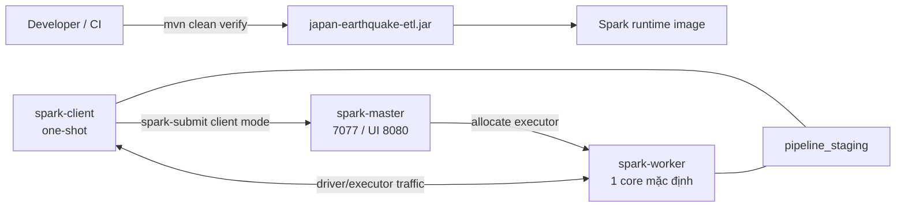

# Spark standalone và Java build contract

| Thuộc tính | Giá trị |
|---|---|
| Task | `SPK-01` |
| Trạng thái | Implemented và verified bằng runtime smoke |
| Spark / Scala / Java | `3.5.9` / `2.12` / `17` |
| Maven / Maven Wrapper | `3.9.16` / `3.3.4` (`only-script`) |
| Java package gốc | `ie212.earthquake.spark` |
| JAR local | `spark/target/japan-earthquake-etl.jar` |
| JAR trong image | `/opt/spark/jobs/japan-earthquake-etl.jar` |

## 1. SPK-01 làm gì

Task này cung cấp nền compute có thể chạy thật cho các Spark job tiếp theo:

- Maven reactor ở root và module Java trong `spark/`.
- Maven Wrapper đã pin phiên bản và checksum để các máy dùng cùng Maven.
- Image Spark có JAR đã qua `mvn clean verify`.
- Spark standalone gồm một master, một worker và một client one-shot.
- `HelloWorldJob` cùng unit test để kiểm chứng Java API, phép tính phân tán và
  format kết quả.
- Static check và runtime smoke có thể lặp lại cho local/CI.

SPK-01 chưa triển khai đọc Bronze, ghi Silver/Gold, Iceberg hoặc tích hợp DAG.
Các job nghiệp vụ sau này mở rộng module hiện có thay vì tạo Maven project hay
Spark cluster thứ hai.

## 2. Ma trận phiên bản

| Thành phần | Phiên bản | Lý do |
|---|---:|---|
| Apache Spark | `3.5.9` | Nhánh Spark 3.5 còn được Iceberg duy trì và có image Java 17 chính thức |
| Scala binary | `2.12` | Khớp artifact Spark `spark-sql_2.12` và image runtime |
| Java | `17` | Một runtime LTS dùng chung cho compile và chạy job |
| Apache Maven | `3.9.16` | Pin bản Maven 3 ổn định trong wrapper và builder image |
| Maven Wrapper | `3.3.4` | Wrapper dạng `only-script`, không cần commit wrapper JAR |
| Apache Iceberg | mục tiêu `1.11.0` | Ma trận tương thích downstream; SPK-01 chưa thêm dependency Iceberg |

Không nâng riêng một phần của ma trận. PR đổi Spark phải kiểm tra đồng thời
Scala artifact, Java runtime, Docker tag và phiên bản Iceberg mà project định
dùng.

## 3. Kiến trúc runtime



Master chỉ điều phối. Driver của smoke job chạy trong `spark-client`; executor
phải chạy trên `spark-worker`. Client vì vậy có hostname ổn định và truyền
`spark.driver.host=spark-client`. Cả ba service cùng ở network `pipeline`.

## 4. Java build contract

Root `pom.xml` quản lý phiên bản và module; `spark/pom.xml` chứa dependency và
build của Spark job. Chạy từ project root:

Source code dùng package ngắn `ie212.earthquake` để cây thư mục dễ đọc. Maven
`groupId` vẫn là `vn.edu.uit.ie212.earthquake` vì đây là định danh artifact,
không quyết định đường dẫn package Java.

```bash
./mvnw --batch-mode --no-transfer-progress clean verify
```

Build phải thỏa các điều kiện:

- Maven chạy bằng Java 17 trở lên và Maven 3.9.x.
- `spark-sql_2.12` có scope `provided`: runtime image cung cấp Spark, JAR không
  đóng gói lại toàn bộ Spark classes.
- Unit test chạy trước khi JAR được tạo.
- Manifest có main class
  `ie212.earthquake.spark.HelloWorldJob`.
- Không commit `target/`, JAR hoặc metastore local.

Maven Wrapper tải Maven từ Apache theo URL và SHA-256 đã pin trong
`.mvn/wrapper/maven-wrapper.properties`. Máy cần `curl` hoặc `wget`, `unzip` và
JDK 17 nếu build ngoài Docker.

## 5. Hello World contract

`HelloWorldJob` tạo range `[0, 10)` với hai partition, rồi tính:

| Giá trị | Kết quả bắt buộc |
|---|---:|
| Số record | `10` |
| Tổng `id` | `45` |

Nếu kết quả khác, job ném exception và `spark-submit` thất bại. Khi thành công,
stdout có đúng một marker để smoke script xác nhận:

```text
event=spark_hello_world_success app_id=<application-id> master=spark://spark-master:7077 record_count=10 id_sum=45
```

Job luôn dừng `SparkSession` trong `finally`. Unit test kiểm tra cả validation
thành công, validation thất bại và format marker; runtime smoke mới là bằng
chứng phép tính thực sự được executor trên worker xử lý.

## 6. Service contract

| Service | Lifecycle | Chức năng | Exposure |
|---|---|---|---|
| `spark-master` | dài hạn | Nhận application và phân phối executor | `7077` nội bộ; UI bind loopback qua `SPARK_MASTER_UI_HOST_PORT` |
| `spark-worker` | dài hạn | Chạy executor | Không publish port; UI worker chỉ nội bộ |
| `spark-client` | one-shot, profile `smoke` | Chạy JAR bằng `spark-submit` và xác nhận marker | Không publish port |

Master và worker dùng healthcheck HTTP trên UI tương ứng. Worker chỉ start sau
master healthy; client chỉ start sau cả master và worker healthy. Script smoke
còn đọc `/json/` của master và yêu cầu có worker ở trạng thái `ALIVE`, tránh
trường hợp job vô tình chạy local mà vẫn báo thành công.

Image được build một lần bởi service `spark-master`; worker/client dùng cùng
tag `japan-earthquake-etl/spark:3.5.9-java17`. Cách này tránh Compose export
cùng một image song song. Dockerfile multi-stage chạy toàn bộ Maven verify ở
builder và chỉ copy JAR sang image Spark chính thức.

## 7. Cấu hình và tài nguyên local

| Biến | Default mẫu | Ý nghĩa |
|---|---|---|
| `SPARK_MASTER_URL` | `spark://spark-master:7077` | Endpoint cluster nội bộ, không đổi ở baseline |
| `SPARK_MASTER_UI_HOST_PORT` | `8082` | UI master trên `127.0.0.1` |
| `SPARK_WORKER_CORES` | `1` | Số core worker quảng bá cho master |
| `SPARK_DRIVER_MEMORY` | `1g` | Memory driver của client smoke |
| `SPARK_EXECUTOR_MEMORY` | `2g` | Memory executor yêu cầu từ worker |

Worker được giới hạn `2 CPU / 3 GiB`, client `1.5 CPU / 2 GiB`; master dùng
resource baseline `1 CPU / 1 GiB`. Đây là guardrail local, không phải sizing
production. Nếu tăng executor memory phải tăng worker limit tương ứng.

`pipeline_staging` được mount read-write vào worker/client tại
`/opt/pipeline/staging`. Source tree không được bind vào Spark container.
`.dockerignore` dùng allowlist để secret, `.env`, `.git`, target cũ và module
không liên quan không đi vào build context.

Spark standalone local hiện không bật authentication. Vì vậy master RPC và UI
worker chỉ ở Compose network; UI master là port duy nhất publish và chỉ bind
`127.0.0.1`.

## 8. Kiểm tra và smoke test

Static/build gate, không cần start cluster:

```bash
./scripts/check-spark.sh
```

Script này chạy Maven verify, kiểm tra JAR/manifest/provided dependency, image
version, Compose dependency/healthcheck/mount/exposure và Docker build context.

Runtime acceptance, cần Docker daemon và `.env` hợp lệ:

```bash
./scripts/smoke-spark.sh
```

Luồng smoke:

1. Kiểm tra config và static contract.
2. Build image qua `spark-master` đúng một lần.
3. Khởi động master/worker với `--no-build --wait`.
4. Chạy `spark-client` trong profile `smoke`.
5. Xác nhận worker `ALIVE`, marker có đúng master/count/sum và exit code `0`.

Script giữ cluster và volume staging để debug. Dừng container/network nhưng
giữ volume bằng:

```bash
docker compose --env-file .env down
```

Không thêm `-v` trong quy trình thường ngày.

## 9. Troubleshooting

- `No live worker`: mở `http://127.0.0.1:${SPARK_MASTER_UI_HOST_PORT}`, xem
  `docker compose logs spark-master spark-worker` và kiểm tra memory/core.
- `Initial job has not accepted any resources`: executor memory/core vượt tài
  nguyên worker; đưa về default hoặc tăng worker limit có chủ đích.
- Driver không reachable: client phải giữ hostname `spark-client` và cùng
  network `pipeline`; không đổi `spark.driver.host` thành `localhost`.
- Maven Wrapper không tải được: kiểm tra network, `curl`/`wget`, `unzip`; không
  bỏ checksum hoặc commit Maven binary thay thế.
- JAR không có trong image: chạy `./scripts/check-spark.sh`, sau đó build lại
  `docker compose build spark-master`.
- Port UI bị chiếm: đổi `SPARK_MASTER_UI_HOST_PORT` trong `.env`, không đổi port
  `8080` nội bộ.

## 10. Handoff cho task downstream

- Job Silver/Gold đặt dưới package gốc đã chốt và có unit test riêng.
- Dùng dependency version từ root POM; không hard-code bản Spark khác trong
  module con.
- Airflow gọi Spark qua service/client contract này và truyền run context rõ
  ràng; không chạy Spark embedded trong scheduler.
- Job đọc/ghi object storage lấy credential từ environment, không từ source,
  POM hoặc JAR.
- Khi thêm Iceberg, dùng artifact tương thích Spark `3.5` và Scala `2.12`, rồi
  cập nhật contract/version gate trong cùng PR.

## 11. Nguồn phiên bản chính thức

- [Apache Spark 3.5.9 release](https://spark.apache.org/releases/spark-release-3-5-9.html)
- [Apache Spark release history](https://spark.apache.org/history.html)
- [Apache Spark Docker images](https://hub.docker.com/r/apache/spark/tags)
- [Apache Iceberg multi-engine support](https://iceberg.apache.org/multi-engine-support/)
- [Apache Iceberg releases](https://iceberg.apache.org/releases/)
- [Apache Maven release history](https://maven.apache.org/docs/history.html)
- [Apache Maven Wrapper](https://maven.apache.org/tools/wrapper/)
