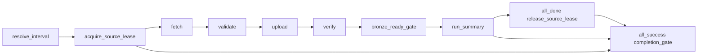

# USGS Airflow ingest contract

| Thuộc tính | Giá trị |
|---|---|
| Task | `USG-04`, live bridge `USG-06` |
| DAG ID | `usg_04_usgs_ingest` |
| Schedule | Manual trong ORC-02 `multi-source`; `15 7 * * *` theo `Asia/Ho_Chi_Minh` ở `usgs-only` |
| Input | Airflow data interval và run context |
| Output | Bronze manifest đã verify và `run_summary.json` |

## 1. Mục đích và ranh giới

`usg_04_usgs_ingest.py` chỉ điều phối lifecycle USGS; nó không đưa raw payload
vào XCom và không tự thay thế HTTP client hoặc Bronze writer của `USG-02` và
`USG-03`. Các task trong group `usgs_ingest` gọi một runner bên ngoài qua
`USGS_INGEST_RUNNER_COMMAND`. `USG-06` cung cấp bridge thật trong custom Airflow
image: executable Java runner gọi HTTP client/Bronze writer, dùng MinIO adapter
và trả summary metadata nhỏ.

Luồng task là:



Airflow mặc định tạo DAG ở trạng thái paused để không gọi nguồn khi runner
chưa được cấu hình. Có thể bật DAG sau khi kiểm tra command, credential và
MinIO connection ở môi trường chạy.

ORC-02 thêm whole-run source lease trước fetch, all_done release và strict
completion leaf sau summary. Guard dùng chung với JMA backfill và daily hai
nguồn, không chỉ serialize riêng USGS. Daily schedule mặc định chuyển sang
`orc_02_daily_sources`; DAG này vẫn nhận scoped manual backfill/smoke như cũ.
Chi tiết [schedule/readiness profile](./SOURCE_SCHEDULE_AND_READINESS.md).

## 2. Run context và cửa sổ

`resolve_interval` tạo một context duy nhất cho toàn bộ task/retry:

- `run_id`, `dag_id`, `logical_run_key`.
- `window_start_utc` và `window_end_utc` dạng half-open `[start,end)`; mặc định
  đọc ba ngày UTC gần nhất và clip tại `USGS_SEED_START_UTC`.
  Overlap=0/1 vẫn bao phủ target day; window clip rỗng bị reject.
- `target_window_start_utc`, `target_window_end_utc` và `processing_date`.
- `is_backfill`, `config_version` và số ngày overlap.

Các task sau chỉ nhận context từ XCom và ghi context/summary vào staging volume.
Retry không tính lại một logical window mới và không đổi `logical_run_key`.

Manual integration run có thể truyền `is_backfill=true` cùng
`window_start_utc`/`window_end_utc` tường minh. Hai timestamp phải có hậu tố
`Z`, start nhỏ hơn end và không được trước seed. Chế độ này giữ nguyên fixed
window, không áp overlap lần hai.

## 3. Runner protocol

Airflow tạo một file JSON nhỏ tại:

```text
/opt/pipeline/staging/usgs/<safe-run-id>/<phase>-input.json
```

File gồm `phase`, `run_context` và summary của phase trước. Airflow gọi:

```text
<USGS_INGEST_RUNNER_COMMAND> --phase <phase> --context-file <path>
```

Runner được đóng gói tại `/opt/pipeline/bin/usgs-ingest-runner` và phải:

1. Dùng `USG-02` để fetch response và `USG-03` để validate/write/verify raw.
2. Không in response body, credential hoặc header nhạy cảm.
3. Trả đúng một JSON object summary ở dòng cuối stdout; exit code khác `0` là
   task failure.
4. Trả `phase`, `status=ok` và chỉ metadata như `bronze_status`,
   `manifest_uri`, `raw_object_uri`, `record_count_estimate`, `sha256`,
   `manifest_sha256`, `verified` hoặc `idempotent_reuse`. Verify trả hash manifest
   bytes riêng với raw SHA để downstream pin chính xác input.

Airflow chỉ giữ whitelist metadata trong XCom. Payload bytes phải ở Bronze hoặc
staging do runner quản lý; không đưa payload vào log/metadata database.

`fetch` giữ raw response ở staging; `validate` kiểm tra GeoJSON; `upload` dùng
conditional put để không overwrite Bronze; `verify` đọc lại raw/manifest từ
MinIO. Mỗi phase mở rồi đóng MinIO SDK client để process runner kết thúc ngay.

`USGS_INGEST_DRY_RUN=true` chỉ dành cho kiểm thử DAG không có network. Custom
Airflow image đặt sẵn command production; nếu operator xóa command trong real
mode, task fail fast với lỗi rõ ràng.

## 4. Publish gate

`verify` chỉ thành công khi runner trả đồng thời:

```json
{
  "phase": "verify",
  "status": "ok",
  "bronze_status": "BronzeReady",
  "verified": true,
  "manifest_uri": "s3://.../manifest.json"
}
```

`bronze_ready_gate` là upstream bắt buộc cho mọi Silver task downstream. Nếu
fetch/validate/upload/verify fail, Airflow trigger rule mặc định `all_success`
không schedule gate và Silver không chạy. Payload bị reject phải được USG-03
quarantine, không được tạo manifest `BronzeReady`.

## 5. Run summary

`run_summary` ghi file JSON nhỏ cạnh staging context:

```text
/opt/pipeline/staging/usgs/<safe-run-id>/run_summary.json
```

Summary có run/window, `is_backfill`, trạng thái `BronzeReady`, metadata từng
phase và manifest URI. Đây là evidence vận hành; Bronze manifest vẫn là commit
point để Silver resolve input.

## 6. Kiểm thử

Static/unit tests không gọi mạng hoặc Airflow scheduler thật:

```bash
python3 -m unittest discover -s airflow/tests -p 'test_*.py'
./scripts/check-airflow.sh
```

Live acceptance dùng fixed window ba ngày, credential local và MinIO thật:

```bash
./scripts/check-usgs-live.sh
./scripts/smoke-usgs-live.sh
```

Không đưa `.env` hoặc payload thật vào repository. Command, evidence, failure
mapping và giới hạn một request được mô tả trong
[USGS live Bronze runbook](./USGS_LIVE_BRONZE_RUNBOOK.md).
