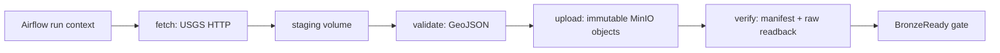

# USG-06 live Bronze runbook

| Thuộc tính | Giá trị |
|---|---|
| Task | `USG-06` |
| Trạng thái | Verified |
| DAG | `usg_04_usgs_ingest` |
| Runner | `/opt/pipeline/bin/usgs-ingest-runner` |
| Fixed smoke window | `[2023-01-01T00:00:00Z, 2023-01-04T00:00:00Z)` |
| Commit point | Manifest có `bronze_status=BronzeReady` |

## 1. Phần này làm gì

USG-06 nối DAG Airflow của `USG-04` với implementation Java của `USG-01` đến
`USG-03`. Airflow không còn dừng ở runner protocol giả: custom Airflow image có
Java 17 và executable JAR, runner gọi USGS thật, giữ raw GeoJSON trong staging,
ghi raw cùng manifest vào MinIO rồi đọc lại để xác minh.

Các lớp Java của luồng này nằm dưới package ngắn
`ie212.earthquake.spark.usgs`; Maven `groupId` đầy đủ chỉ dùng để định danh
artifact và không làm thay đổi cây thư mục source.



Raw body không đi qua XCom/stdout. Log và summary chỉ chứa run/window, object
URI, SHA-256, byte/count metadata và trạng thái kiểm tra.

## 2. Thành phần triển khai

| Thành phần | Vai trò |
|---|---|
| `UsgsIngestRunner` | CLI nhận `--phase` và `--context-file`, nối request/client/validator/writer |
| `MinioBronzeObjectStore` | Đọc/ghi MinIO bằng pipeline credential, conditional put và readback |
| `compose/airflow/Dockerfile` | Build executable JAR, thêm Java 17 vào image Airflow 3.3.2 |
| `compose/airflow/usgs-runner.sh` | Entrypoint ổn định cho Airflow runner command |
| `compose/airflow/usgs-live-smoke.sh` | Trigger fixed window, chờ DAG, rerun upload/verify và đối soát evidence |
| `scripts/check-usgs-live.sh` | Static/unit gate, không gọi nguồn thật |
| `scripts/smoke-usgs-live.sh` | Operator command chạy live acceptance có chủ đích |

Runner hiện xử lý đúng một resolved request cho mỗi Airflow run. Vì vậy window
live phải không lớn hơn `USGS_MAX_WINDOW_DAYS` (mặc định 3 ngày). Chia nhiều
request/page cho historical backfill không thuộc USG-06.

## 3. Phase contract

| Phase | Input/side effect | Summary chính | Idempotency |
|---|---|---|---|
| `fetch` | Gọi USGS, ghi raw + fetch state vào staging | `artifact_uri`, `sha256` | Nếu artifact cùng run đã tồn tại và checksum khớp thì reuse, không gọi lại nguồn |
| `validate` | Kiểm tra GeoJSON/feature count | `valid`, `record_count_estimate` | Payload lỗi được ghi vào quarantine, không qua gate |
| `upload` | Ghi raw rồi manifest vào MinIO | `BronzeReady`, object URI, SHA/count | Conditional put không overwrite; cùng bytes trả `idempotent_reuse=true` |
| `verify` | Đọc lại raw và manifest từ MinIO | `verified=true`, URI, SHA/count | Đối soát length, checksum, run ID, keys và validation flags |

USGS dùng offset một-gốc. Request đầu tiên gửi `offset=1`; pagination tiếp theo
dùng `1+limit`, `1+2*limit`, ... . `offset=0` bị USGS trả HTTP 400.

## 4. Chuẩn bị cấu hình local

Từ project root:

```bash
cp .env.example .env
```

Thay toàn bộ placeholder `change-me-*`, sau đó kiểm tra:

```bash
./scripts/check-config.sh --require-local
```

Các biến quan trọng:

- `USGS_INGEST_DRY_RUN=false`.
- `USGS_INGEST_RUNNER_COMMAND=/opt/pipeline/bin/usgs-ingest-runner`.
- `MINIO_ENDPOINT=http://minio:9000`.
- `MINIO_ACCESS_KEY` và `MINIO_SECRET_KEY` là pipeline credential, không phải
  root credential.
- `DATA_BUCKET` và `BRONZE_PREFIX` khớp MinIO bootstrap.

Không truyền credential trong runner command, DAG conf hoặc terminal argument.

## 5. Chạy kiểm tra

Static/unit gate, không gọi USGS thật:

```bash
./scripts/check-usgs-live.sh
```

Live acceptance, gọi đúng fixed window và giữ service/volume để review:

```bash
./scripts/smoke-usgs-live.sh
```

Có thể dùng env file ở vị trí khác mà không tạo `.env` trong repository:

```bash
ENV_FILE=/absolute/path/to/local.env ./scripts/smoke-usgs-live.sh
```

Smoke harness chủ động unpause DAG, trigger run có `is_backfill=true` cùng
window start/end tường minh, rồi pause lại khi kết thúc. Nó không chạy full
history và không in raw payload.

## 6. Output thành công

Một dòng thành công có dạng:

```text
USG-06 live smoke passed: run_id=<id> window=[2023-01-01T00:00:00Z,2023-01-04T00:00:00Z) manifest_uri=s3://.../manifest.json sha256=<digest> record_count=<n> rerun_reused=true
```

Evidence đã xác minh ngày `2026-10-04`:

| Field | Giá trị |
|---|---|
| `run_id` | `usg06-live-20261004T121205Z-db580aece6dc` |
| `manifest_uri` | `s3://japan-earthquake/bronze/usgs/ingest_date=2023-01-01/run_id=usg06-live-20261004T121205Z-db580aece6dc/attempt=01/manifest.json` |
| `sha256` | `8667f9b7ac02ce0e88c78767bd51dee1fdf1292ac987a7cdc00c3aaec6b0545e` |
| `record_count_estimate` | `16` |
| Readback | `BronzeReady`, `verified=true` |
| Rerun | Cùng URI/SHA/count, `idempotent_reuse=true` |

USGS có thể thay đổi metadata/revision giữa hai lần fetch khác run ID. Tính
idempotent ở đây áp dụng cho cùng logical run: runner reuse staged bytes và
không overwrite object khác nội dung.

## 7. Xử lý lỗi

| Dấu hiệu | Kiểm tra |
|---|---|
| DAG vẫn `queued` | DAG phải được unpause; dùng smoke script thay vì trigger rời rạc |
| HTTP 400 | Xác nhận request dùng `offset>=1`, bounds/time hợp lệ và limit không quá 20000 |
| Runner command thiếu | Build custom Airflow image và giữ command mặc định trong `.env` |
| MinIO `AccessDenied` | Chạy `minio-init`; xác nhận dùng pipeline credential và đúng bucket/prefix |
| Checksum/length mismatch | Không publish Silver; giữ staging/object để điều tra, không sửa manifest tay |
| Payload invalid | Xem failure manifest ở quarantine; `bronze_ready_gate` phải bị chặn |
| Smoke timeout | Xem DAG run trong Airflow; harness chờ tối đa 20 phút để bao gồm image/startup |

Không dùng `curl` ghi trực tiếp object để thay thế runner, không xóa data volume
khi đang điều tra và không chỉnh manifest thành `BronzeReady` bằng tay.

## 8. Handoff cho task sau

`DAT-01` chỉ cần đăng ký metadata của sample: source, fixed window, run ID,
manifest URI, SHA-256, count và trạng thái `BRONZE_READY`. Raw GeoJSON tiếp tục
nằm trong MinIO; không copy raw data vào Git.

Tài liệu liên quan:

- [USGS request contract](./USGS_REQUEST_CONTRACT.md)
- [USGS HTTP client contract](./USGS_HTTP_CLIENT_CONTRACT.md)
- [USGS Bronze writer contract](./USGS_BRONZE_WRITER_CONTRACT.md)
- [USGS Airflow ingest contract](./USGS_AIRFLOW_INGEST_CONTRACT.md)
- [Configuration and secrets](./CONFIGURATION_AND_SECRETS.md)
