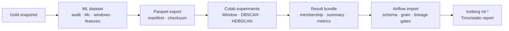
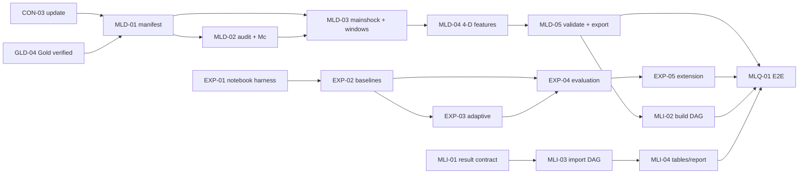

# Roadmap HDBSCAN từ Gold đến ML Iceberg

Tài liệu này chuyển phương án nghiên cứu HDBSCAN thành các khối công việc có
thể giao độc lập. File task riêng trong [`tasks/`](./tasks/README.md) là nguồn
theo dõi chính cho dependency, acceptance criteria, assignee và evidence.

## 1. Mục tiêu đã chốt

Pipeline nhận `gold.earthquake_event_current` tại một Iceberg snapshot cố định,
tạo candidate theo từng mainshock, xây feature không–thời gian 4-D, so sánh
Window/DBSCAN/HDBSCAN và nhập kết quả đã kiểm tra về namespace `ml`.

Kết quả là **sequence/aftershock candidate theo mô hình thống kê**. Đây là
clustering hồi cứu, không dự đoán trận động đất tiếp theo và không chứng minh
quan hệ nhân quả vật lý.

## 2. Ranh giới dữ liệu

- Gold core giữ canonical event và không nhận `cluster_id` thử nghiệm.
- Mọi dataset phải pin `gold_snapshot_id` và có `dataset_id` bất biến.
- Mọi kết quả phải có `experiment_run_id`, `model_config_version`, checksum và
  code/notebook/package version.
- Feature baseline là `[x_scaled, y_scaled, z_scaled, time_scaled]`; không dùng
  latitude/longitude degree trực tiếp và không cộng kilomet với giờ chưa scale.
- HDBSCAN chạy theo từng mainshock window, không fit một lần trên toàn catalog.
- Colab không nhận credential MinIO. Export/result trao đổi qua bundle có
  manifest; pipeline local mới được ghi Iceberg/MinIO.

## 3. Phạm vi Core và Stretch

Core phải có:

- reproduction `2000-01-01` đến hết `2018-09-30` và extension `2018-10-01`
  đến hết `2023-12-31`;
- mainshock `50–200 km`, magnitude `> 5.5`, catalog era `UNIFIED`, primary JMA;
- phương pháp/version `Mc`, candidate window và scaling;
- Window, DBSCAN, HDBSCAN global và HDBSCAN adaptive dùng cùng dataset;
- DBCV/noise/membership, Omori consistency, sensitivity và out-of-period;
- result bundle, import gate, Iceberg `ml.*` và static report.

Power BI, shallow control group, OPTICS và tối ưu mở rộng là Stretch. Power BI
không còn là hard dependency của MVP HDBSCAN.

## 4. Các khối có thể chia người

| Khối | Task | Output độc lập | Có thể bắt đầu bằng |
|---|---|---|---|
| Contract | `PLN-01`, `CON-03` | Scope/DoD và logical schema ML | Tài liệu phương án, schema mẫu |
| Dataset | `MLD-01..05` | Dataset manifest, Mc, windows, features, export | Gold fixture/snapshot metadata giả lập |
| Experiment | `EXP-01..05` | Notebook, assignments, metrics, sensitivity/extension | Feature Parquet fixture nhỏ |
| Integration | `MLI-01..04` | Bundle validator, hai DAG, Iceberg tables, report | Result bundle fixture hợp lệ/lỗi |
| ML QA | `MLQ-01` | Evidence Gold snapshot → report | Output thật của các khối trên |

Ba luồng Dataset, Experiment và Integration không cần chờ nhau để viết
interface/test. Chỉ `MLQ-01` là integration gate buộc phải dùng output thật.

## 5. Dependency chính

`EXP-01` và `MLI-01` dùng fixture contract nên có thể bắt đầu trước `MLD-05`.

## 6. Task cũ bị tác động

| Task | Trạng thái mới | Lý do |
|---|---|---|
| `PLN-01` | `Done` | Baseline đã đưa HDBSCAN vào Core, Power BI sang Stretch và chốt lại KPI/DoD |
| `CON-03` | `Done` | Đã khóa grain/schema/lifecycle dataset, experiment và publication gate `ml.*` |
| `GLD-01/03/04` | `Backlog`, scope cập nhật | Gold phải là input snapshot ổn định cho ML |
| `GLD-02` | `Backlog`, chuyển Stretch | Aggregate dashboard không nằm trên đường găng HDBSCAN |
| `BI-01..05` | `Backlog`, chuyển Stretch | Power BI là output tùy chọn sau static report |
| `QA/SEC/DOC/DEMO` | `Backlog/Ready`, scope cập nhật | Phải bao phủ external bundle, import gate và ML reproducibility |

Các task Foundation và USGS Bronze đã hoàn tất vẫn giữ `Done` vì phương án mới
không làm mất evidence đã kiểm chứng. JMA, Silver, Gold và các khối downstream
giữ trạng thái riêng trong task index; không được suy ra `Done` từ bảng tác động
này.

## 7. Definition of Done cấp workstream

- Một Gold snapshot được pin và truy vết trong `ml.dataset_manifest`.
- Dataset/experiment lifecycle được ghi qua `ml.dataset_manifest` và
  `ml.experiment_run`; import thành công chỉ tạo `CANDIDATE`, không tự approve.
- `Mc`, window, feature/scaling và model config đều có version.
- Mỗi candidate có grain `(dataset_id, mainshock_event_id, candidate_event_id)`.
- Window/DBSCAN/HDBSCAN đọc cùng `dataset_id`; cluster của mainshock được chọn
  bằng rule xác định và mainshock noise không bị thay bằng cluster gần nhất.
- Có DBCV/noise, stability, Omori consistency và out-of-period evidence.
- Result bundle có schema, config, package lock, checksum và `_SUCCESS.json`.
- Airflow reject checksum/schema/grain/lineage sai trước khi commit `ml.*`.
- Báo cáo dùng thuật ngữ candidate và nêu rõ limitation không dự đoán/causal.
