# Các khối công việc sau Foundation

Tài liệu này giải thích các task từ tuần 2 đến tuần 6 theo ba câu hỏi: **làm phần gì**, **có những gì** và **dùng để làm gì**. Danh sách task chi tiết, effort, assignee, reviewer và status nằm trong [danh mục task Markdown](./tasks/README.md); mỗi mã task dẫn đến một file riêng.

## 1. Luồng dữ liệu mục tiêu

```mermaid
flowchart LR
    USGS["USGS API<br/>daily windows"] --> BUSGS["Bronze USGS<br/>raw GeoJSON + manifest"]
    JMA["JMA archives<br/>40 years by catalog release"] --> BJMA["Bronze JMA<br/>raw ZIP + manifest"]
    BUSGS --> PUSGS["USGS parser"]
    BJMA --> PJMA["JMA fixed-width parser"]
    PUSGS --> OBS["Silver source observations"]
    PJMA --> OBS
    OBS --> LINK["Dedup + source linking<br/>canonical selection"]
    LINK --> GOLD["Gold Iceberg tables"]
    GOLD --> TRINO["Trino views + verification"]
    GOLD --> MLD["ML dataset<br/>snapshot · Mc · windows · 4-D feature"]
    MLD --> EXP["Window · DBSCAN · HDBSCAN<br/>Colab experiment"]
    EXP --> MLI["Validate/import<br/>Iceberg ml.*"]
    MLI --> REPORT["Trino + static report"]
    REPORT -. "optional" .-> PBI["Power BI Import"]
```

PostgreSQL trong Compose chỉ lưu metadata của Airflow. Dữ liệu nghiệp vụ nằm ở MinIO; Silver dùng Parquet, Gold và `ml.*` dùng Iceberg, Trino cung cấp giao diện SQL cho kiểm chứng/report. Vì vậy phần “thiết kế database” của dự án là `CON-03`, `GLD-01`, `GLD-03` và `MLI-03`, không phải tạo thêm PostgreSQL để chứa bản sao dữ liệu.

## 2. Quy tắc giảm dependency

- `Hard dependency` trong từng file task chỉ chứa hard gate: thiếu dependency thì task không thể đạt acceptance criteria.
- Contract, fixture, mock task và sample view là giao diện làm việc hợp lệ. Thành viên không phải chờ toàn bộ upstream chạy thật mới bắt đầu.
- Mỗi block có unit/integration test riêng. E2E chỉ được dùng làm cổng tích hợp cuối, không thay thế test của từng block.
- Mọi thay đổi contract phải được review trước khi các block tiêu thụ cập nhật theo; không sửa ngầm schema trong một PR implementation.
- `USG-05` là acceptance bằng fixture/mock; `USG-06` là gate chạy thật USGS →
  MinIO. Integration gate đa khối là `JMA-05`, `SLV-09`, `GLD-04`, `QA-01`
  và `MLQ-01`. `BI-05` chỉ là gate của phần Power BI Stretch.

## 3. Khối A - Hợp đồng dữ liệu

Task: `CON-01..04`, `DAT-01`.

Làm phần gì:

- Chốt vai trò USGS và JMA, phạm vi thời gian, vùng Nhật Bản và chính sách overlap.
- Chốt cách lưu Bronze raw và manifest.
- Thiết kế logical schema Silver/Gold/ML, lineage, canonical event, dataset và experiment.
- Chuẩn bị fixture dùng chung cho các nhóm code và test.
- Đăng ký một USGS sample và một JMA sample thật, nhỏ, cố định để ghép luồng
  cuối tuần mà không đưa raw dump vào Git.

Có những gì:

- Source coverage và source priority.
- [Bronze storage contract](../specs/BRONZE_STORAGE_CONTRACT.md), object naming,
  checksum, catalog release và run context.
- [Silver/Gold logical data model](../specs/SILVER_GOLD_DATA_MODEL.md) và
  [ML logical data model](../specs/ML_DATA_MODEL.md), khóa field mapping,
  UTC/JST, null policy, key, grain và dataset/experiment lifecycle.
- [Fixture và test matrix dùng chung](../../tests/fixtures/README.md) cho
  success, empty, invalid, duplicate, revised, timezone, checksum và ambiguous
  source link.
- Real-sample catalog có source identity, release/window, logical URI,
  checksum, size và expected count; USGS là `BRONZE_READY`, JMA ban đầu là
  `STAGED_SOURCE`.

Dùng để làm gì:

- Cho phép USGS, JMA, Silver, Gold, Airflow, ML dataset, experiment và import phát triển song song trên cùng một giao diện.
- Ngăn mỗi nhóm tự đặt tên trường, tự chọn timezone hoặc tự hiểu khác nhau về “một động đất”.
- Cho phép ba luồng tuần 3 dùng cùng sample identity khi integration nhưng vẫn
  chạy unit test hằng ngày hoàn toàn offline.

## 4. Khối B - USGS Bronze

Task: `USG-01..06`.

Làm phần gì:

- Tạo request theo cửa sổ UTC, bounding box và overlap đã chốt.
- Xây HTTP client có timeout, retry/backoff và giới hạn response.
- Validate GeoJSON, lưu raw response, manifest và checksum vào MinIO.
- Đóng gói thành Airflow task group và kiểm thử đến Bronze.
- Nối DAG/Java runner với MinIO adapter và xác nhận một fixed live window tạo
  manifest `BronzeReady` thật.

Có những gì:

- [USGS request contract](../specs/USGS_REQUEST_CONTRACT.md), config validation
  và request builder daily/backfill không gọi mạng.
- [USGS HTTP client contract](../specs/USGS_HTTP_CLIENT_CONTRACT.md), Java HTTP
  client, mock tests và response validator.
- [USGS Bronze writer contract](../specs/USGS_BRONZE_WRITER_CONTRACT.md), raw
  object theo `ingest_date/run_id/attempt`, manifest `BronzeReady` và run
  summary; payload lỗi đi vào `_quarantine` và không được Silver chọn.
- [USGS Bronze QA contract](../specs/USGS_BRONZE_QA_CONTRACT.md), fixture/mock
  matrix và acceptance test cho success, empty, lỗi HTTP, timeout, checksum và
  đối soát `run_id`/record count giữa object và manifest.
- Runner CLI tuân thủ phase protocol, MinIO `BronzeObjectStore`, live smoke có
  phạm vi và evidence chỉ chứa metadata/checksum/count.

Dùng để làm gì:

- Cung cấp luồng cập nhật động đất hằng ngày có thể retry, audit và reprocess.
- Silver chỉ nhận manifest đã verify, không phụ thuộc trực tiếp vào API.
- Cung cấp USGS sample thật cho `DAT-01` mà không biến unit test thành network test.

## 5. Khối C - JMA Bronze

Task: `JMA-01..05`.

Làm phần gì:

- Lập inventory archive cho 40 năm dữ liệu và metadata format JMA.
- Tải từng năm, phát hiện file bị thay đổi và lưu version theo catalog release.
- Validate ZIP/fixed-width ở mức Bronze và lưu file nguyên bản.
- Tạo workflow backfill theo năm, có resume và giới hạn concurrency.

Có những gì:

- URL/file inventory, timezone JST, datum, record type, quality flag và source notice.
- ETag/Last-Modified/size/SHA-256, archive manifest và record count sơ bộ.
- Airflow task group theo danh sách năm và integration fixtures.

Dùng để làm gì:

- Nạp lịch sử theo batch nhỏ, không cần tải toàn bộ vào máy trước.
- Khi JMA sửa một năm, chỉ ingest và xử lý lại version/partition bị ảnh hưởng.

## 6. Khối D - Silver đa nguồn

Task: `SLV-01..09`.

Làm phần gì:

- Parse USGS GeoJSON và JMA fixed-width bằng hai parser độc lập.
- Chuẩn hóa về cùng observation schema, giữ đầy đủ lineage và source flags.
- Validate, reject, deduplicate trong từng nguồn và liên kết observation giữa hai nguồn.
- Publish Silver Parquet theo source và event time.

Có những gì:

- USGS parser, JMA parser, source record key và raw record lineage.
- Quality reason codes, reject dataset và run-level counts.
- Source-link table, match thresholds và canonical selection rules.
- Silver writer, output manifest và idempotency tests.

Dùng để làm gì:

- Tạo dữ liệu chuẩn hóa dùng lại được cho Gold, backfill và audit.
- Tránh `UNION ALL` hai catalog rồi double count cùng một động đất.
- Giữ observation gốc ngay cả khi canonical event chọn một nguồn ưu tiên.

## 7. Khối E - Gold và Serving

Task: `GLD-01..04`.

Làm phần gì:

- Tạo canonical current event cùng các field cần cho audit/filter ML; aggregates dashboard là Stretch.
- Ghi bảng Gold bằng Iceberg, commit snapshot và lưu snapshot ID.
- Tạo Trino views và verification SQL cho ML input, static report và consumer tùy chọn.

Có những gì:

- Event-level fact/current data, source bridge, date/region/source dimensions; KPI aggregates dashboard là Stretch.
- Iceberg tables trên MinIO, partition strategy và atomic snapshot commit.
- Trino schema/views, uniqueness/completeness/aggregate checks.

Dùng để làm gì:

- Cung cấp lớp dữ liệu nghiệp vụ ổn định, có snapshot và query SQL cho ML.
- Đặt logic canonical ở data layer để JMA–USGS không bị đếm trùng trong experiment.

## 8. Khối F - Điều phối ETL và vận hành

Task: `ORC-01..05`.

Làm phần gì:

- Ghép source → Bronze → Silver → Gold bằng DAG và run context chung.
- Thiết lập daily schedule, JMA catalog check, backfill và reprocessing.
- Chuẩn hóa metrics/logs, recovery boundary, concurrency và Spark resources.

Có những gì:

- Task groups, readiness gates và publish gate.
- Backfill parameters cho USGS UTC range và JMA year/release.
- Run summary, recovery matrix và runtime profile.

Dùng để làm gì:

- Cho phép retry đúng tầng, chạy lại có phạm vi và không xóa dữ liệu.
- Cho phép nhiều thành viên làm và test các block mà không tranh tài nguyên hoặc sửa nhầm partition.
- Kết thúc ở Gold Published; hai DAG ML build/import thuộc khối I để không buộc daily ETL chờ Colab thủ công.

## 9. Khối G - ML Dataset

Task: `MLD-01..05`.

Làm phần gì:

- Pin Gold Iceberg snapshot và tạo `dataset_id`/manifest bất biến.
- Audit input, estimate/version `Mc`, chọn mainshock và tạo candidate windows.
- Chuyển tọa độ sang kilomet, tạo/scaling feature 4-D và validate resource guard.
- Materialize feature snapshot rồi export Parquet bundle có manifest/checksum.

Có những gì:

- `ml.dataset_manifest`, mainshock/candidate snapshots và reason codes.
- Window model version, feature/scaling version và reproduction/extension split.
- Bundle `features*.parquet`, `dataset_manifest.json`, `checksums.sha256`.

Dùng để làm gì:

- Bảo đảm mọi thuật toán so sánh cùng input và tái lập được khi Gold thay đổi.
- Giảm dữ liệu bằng Spark trước khi chuyển sang Colab/HDBSCAN.

## 10. Khối H - Experiment

Task: `EXP-01..05`.

Làm phần gì:

- Tạo notebook/harness Colab có package lock và kiểm tra manifest/checksum.
- Chạy Window, DBSCAN, HDBSCAN global/adaptive theo từng mainshock.
- Chọn cluster chứa mainshock, gắn PRE/MAINSHOCK/POST và xử lý multi-sequence.
- Đánh giá DBCV/noise, Omori, stability/sensitivity và out-of-period extension.

Có những gì:

- Membership, sequence summary, experiment config/metrics và completion manifest.
- Global/adaptive model config có version; Jaccard/ARI và metric thành phần.

Dùng để làm gì:

- So sánh thuật toán có bằng chứng thay vì dựa vào hình minh họa hoặc accuracy giả.
- Chứng minh rule khóa ở reproduction period có hành vi chấp nhận được ở extension.

## 11. Khối I - ML Integration

Task: `MLI-01..04`, `MLQ-01`.

Làm phần gì:

- Khóa result bundle và lifecycle; tạo DAG build dataset và DAG import kết quả.
- Verify checksum/schema/grain/lineage trước khi commit Iceberg `ml.*`.
- Tạo Trino/static report và chạy E2E Gold snapshot → ML report.

Có những gì:

- `_SUCCESS.json`, bundle validator, rejected reason và artifact registry.
- Iceberg tables `ml.dataset_manifest`, `ml.mainshock_candidate_snapshot`,
  `ml.sequence_candidate_snapshot`, `ml.experiment_run`,
  `ml.sequence_membership`, `ml.sequence_summary`.
- Trino verification SQL, report so sánh và evidence theo dataset/run.

Dùng để làm gì:

- Không cho notebook ghi thẳng vào Gold hoặc MinIO bằng credential pipeline.
- Đưa kết quả nghiên cứu về lakehouse một cách audit được và tái lập được.

## 12. Khối J - Power BI tùy chọn

Task: `BI-01..05` (`Stretch`).

Làm phần gì:

- Kết nối Power BI đến Trino qua ODBC/Power Query.
- Tạo semantic model, DAX measures và các trang phân tích.
- Thiết lập refresh gate và reconciliation với SQL.

Có những gì:

- Dataset import, date table, relationships, measures và freshness metadata.
- Trang Tổng quan, Không gian và Độ sâu - Độ lớn.
- SQL kiểm chứng total, average, max, source và date filters.

Dùng để làm gì:

- Trình bày thêm dữ liệu Gold/ML khi đường găng HDBSCAN đã ổn định mà không đọc trực tiếp từng object Parquet.
- Bảo đảm cùng một KPI có cùng kết quả giữa Trino và Power BI.

## 13. Khối K - QA và Release

Task: `QA-01..05`, `SEC-01`, `OPS-01`, `DOC-01`, `DEMO-01..02`.

Làm phần gì:

- Kiểm thử ETL E2E, rerun, revision, historical backfill, ML bundle/import và failure recovery.
- Review performance, security, backup/restore và tài liệu thực tế.
- Chuẩn bị demo, rehearsal và release candidate.

Có những gì:

- E2E/reconciliation reports, recovery matrix và security checklist.
- Resource profile, restore evidence, runbook và demo package.
- Release checklist phân biệt Core với Stretch.

Dùng để làm gì:

- Xác nhận các block riêng lẻ ghép được thành ETL hoàn chỉnh và tạo Gold input đáng tin cậy cho ML.
- Chứng minh pipeline an toàn khi retry, nguồn thay đổi hoặc một tầng thất bại.

## 14. Gợi ý chia việc cho ba thành viên

Đây là gợi ý ownership, không phải dependency bắt buộc:

- Luồng 1: Khối A + B, tập trung contract và USGS daily ingest.
- Luồng 2: Khối C + parser JMA trong D, tập trung historical ingest và fixed-width.
- Luồng 3: Phần còn lại của D + E, tập trung canonical event, Iceberg và Trino.
- Sau khi Gold contract ổn định, ba người có thể tách thành ML Dataset (`MLD`), Experiment (`EXP`) và Integration (`MLI`) vì mỗi luồng có fixture/bundle contract riêng.
- Power BI chỉ được pick khi Core ML không bị trễ.

Reviewer nên thuộc luồng khác để tránh một người vừa viết contract vừa tự xác nhận implementation của chính contract đó.

Phân công tuần 4 mở rộng nằm tại [WEEK_4_PARALLEL_PLAN.md](./WEEK_4_PARALLEL_PLAN.md):

- [Nhóm mở đường](./WEEK_4_PREP_GROUP.md): HoaiTam làm JMA-04/JMA-05/ORC-01 trước, 13h đã tính trong tải tuần.
- HoaiTam: sau mở đường làm ORC-02..05 (17h) — vận hành ETL; tổng 30h Core + 2h buffer.
- ThanhTris: SLV-06/07/09 và MLD-02/03 — Silver current/canonical và ML audit/candidate; 29h Core + 3h buffer.
- Trang: GLD-01/03/04, MLD-01, MLI-01, SEC-01 — Gold/pin dataset/result contract/security; 30h Core + 2h buffer. GLD-02 chỉ Stretch khi có capacity bổ sung.

Ownership không thay hard dependency: mọi người làm fixture/mock độc lập,
nhưng SilverReady, Gold Published và ML audit thật phải có evidence theo thứ tự
gate. Đây là tải tăng tốc khoảng 32h/người, không phải lịch 15h ban đầu;
EXP-01/DOC-01 không được nhận Done trước feature/export/experiment evidence.
