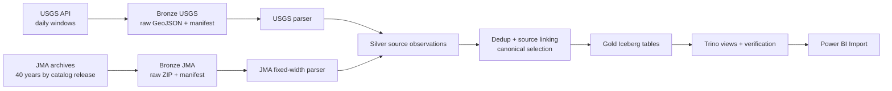

# Các khối công việc sau Foundation

Tài liệu này giải thích các task từ tuần 2 đến tuần 6 theo ba câu hỏi: **làm phần gì**, **có những gì** và **dùng để làm gì**. Danh sách task chi tiết, effort, assignee, reviewer và status nằm trong [danh mục task Markdown](./tasks/README.md); mỗi mã task dẫn đến một file riêng.

## 1. Luồng dữ liệu mục tiêu

PostgreSQL trong Compose chỉ lưu metadata của Airflow. Dữ liệu nghiệp vụ nằm ở MinIO; Silver dùng Parquet, Gold dùng Iceberg và Trino cung cấp giao diện SQL cho Power BI. Vì vậy phần “thiết kế database” của dự án là `CON-03`, `GLD-01` và `GLD-03`, không phải tạo thêm PostgreSQL để chứa bản sao dữ liệu.

## 2. Quy tắc giảm dependency

- `Hard dependency` trong từng file task chỉ chứa hard gate: thiếu dependency thì task không thể đạt acceptance criteria.
- Contract, fixture, mock task và sample view là giao diện làm việc hợp lệ. Thành viên không phải chờ toàn bộ upstream chạy thật mới bắt đầu.
- Mỗi block có unit/integration test riêng. E2E chỉ được dùng làm cổng tích hợp cuối, không thay thế test của từng block.
- Mọi thay đổi contract phải được review trước khi các block tiêu thụ cập nhật theo; không sửa ngầm schema trong một PR implementation.
- Integration gate chính là `USG-05`, `JMA-05`, `SLV-09`, `GLD-04`, `BI-05` và `QA-01`.

## 3. Khối A - Hợp đồng dữ liệu

Task: `CON-01..04`.

Làm phần gì:

- Chốt vai trò USGS và JMA, phạm vi thời gian, vùng Nhật Bản và chính sách overlap.
- Chốt cách lưu Bronze raw và manifest.
- Thiết kế logical schema Silver/Gold, lineage, canonical event và KPI.
- Chuẩn bị fixture dùng chung cho các nhóm code và test.

Có những gì:

- Source coverage và source priority.
- [Bronze storage contract](../specs/BRONZE_STORAGE_CONTRACT.md), object naming,
  checksum, catalog release và run context.
- [Silver/Gold logical data model](../specs/SILVER_GOLD_DATA_MODEL.md), field
  mapping USGS/JMA, UTC/JST, null policy, key và data dictionary.
- [Fixture và test matrix dùng chung](../../tests/fixtures/README.md) cho
  success, empty, invalid, duplicate, revised, timezone, checksum và ambiguous
  source link.

Dùng để làm gì:

- Cho phép USGS, JMA, Silver, Gold, Airflow và BI phát triển song song trên cùng một giao diện.
- Ngăn mỗi nhóm tự đặt tên trường, tự chọn timezone hoặc tự hiểu khác nhau về “một động đất”.

## 4. Khối B - USGS Bronze

Task: `USG-01..05`.

Làm phần gì:

- Tạo request theo cửa sổ UTC, bounding box và overlap đã chốt.
- Xây HTTP client có timeout, retry/backoff và giới hạn response.
- Validate GeoJSON, lưu raw response, manifest và checksum vào MinIO.
- Đóng gói thành Airflow task group và kiểm thử đến Bronze.

Có những gì:

- [USGS request contract](../specs/USGS_REQUEST_CONTRACT.md), config validation
  và request builder daily/backfill không gọi mạng.
- Java HTTP client, mock tests và response validator.
- Raw object theo `ingest_date/run_id/attempt`, manifest `BronzeReady` và run
  summary; payload lỗi đi vào `_quarantine` và không được Silver chọn.

Dùng để làm gì:

- Cung cấp luồng cập nhật động đất hằng ngày có thể retry, audit và reprocess.
- Silver chỉ nhận manifest đã verify, không phụ thuộc trực tiếp vào API.

## 5. Khối C - JMA Bronze

Task: `JMA-01..05`.

Làm phần gì:

- Lập inventory archive cho 40 năm dữ liệu và metadata format JMA.
- Tải từng năm, phát hiện file bị thay đổi và lưu version theo catalog release.
- Validate ZIP/fixed-width ở mức Bronze và lưu file nguyên bản.
- Tạo workflow backfill theo năm, có resume và giới hạn concurrency.

Có những gì:

- URL/file inventory, timezone JST, datum, record type, quality flag và source notice.
- ETag/Last-Modified/size/SHA-256, archive manifest và record count sơ bộ.
- Airflow task group theo danh sách năm và integration fixtures.

Dùng để làm gì:

- Nạp lịch sử theo batch nhỏ, không cần tải toàn bộ vào máy trước.
- Khi JMA sửa một năm, chỉ ingest và xử lý lại version/partition bị ảnh hưởng.

## 6. Khối D - Silver đa nguồn

Task: `SLV-01..09`.

Làm phần gì:

- Parse USGS GeoJSON và JMA fixed-width bằng hai parser độc lập.
- Chuẩn hóa về cùng observation schema, giữ đầy đủ lineage và source flags.
- Validate, reject, deduplicate trong từng nguồn và liên kết observation giữa hai nguồn.
- Publish Silver Parquet theo source và event time.

Có những gì:

- USGS parser, JMA parser, source record key và raw record lineage.
- Quality reason codes, reject dataset và run-level counts.
- Source-link table, match thresholds và canonical selection rules.
- Silver writer, output manifest và idempotency tests.

Dùng để làm gì:

- Tạo dữ liệu chuẩn hóa dùng lại được cho Gold, backfill và audit.
- Tránh `UNION ALL` hai catalog rồi double count cùng một động đất.
- Giữ observation gốc ngay cả khi canonical event chọn một nguồn ưu tiên.

## 7. Khối E - Gold và Serving

Task: `GLD-01..04`.

Làm phần gì:

- Tạo canonical current event, dimensions, magnitude/depth bands và aggregates.
- Ghi bảng Gold bằng Iceberg, commit snapshot và lưu snapshot ID.
- Tạo Trino views và verification SQL cho Power BI.

Có những gì:

- Event-level fact/current data, date/region/source dimensions và KPI aggregates.
- Iceberg tables trên MinIO, partition strategy và atomic snapshot commit.
- Trino schema/views, uniqueness/completeness/aggregate checks.

Dùng để làm gì:

- Cung cấp lớp dữ liệu nghiệp vụ ổn định, có snapshot và query SQL.
- Đặt logic canonical/KPI ở data layer thay vì lặp lại trong Power BI.

## 8. Khối F - Điều phối và vận hành

Task: `ORC-01..05`.

Làm phần gì:

- Ghép các block bằng DAG và run context chung.
- Thiết lập daily schedule, JMA catalog check, backfill và reprocessing.
- Chuẩn hóa metrics/logs, recovery boundary, concurrency và Spark resources.

Có những gì:

- Task groups, readiness gates và publish gate.
- Backfill parameters cho USGS UTC range và JMA year/release.
- Run summary, recovery matrix và runtime profile.

Dùng để làm gì:

- Cho phép retry đúng tầng, chạy lại có phạm vi và không xóa dữ liệu.
- Cho phép nhiều thành viên làm và test các block mà không tranh tài nguyên hoặc sửa nhầm partition.

## 9. Khối G - Power BI

Task: `BI-01..05`.

Làm phần gì:

- Kết nối Power BI đến Trino qua ODBC/Power Query.
- Tạo semantic model, DAX measures và các trang phân tích.
- Thiết lập refresh gate và reconciliation với SQL.

Có những gì:

- Dataset import, date table, relationships, measures và freshness metadata.
- Trang Tổng quan, Không gian và Độ sâu - Độ lớn.
- SQL kiểm chứng total, average, max, source và date filters.

Dùng để làm gì:

- Trình bày dữ liệu cho người dùng mà không đọc trực tiếp từng object Parquet.
- Bảo đảm cùng một KPI có cùng kết quả giữa Trino và Power BI.

## 10. Khối H - QA và Release

Task: `QA-01..05`, `SEC-01`, `OPS-01`, `DOC-01`, `DEMO-01..02`.

Làm phần gì:

- Kiểm thử E2E, rerun, revision, historical backfill và failure recovery.
- Review performance, security, backup/restore và tài liệu thực tế.
- Chuẩn bị demo, rehearsal và release candidate.

Có những gì:

- E2E/reconciliation reports, recovery matrix và security checklist.
- Resource profile, restore evidence, runbook và demo package.
- Release checklist phân biệt Core với Stretch.

Dùng để làm gì:

- Xác nhận các block riêng lẻ ghép được thành pipeline hoàn chỉnh.
- Chứng minh pipeline an toàn khi retry, nguồn thay đổi hoặc một tầng thất bại.

## 11. Gợi ý chia việc cho ba thành viên

Đây là gợi ý ownership, không phải dependency bắt buộc:

- Luồng 1: Khối A + B, tập trung contract và USGS daily ingest.
- Luồng 2: Khối C + parser JMA trong D, tập trung historical ingest và fixed-width.
- Luồng 3: Phần còn lại của D + E, tập trung canonical event, Iceberg và Trino.
- Khối F, G và H được pick theo kỹ năng; có thể bắt đầu bằng mock/fixture ngay khi contract liên quan ổn định.

Reviewer nên thuộc luồng khác để tránh một người vừa viết contract vừa tự xác nhận implementation của chính contract đó.
